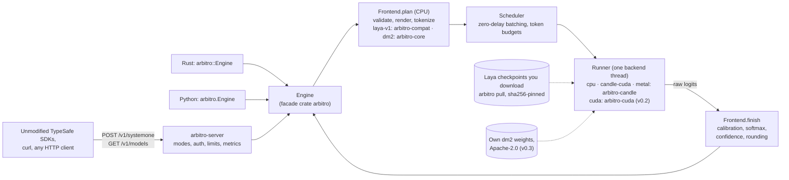

# Arbitro

**Self-hosted typed decisions, written in Rust.** Arbitro is a planned inference engine and HTTP server. It answers *typed questions* about a piece of context with a calibrated probability distribution, never with generated text:

- `choice`: pick one of 1–255 named options;
- `score`: rate on an ordinal scale of 1–10 levels, numbered from 0 (`score` = Σ i·pᵢ);
- `noul`: yes or no (the answer is P(yes)).

> **Status: design phase.** No code exists yet, and every feature below is *planned*. Each number is labelled as a target (GATE/GOAL), an estimate (ESTIMATED), a third-party claim (REPORTED), or a figure checked against source code or raw data during the design phase (VERIFIED). Nothing has been measured by this project. v0.1 is planned for about week 14 of development (ESTIMATED at ~12 h/week; see the [roadmap](docs/ROADMAP.md)).

"Arbitro" is a working name (open question Q1). The repository is `Foxur/Rustify`.

## Why

- **Jev** (TypeSafe AI's hosted "System One" model) defines a clean API for typed decisions. It is a closed, hosted service, though: 236–276 ms p50 end-to-end on the direct API in third-party runs from France and from unstated client locations (REPORTED; one 17-request run, client location unstated, reports a 178 ms median), 2-decimal output with hard zeros, and nondeterministic answers (a noul ranged 0.46–0.54 over 60 identical calls, REPORTED) [BW §1.3], [JAS §0, §3.4, §4].
- **Laya** (Convai Innovations) is an open-weights, Jev-compatible model with a Python/PyTorch reference implementation. Its weaknesses:
  - serving takes 39.5 ms for one question (≈ 170-token state) on a T4 with PyTorch fp16 autocast (VERIFIED), and grows by about 15 ms per extra question because the state is re-encoded for every question (linear fit, ESTIMATED) [BW §1.5];
  - `laya-en`'s zero-shot accuracy on typed-decisions (2,000 decisions) is 0.362, against 0.318 for random guessing and 0.461 for the majority class (VERIFIED) [BW §1.1];
  - shipped calibration is over-confident, with a mean ECE of 0.466 over 49 suites, measured before the `choice:11+` temperature was clamped (VERIFIED); after the clamp, the English checkpoint's 51-language MASSIVE sweep still shows a macro ECE of 0.571 (VERIFIED) [BW §1.1, §1.4];
  - `laya-serve` is only loosely wire-compatible: no `GET /v1/models`, no request-id header, a different confidence statistic [JAS §10].
- **Arbitro** plans to fix the runtime first: Rust, a custom CUDA engine, the exact wire contract and numerical parity checked against the reference. Then it aims to fix the model, with our own Apache-2.0 weights trained on one RTX 4090; whether those weights beat Laya is decided by pre-registered release gates, not assumed. Runtime results and model results are measured and published separately, never in one table (ADR-027).

| Track | What runs | First release |
|---|---|---|
| **A. Compat runtime** | Laya checkpoints *you* download (`laya-en`, `laya-multilingual`, `laya-typed-decisions`), with verified parity | v0.1 (CPU + `candle-cuda`); v0.2 (custom `cuda` engine) |
| **B. Own-model track** | `arbitro-en-large` and `arbitro-en-base` (family `dm2`), with Apache-2.0 weights; `arbitro-multi-base` only after legal review of its tokenizer | v0.3 |

The evidence behind these points (what Jev and Laya are, how Laya computes an answer, the Jev wire contract, measured quality and latency, and the failure modes of both) is in [docs/ANALYSIS.md](docs/ANALYSIS.md).

## Feature goals

Every row is **planned**. None is implemented.

| Feature | Release |
|---|---|
| Wire-compatible server: `POST /v1/systemone`, `GET /v1/models`; modes `strict` (Jev contract), `lenient` (SDK drop-in, default), `laya` (laya-serve migration) | v0.1 |
| Unmodified TypeSafe SDKs work with only `TYPESAFE_BASE_URL` (and a local `TYPESAFE_API_KEY`) changed; a conformance suite pins `typesafe-sdk` 0.7.1, `@typesafe-ai/sdk` 0.6.0, `@ai-sdk/typesafe-ai` 3.0.4 and `pydantic-ai-slim` 2.48.0 | v0.1 |
| Laya parity levels L0–L3 on `cpu` fp32 and `candle-cuda` bf16, for all three checkpoints, at sha256-pinned revisions | v0.1 |
| Full-precision probabilities with a 1e-6 floor, so there are no hard zeros (`round2` / `round4` opt-in); truncation always reported, never silent; `usage` counts the tokens actually processed | v0.1 |
| `arbitro` CLI and binaries; Docker images `ghcr.io/foxur/arbitro:<version>-cpu` / `-cuda` (never containing weights); Prometheus metrics; no telemetry | v0.1 |
| Custom CUDA engine (cudarc + cuBLASLt + vendored FlashAttention-2), zero-delay batching, CUDA graphs | v0.2 |
| Batch-invariant determinism by default: the same request gives bitwise-identical JSON alone or co-batched (a design goal until the bitwise test passes) | v0.2 |
| `laya-heuristic` automatic routing for laya-serve users | v0.2 |
| Own models: up to 255 options via option-group chunking, an explicit "none" option, a `p_correct` channel with conformal `automate`/`review` decisions, and 8,192-token context | v0.3 |
| Python wheel `arbitro` (CPU inference, data, calibration, evaluation) | v0.3 |
| API freeze (`/v1`, `x_arbitro` v1) | 1.0 |
| Multilingual own model (only if counsel clears the tokenizer) / FP8 opt-in | 1.1 / 1.2 |

## What this is not

- Not text generation or chat, and not an embeddings product.
- Not a hosted service: no accounts, no billing.
- Not answer-compatible with Jev. The request and response *format* is the same, but the answers come from a different model (a Laya checkpoint or our own), so they will differ from Jev's.
- Not an emulation of Jev's randomness (shuffled probability keys, ±0.04 noul noise).
- Not trained on Jev outputs, and not built with a TypeSafe account.
- Not a redistribution of Laya weights. Our models are never initialised from Laya weights and never distilled from Laya outputs.
- Before 1.0: no decoder "accurate tier" and no pure-Rust training loop. In 0.x: no CUDA wheels on PyPI.
- No multi-GPU, ROCm or Intel GPU support.
- Not a native 32k-token encoder: our own models truncate states over 8k tokens head+tail, and Laya checkpoints keep their 512 / 1024-token budgets. Truncation is always reported, never silent.

## Targets compared with Laya and Jev

**These are targets, not results.** Jev figures are from third-party publications about Jev 1.13 (September 2026); the Arbitro authors did not access the Jev API. Laya figures come from Laya's own benchmark files and from third-party runs. Each table covers one kind of comparison, per ADR-027.

**Runtime and interface** (track A: Laya weights on a different engine; targets on an RTX 4090, `laya-en`, 250-token question):

| | Jev (hosted) | Laya reference (Python) | Arbitro target |
|---|---|---|---|
| Deployment | Hosted API, closed model | Self-hosted PyTorch; open weights (Apache-2.0 per model card, REPORTED; the training mix reportedly includes CC-BY-NC data [LTR §5.2]) | Self-hosted binary, Docker image, Rust crate |
| Wire contract | Defines it | Loosely compatible [JAS §10] | Full contract; SDK conformance suite 100 % on every PR (GATE) |
| Latency, 1 question | 236–276 ms p50 end-to-end on the direct API, network included, measured from France and from unstated client locations (REPORTED)¹ | 39.5 ms on a T4, PyTorch fp16 autocast, ≈ 170-token state (VERIFIED) | v0.1 `candle-cuda`: ≤ 12 ms p50 **and** ≤ PyTorch on the same GPU (GATE P6; ESTIMATED 6–10 ms). v0.2 `cuda`: ≤ 6 ms (GATE P1), 3–4 ms (GOAL), in-process |
| Throughput | Account limits of 1,200 requests/min and 250k tokens/s (REPORTED) | Not measured on a 4090 yet (M0 task). Context: the ModernBERT paper reports ≈ 52.3k tokens/s for the ModernBERT-large encoder alone on a 4090, 512-token inputs, PyTorch with FA2 unpadding (REPORTED) | v0.2 `cuda`: ≥ 350 q/s (GATE P3), ≥ 450 q/s (GOAL); ≈ 2.5× that 52.3k tokens/s (GOAL P5, ESTIMATED) |
| 50 questions per request | Latency roughly flat in question count; 800 questions in 985 ms via OpenRouter (REPORTED) | 771 ms on a T4 (VERIFIED): the state is re-encoded per question, ≈ 14.2 ms + 15.1 ms per question (fit, ESTIMATED) | v0.2 `cuda`: ≤ 150 ms (GATE P4), ≤ 100 ms (GOAL) |
| Output numerics | 2 decimals, hard zeros, some sums of 0.99 (VERIFIED on third-party logs) | 4 decimals, `round(x, 4)` | Full precision, 1e-6 floor, sum = 1 within 1e-9 |
| Determinism | Nondeterministic (REPORTED) | Repeat-stable over 3 repeats in a third-party run (VERIFIED on its raw logs); batch invariance not characterised | Batch-invariant by design (UNVERIFIED until tested) |
| Parity with Laya | — | Reference | CPU fp32 max \|Δp\| ≤ 1e-4 (GATE T3); GPU bf16 mean \|Δp\| ≤ 2e-3, max ≤ 2e-2 (GATE T4) |

¹ Different quantities: Jev's figures include the network round trip, and Arbitro's targets are local. The row gives deployment context; it is not a speed-up claim.

**Model quality** (track B: our `dm2` models vs Laya; release gates for v0.3):

| | Jev (third-party, REPORTED) | Laya EN | Arbitro `dm2` target |
|---|---|---|---|
| Held-out-source macro accuracy | — | Baseline: `laya-en`, run by us through the compat runtime | ≥ +10 pp vs `laya-en`, with CI lower bound > +5 pp (primary GATE, G-Q1) |
| JevBench v1.2 hard tier² | 74.1 % | 34.1 % (REPORTED) | Reported, not gated; G-Q2 aims to recover ≥ 50 % of the Jev–Laya gap across comparable suites |
| Banking77, 77 options at once³ | 0.763 | 0.425 (VERIFIED) | ≥ `laya-en` + 20 pp (GATE, G-Q6); ≥ 0.75 (GOAL) |
| Calibration (ECE)⁴ | 0.05–0.08 raw on most tasks; 0.28–0.35 on emotion [BW §1.4] | 0.466 as shipped, mean over 49 T4 suites, before the `choice:11+` clamp (VERIFIED) | ECE-15 ≤ 0.05 with the shipped calibration (fitted in-domain, evaluated on held-out sources); `p_correct` ECE ≤ 0.03 (GATE, G-Q3) |
| Option-order flip rate | 0.13 (DMB S4, 3 permutations) / 0.05 (JevBench #40, 4 orders) [BW §1.3] | 0.15–0.23, 20-option MASSIVE (VERIFIED) | ≤ 0.05 on 20-option MASSIVE-en (GATE, G-Q5) |
| Options / context | 255 options (VERIFIED on third-party logs); 32k tokens of state + question (REPORTED) | ≈ 125 options (EN), options cut to 3 tokens long before that; 512 / 1024-token budgets (VERIFIED) | 255 options, code-word test ≥ 0.98 at k = 255 (GATE, G-Q6); 8,192-token context |
| Selective automation | `confidence` only | Saturated act head, AUROC 0.30 [BW F13] | Coverage ≥ 0.60 at ≤ 5 % error (GATE, G-Q4) |

² `fstandhartinger/jevbench` v1.2, 220 hard items. The Laya run used laya 0.3.3 on CPU, which truncates at 512 tokens per question [BW §1.2]. ³ Jev: nibzard decision-model-benchmark v2 S1, 900 decisions [BW §1.3]. ⁴ Laya's ECE falls to 0.081 when temperatures are refitted per suite on half of each suite and evaluated on the other half [BW §1.4]. That is an in-distribution oracle fit, an upper bound rather than a deployable number. `arbitro calibrate` will offer this kind of refit on the user's own labelled data as an opt-in "laya-plus" feature. A refit ECE is never compared with another system's raw ECE (ADR-027).

## Architecture



The **frontend** is specific to a model family and does not depend on the backend. It turns JSON into packed token batches, and logits back into answers. The **runner** is specific to a backend and does not depend on the family: it executes a packed batch and never sees JSON. The **scheduler** sits between them. Details are in [docs/ARCHITECTURE.md](docs/ARCHITECTURE.md).

## Planned quickstart

> **Planned for v0.1. None of these commands works yet.**

```sh
docker run -p 8080:8080 -v arbitro-cache:/cache -e ARBITRO_API_KEYS=dev-key \
  ghcr.io/foxur/arbitro:0.1.0-cpu serve --preload laya-en
```

On first start, the server downloads the pinned `laya-en` checkpoint from its original Hugging Face repository and prints its licence line. The image contains no weights. The images bind `0.0.0.0:8080` inside the container and use `/cache` as `ARBITRO_HOME`, so `-p` and the volume work; outside Docker the default bind is `127.0.0.1:8080` (ADR-017).

```sh
curl -s http://localhost:8080/v1/systemone \
  -H 'Authorization: Bearer dev-key' -H 'Content-Type: application/json' \
  -d '{"model": "laya-en",
       "state": {"ticket": "I was charged twice. Please fix this ASAP."},
       "questions": {"category": {"type": "choice",
         "instructions": "What is this ticket about?",
         "criteria": {"billing": null, "technical": null, "other": null}}}}'
# Response shape: {"model": "laya-en-c5d78730", "answers": {"category": {"type": "choice",
#   "choice": ..., "confidence": ..., "probabilities": {...}}}, "usage": {"input_tokens": ..., "output_tokens": 0}}
```

The **unmodified** TypeSafe Python SDK (MIT-licensed) needs only two environment variables:

```sh
pip install "typesafe-sdk==0.7.1"
export TYPESAFE_BASE_URL=http://localhost:8080 TYPESAFE_API_KEY=dev-key
```

```python
from typesafe_sdk import Choice, TypeSafeClient  # the SDK's own API, used unmodified

with TypeSafeClient() as client:
    response = client.system_one(
        state={"ticket": "I was charged twice. Please fix this ASAP."},
        questions={"category": Choice(instructions="What is this ticket about?",
                                      criteria={"billing": None, "technical": None, "other": None})},
    )
print(response.choices["category"].choice)
```

The SDK sends `model: "jev-latest"` by default. In `lenient` mode, that alias resolves to the configured default model (`laya-en`).

Embedded use, planned API (ADR-004): `arbitro::Engine::builder().model("laya-en").build()?` then `engine.decide(req).await?` in Rust, or `arbitro.Engine(model="laya-en").decide(state, questions)` in Python (public from v0.3).

## Getting Laya checkpoints

Arbitro never ships Laya weights. On your request it fetches them from Convai Innovations' own Hugging Face repositories, at the revisions the parity fixtures are pinned to (ADR-005):

| Registry id | Source, pinned revision | Size on disk (fp16; VERIFIED by proxy, header check in M0) |
|---|---|---|
| `laya-en` | `convaiinnovations/laya` @ `c5d78730` | 842.6 MB |
| `laya-multilingual` | `convaiinnovations/laya`, subfolder `multilingual` @ `1c5edc17` | 643.8 MB |
| `laya-typed-decisions` | `convaiinnovations/laya-typed-decisions` @ `f9ab0b22` | 842.6 MB |

- `arbitro pull <id>` (or `serve --preload <id>`) downloads the pinned files into `$ARBITRO_HOME`, reuses an existing Hugging Face cache, verifies every file's sha256 and prints the licence line. A mismatch refuses to load. The per-file sha256 values are recorded in M0.
- Offline machines: copy a checkpoint directory (`rl_agent_config.json`, `model.safetensors`, `tokenizer/`, `encoder/`) and register it as a `{dir}` source in `~/.config/arbitro/models.toml`. The sha256 check still applies.
- Another revision needs its own registry entry with its own sha256 values, and the parity fixtures do not cover it.
- **Licence.** The upstream model cards declare Apache-2.0, but Laya's training mix reportedly includes CC-BY-NC data [LTR §5.2], so the weights' licence status is unclear. Whether your use is acceptable is your decision.

## Hardware and platforms

Planned support (Q5 default; nothing is tested yet):

| Target | Requirement |
|---|---|
| CPU inference, Tier-1 | Linux x86_64. The CPU gate P7 is measured on 8 physical cores. fp32 weights take 1.7 GB of RAM per English checkpoint and 1.3 GB for the multilingual one (arithmetic). |
| NVIDIA GPU inference, Tier-1 | Compute capability ≥ 8.0 (Ampere, Ada, Hopper), because FlashAttention-2 needs sm_80+. Older GPUs such as the T4 are served by the `cpu` backend only. The project is developed and measured on one RTX 4090 (sm_89); GPUs newer than Hopper rely on PTX (UNVERIFIED). All three Laya checkpoints fit in ≈ 2.3 GB of VRAM in bf16, plus a 342–408 MiB activation arena per model (ESTIMATED). |
| Tier-2 | macOS arm64 (CPU; Metal best-effort), Linux aarch64 (CPU) |
| Tier-3 | Windows x64 (CPU, build-only) |
| Training the own models | One 24 GB GPU (the plan is sized for an RTX 4090) and ≥ 1 TB of free disk; see [TRAINING.md](docs/TRAINING.md) |

## How parity is proven and numbers are reported

**Parity with Laya** (ADR-012, ADR-014; details in [ARCHITECTURE.md §15](docs/ARCHITECTURE.md#15-parity-and-test-strategy)):
- The reference is Laya 0.3.7 (`NandhaKishorM/laya` @ `010bacef`) in a pinned environment (torch 2.14.0, transformers 5.17.0, tokenizers 0.23.2, numpy 2.4.6, CPython 3.11), run on the pinned checkpoints above.
- Six levels: L0 pure functions (byte-identical); L1 token ids and sequences (100 % identical on ≥ 10k items per tokenizer); L2 tiny random-weight models; L3 real checkpoints on a 2,000-question golden set; L4 Laya's own published tables; L5 end-to-end HTTP in `laya` mode.
- Tolerances: CPU fp32 max |Δp| ≤ 1e-4 (T3). GPU bf16 mean |Δp| ≤ 2e-3 and max ≤ 2e-2 against PyTorch's own bf16 autocast on the same GPU (T4). The GPU gate is looser because the reference itself rounds every GEMM output to bf16.
- A mutation self-check re-introduces known Laya quirks one at a time and asserts that the tests fail.
- CI runs L0, L1, L2 (CPU) and L5 on every PR without any weights; L3 runs nightly on the self-hosted 4090. Committed fixtures contain outputs only (token ids, logits, answers).

**Honest numbers** (ADR-027, ADR-028):
- Every number carries a label (VERIFIED, REPORTED, ESTIMATED, MEASURED, GATE/GOAL). Runtime results and model results live in separate tables that are never merged.
- Numbers in the README and the docs are rendered from `reports/*.json` by `cargo xtask numbers`. Every claim is listed in `reports/claims.toml`, `arbitro eval verify-claims` fails CI on drift, and per-case JSONL is published for every number.
- Model claims use 3 seeds, paired record-clustered bootstrap CIs, one pre-registered primary endpoint, a contamination tag on every row and a log of every test-split read. Failures count as errors.
- Calibration is always reported three ways: raw, as shipped and after a held-out refit. A refit ECE is never compared with another system's raw ECE.
- Jev numbers come only from third-party publications, with source, date, n and protocol differences. The Arbitro authors do not access the Jev API.
- Performance runs use an open-loop load generator with locked GPU clocks and record the full hardware and software setup. The baseline is the Laya PyTorch reference on the same machine (`docs/perf-baseline.md`).

## Documentation

| Document | Status |
|---|---|
| [docs/ANALYSIS.md](docs/ANALYSIS.md): what Jev and Laya are, Laya's architecture and numerics, the Jev wire contract and its observed behaviour, measured quality and latency, failure modes, and what follows for Arbitro. Start here. | Reference analysis; quotes the canonical numbers of DECISIONS.md |
| [docs/ARCHITECTURE.md](docs/ARCHITECTURE.md): crates, request path, engine, numerics, scheduler, server, tests | Design baseline |
| [docs/ROADMAP.md](docs/ROADMAP.md): milestones, gates, effort, 4090 budget, risks, open questions | Design baseline |
| [docs/TRAINING.md](docs/TRAINING.md): the own-model track: architecture changes, backbone choice, trainer, data and licences, teachers, calibration, evaluation | Design baseline |
| [docs/DECISIONS.md](docs/DECISIONS.md): the decision record: ADR-001…ADR-033, canonical names and numbers, open questions Q1–Q18 | Canonical; the other documents quote it |
| `docs/adr/`: one file per ADR | Split from DECISIONS.md in M0 |
| `docs/clean-room.md`: the sources the wire format and the compat logic come from | Planned, week 1 |
| `docs/ablations.md`: pre-registered model experiments | Planned, M0 |
| `docs/perf-baseline.md`: the PyTorch reference on the same 4090, "the number to beat" | Planned, M0 |
| `CONTRIBUTING.md`, `SECURITY.md` | Planned, week 1 |

Evidence keys such as [BW §1.1] refer to the design-phase research reports listed in [DECISIONS.md, Appendix B](docs/DECISIONS.md#9-appendix-b-evidence-keys). They are not in the repository yet (open question Q15).

## Contributing

Contributions will open after the M0 skeleton lands. Two rules apply from day one:
- every commit carries a DCO sign-off (`git commit -s`); there is no CLA;
- **do not use a TypeSafe account to develop, test, or benchmark this project.**

Good first issues are planned from v0.1: ports such as email cleaning and the shortlist come with literal test fixtures, so a contributor can check their own work.

Pull-request CI is CPU-only and needs no model weights. GPU tests run nightly on the maintainer's self-hosted RTX 4090, only for `main` and scheduled jobs, never for fork PRs (ADR-029).

## Related work

- **Laya** (`NandhaKishorM/laya`, Apache-2.0 code) is the reference implementation whose behaviour the compat runtime ports, including its `laya-serve` HTTP server.
- The Rust crates `laya` 0.1.1 and `laya-rs` 0.1.0 already run Laya with candle in f32. They have no Jev wire contract and no parity fixtures. Arbitro plans to offer them its `pycompat` module (Q10).
- Hugging Face's text-embeddings-inference (TEI, Apache-2.0) supplies the serving architecture that `arbitro-server` follows: router, queue, batcher and backend thread. The plan copies no TEI code; if any is ever copied, `NOTICE` will list it (ADR-030).

## Legal and trademarks

**Not affiliated with or endorsed by TypeSafe AI or Convai Innovations.**

- "Jev", "TypeSafe", "System One" and "Laya" are trademarks or names of their owners. This project uses them only nominatively, to describe compatibility ("compatible with the TypeSafe Jev API wire format", "runs Laya checkpoints"), and uses no logos. They never appear in our crate, binary, image, mode or method names.
- Only the wire protocol forces a few identifiers into the code: the route `/v1/systemone`, the header `x-typesafe-request-id`, and the accepted alias values `jev-latest` / `jev-preview`. The aliases are unlisted by default and can be disabled. An optional `/typesafe/v1/*` path alias exists and is off by default.
- The wire format comes from the MIT-licensed TypeSafe SDKs and the public OpenAPI document. `docs/clean-room.md` will record every source. Third-party Jev logs are used only for response *shapes*, never as training data, labels, calibration or selection.
- TypeSafe's Master Customer Agreement reportedly forbids customers to use the service or its output to build a competing product or to train a model, and to publish benchmarks of the service (§2.3(b), §2.3(f), REPORTED [JAS §8]). That is why no TypeSafe account is used for this project and every Jev number here is cited from third-party publications. Users who hold a TypeSafe account should check these terms themselves before comparing the two services.
- Laya weights are never stored in this repository, in images or in release assets. On your request, Arbitro downloads them from their original repository at runtime, and their licence terms apply to you. Laya's training mix reportedly includes CC-BY-NC data [LTR §5.2], so our models are never initialised from Laya weights or distilled from Laya outputs. The repository will contain small parity fixtures (token ids, logits, answers) produced by running Laya checkpoints; they are test outputs only, never used for training, and are listed in `NOTICE` and `docs/clean-room.md` (ADR-030).
- This is not legal advice.

## License

- **Apache-2.0** for all code, documentation and our own model weights. This follows the decision record's default; Q2 (Apache-2.0 only vs MIT OR Apache-2.0) is still open.
- `arbitro-cuda` will be `Apache-2.0 AND BSD-3-Clause`, because it vendors FlashAttention-2 and CUTLASS kernels. `third_party/` will record their file-level provenance, and `NOTICE` will list copied code and the Laya-derived logic files (a behavioural port of Laya, © Convai Innovations, Apache-2.0).
- Third-party model weights keep their own licences.
