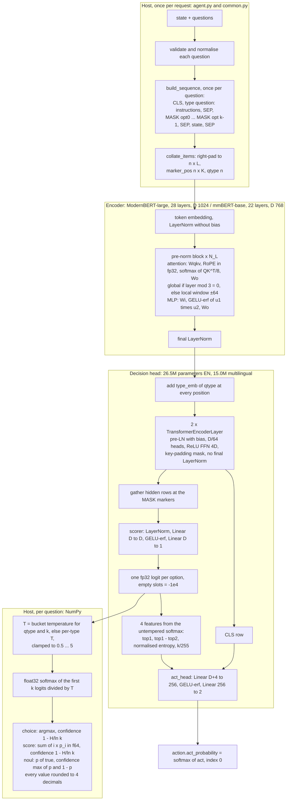

# Jev and Laya: technical analysis

**Status:** reference analysis, 2026-09-23. **Scope:** what Jev and Laya are, how Laya computes an answer, the Jev wire contract and its observed behaviour, measured quality and latency, the failure modes of both, and what all of this means for Arbitro. **Audience:** contributors and evaluators of Arbitro. Arbitro is the working product name (ADR-002); the repository is [`Foxur/Rustify`](https://github.com/Foxur/Rustify).

> Not affiliated with or endorsed by TypeSafe AI or Convai Innovations. "Jev", "TypeSafe", "System One" and "Laya" are used only to describe compatibility.
>
> **Clean-room note.** Arbitro authors did not access the Jev API. Every Jev number in this document comes from a third-party publication or from raw logs that third parties published. Those logs are used to describe wire behaviour and to give context. They are never used as training labels, for calibration or for model selection (ADR-027, ADR-031).

## How to read this document

Every number carries a label:

| Label | Meaning |
|---|---|
| **VERIFIED** | Read in source code, or recomputed from raw data, by the 2026-09-23 research reports, the design review or while writing this document |
| **REPORTED** | A third-party claim that nobody on the project re-measured |
| **INFERRED** | An interpretation of verified data. It is not a measurement. |
| **ESTIMATED** | Modelled, not measured. The M0 and M4 measurements replace it. |
| **GATE** / **GOAL** | A target. A GATE blocks a release; a GOAL does not. |
| **UNVERIFIED** | Nobody has checked it |

No number has the status MEASURED yet: Arbitro has not measured anything.

Citation conventions:
- Laya source is cited at [NandhaKishorM/laya@010bacef][laya-010] (release 0.3.7) as `file:lines`, linked to that commit.
- Keys such as [LIS §2] or [CR C1] point to the design-phase research reports listed in [Appendix B](#appendix-b-evidence-keys). These reports are not in the repository yet (open question Q15 in [DECISIONS.md](DECISIONS.md#2-decisions-needing-the-maintainers-input)). Where the reports disagree, the completeness critic [CR] wins, and the amendments in [DECISIONS.md, Appendix C](DECISIONS.md#10-appendix-c-amendments-from-the-documentation-review) override both.
- IDs such as P1, S1, T4 or Q-ref5 are rows of the canonical numbers table in [DECISIONS.md §5](DECISIONS.md#5-canonical-numbers-downstream-documents-must-quote-these-identically), which the ADRs cite. This document quotes their values unchanged.

## Contents

1. [Key findings](#1-key-findings)
2. [What Jev and Laya are](#2-what-jev-and-laya-are)
3. [Timeline](#3-timeline)
4. [Laya architecture](#4-laya-architecture)
5. [The Jev API contract and its observed behaviour](#5-the-jev-api-contract-and-its-observed-behaviour)
6. [Measured quality and latency](#6-measured-quality-and-latency)
7. [Failure modes](#7-failure-modes)
8. [What this means for Arbitro](#8-what-this-means-for-arbitro)
- [Appendix A: sources](#appendix-a-sources)
- [Appendix B: evidence keys](#appendix-b-evidence-keys)

---

## 1. Key findings

1. **Jev** is a closed, hosted typed-decision service. It has one decision endpoint (`POST /v1/systemone`, plus `GET /v1/models`) and three question types, and it answers with probability distributions, never with generated text. Its internals are unpublished. Black-box data (latency flat in the number of options and questions, the state billed once per request) fits one prefill-only pass per request (INFERRED) [JAS §4–5], [CR C5].
2. **Laya** is an Apache-2.0 Python package with three open-weight checkpoints that adopts Jev's wire format and field names. The model is a ModernBERT-large or mmBERT-base encoder, a 2-layer transformer head, and one `[MASK]` marker per option that is scored to one logit [LIS §2–5].
3. **Laya encodes the state once per question.** Cost grows linearly with the number of questions: 39.5 ms for 1 question and 771.3 ms for 50 on a T4 (VERIFIED, P14). The encoder is bidirectional, so the state's hidden states depend on the question, and sharing them needs retraining (INFERRED) [LIS §0].
4. **Zero-shot accuracy.** On independent evaluations Jev is far ahead:
   - 74.1 % vs 34.1 % on the JevBench v1.2 hard tier (REPORTED, Q-ref5);
   - 64/64 vs 20/64 on the Feishu Chinese set (VERIFIED, recomputed from published raw data);
   - 0.763 vs 0.425 on Banking77 at 77 options (REPORTED / VERIFIED, Q-ref10).

   On typed-decisions, Laya-EN scores 0.362, below the 0.461 majority baseline (VERIFIED, Q-ref1); Laya's own README says the base checkpoints are "near chance on typed-decisions zero-shot". Laya wins or ties only on datasets in its training mix, on its own fine-tuning target, and on DAIR emotion [BW §0–1].
5. **Calibration.** Laya ships over-confident: mean ECE 0.466 (EN) and 0.314 (multilingual) over 49 suites of the T4 run, before the [#42][l-42] clamp (VERIFIED, Q-ref7). Laya's headline "ECE 0.081 vs Jev 0.246", which its README marks as post-temperature, puts an in-domain, per-suite temperature refit next to Jev's *raw* ECE on one adversarial suite. Jev's raw ECE is 0.05–0.08 on most tasks (REPORTED, Q-ref8) [BW §1.4].
6. **Most of Laya's defects sit in the model and its post-processing, not in the runtime:**
   - a degenerate `choice:11+` temperature of 0.1006;
   - noul answers that follow the label tokens rather than the state;
   - 15–23 % option-order flips;
   - a shared 192/256-token option budget, which caps a question at about 125/250 options;
   - a right-truncated state (as little as 316 tokens on EN when the option budget is full);
   - a saturated act head (AUROC 0.30).
7. **laya-serve is only loosely wire-compatible.** It has no `/v1/models` and sends no request-id header, so the Python SDK raises when a caller reads the id. Its confidence is entropy-based instead of Jev's (n·p_max − 1)/(n − 1). It returns 422 for every internal failure and enforces no limits [JAS §10].
8. **Jev has its own failure modes:**
   - network-bound latency, 236–276 ms p50 direct (REPORTED, P15), measured from France and from unstated client locations; a small browser-agent run (17 requests, location unstated) reports a 178 ms median;
   - hard zeros, most likely from 2-decimal rounding (INFERRED): the gold label gets p = 0 on 15–16 % of emotion items (REPORTED);
   - no abstention field in the contract (VERIFIED);
   - non-deterministic outputs (VERIFIED in third-party raw logs);
   - a 255-option cap (VERIFIED).
9. **Consequence for Arbitro: two tracks with two results tables** (ADR-001, ADR-027).
   - The *compat runtime* runs user-downloaded Laya checkpoints with bit-faithful sequence building and numerical parity, behind a Jev-compatible server that is stricter than laya-serve.
   - The *own-model track* (`dm2`) targets the model-level failures. Its primary gate is +10 pp macro accuracy over `laya-en` on held-out sources, with a CI lower bound > +5 pp (G-Q1).

---

## 2. What Jev and Laya are

### 2.1 Jev (TypeSafe AI)

- **Vendor.** TypeSafe AI, San Francisco. The company emerged from stealth on 2026-09-15 with a $40M seed round led by DCVC. Its CEO is Diogo Almeida (REPORTED: [MarkTechPost][mtp], [The New Stack][tns], [Latent Space][ls], [HN launch thread][hn]).
- **Product.** A "System One" typed-decision model behind `POST https://api.typesafe.ai/v1/systemone`. A request carries one `state` (string, JSON object or array) and a map of named questions:
  - `choice`: 1–255 named options;
  - `score`: an ordinal scale of up to 10 levels;
  - `noul`: yes/no, answered as P(yes).

  Answers are distributions plus derived fields. There is no streaming, no batch API and no webhooks (VERIFIED: [typesafe-sdk-python][sdk-py] and [typesafe-sdk-js][sdk-js] sources, and the served OpenAPI 3.1 document, FastAPI, `info.version` 0.2.0, [mirrored by api-evangelist][apiev]).
- **Model ids.** Every recorded response in three independent raw data sets returns `"model": "jev-1.13.0"` (VERIFIED) [JAS §2]. `jev-latest` is the SDK default alias (VERIFIED). `jev-preview` runs ahead of it when a preview build exists (REPORTED).
- **Vendor claims** (REPORTED):
  - "a new model architecture, parallel sampler … and RLCD (Reinforcement Learning for Calibrated Decisions)";
  - "70–500 ms" end to end;
  - "40x–200x faster than frontier LLMs";
  - English-first and text-only.

  There is no paper and there are no open weights.
- **Price.** $0.042 per 1M input tokens; output tokens are free (REPORTED). priorbench's OpenRouter cost fields give exactly this rate over 4,015,924 tokens [JAS §3.8].
- **Channels** (REPORTED): the direct API; OpenRouter (`/api/alpha/decisions`, with its own error envelope); Vercel AI Gateway; Cloudflare Workers AI.
- **Clients.** The official MIT SDKs `typesafe-sdk` 0.7.1 (Python) and `@typesafe-ai/sdk` 0.6.0 (JS), `@ai-sdk/typesafe-ai` 3.0.4, pydantic-ai, and community SDKs. These SDKs and the public OpenAPI document are the only sources Arbitro uses for the wire format (ADR-031).

### 2.2 Laya (Convai Innovations)

- **Code.** [NandhaKishorM/laya][laya] under Apache-2.0 ([LICENSE][l-license]). Release 0.3.7 is commit `010bacef` (2026-09-23). The `laya/*.py` modules of the PyPI sdist 0.3.7 are byte-identical to that commit (VERIFIED with `diff -q`) [LIS header].
- **Weights.** Three checkpoints on Hugging Face, declared Apache-2.0 on the card (REPORTED; huggingface.co was unreachable during the research, so the cards were not inspected). The training mix includes data under CC-BY-NC-4.0 (REPORTED) [LTR §5.2].
- **What it is.** An `Agent` (one checkpoint), a `Router` (picks one of three checkpoints per request) and `laya-serve`, a FastAPI server with `POST /v1/systemone`.
  - The README tagline: "Multilingual, non-autoregressive System 1 decision engine … in a single forward pass — 33 ms — trained with reinforcement learning against strictly proper scoring rules (RLCD)" ([README.md:8][l-readme-8], REPORTED).
  - Its own "Honest limits" section: "Laya is a fast base to specialise, not a zero-shot decision engine" ([README.md:567-572][l-readme-limits]).
- **Model.** A bidirectional encoder over one sequence per question, a `[MASK]` marker in front of each option, a 2-layer transformer head, one scalar logit per marker, and a softmax with bucketed temperature (§4).

### 2.3 Side by side

| | Jev (`jev-1.13.0`) | Laya 0.3.7 |
|---|---|---|
| Access | Hosted API with an account key | pip package plus open weights |
| Licence | Proprietary; Master Customer Agreement (MCA) | Code Apache-2.0. Weights declared Apache-2.0; the training data reportedly includes NC-licensed sets (REPORTED) |
| Architecture | Unpublished. Prefill-only pass (INFERRED). "Sparse MoE, ~10B active" (REPORTED, unverified) | ModernBERT-large (EN) or mmBERT-base (multilingual) encoder + 2-layer head, 421.3M / 321.9M parameters (VERIFIED, MEM1, MEM2) |
| Context | 32,768 tokens for state + question; 65,536 per request (S3, S4) | 512 (EN) or 1,024 tokens per question sequence; the state is cut from the right |
| Options per choice | ≤ 255 (VERIFIED contract, S1) | Hard ceiling ≈ 125 (EN) / ≈ 250 (1,024-token checkpoints); options shrink to 3 text tokens long before that (VERIFIED, MEM8) |
| State cost | Billed once per request (INFERRED) | Encoded once per question (VERIFIED) |
| Choice confidence | (n·p_max − 1)/(n − 1) (VERIFIED fit) | 1 − H/ln k (VERIFIED) |
| Output precision | 2 decimals, many exact zeros (VERIFIED) | 4 decimals (VERIFIED) |
| Determinism | No: one noul ranged 0.46–0.54 over 60 identical calls (REPORTED) | Repeat-stable: Δp = 0 over 3 repeats in the published Feishu run, MPS fp32 (VERIFIED). Batch invariance is not characterised |
| Latency, 1 question | 236–276 ms p50 end to end, direct API, network included (REPORTED, P15); 178 ms median in one 17-request run (REPORTED) | 39.5 ms on a T4, PyTorch fp16, in-process (VERIFIED, P14) |

---

## 3. Timeline

All dates are 2026 unless stated. Laya dates come from the git history of [NandhaKishorM/laya][laya] (VERIFIED). TypeSafe SDK dates come from the SDK changelogs (VERIFIED). Everything else is REPORTED.

| Date | Event | Label |
|---|---|---|
| 2025-03-30 | arXiv [2503.23303][salesrl], "SalesRLAgent" (Nandakishor M): PPO over embeddings for sales-conversion prediction. It is the lineage of Laya's `rl-agent` config keys. It is **not** an RLCD paper [CR C12] | REPORTED |
| 09-11 / 09-14 | `@typesafe-ai/sdk` 0.5.7 (JS) / `typesafe-sdk` 0.5.7 (Python) | VERIFIED |
| 09-15 | TypeSafe AI leaves stealth and Jev launches in early access. Both SDKs reach 0.6.0; score criteria become an ordered list | REPORTED / VERIFIED |
| 09-17 | The date carried by OpenRouter's resolved model id `typesafe/jev-1.13-20260917`. AbdelStark's BTZSC pilot runs (seed 20260917) | VERIFIED (priorbench raw) / REPORTED |
| 09-18 | Jev 1.13 reported as released. `typesafe-sdk` 0.7.0 | REPORTED / VERIFIED |
| 09-18 | Laya's first commit (package 0.1.x). The initial README publishes the model as `convaiinnovations/rl-agent`. The same day: a Laya-vs-Jev comparison ([5fb2d07][l-5fb2d07]), then Colab and Kaggle 2×T4 fine-tuning notebooks | VERIFIED |
| 09-19 | Laya 0.2.0 routes between three checkpoints. 0.3.0 bundles all three in `convaiinnovations/laya` with subfolder loading. 0.3.3 is the version JevBench evaluated | VERIFIED |
| 09-20 | elcronos head-to-head run, before the temperature clamp | REPORTED |
| 09-21 | Laya [#42][l-42] merged: temperatures clamped to [0.5, 5], and unidentified Latin-script text no longer routes to English. Laya 0.3.5. `typesafe-sdk` 0.7.1. The Feishu Jev raw responses are recorded. The Jev waitlist is reportedly removed | VERIFIED / REPORTED |
| 09-23 | Laya 0.3.6. [#191][l-191]: the calibration slice is held out of fine-tuning. [#139][l-139]: per-type exports clear inherited buckets. Laya 0.3.7 at `010bacef`, **the parity reference for Arbitro** (ADR-012) | VERIFIED |

Pinned checkpoint revisions (ADR-005):
- EN root: `c5d78730`, the revision benchmarked by [laya-mps][laya-mps];
- multilingual: `1c5edc17`, the bundle mirrored in [laya-hexagon-npu][hexnpu] and pinned by Laya's Feishu benchmark;
- typed-decisions: `f9ab0b22`, a separate Hub repo.

---

## 4. Laya architecture

### 4.1 Package and checkpoints

| Arbitro registry id | Hub source @ pinned revision | Laya router key | Encoder | Parameters (encoder + head) | Tensors | `max_len` / `head_max_len` | Shipped temperatures |
|---|---|---|---|---|---|---|---|
| `laya-en` | `convaiinnovations/laya` (root) @ `c5d78730` | `english` | `answerdotai/ModernBERT-large` | 421,293,830 = 394,781,696 + 26,512,134 | 206 | 512 / 192 | Per type `[1.637, 1.251, 1.983]` plus 6 buckets, including `choice:11+` = 0.1006 (served as 0.5) |
| `laya-multilingual` | `convaiinnovations/laya`, subfolder `multilingual` @ `1c5edc17` | `multilingual` | `jhu-clsp/mmBERT-base` | 321,908,998 = 306,939,648 + 14,969,350 | 170 | 1,024 / 256 | `[1, 1, 1]`, no buckets (uncalibrated) |
| `laya-typed-decisions` | `convaiinnovations/laya-typed-decisions` @ `f9ab0b22` | `typed-decisions` | ModernBERT-large, as EN | 421,293,830 | 206 | 1,024 / 256 at serve time; trained at 512 / 192 | In practice the EN bucket table [CR C10] |

Parameter and tensor counts are VERIFIED by building `DecisionModel` on the real configs. They count state-dict elements, so they include the unused 3-element `temperature` buffer; the `nn.Parameter` totals are 3 lower (421,293,827 and 321,908,995). They agree with Laya's own count from the real safetensors, which Laya publishes to two decimals (421.29M / 394.78M / 26.51M and 321.91M / 306.94M / 14.97M) [EA §0, §9.1]. Budgets are VERIFIED (MEM7). The EN and multilingual configs are VERIFIED in the [laya-hexagon-npu mirror][hexnpu-cfg] of revision `1c5edc17`.

**Files in a checkpoint** ([agent.py:103-267][l-agent-init]):
- `rl_agent_config.json`;
- `model.safetensors`: one file holding the full state dict, including an unused `temperature` buffer [CR C3];
- `tokenizer/`;
- `encoder/config.json`.

Laya downloads from the Hub **without a revision pin** [LIS §6.3].

**On-disk dtype.** The weights are 2-byte fp16 (VERIFIED by proxy):
- 421.29M × 2 B = 842.6 MB matches the file size laya-mps loads;
- laya-mps rejects any dtype other than F16 or F32;
- the notebook saves `v.half()`.

Reading the safetensors headers is an M0 task [CR G1].

**Tokenizers** (VERIFIED from the shipped `tokenizer.json` files) [EA §8]:
- **EN.** ModernBERT byte-level BPE, vocabulary 50,368. `[CLS]` 50281, `[SEP]` 50282, `[PAD]` 50283, `[MASK]` 50284.
- **Multilingual.** Gemma-2-derived Metaspace BPE with byte fallback, vocabulary 256,000. `<bos>` 2 (CLS), `<eos>` 1 (SEP), `<pad>` 0, `<mask>` 4.
  - The multilingual `encoder/config.json` says `cls_token_id = 1`, which is wrong for Laya. Special ids must come from the tokenizer files [CR G2].
- **Rust.** The Rust `tokenizers` crate at `=0.23.2` reproduces the Python ids (0 mismatches on a 20-string mixed-script probe, both files). Version 1.0.0-rc.2 refuses both files (VERIFIED) [EA §8.4].

### 4.2 Request path

1. `laya-serve` receives `POST /v1/systemone`.
   - With `LAYA_API_KEY` set, it checks `Authorization` by exact string compare.
   - A `model` value selects a checkpoint only if it is a Laya alias. Anything else, including `jev-latest`, means auto-routing ([serve.py:51-64][l-serve-resolve], [serve.py:100-146][l-serve-app]).
2. `Router.route` picks `english`, `multilingual` or `typed-decisions` (§4.10). `Router.load` keeps an LRU of built agents (default `max_loaded = 2`; laya-serve preloads all three).
3. `Agent.system_one` ([agent.py:319-430][l-system-one]) loops over the questions in insertion order:
   - `_check_question`: 8 `ValueError`s in a fixed order;
   - `_to_internal`;
   - `build_sequence`.

   If an option marker was cut, it raises "options exceed head_max_len". The first invalid question aborts the whole request.
4. `collate_items` right-pads every per-question sequence into one `[n, L]` batch. There is no chunking and no maximum batch size ([common.py:247-280][l-collate]).
5. One `DecisionModel.forward` runs, under autocast on CUDA and in fp32 on CPU and MPS (§4.7).
6. On the host, each question gets its temperature, a float32 softmax and an answer object (§4.8). `usage.input_tokens` is the sum of the attention mask.
7. The router adds a `routing` object. Any exception becomes HTTP 422 with `str(e)`.

The `async` handler calls the blocking `predict`, so each process has one inference in flight (INFERRED from code) [LIS §11.1].

### 4.3 Sequence layout and budgets

`build_sequence` ([common.py:49-86][l-build]) produces one sequence per question:

```text
[CLS] "<type> question: <instructions>" [SEP] [MASK] opt0 [MASK] opt1 … [MASK] opt(k−1) [SEP] <state> [SEP]
|<------------------ head block, ≤ head_max_len + 3 when options fit ------------------>|<- room ->|
```

Rules (VERIFIED) [LIS §2]:

| Rule | Detail |
|---|---|
| Option text | `[MASK]` followed by at most **48** tokens of `" " + option text` (note the leading space) |
| Option overflow | If fewer than 16 tokens of `head_max_len` would remain, every option is cut to `per = max(4, (head_max_len − 16) // k)` tokens, **counting the marker**, so each option keeps at least 3 text tokens. At k = 77 each option gets 3 text tokens under either budget |
| Instructions | Keep `max(8, remaining budget)` tokens |
| State | Goes last and keeps its **first** `room = max_len − len(head block) − 1` tokens (`st[:room]`). When the option budget is fully used, that leaves 316 state tokens on EN (512 − 192 − 4) and 764 on the 1,024-token checkpoints; the README rounds these to ~320 / ~768. Shorter instructions and options leave more room: a 2-option EN question keeps 497 state tokens (VERIFIED by running `build_sequence` with the shipped tokenizers) |
| Marker loss | Markers at or beyond `max_len` are dropped, and `Agent` then raises. This gives the ≈ 125 / ≈ 250 option ceiling (MEM8) |
| Mask literal | The literal mask string is replaced by a space in instructions, options and state |
| Other special-token literals | Not replaced. `"[SEP]"` or `"<eos>"` in user text becomes a special id through the tokenizer's added-vocabulary pass (VERIFIED in Rust for both tokenizers) [EA §8.3], [CR G9] |
| Option rendering | choice: `label` or `label: description`. score: `level i: description`. noul: always `[false, true]`, with the defaults `false: no, the statement does not hold` and `true: yes, the statement holds` ([common.py:15-46][l-render]) |
| Serialisation | State: `json.dumps(state, ensure_ascii=False)`. Criteria values: `json.dumps(v, ensure_ascii=False, separators=(", ", ": "), default=str)`. Non-string instructions: `json.dumps(ins)` with `ensure_ascii=True`. Python float `repr` applies throughout, so token ids depend on Python's exact formatting [CR C11] |
| Option order | `build_sequence(option_order=…)` exists, but inference and the public fine-tuning notebook never use it. Options are never shuffled there [CR C8] |

The per-question re-encoding is visible in Laya's own golden data. For the warm-up case of the Feishu benchmark, one 4-option choice question processes 327 tokens, and four noul questions on the same state process 988 (VERIFIED, [feishu_zh][l-feishu]) [LIS §13 #61].

### 4.4 Encoder

Both encoders use the ModernBERT architecture; mmBERT is `model_type: modernbert` (VERIFIED) [EA §1, §2.1].

| Field | `laya-en` (ModernBERT-large) | `laya-multilingual` (mmBERT-base) |
|---|---|---|
| Hidden D / heads / head_dim | 1024 / 16 / 64 | 768 / 12 / 64 |
| Layers (global + local) | 28 (10 + 18) | 22 (8 + 14) |
| Intermediate I (Wi output = 2I) | 2,624 (5,248) | 1,152 (2,304) |
| Local window | \|i − j\| ≤ 64, inclusive (129 keys) | same |
| RoPE θ global / local | 160,000 / **10,000** | 160,000 / **160,000** |
| Norms | LayerNorm without bias, eps 1e-5 | same |
| Biases in Linear layers | none | none |
| Vocabulary | 50,368 | 256,000 (64.1 % of encoder parameters are embeddings) |

Operation order in transformers 5.17 (VERIFIED) [EA §3.1]:
1. Token embedding, then LayerNorm. There are no position embeddings.
2. N_L pre-norm blocks:
   - `attn_norm`, which is the identity in layer 0;
   - `Wqkv`, then rotate-half RoPE computed in fp32, then softmax(QKᵀ/8), then `Wo`;
   - `mlp_norm`, then `Wi`, then GELU-erf on the first half times the second half (GeGLU), then `Wo`.
3. Layer i uses global attention iff i mod 3 = 0.
4. A final LayerNorm.

Checks on this spec (VERIFIED) [EA §0]:
- A float64 numpy re-implementation matched HF within 1.07e-6 on valid tokens. The check used a tiny random config (D = 128, 6 layers, window ±8), not the real weights.
- A window off by one (±7 or ±9 instead of ±8) gives a 1.2e-2 error, which pins the window at ±`local_attention`/2 inclusive, i.e. ±64 on the real configs.
- Laya builds the encoder with `attn_implementation="sdpa"`, which runs padded. Each padded row matched the same sequence run alone (no padding) within 2.4e-7 in fp32, so varlen execution should give the same valid-token outputs up to kernel rounding (INFERRED).

### 4.5 Decision head and act head

From [common.py:89-136][l-model] (VERIFIED; a hand-written re-implementation matched within 8.9e-8 on a tiny random d = 128 model) [LIS §5.3], [EA §3.2]:

1. `h ← h + type_emb[qtype]` at **every** position, padding included. qtype is 0 for choice, 1 for score and 2 for noul.
2. Two `nn.TransformerEncoderLayer(D, D/64 heads, FFN 4D)` layers:
   - pre-norm, with LayerNorms that have biases;
   - ReLU activation (the PyTorch default);
   - dropout 0.1 in training only;
   - a key-padding mask;
   - **no final LayerNorm**.
3. Gather the rows at the marker positions, then the scorer: `LayerNorm → Linear(D, D) → GELU(erf) → Linear(D, 1)`. The result is one fp32 logit per option. Padded slots are set to **−1e4**, not −inf.
4. **Act head.** It takes the CLS row *after* the head layers, plus four features computed from the *untempered* softmax:
   - top1;
   - top1 − top2;
   - the normalised entropy (log floored at 1e-9);
   - k/255, with k clamped to ≥ 2.

   These pass through `Linear(D+4, 256) → GELU(erf) → Linear(256, 2)` (exact `nn.GELU()`, `common.py:101`), and `action.act_probability = softmax(act)[0]`. The public fine-tune never trains it (`+ 0.0 * act.sum()`) [LTR §4.7].

Magnitudes (REPORTED, [#185][l-185]):
- The residual-stream norm is about 35.6 after the encoder and about 10,838 after the two head layers.
- The act logits reach about ±4,000, so `act_probability` saturates at 1.0.

The head is 7–12 % of the model's FLOPs (ESTIMATED) [EA §7.2].

### 4.6 Forward pass



### 4.7 Numerics and precision

| Path | What Laya computes | Evidence |
|---|---|---|
| CPU / MPS | fp32, no autocast. On CPU the head layers take PyTorch's fused `_transformer_encoder_layer_fwd` fast path, so the reference differs by backend (about 1e-6 in fp32) | [agent.py:236-241][l-agent-dtype]; [CR G12] |
| CUDA, compute capability ≥ 8 (RTX 4090 = sm_89) | **bf16 autocast for all three checkpoints.** The EN-root and multilingual configs of the mirrored bundle `1c5edc17` set `amp_dtype: "bf16"` (VERIFIED); the typed-decisions fine-tune inherits the key unchanged (INFERRED from the notebook). M0 re-reads it at the `c5d78730` and `f9ab0b22` pins. The code's `"fp16"` default applies only when the key is absent | [CR C1] |
| CUDA, compute capability < 8 (T4) | fp16 is forced. This covers the T4 benchmarks and the Kaggle 2×T4 training | [agent.py:236-241][l-agent-dtype] |
| Under autocast | GEMM inputs bf16 with fp32 accumulate, outputs rounded to bf16. Residual stream, LayerNorm and softmax in fp32. RoPE computed in fp32. The scorer output is cast `.float()`, so a logit near 5 carries a bf16 quantisation step of about 0.03 (INFERRED) | [EA §6.1] |
| Weights | fp16 values on disk, loaded into fp32 parameters, so they are fp16-exact | [CR C1, G1] |
| Outliers | The multilingual layer-11 GeGLU output reaches +33,419.97 at the CLS token (REPORTED, [laya-hexagon-npu][hexnpu-report]). That leaves about 2× headroom under the fp16 maximum of 65,504. EN outliers are unknown; the M0 max-abs sweep measures them | [EA §6.2] |
| Quantisation | ONNX dynamic int8 of the multilingual model: mean \|Δp\| 0.151 on one task, with ranking changes (REPORTED, [laya-int8][int8]) | [EA §6.3] |
| Fallback | During inference, a `RuntimeError` or CUDA out-of-memory error whose message mentions "memory" or "cuda" moves the model **permanently** to CPU fp32 and re-runs the batch there | [agent.py:353-379][l-agent-fallback] |

### 4.8 Post-processing and answer shapes

VERIFIED from [agent.py:381-430][l-post] and [common.py:210-240][l-temps] [LIS §7]:

- **Temperature.** `T = temperature_by_options["<qtype>:<bucket>"]` if that key exists, otherwise `temperature[qtype]`.
  - The bucket is `2` (k ≤ 2), `3-5`, `6-10` or `11+`, where k is the number of markers kept. A bucket always wins, even when it fell back to 1.0.
  - Clamp rule: `float(t)`; an invalid or non-finite value becomes 1.0; the result is clipped to [0.5, 5]. One `RuntimeWarning` lists every changed entry.
- **Probabilities.** `softmax(logits[:k] / T)` in float32 (NumPy). There is no permutation averaging and no position debiasing.
- **choice.**
  - `choice`: the first argmax of the unrounded p.
  - `probabilities`: in criteria order, rounded to 4 decimals.
  - `confidence`: clip(1 − H/ln k, 0, 1), or 1.0 when k < 2.
- **score.**
  - `score`: Σ i·pᵢ in float64. It is the expected level, not the argmax.
  - `legend`: the raw criterion values under the keys `"0"…"n−1"`.
  - `confidence`: the same entropy statistic as choice.
- **noul.**
  - `noul`: p(true).
  - `confidence`: max(p, 1 − p).
  - There is no `probabilities` key.
- **Every answer** carries `action.act_probability`. All values use Python `round(x, 4)`, which rounds half-even on the exact binary value.
- **Top level.**
  - `model` is hard-coded to `"laya-rl-agent"`.
  - `answers` follows question order.
  - `usage` is `{input_tokens: Σ attention mask over all per-question sequences, output_tokens: 0}`.
  - Empty `questions` returns 200 with empty answers and zero usage, without a forward pass.

**Confidence scales differ.** On `[0.90, 0.06, 0.04]`, Laya's entropy confidence is 0.64, while Jev's documented statistic gives 0.85 (VERIFIED arithmetic) [JAS §10 #6]. The Laya README advises gating at ≥ 0.85, which is a much stricter gate on the entropy scale [BW F14].

### 4.9 Calibration as shipped

- **How it is fitted.** The fine-tuning notebook fits one temperature per question type with LBFGS on log T, minimising soft-target NLL, and clamps the result to [0.1, 10] [LTR §7].
  - The fit originally ran on training items.
  - Since [#191][l-191] (2026-09-23), it runs on a held-out slice of min(400, 10 %) items.
  - Since [#139][l-139], the export deletes `temperature_by_options`.
- **`laya-en`.**
  - Per type: `[1.637, 1.251, 1.983]`.
  - Buckets: `choice:2` 1.906, `choice:3-5` 1.760, `choice:6-10` 1.00002, `choice:11+` **0.1006**, `score:3-5` 1.251, `noul:2` 1.983 (VERIFIED, [mirror config][hexnpu-cfg]).
  - 0.1006 sits just above the notebook fit's lower clamp of 0.1 and sharpens logits about 10×. The most likely explanation is a fit on items the model already gets right, i.e. in-sample (INFERRED; the base model's calibration run is not public) [LTR §7].
  - Since [#42][l-42] it is served as 0.5.
- **`laya-multilingual`.** `[1, 1, 1]` and no buckets: uncalibrated.
- **`laya-typed-decisions` @ `f9ab0b22`.** It runs with the EN bucket temperatures. laya-mps diagnostics show 1.760 / 1.983 / 1.251, which are exactly EN's `choice:3-5` / `noul:2` / `score:3-5`. These buckets override the checkpoint's per-type fit (VERIFIED) [CR C10].
- **Measured effect** (VERIFIED, [t4_colab_benchmark.json][l-t4]) [BW §1.4]:
  - On MASSIVE-en (20 options), the shipped temperatures give ECE 0.214, against 0.126 at T = 1. NLL reaches 21.7 on MASSIVE intent and 22.4 on MASSIVE scenario in other languages (recomputed from the same file).
  - After the clamp, the 51-language macro ECE is 0.571; it was 0.733 before.
- **One temperature per bucket cannot work across domains.**
  - Per-suite refits on MASSIVE range from T = 1.54 (en, accuracy 0.74) to 8.84 (hi, accuracy 0.09), with Pearson r = −0.888 against accuracy (VERIFIED).
  - The needed temperature depends on input difficulty, not only on k (INFERRED).
  - The direction also depends on the task. On a routing task the typed-decisions checkpoint is *under*-confident: mean P(chosen) 0.501 against accuracy 0.694 (REPORTED, [BENCHMARKS.md][l-bench]).

### 4.10 Router

Precedence, first match wins ([router.py:332-416][l-route]) [LIS §8]:
1. explicit `model`;
2. `task`;
3. a typed-decisions workflow, matched by exact question-id set, only with `auto_task_detection`;
4. a `lang` code;
5. a `lang_guess` hint;
6. the heuristic `analyse(state)`.

The heuristic:
- reads string leaves of the state, up to 4,000 code points;
- detects the script from Unicode ranges;
- for Latin script, uses stop-word lists for en, fr, de, es, pt, it, nl and ro, plus a non-English diacritic rate ≥ 0.02.

Known misroutes (REPORTED, unless pinned):
- [#54][l-54]: 64 % of short German text went to the English checkpoint (not re-measured at 0.3.7).
- "Care este ora in Tokyo?" routes to English; a test pins this.

Other properties:
- A checkpoint switch under `max_loaded = 1` reloads in 7.4 s on CPU and 10.3 s on a T4 (REPORTED, [#172][l-172]).
- Over HTTP, laya-serve cannot pass `lang`, `task` or `lang_guess`.
- **Parity trap.** Python's `str.isalpha()` and `re`'s `\w` disagree with Rust's `char::is_alphabetic()` and the `regex` crate. For example, U+093F is alphabetic in Rust but not in Python. A parity router must use Python's Unicode tables [CR G8].

### 4.11 Training provenance and "RLCD"

- **Public:**
  - the model code;
  - `build_sequence`;
  - `proper_reward` and `td_lambda_targets` ([common.py:150-194][l-reward]);
  - one fine-tuning notebook ([Kaggle 2×T4][l-nb]).
- **Missing** [LTR §2]:
  - the base-training script and data manifest;
  - the act-head objective;
  - the earlier checkpoint that initialised `laya-en` (`fine_tuned_from_checkpoint: true`).

  Exact reproduction of the base checkpoints is therefore impossible.
- **Lineage.** The model was first published as `convaiinnovations/rl-agent`. The config keeps `model_name: "rl-agent"`, `max_prefixes: 6`, `act_costs: {"escalate": 0.5}` and `cost_wrong_act: 3.0`. These match SalesRLAgent ([arXiv 2503.23303][salesrl]) [CR C12], [LTR §1].
- **"RLCD" as Laya implements it** (VERIFIED, notebook cell 8) [LTR §4]:
  - It is a one-step contextual bandit: REINFORCE on Gaussian-perturbed option logits, with G = 4 samples, σ annealed 0.4 → 0.1, and zero-sum noise.
  - It uses a group-mean baseline and a global standard-deviation normalisation.
  - The reward is the log score floored at log 1e-4, plus 0.75 × the spherical score, minus RPS for score questions.
  - The current notebook adds soft-target cross-entropy with weight 1.0.
  - There is no PPO ratio, no clipping and no KL term.
- **What the estimator is.** A simulation of the exact estimator (VERIFIED) [LTR §4.5]:
  - Averaged, it points along the analytic gradient of the same proper score (cosine 0.97–0.996).
  - A single G = 4 estimate has cosine 0.48–0.84 with it.
  - Its magnitude is 3–17× that of the CE gradient.

  In expectation it has the optimum of the log loss; the RL framing adds variance (INFERRED; [Kev][kev]'s authors reach the same conclusion). Arbitro's trainer therefore uses the analytic proper-score loss and keeps the estimator only behind an `rlcd_es` parity flag (ADR-023).
- **Compute** (VERIFIED configs) [LTR §0, §8]:

  | Checkpoint | Starting point | Updates | Epochs | Hours |
  |---|---|---|---|---|
  | `laya-en` | fine-tuned from an undisclosed earlier checkpoint | 7,313 | 1 | 1.96 |
  | `laya-multilingual` | head trained from scratch on mmBERT-base (Q-ref12) | 15,987 | 4 | 4.97 |
  | `laya-typed-decisions` | 2×T4 DDP fine-tune over about 5.6k questions | — | 4 | — (the notebook and README disagree) |

  The fine-tune runs fp16 autocast with GradScaler, LR 2.5e-5 (encoder) / 1.0e-4 (head), no warmup, a cosine schedule, an effective batch of 64 sequences and gradient clipping at 1.0.
- **Data** (REPORTED unless noted) [LTR §5]:
  - The base mix is described as "100% human-labeled, real-world public datasets".
  - The evaluation harness flags these as in training: AG News, BoolQ, Enron spam, phishing emails, `Tobi-Bueck/customer-support-tickets` (CC-BY-NC-4.0) and MS MARCO (VERIFIED flags).
  - An author comment says the recipe samples 5–20 options per choice question.
  - typed-decisions gold labels are soft distributions from an unnamed teacher; teacher self-agreement is 0.735.
- **Train/serve skew.** `laya-typed-decisions` items were pre-tokenised at 512 / 192 but are served at 1,024 / 256 [CR G13]. `head_max_len` is load-bearing: forcing 256 or 512 on `laya-en` drops MASSIVE-en from 0.82 to 0.79 (REPORTED in [research/eval/README.md][l-evalreadme]; no raw file is committed for the forced runs).

---

## 5. The Jev API contract and its observed behaviour

Sources: the MIT SDKs, the public OpenAPI document, and third-party raw logs. No TypeSafe account was used [JAS §1].

### 5.1 Routes, authentication, headers

| Item | Contract | Label |
|---|---|---|
| `POST /v1/systemone` | Answers the questions about `state` | VERIFIED (OpenAPI, SDKs) |
| `GET /v1/models` | `{"models": [{name, description, release_date}]}`. The TS SDK rejects any other shape | VERIFIED |
| Other paths | `404 {"detail": "Not Found"}` | REPORTED |
| Auth | `Authorization: Bearer <key>` (HTTPBearer). Missing key: **403**. Invalid key: **401**. Both reportedly carry `detail.error_type: "authentication_error"` | 401 VERIFIED (JS live-test expectation); 403 and the `error_type` body REPORTED |
| Response header `x-typesafe-request-id: req_…` | Always present. The Python SDK raises `TypeSafeError` when `result.request_id` is read without it | VERIFIED |
| `retry-after`, `retry-after-ms` | Honoured when present; `retry-after-ms` takes precedence | VERIFIED (SDK parsing) |
| SDK request headers | `User-Agent`, `X-TypeSafe-SDK`, `X-TypeSafe-Runtime`, and `X-TypeSafe-Retry-Count` on retries | VERIFIED |

### 5.2 Request

```text
{ state:     string | object | array,                      # required; null is rejected
  model:     string,                                        # required in the OpenAPI; alias or versioned id
  questions: { <id>: Noul | Choice | Score } }              # minProperties 1; ids are never sent to the model
Noul   { type: "noul",   instructions?: Entry|null, criteria?: {true?: Entry|null, false?: Entry|null} }
Choice { type: "choice", instructions?: Entry|null, criteria: { <label>: Entry|null } }   # 1..255; a list is rejected
Score  { type: "score",  instructions?: Entry|null, criteria: [Entry, …] }               # ≥ 1 item, ≤ 10; null or number → 422
Entry = string | object | array
```

Semantic rules:
- `type` must be lowercase.
- A noul needs instructions or non-empty criteria (REPORTED).
- Questions are independent: they "cannot see one another's answers" (VERIFIED, [SKILL.md][skill]).
- Unknown top-level fields are forwarded by the SDKs and ignored by the server (INFERRED from pydantic defaults).

Limits:

| Limit | Value | Error | Label |
|---|---|---|---|
| Options per choice (S1) | 255 | `400 {"detail": "Too many choices. Must have at most 255 choices."}` | VERIFIED (285 recorded 400s) |
| Score levels (S2) | 10 | 400; exact text UNVERIFIED | REPORTED |
| Tokens per request (S3) | 65,536 ("64k") | `400 {"detail": {"error_type": "max_tokens_exceeded"}}`, no message | REPORTED |
| State + longest question (S4) | 32,768 ("32k"). A 32,553-token state was accepted; a 50k state was rejected | same | REPORTED |
| Rate limits | 250,000 tokens/s and 1,200 requests/min per account | 429 | REPORTED |
| Overload | — | 529 (non-standard, retryable) | REPORTED |

### 5.3 Response and answer semantics

```text
{ model:   "jev-1.13.0",                                    # the resolved concrete id, never the alias
  answers: { <id>: Answer },                                # request order
  usage:   { input_tokens: int, output_tokens: int } }
NoulAnswer   { type: "noul",   noul: number }                                   # P(yes); no confidence
ChoiceAnswer { type: "choice", choice, confidence, probabilities: {label: p} }  # all labels present
ScoreAnswer  { type: "score",  score, confidence, legend: {"0": criteria[0], …}, probabilities: {"0": p0, …} }
```

Behaviour observed in third-party raw logs: Feishu (Laya repo), [nibzard DMB][dmb], [priorbench][priorbench], JevBench, TokenTrim. The research reports recomputed it from their subsets of these logs; the choice-probability rows below were recomputed again for this document from the Feishu, priorbench and DMB v1.1 raw files (VERIFIED data; interpretations INFERRED) [CR C4, G7], [JAS §3.4]:

| Behaviour | Evidence |
|---|---|
| **Choice confidence = (n·p_max − 1)/(n − 1)**, computed on the unrounded p and then rounded. The n = 1 case is unobserved [JAS §13 #7] | 192/192 Feishu answers (n = 4) within 0.015; 2,995/3,000 DMB answers (S1–S3, S5) within 0.02. It beats 1 − H/ln k (94/192). This is TypeSafe's documented formula (REPORTED): `[0.90, 0.06, 0.04] → 0.85` |
| `choice` is the argmax of the probabilities before display rounding | priorbench + Feishu: the displayed argmax in 5,291 of 5,291 choice answers. DMB (direct API): 3,899 of 3,900; in one S5 answer the chosen label shows 0.14 while another shows 0.15 (VERIFIED, recomputed). So `choice` follows the unrounded argmax (INFERRED) |
| **2-decimal rounding** that never sums above 1 | priorbench + Feishu: sums 1.00 in 5,221 answers, 0.99 in 70; 76 answers carry a float artefact such as `0.47000000000000003`, always on one entry. DMB (direct API, 3,900 choice answers): 3,687 sum to 1.00 and 213 to 0.99; 323 answers carry 385 artefacts, and 52 of them have artefacts on more than one entry. None of the ~9.2k answers sums above 1 (VERIFIED, recomputed). The exact rule is unknown: cumulative-sum rounding [JAS §3.4] and per-entry flooring plus a +0.01 correction [CR G7] are both candidates (INFERRED) |
| Exact zeros are common | Feishu: 151 of the 256 probability values of one repeat are exactly 0.0. DAIR emotion: the gold label got p = 0 on 16 % of items, which drove NLL to 5.588 (REPORTED, AbdelStark) |
| **noul lies in [0.01, 0.99]** | 2,960 answers; no exact 0 or 1; the mode is 0.04 / 0.96. Either clipping or an intrinsic bound (INFERRED) |
| Choice `probabilities` keys are randomly permuted per request | DMB S1 (77 options): 900 distinct orders in 900 responses |
| score = Σ i·pᵢ of the rounded p, within 0.02 | 150 answers |
| **Score confidence does not follow the documented formula** | Only 48/150 answers fit the formula within 0.02. The peak fits best (81/150). All 150 samples come from one file, so the statistic is still unknown |
| **Not deterministic** | Feishu: 90 of 128 request groups repeated three times differed, ignoring float artefacts. priorbench: one noul took nine values from 0.46 to 0.54 over 60 identical calls, while the choice was identical 60/60 |

### 5.4 Errors

The FastAPI envelope is `{"detail": …}`, where `detail` is a string, an object `{error_type?, message?}`, or a pydantic list `[{type, loc, msg, input?, ctx?}]` (VERIFIED) [JAS §3.6].

| Status | Condition | Label |
|---|---|---|
| 400 | > 255 options; token budget exceeded; unknown model (`{"detail": {"error_type": "api_usage_error", "message": "Unknown model: X"}}`) | VERIFIED / REPORTED / VERIFIED (SDK fixture) |
| 400 vs 422 | Docs say 422 for body validation. Reports say some such errors return 400 (bad `type` casing, > 10 levels). A numeric score criterion returns 422 with `loc` `["body", "questions", "q", "score", "criteria", 0]`: the discriminator tag appears in `loc` | Mixed; the split is open |
| 401 / 403 | Invalid / missing key | §5.1 |
| 402 | Out of credits | REPORTED |
| 413 | Payload too large | REPORTED |
| 429 / 529 | Rate limit / overload | REPORTED |

### 5.5 Client behaviour

VERIFIED in SDK source [JAS §3.7]:
- The per-attempt timeout is **10 s** in both SDKs. A slower answer is retried, and billed again.
- Python `RetryPolicy`:
  - 2 retries;
  - backoff 0.5 s doubling to a 5 s cap, with up to 25 % jitter;
  - retries on 408, 429 and 5xx (including 529), on connection errors and on timeouts;
  - a 30 s total budget.
- The TS SDK honours a `retry-after` hint only up to 60 s (`maxRetryAfterMs`); a longer hint falls back to its own backoff.
- There is no idempotency key.

### 5.6 Tokens and billing

INFERRED from VERIFIED usage fields [JAS §3.8], [CR C5]:
- **The state is counted once per request.** On the same Feishu state, four-noul requests always cost exactly 378 more input tokens than one-choice requests. That constant equals the difference in question text.
- **A fixed overhead of about 300 input tokens per request.** A 2-option choice with a tiny state costs 350–376 tokens. An earlier estimate of about 450 compared two different tokenizers and is not overhead [CR C5].
- A short extra question costs about 13–15 tokens. A code-word option costs about 14 tokens.
- **`output_tokens`** is about 8·N + 18 for an N-option choice and 17–19 per noul. It is unbilled and does not change latency. It is most likely the token length of the serialised answer, not decoding.
- **The tokenizer is not public.** It matches none of 192 public tokenizers; the closest is Qwen, at 348/415 probes (REPORTED, [archerhume][archer]).

### 5.7 What the black-box data says about the architecture

| Observation | Label | Reading |
|---|---|---|
| p50 flat from 2 to 255 options: 259–289 ms for N = 2…255 (DMB S3) | VERIFIED (third-party raw) | Options are scored in parallel |
| Flat in question count: 1 → 12 questions changes latency by −9 ms; 800 questions take 985 ms via OpenRouter | REPORTED (priorbench) | Questions are answered together, and the state is read once |
| About 8.5 µs of marginal latency per input token (state ×23 adds about 71 ms) | REPORTED | Server compute is small next to the fixed network and gateway overhead |
| Unbilled `output_tokens` that grow with the answer length and do not change latency | VERIFIED data | No per-answer autoregressive decoding (INFERRED) [CR C5] |
| Random option permutation per request, plus sampling noise | VERIFIED data | Internal position debiasing and/or a stochastic "parallel sampler" (INFERRED, speculative) |
| "Sparse MoE, ~10B active parameters" ([archerhume][archer]) vs "~150M" (openJev-verdict README) | REPORTED, conflicting | Unverified, and irrelevant to the port |
| FastAPI + pydantic v2 (generated OpenAPI 3.1, operationIds, pydantic messages) | VERIFIED | Explains the error envelopes |

### 5.8 Terms of service

Quotes of TypeSafe's Master Customer Agreement are REPORTED; the [MCA page][mca] was unreachable [JAS §8]:
- **§2.3(b)** forbids using "the Services or any Output … to perform model distillation, train a model to imitate the output of the Services, or develop (or to facilitate the development of) a similar or competing product or service".
- **§2.3(f)** forbids publishing "benchmarks or performance information about the Services".
- Reverse engineering and resale of the Services are reportedly prohibited as well.

Consequences, binding for Arbitro (ADR-031):
- The wire format comes only from the MIT SDKs and the public OpenAPI.
- Nobody uses a TypeSafe account to develop, test or benchmark Arbitro.
- Jev outputs, including third-party published logs, never become training data, calibration data or a selection signal.

### 5.9 laya-serve against the contract

Condensed from [JAS §10]:

| Aspect | Jev contract | laya-serve 0.3.7 | Impact |
|---|---|---|---|
| `GET /v1/models` | Exists | Missing | `client.models.list()` raises NotFound |
| `x-typesafe-request-id` | Always sent | Not sent | The Python SDK raises on `result.request_id` |
| Response `model` | Concrete id | `"laya-rl-agent"` for every checkpoint | Only the non-standard top-level `routing` key names the checkpoint |
| Confidence | (n·p_max − 1)/(n − 1) | 1 − H/ln k; noul gets a `confidence` it should not have | Thresholds tuned on Jev misfire |
| `instructions` | Optional | Required on every question (a string error becomes 422) | `Choice(criteria=…)` without instructions fails |
| `state` null or missing | Rejected | Serialised as `"null"` and answered | An answer about the literal text `null`, with no error |
| Empty `questions` | 422 | 200 with empty answers | Silent no-op |
| Limits | 255 options, 10 levels, 32k/64k tokens | None. The option overflow raises; the state is **silently** truncated | Degradation without a signal |
| Internal failure (including OOM) | 5xx, retryable | 422 with `str(e)` | Clients do not retry transient faults |
| `usage.input_tokens` | State counted once | State counted once per question | Not comparable to Jev billing |
| Auth | 403 / 401 with `error_type` | Open unless `LAYA_API_KEY`; 401 for both cases; exact string compare, not constant-time | No 403/401 split; a theoretical timing side channel |
| Concurrency | Batched service | Blocking handler, serial requests | Throughput |

---

## 6. Measured quality and latency

### 6.1 Reading rules

- **Third-party only for Jev.** Every Jev figure below comes from a third-party publication, with source, n and protocol given. Arbitro authors did not access the Jev API.
- **Contamination matters.** AG News, BoolQ, spam and phishing were in Laya's training mix. Emotion data was too, per an HF eval file (REPORTED) [LTR §5.2]. The "held out" label in Laya's own tables is therefore weak.
- **typed-decisions is an in-distribution-teacher benchmark.**
  - `laya-typed-decisions` was fine-tuned on its train split.
  - Its gold labels are soft teacher distributions.
  - Its reported 0.766 exceeds the 0.735 teacher self-agreement ceiling.

  Laya's README also quotes a Jev score on this benchmark. That figure has no traceable primary source (`bench_apps.py` cites only "laya repo comparison table"), so this document does not use it (ADR-027) [CR §3 #7].
- **Refit ECE is not raw ECE.** Laya's 0.081 comes from a per-suite temperature refit on half of each suite, which is an in-domain oracle. It is never compared with another system's raw ECE here.
- **Different n and protocols.** Rows are not directly comparable unless they are marked *paired*, meaning the same items and the same protocol.

### 6.2 Accuracy

| Task (n) | Laya (checkpoint, setting) | Jev 1.13 (third-party) | Paired? | Contamination (Laya) | Label | Source |
|---|---|---|---|---|---|---|
| typed-decisions test, 4 workflows (2,000 decisions) | `laya-en` zero-shot **0.362**; multilingual 0.3515. Random 0.318, majority 0.461. choice / score / noul = 0.290 / 0.323 / 0.487 | not cited (no traceable source) | — | held out for the base models | VERIFIED (Q-ref1) | [t4_colab_benchmark.json][l-t4] |
| typed-decisions test | `laya-typed-decisions` 0.766, ECE 0.213; 145/200 = 0.725 on an in-domain subset | — | — | fine-tune target | REPORTED (Q-ref2; no raw file); subset REPORTED | [BENCHMARKS.md][l-bench]; [laya-mps][laya-mps] |
| JevBench v1.2 (534 decisions): easy / standard / judge / **hard** | `laya-en`, CPU, laya 0.3.3, truncated at 512 tokens: 94.4 / 72.9 / 69.2 / **34.1 %**; hard ECE 0.206 | 100 / 99.0 / 94.5 / **74.1 %**; hard ECE 0.061 | yes | held out | REPORTED (Q-ref5) | [jevbench][jevbench] `results/v1.2` |
| JevBench hard tier by family: trap / ambiguous / long policy / temporal / multi-hop | 0.19 / 0.14 / 0.32 / 0.30 / 0.34 | 1.0 / 0.79 / 0.61 / 0.27 / 0.86 | yes | held out | REPORTED | same |
| Feishu zh, 64 synthetic workplace cases, 4 labels, 3 repeats | `laya-multilingual`, MPS fp32: choice **20/64**, never predicts `noise`; 4×noul 18/64 | choice **64/64**; 4×noul 63/64 | yes | held out | VERIFIED (recomputed from raw) | [feishu_zh][l-feishu] |
| Banking77, all labels at once | `laya-en` 0.425 at 77 labels (macro-F1 0.11, NLL 12.1); CPU, laya 0.2.1, n = 400 | 0.763 at 77 labels (DMB S1, 900 decisions); 0.870 at 72 labels (BTZSC, n = 100) | no | held out | VERIFIED / REPORTED (Q-ref10) | [app_benchmark_results.json][l-apps]; [DMB v2][dmb-v2]; [BTZSC][btzsc] |
| AG News | `laya-en` 0.950 (n = 400) | 0.910 (n = 100) | no | **in training** | VERIFIED / REPORTED | same |
| DAIR emotion (n = 2,000) | `laya-en`, MPS fp32: 0.587, ECE 0.307, NLL 2.03 | 0.587 (McNemar p = 1.0), ECE 0.281, NLL 2.84, gold p = 0 on 15.1 % | yes | partly in training | REPORTED | [elcronos][elcronos] |
| tweet_topic / fin_topic (20 classes) / daily_dialog | 0.632 / 0.342 (ECE 0.610) / 0.614; run before the clamp | 0.793 / 0.670 / 0.710 | yes | held out | REPORTED | [elcronos][elcronos] |
| Chinese support tickets (40) | `laya-multilingual`, MLX: 23/40 | 31/40 | yes | held out | VERIFIED (recomputed from raw) | [yibie][yibie] |
| Catalog selection (100) | MLX runtime: 23 / 24 / 30 of 100 (multilingual / EN / typed-decisions); reordering changed 65–76 % of picks | 92/100 | yes | held out | REPORTED | [#171][l-171] |
| Chinese voice commands (20, 3-way) | `laya-multilingual` 10/20 (a 15-line regex scores 19/20) | 20/20 | yes | held out | REPORTED | [#218][l-218] |
| SST-2 / AG / Emotion / Banking77 (2,500 each; `head_max_len` 512, `max_len` 1,024) | 86.5 / 93.9 / 58.2 / 54.3 (60.8 with a top-20 shortlist) | 91.6 / 88.6 / 59.0 / 77.8 | yes | mixed | REPORTED | [#102][l-102] |
| MASSIVE intent, 51 languages × 100, 20 options | `laya-en` macro **0.2269** (en 0.82); multilingual macro 0.3661 (laya 0.2.0) | — | — | held out | VERIFIED (Q-ref6) | [cpu_51_language_sweep.json][l-sweep] |
| MASSIVE-en, 20 options (300) / XNLI-en (300) / SST-5 (600) | 0.783 / 0.860 / 0.372 (MAE 0.90) | — | — | held out | VERIFIED | [t4_colab_benchmark.json][l-t4] |
| DMB S3: code-word choice, N = 2…512 | — | 100 % up to 255; HTTP 400 from 256 | — | — | REPORTED | [DMB v2][dmb-v2] |
| priorbench: 400 graded 4-way items (FR), via OpenRouter | — | 95.9 %, ECE 0.051, AUROC 0.837; wrong criteria descriptions: 16.7 % (below random) | — | — | REPORTED | [priorbench REPORT][priorbench-report] |
| Open baselines on typed-decisions | verdict2 (ModernBERT-base, marker read-out, no head): 0.771, correctness-head ECE 0.0144 (Q-ref3). TF-IDF + logistic regression: 0.661 (Q-ref4) | — | — | in-domain | REPORTED | [openJev-verdict-2.0][verdict2] |

### 6.3 Calibration and robustness

| Metric | Laya | Jev (third-party) | Label |
|---|---|---|---|
| ECE, shipped temperatures, mean over 49 T4 suites | 0.466 (EN) / 0.314 (multilingual) | — | VERIFIED (Q-ref7) |
| Same, after a per-suite refit on half of each suite (an oracle) | 0.081 / 0.106 | — | VERIFIED |
| Raw ECE on typical tasks | — | 0.05–0.08 (AG, B77, DMB S1/S4, JevBench hard, priorbench); Feishu 0.032; emotion 0.28–0.35 | REPORTED (Q-ref8) |
| Forced-uncertainty items (DMB S5) | — | ECE 0.246; admits ignorance on 49.7 % of items | REPORTED |
| Out-of-scope inputs | — | 0/30 flagged without a "none" option; 21/30 with one; classified at 0.94–0.99 confidence | REPORTED (priorbench) |
| Confident collapse outside English (`laya-en`) | Khmer: accuracy 0.000 at confidence 0.952 before the clamp and 0.705 after | — | VERIFIED |
| Option-order flip rate | 0.15 (EN) / 0.23 (multilingual) on 20-option MASSIVE; 65–76 % of catalog picks (#171) | 0.13 (DMB S4, 77-way); 0.05 (JevBench #40) | VERIFIED / REPORTED (Q-ref9) |
| Act-head usefulness | `act_probability` = 1.0 on 64/64 Feishu cases; AUROC 0.30 against correctness (entropy confidence: 0.77) | — | VERIFIED / REPORTED |
| Determinism | Δp = 0 over 3 repeats (Feishu, MPS fp32); batch invariance not characterised | noul 0.46–0.54 over 60 identical calls | VERIFIED / REPORTED |

### 6.4 Latency and throughput

All rows are end to end on the stated hardware unless noted. None of them is an Arbitro measurement.

| System, hardware, runtime | Workload | p50 | Label | Source |
|---|---|---|---|---|
| Laya EN / multilingual, Tesla T4, PyTorch fp16 autocast | 1 / 5 / 10 / 50 questions, about 170-token state | EN 39.5 / 84.5 / 158.6 / 771.3 ms; multilingual 32.8 / 40.1 / 72.3 / 337.4 ms | VERIFIED (P14) | [t4_colab_benchmark.json][l-t4] |
| Same, least-squares fit | per request | EN ≈ 14.2 ms + 15.1 ms per question; multilingual ≈ 14.8 ms + 6.4 ms per question | ESTIMATED (fit) | [BW §1.5] |
| `laya-typed-decisions`, NVIDIA GB10, CUDA over HTTP, shared GPU | 1 / 5 / 10 / 50 questions | 100.2 / 137.7 / 159.3 / 443.1 ms (≈ 93 ms fixed + 7.0 ms per question) | REPORTED | [BENCHMARKS.md][l-bench] |
| Laya 0.3.5 router deployment (checkpoint not stated), Ryzen 9 6900HX, in-process, 1 question | intra-op threads 1 / 4 / 8 / 10 | 910 / 374 / **329** / 388 ms. Default PyTorch threading: 9,396 ms (3 questions over HTTP, busy host) | REPORTED | [BENCHMARKS.md][l-bench] |
| Laya EN, Ryzen 5 3600, 4 threads | JevBench standard+judge / hard | 0.79 s / 1.93 s | REPORTED | [jevbench][jevbench] |
| laya-mlx FP16, Apple M3 Max | 1 short question (EN / multilingual / typed-decisions) | 13.4 / 7.4 / 13.7 ms (MPS fp32 torch: 24.9 / 19.4 / 24.8 ms) | REPORTED | [laya-vs-jev][lvj] `BENCHMARKS.md` |
| `laya-multilingual`, MLX, Apple M4 Max | 1 short choice | 6.4 ms | VERIFIED (recomputed) | [yibie][yibie] |
| Laya, Ascend 910B1 NPU vs host CPU | 4 questions (EN / multilingual / typed-decisions) | 46.4 / 37.3 / 44.7 ms vs 3,136 / 1,260 / 3,169 ms | REPORTED | [#221][l-221] |
| Jev, direct API | 1 question | 236–256 ms (France, AbdelStark); 250–254 ms (Feishu); 264–276 ms (DMB, 4,125 requests; p99 553–884 ms); 178 ms median (jev-ultrafast, 17 requests of about 5.3k input tokens, client location not stated) | REPORTED (P15) | [BTZSC][btzsc]; [DMB][dmb]; [jev-ultrafast][jevuf] |
| Jev, via OpenRouter (EU) | 1 question; 800 questions in one call | 437 ms floor, 475 ms global, p99 715 ms; **800 questions: 985 ms** | REPORTED (P15) | [priorbench][priorbench-report] |
| Jev, from China | 1 question | 525 ms p50, mean 588 ms | REPORTED | [yibie][yibie] |
| Jev, via OpenRouter, rising concurrency | throughput | 1.9 req/s at concurrency 1, 10.4 at 8, 11.2 at 16, 16.2 at 32; latency rises beyond 8, probably partly a gateway effect | REPORTED | [priorbench][priorbench-report] |
| PyTorch ModernBERT-large (encoder only), RTX 4090 | fixed length 512 | 52.3k tokens/s | REPORTED (P5a) | ModernBERT paper, [arXiv 2412.13663][modernbert] |

### 6.5 Summary of the evidence

- Zero-shot accuracy on hard, long or high-cardinality decisions: Jev ≫ Laya. Laya's base checkpoints sit near the label prior on typed decisions.
- Calibration: Jev is better on typical tasks, but it answers unanswerable and out-of-scope items with high confidence and emits hard zeros. Laya ships over-confident, and its shipped temperatures sometimes make ECE worse than T = 1.
- Latency: Laya runs locally in single-digit to tens of milliseconds on a GPU or Apple silicon (hundreds of milliseconds on a CPU) and grows linearly with questions. Jev is network-bound at about 250 ms from the clients measured (178 ms median in one 17-request run) and flat in questions and options.
- Robustness: both show position bias. Laya's is larger. Only Laya was repeat-stable in the published runs.

---

## 7. Failure modes

### 7.1 Laya: model and post-processing

IDs follow [BW §3].

| ID | Failure | Evidence | Arbitro response |
|---|---|---|---|
| F1 | Degenerate temperature `choice:11+` = 0.1006 makes answers extremely over-confident (NLL up to 22.4 on the T4 MASSIVE suites) | VERIFIED; fixed by the clamp in [#42][l-42]. Ports that apply the raw value still inherit it (receptron) | Reproduced in parity mode. `arbitro calibrate` refits on held-out data (laya-plus). A dm2 temperature at a clamp bound fails the gate (ADR-021) |
| F2 | Over-confident as shipped; the multilingual checkpoint is uncalibrated | ECE 0.466 / 0.314 (VERIFIED) | Hierarchical, feature-conditioned temperatures fitted only on held-out groups; calibration reported three ways (ADR-021, ADR-027) |
| F3 | The direction of miscalibration depends on the task | Under-confident on routing (REPORTED) | User-refittable calibration; a separate `p_correct` channel (ADR-021) |
| F4 | Confident collapse outside the training language or script | Khmer 0.000 at 0.952 (VERIFIED) | `lid` routing for dm2 multilingual; out-of-scope probes (ADR-012, ADR-027) |
| F5 | Heuristic router misroutes | 64 % of short German sent to EN ([#54][l-54], REPORTED; not re-measured at 0.3.7) | v0.1 routes explicitly. The parity `laya-heuristic` router comes in v0.2 (ADR-012) |
| F6 | Near-chance zero-shot accuracy on real decision tasks | 0.362 on typed-decisions (VERIFIED); 34.1 % on JevBench hard (REPORTED) | The own-model track and G-Q1 (ADR-019–ADR-022) |
| F7 | noul follows its label tokens, not the state | [#156][l-156]: `true/false` labels give P(true) = 0.0000 on a clearly positive review (REPORTED). Feishu "urgent" ≥ 0.716 on every case, mean 0.936 (VERIFIED, recomputed) | dm2: neutral noul options, label-swap augmentation, negation pairs; gate G-Q5 (label-swap consistency ≥ 0.90). Laya: an opt-in empty-state prior correction (laya-plus) |
| F8 | Option-position bias | Flip rate 0.15–0.23 (VERIFIED); the multilingual checkpoint never picks the first score level, 0/290 ([#131][l-131], REPORTED) | dm2: shuffle options every epoch; G-Q5 (flip rate ≤ 0.05). Laya: opt-in `x_arbitro.permutations` (laya-plus) |
| F9 | Shared option budget, high-cardinality collapse | Banking77 at 77 labels: 0.425; per-option text cut to 3 tokens **silently** | dm2: option-group chunking up to 255 options; G-Q6. Laya mode: truncation reported in `x_arbitro` (ADR-018, ADR-019) |
| F10 | State truncated on the right; as little as 316 tokens remain on EN when the option budget is full | JevBench long-policy items (2–6k tokens): 0.32 (REPORTED) | dm2: 8,192-token context; beyond that, head+tail truncation that is always reported (ADR-019) |
| F11 | Sensitive to label names, instructions and format | The multilingual checkpoint scores 0.123 on a 6-way routing task, below 1/6 chance (VERIFIED); [#218][l-218] (REPORTED) | Paraphrase augmentation; shuffled-context and paraphrase probes (ADR-027) |
| F12 | Confident and wrong on multi-intent or empty inputs | An empty message goes to the dominant option at 0.85 ([#99][l-99], REPORTED) | Explicit none option; unknowable items with uniform targets (ADR-019, ADR-025) |
| F13 | Saturated act head | Always 1.0 (VERIFIED); AUROC 0.30, disclosed in Laya's own README and [#185][l-185] (REPORTED) | Computed only in `laya` mode or on request. dm2 drops it for `p_correct` plus conformal thresholds (ADR-021) |
| F14 | Confidence semantics differ from Jev | Entropy vs rescaled peak (VERIFIED) | `strict`/`lenient` use rescaled-peak confidence; entropy confidence is available under `x_arbitro` (ADR-016) |
| F15 | score is the weakest primitive | SST-5 0.372; typed-decisions score 0.323 (VERIFIED) | dm2: "level i:" rendering, RPS in the loss, random scale reversal (ADR-019) |
| — | Special-token injection | `"[SEP]"` in user text becomes a structural token (VERIFIED) [CR G9] | Kept for parity (`encode_special_tokens = false`); dm2 trains and serves with it set to `true` (ADR-012, ADR-019) |
| — | Train/serve layout skew in `laya-typed-decisions` | Trained at 512/192, served at 1,024/256 [CR G13] | Reproduced for parity and documented. The dm2 trainer uses the serving layout through the shared Rust data core (ADR-023) |

### 7.2 Laya: engineering and reproducibility

| ID | Failure | Evidence | Arbitro response |
|---|---|---|---|
| F18 | Reproducibility drift and stale numbers | The multilingual checkpoint differs on 45/51 languages between laya 0.2.0 and 0.3.6 (macro 0.3661 → 0.4008), unexplained. The same metric is quoted as 0.342 / 0.352 / 0.3515. 0.766 has no raw file. Two ECE binning conventions coexist (VERIFIED; Laya's `research/eval/README.md` itself documents the drift) | Pinned revisions and sha256 (ADR-005); a pinned reference environment (ADR-012); per-case JSONL for every number; one metrics implementation; README numbers rendered from report files (ADR-027) |
| F19 | Crashes and edge cases, fixed upstream by 0.3.7 | Single-option `topk(2)` raised ([#96][l-96]); malformed questions crashed deep in the stack ([#182][l-182]). Both are handled at `010bacef` (VERIFIED) | L0 fixtures from LIS §13 (#1–29) (ADR-014) |
| F20 | Performance pathologies | Default CPU threading about 12× slower than pinned threads, as Laya's BENCHMARKS.md documents; 93 ms fixed overhead on GB10; checkpoint reloads of 7–10 s on router switches (all REPORTED); a blocking async handler (VERIFIED) | Explicit thread pools; all three checkpoints resident (≈ 2.3 GB bf16, MEM3); zero-delay cross-request batching (ADR-005, ADR-010) |
| — | Unpinned Hub downloads; the wrong `cls_token_id` in the multilingual config | [LIS §6.3], [CR G2] | Per-file pins; special ids read from the tokenizer files (ADR-005) |
| — | Every internal error becomes a non-retryable 422 | [serve.py:100-146][l-serve-app] | 500 with the request id; a sticky CUDA fault sets `/health` to degraded and exits (ADR-017) |

### 7.3 Jev

IDs follow [BW §3.C]. J9 and J10 are properties of a closed, hosted service rather than defects; they are listed because Arbitro's design responds to them.

| ID | Failure | Evidence (REPORTED unless noted) | Arbitro response |
|---|---|---|---|
| J1 | Network-bound latency | 236–276 ms p50 direct; 178 ms median in one 17-request run; about 430 ms floor via OpenRouter; 525–588 ms from China; p99 up to 884 ms | Local serving. Estimated 6–10 ms per question in-process on `candle-cuda` in v0.1 (P6, ESTIMATED) |
| J2 | 255-option cap; a 32k state + question budget | HTTP 400 from 256 options (VERIFIED) | The same limits in `strict`/`lenient` for contract fidelity (S1–S4) |
| J3 | Exact zeros and sums of 0.99 from 2-decimal rounding | Gold p = 0 on 15–16 % of emotion items; 151/256 zeros in one Feishu repeat (VERIFIED) | `full` rounding with a 1e-6 floor by default; `round2` emulation only in `strict` mode or on request (ADR-016) |
| J4 | No abstention; confident answers on unanswerable items | Admits ignorance on 49.7 % of forced-uncertainty items (LLMs in the same study: 97–100 %); out-of-scope inputs at 0.94–0.99 confidence | dm2: explicit none option, `p_correct`, `decision` = automate or review (ADR-019, ADR-021); G-Q4 |
| J5 | Non-determinism | noul 0.46–0.54 over 60 identical calls; Feishu: the same choice label in all three repeats on 63/64 cases (VERIFIED) | Batch-invariant determinism by default (ADR-011) |
| J6 | Position bias | Flip rate 13 % (DMB, 77-way); 5 % (JevBench #40) | G-Q5 sets flip rate ≤ 0.05 for dm2 |
| J7 | Over-confident on affect tasks | Emotion accuracy 0.48–0.587, ECE 0.28–0.35 | Held-out, feature-conditioned calibration (ADR-021) |
| J8 | Weak domains | JevBench hard: temporal 0.27, long policy 0.61. priorbench: all 32 trap errors land on the decoy | Probe suites in evaluation (ADR-027) |
| J9 | Opaque semantics | About 300 input tokens of fixed per-request overhead that the caller does not see (INFERRED) [CR C5]; the score confidence statistic is undocumented in practice | Documented statistics; `usage` counts processed tokens (ADR-016, ADR-018) |
| J10 | Closed, per-token billing | $0.042 per 1M input tokens | Self-hosted, Apache-2.0 |

---

## 8. What this means for Arbitro

### 8.1 Scope follows the evidence

- **Two tracks, two tables** (ADR-001, ADR-027). Laya's weaknesses are in the model; its runtime is correct but not optimised for speed. Parity and model quality are separate goals and are measured separately [BW §5.1].
  - The *compat runtime* runs `laya-en`, `laya-multilingual` and `laya-typed-decisions` from user-downloaded files, with verified parity.
  - The *own-model track* trains the `dm2` family (`arbitro-en-large`, `arbitro-en-base`, and `arbitro-multi-base` after Q8) on the RTX 4090.
- **laya-plus** options change outputs and are reported in their own rows, never as parity:
  - `arbitro calibrate`;
  - `x_arbitro.permutations`;
  - the noul empty-state prior correction.
- **Prior art.** The Rust crates `laya` 0.1.1 and `laya-rs` 0.1.0 are candle-based (crates.io, checked 2026-09-23). Per the design review they are f32-only, with no Jev contract and no parity goldens (ADR-001). TEI is fp16-only, uses tanh GELU, keeps an fp16 residual, has no decision head and pins a 0.8-era candle revision and a cudarc fork. candle-transformers' ModernBERT is f32-only, builds dense masks and computes RoPE tables in the model dtype, which is wrong in half precision [RIS §0, §3]. Arbitro therefore writes its own ModernBERT and head code (ADR-001, ADR-006).

### 8.2 Compat runtime: what parity requires

**Reference environment** (ADR-012):
- laya 0.3.7 (`010bacef`), torch 2.14.0, transformers 5.17.0, tokenizers 0.23.2, numpy 2.4.6;
- **CPython 3.11** with Unicode 14.0.0 tables;
- the checkpoint pins of §3.

**Behaviour reproduced exactly**, because each item changes token ids or outputs (ADR-012, ADR-013):
- **Python-compatible serialisation (`pycompat`):**
  - `json.dumps` in both `ensure_ascii` modes; DEL and U+2028 are escaped only with `ensure_ascii=True`;
  - float `repr`;
  - exact big integers;
  - insertion-ordered objects, where a duplicate key keeps its first position and takes the last value;
  - `%r`, `%.0f` half-even and `round(x, 4)`.
- **`build_sequence`, line by line:**
  - the 48-token option cap;
  - `per = max(4, (head_max_len − 16) // k)`, counting the marker;
  - `max(8, budget)` for instructions;
  - the mask literal replaced by a space;
  - `st[:room]`;
  - the marker filter and its error.
- **`clamp_temperature`** with Python `float()` semantics, bucket precedence and the exact warning text.
- **Post-processing:** a float32 softmax in numpy's summation order, entropy confidence, noul max(p, 1 − p), the f64 expected score, answer key order and `input_tokens`.
- **The act head**, whose features use the untempered softmax.
- **Documented quirks, reproduced faithfully:**
  - `encode_special_tokens = false`;
  - typed-decisions' inherited EN buckets and its 512/192 vs 1,024/256 skew;
  - the latent `truncate_left` bug, behind a flag.

**Numerics** (ADR-009, ADR-014):
- The CPU fp32 path is the golden reference.
- The GPU default is bf16 GEMM inputs with fp32 accumulate. The residual stream, LayerNorm, softmax, head and scorer stay fp32.
- fp16 is opt-in only after a max-abs sweep shows ≥ 4× headroom below 65,504 (T10). The multilingual +3.3e4 outlier leaves only about 2×.

**Parity tolerances** (canonical values):

| ID | Comparison | Gate |
|---|---|---|
| T1 | Token ids, `build_sequence` ids, markers and errors (≥ 10k items per tokenizer) | 100 % identical |
| T2 | Post-processing given identical logits | Byte-identical JSON |
| T3 | `cpu` fp32 vs PyTorch CPU fp32 (fused fast path) on real weights | max \|Δlogit\| ≤ 1e-4 and max \|Δp\| ≤ 1e-4; argmax 100 % except near-ties with a reference top-2 margin < 1e-3 (listed, not failed); `input_tokens` exact; `round4` JSON identical on ≥ 99.9 % of answers |
| T4 | GPU bf16 (`candle-cuda` or `cuda`) vs PyTorch CUDA bf16 autocast on the same 4090 | mean \|Δp\| ≤ 2e-3 and max \|Δp\| ≤ 2e-2; argmax identical where the reference top-2 margin is > 0.05, ≥ 99.5 % overall |
| T7 | feishu_zh (128 requests, MPS fp32 archive) | `input_tokens` exact, \|Δp\| ≤ 2e-4, argmax 128/128 |
| T8 | MASSIVE 51-language EN sweep | Each language within ±1 item of 100, and every deviation a near-tie (reference margin < 1e-3); macro 0.2269 ± 0.002 |

### 8.3 Server: stricter than laya-serve, more useful than Jev

Decisions (ADR-015 to ADR-018):

| Aspect | Decision | Why (finding) |
|---|---|---|
| Modes | `strict` (Jev's contract, for testing clients), `lenient` (default, SDK drop-in), `laya` (laya-serve migration). A mode changes validation and output numerics, never the model | §5, §5.9 |
| Routes and headers | `POST /v1/systemone`, `GET /v1/models`, `/health`, `/ready`, `/metrics`, `/openapi.json`. `x-typesafe-request-id: req_<32 hex>` is always sent | The SDK raises without the id; laya-serve has neither the id nor `/v1/models` |
| Response `model` | The concrete id (e.g. `laya-en-c5d78730`) in `strict` and `lenient`; `"laya-rl-agent"` in `laya` mode for byte parity; the `x-arbitro-model` header always carries the concrete id | laya-serve names no checkpoint in `model` (§5.9); ADR-015 and DECISIONS.md Appendix C, AM-4 |
| Choice confidence | Rescaled peak, (n·p_max − 1)/(n − 1), on the unrounded calibrated p | Matches the documented and fitted Jev statistic [CR C4] |
| Score confidence | `peak` by default; `rescaled_peak` configurable | The fit to real answers favours the peak (81/150 vs 48/150) [CR G7]. A deliberate, documented choice |
| Rounding | `full` by default: f64, floor 1e-6, renormalised, sum 1 within 1e-9. `round2` in `strict`; `round4` in `laya` | Avoids Jev's hard zeros and NLL blow-ups (J3) |
| Probabilities order | Criteria order, not Jev's random order | Easier for clients; no SDK depends on the order |
| `usage.input_tokens` | Tokens actually processed; the laya-v1 layout counts the state once per question. "Honest compute, not Jev billing" | Jev's tokenizer is not public; laya-v1 really does re-encode |
| Deadline | 8,000 ms (S5), below the SDK's 10 s per-attempt timeout; `limits.max_processed_tokens = "auto"` | A slower answer is retried and billed twice [JAS §9.4 #19] |
| Overload and faults | 503 (529 in `strict`) with `retry-after-ms`; 429 only for per-key rate limits; 500 for internal faults, never 422 | laya-serve's 422 blocks SDK retries |
| Extensions | Everything extra goes under the top-level `x_arbitro` key, never inside answer objects | The Python answer models are `strict=True` |
| Truncation | Always reported (`x_arbitro`, `x-arbitro-truncated-questions`), never silent | F9, F10 |

### 8.4 Performance: where the time goes, and the targets

**Where Laya loses time** [BW §2]:
- A fixed overhead of about 14–15 ms per call on a T4 (fit intercept), most likely from dispatch plus per-question Python tokenisation (INFERRED).
- Padded batches: transformers 5.17 runs ModernBERT padded.
- The state tokenised and encoded again for every question.
- Requests serialised by the blocking handler.
- Default CPU threading.

**Levers that need no retraining** (outputs stay within the parity tolerances T3/T4):
- Rust tokenisation of the state, once per request;
- varlen FlashAttention with the exact ±64 window;
- zero-delay cross-request batching;
- CUDA graphs per shape bucket;
- fp32 residual and head.

**The lever that needs retraining.** Sharing the state across questions changes the model, so it belongs to the dm2 layout programme: layouts L0, L2 and L3-k, with a pre-registered decision rule (ADR-019).

Targets on an RTX 4090 running `laya-en`. All are ESTIMATED until the M0 and M4 measurements re-base them:

| ID | Quantity | Value | Kind |
|---|---|---|---|
| P1 | 1 question × 250 tokens, in-process p50, `cuda` engine, bf16 | ≤ 6 ms (gate, v0.2); 3–4 ms (goal) | GATE / GOAL, ESTIMATED |
| P3 | Saturated throughput, 250-token questions, bf16 | ≥ 350 q/s (gate); ≥ 450 q/s (goal); planning figure ~500 q/s | GATE / GOAL, ESTIMATED |
| P4 | 1 request × 50 questions × 250 tokens (12.5k processed tokens, laya-v1 layout) | ≤ 150 ms (gate); ≤ 100 ms (goal) | GATE / GOAL, ESTIMATED |
| P5 | Custom engine throughput vs the PyTorch reference on the same 4090 | ≈ 2.5× tokens/s (goal); no "10×" claim anywhere | GOAL, ESTIMATED |
| P6 | v0.1 `candle-cuda`, 1 × 250 tokens, in-process p50 | ≤ 12 ms **and** ≤ the PyTorch-reference p50 measured in M0 (gate); saturated q/s ≥ PyTorch reference (gate); estimate 6–10 ms | GATE, ESTIMATED |
| P7 | `cpu` backend, 8 physical cores, 1 × 250 tokens, fp32 | ≤ 1.5× PyTorch CPU fp32 latency on the same machine (gate); ≤ 1.0× (goal) | GATE / GOAL |

For context:
- Laya on a T4 takes 39.5 ms for 1 question (P14, VERIFIED).
- Jev takes 236–276 ms p50 end to end (P15, REPORTED; one 17-request run reports a 178 ms median). That is a network round trip, not an in-process time, so it is not directly comparable to P1 or P6.
- The FLOP floor for `laya-en` at L = 512 is 2.39 ms at 100 % of the REPORTED 165 TFLOPS bf16 peak (VERIFIED arithmetic; a floor, not a latency estimate) [EA §7.1].

### 8.5 Own-model track: answers to the failure modes

dm2 design choices (ADR-019 to ADR-022), each tied to the evidence:

| Evidence | dm2 choice |
|---|---|
| Fresh marker tokens do not learn on ModernBERT (kotoba); Laya's pretrained `[MASK]` works | Read out from the pretrained `[MASK]` marker, optionally with span pooling (ablation X3) |
| Laya's 192/256-token option budget; Jev handles 255 options | Per-option spans; option-group chunking (≤ 64 options per group, one joint softmax); chunk invariance ≤ 0.02 (G-Q6) |
| Laya re-encodes the state N×; Jev is flat in N | Layout L2 (shared state, prefix-isolated) if it stays within 1 pp of layout L0; else L3-k; else L0 |
| No abstention (Laya F12, Jev J4) | An explicit "none" option; unknowable items trained toward uniform targets |
| Soft labels make Brier and top-1 ECE conflict (verdict2) | Dual channel: a calibrated distribution plus an out-of-fold `p_correct`; conformal automate/review |
| Position bias, noul label bias (F7, F8) | Shuffle options every epoch; label-swap and negation augmentation; neutral noul options |
| ModernBERT-large cold start is uncertain (kotoba: 0.388–0.399 at 3k states / 1 epoch; DeBERTa-v3-large 0.787, Q-ref11); mmBERT-base heads do train from scratch (Q-ref12) | Early backbone signal E1 (weeks 5–11). DeBERTa is adopted only as a teacher, distilled into a ModernBERT-family student (ADR-020) |
| Data licences and ToS | Soft labels only from Apache- or MIT-licensed open-weight teachers. Never Jev outputs, never Laya weights or outputs (ADR-024, ADR-025) |

**Release gates** (ADR-022), on the held-out-source (OOD-S) test split:
- **G-Q1 (primary):** macro accuracy Δ vs `laya-en` ≥ +10 pp, with the paired-bootstrap CI lower bound > +5 pp.
- **G-Q2 (reported only):** recover ≥ 50 % of the (Jev − Laya) gap on the Jev-comparable suites, using third-party published Jev numbers only.
- **G-Q3–G-Q6** gate calibration, abstention, robustness and cardinality.

### 8.6 Evaluation and reporting

The lessons from Laya's claims (ADR-027) [BW §5.5]:
- **Tables.** Runtime results (parity, speed) and model results are never merged. laya-plus rows sit in the runtime table.
- **Contamination.** Every result row carries a tag: `in-train`, `held-out-source` or `held-out-family`.
- **Calibration** is always reported three ways: raw (T = 1), shipped, and held-out refit.
- **Jev numbers** come only from third-party publications, with source, date, n and protocol differences, plus the note "Arbitro authors did not access the Jev API". typed-decisions is reported as an in-distribution-teacher benchmark.
- **Statistics:**
  - paired, record-clustered bootstrap CIs (≥ 2,000 resamples);
  - McNemar's test;
  - one pre-registered primary endpoint per release;
  - 3 seeds for model claims;
  - failures counted as errors, never dropped.
- **Traceability.** README numbers are rendered from `reports/*.json`, and a CI claims check fails on any drift.

### 8.7 Legal constraints

(ADR-030, ADR-031)
- **Names.** "Jev", "TypeSafe", "System One" and "Laya" appear only nominatively. They never appear in project, crate, binary, image or method names, config keys, or Arbitro's own model ids. The Laya descriptors (`laya` mode, the `laya-v1` family, the `laya-*` registry ids) are the documented nominative exception.
- **Wire-required exceptions:** the route `/v1/systemone`, the header `x-typesafe-request-id`, and the accepted alias values `jev-latest` / `jev-preview`.
- **No TypeSafe account**, ever, for development, testing or benchmarking.
- **Laya weights** are never redistributed, never used to initialise Arbitro models, and never distilled from. Loading a user-downloaded checkpoint at runtime is fine.
- **Share-alike data** (CC-BY-SA, CDLA-Sharing) is excluded from training by default (Q4). mmBERT's Gemma-2-derived tokenizer needs counsel before any multilingual weights ship (Q8).

### 8.8 Open questions

| Question | Where it gets settled |
|---|---|
| On-disk dtype of each checkpoint (safetensors header); whether the EN weights differ between `c5d78730` and `1c5edc17` | M0 (ADR-005) |
| Real 4090 numbers: GEMM TFLOPS, FA2 windowed hdim64, the PyTorch baseline, batch-1 latency | M0 spikes; P-rows re-based (ADR-028) |
| fp16 headroom on EN activations (the multilingual +3.3e4 outlier is known) | M0 max-abs sweep; T10 |
| Accuracy cost of sharing the state across questions in a bidirectional encoder | E1 signal; ablation X2 (ADR-019) |
| ModernBERT-large cold-start stability | E1; ablation X1 (ADR-020) |
| Jev's score-confidence statistic, exact rounding rule, noul clipping, the 400-vs-422 split, and the bodies of 402/413/429/529 | Only through public artefacts (SDK updates, docs, third-party logs), never through a TypeSafe account. Only `strict` mode depends on these |
| The typed-decisions teacher and licence; the provenance of Jev's typed-decisions score | Q3; eval-only until resolved [CR G14] |
| Laya's base recipe and act-head objective; the multilingual drift between 0.2.0 and 0.3.6 | Not recoverable from public sources. The parity reference is 0.3.7 |
| Whether Laya's Metaspace tokenizer equals the one mmBERT was pretrained with | Matters only for training new multilingual checkpoints (M8) |

---

## Appendix A: sources

**Laya** (commit [`010bacef`][laya-010]):
- [`laya/common.py`][l-common]: serialisation and rendering ([15-46][l-render]); `build_sequence` ([49-86][l-build]); `DecisionModel` ([89-136][l-model]); rewards ([150-194][l-reward]); confidence, buckets and clamp ([210-240][l-temps]); `collate_items` ([247-280][l-collate]).
- [`laya/agent.py`][l-agent]: tokenizer-config fix ([25-50][l-agent-fix]); loading and temperatures ([103-267][l-agent-init]); precision ([236-241][l-agent-dtype]); validation and normalisation ([270-316][l-agent-check]); `system_one` ([319-430][l-system-one]).
- [`laya/router.py`][l-router] ([route: 332-416][l-route]), [`laya/lang.py`][l-lang], [`laya/serve.py`][l-serve].
- [README.md][l-readme], [BENCHMARKS.md][l-bench], [fine-tuning notebook][l-nb].
- Results files: [t4_colab_benchmark.json][l-t4], [cpu_51_language_sweep.json][l-sweep], [app_benchmark_results.json][l-apps], [research/eval/README.md][l-evalreadme], [feishu_zh benchmark][l-feishu].
- Issues and PRs: [#42][l-42], [#54][l-54], [#96][l-96], [#99][l-99], [#102][l-102], [#131][l-131], [#139][l-139], [#156][l-156], [#171][l-171], [#172][l-172], [#182][l-182], [#185][l-185], [#191][l-191], [#218][l-218], [#221][l-221].

**Checkpoint mirrors and ports** (third party):
- [EricYu123456/laya-hexagon-npu][hexnpu]: configs and tokenizers at `1c5edc17`, plus an NPU report;
- [afshinm/laya-mps][laya-mps];
- [koteitan/laya-int8][int8];
- [virajbhartiya/laya-vs-jev][lvj] (laya-mlx).

**Jev contract** (MIT and public):
- [typesafe-ai/typesafe-sdk-python][sdk-py], [typesafe-ai/typesafe-sdk-js][sdk-js], [typesafe-ai/skills][skill];
- [api-evangelist/typesafe-ai][apiev] (OpenAPI mirror).

**Jev coverage** (REPORTED): [MarkTechPost][mtp], [The New Stack][tns], [Latent Space][ls], [HN][hn], [archerhume][archer], [MCA][mca].

**Third-party evaluations:**
- [nibzard/decision-model-benchmark][dmb] ([v2 report][dmb-v2]);
- [AbdelStark/jev-benchmarks][btzsc];
- [priorbench/jev][priorbench] ([report][priorbench-report]);
- [fstandhartinger/jevbench][jevbench];
- [elcronos/jev-vs-open-decision-models][elcronos];
- [yibie/laya-jev-lab][yibie];
- [browser-use/jev-ultrafast][jevuf];
- [kotoba-lang/typed-decisions][kotoba];
- [Heman10x-NGU/openJev-verdict-2.0][verdict2];
- [jaredpalmer/kev][kev].

**Papers:**
- ModernBERT, [arXiv 2412.13663][modernbert];
- mmBERT, [arXiv 2509.06888][mmbert];
- SalesRLAgent, [arXiv 2503.23303][salesrl].

## Appendix B: evidence keys

The keys refer to the project's design-phase research reports of 2026-09-23. They are not in the repository yet (open question Q15); the keys are kept so that every claim stays traceable. The ADRs cite the same keys ([DECISIONS.md, Appendix B](DECISIONS.md#9-appendix-b-evidence-keys)).

| Key | Report | Scope |
|---|---|---|
| [LIS] | `laya-inference-spec.md` | Behavioural spec of Laya 0.3.7 inference; 63 acceptance tests |
| [JAS] | `jev-api-spec.md` + `typesafe-ai-openapi.json` | Jev wire format, limits, errors, post-processing, ToS |
| [LTR] | `laya-training-recipe.md` | RLCD, the fine-tuning recipe, compute, improvement ideas |
| [BW] | `benchmarks-weaknesses.md` | Quality bar, failure modes, latency data, evaluation requirements |
| [EA] | `encoder-architecture.md` | ModernBERT, mmBERT and head architecture; tokenizers; numerics; FLOPs |
| [RIS] | `rust-inference-stack.md` | candle, ort, burn, TEI and cudarc evaluation; 4090 estimates |
| [RT] | `rust-training-4090.md` | Training stack, memory and throughput, data strategy |
| [CR] | `critic.md` | Resolved contradictions. **Overrides the other reports** |

<!-- Link definitions -->
[laya]: https://github.com/NandhaKishorM/laya
[laya-010]: https://github.com/NandhaKishorM/laya/tree/010bacef009c855ccba814b51f7c8e1d38ab5e3f
[l-license]: https://github.com/NandhaKishorM/laya/blob/010bacef009c855ccba814b51f7c8e1d38ab5e3f/LICENSE
[l-readme]: https://github.com/NandhaKishorM/laya/blob/010bacef009c855ccba814b51f7c8e1d38ab5e3f/README.md
[l-readme-8]: https://github.com/NandhaKishorM/laya/blob/010bacef009c855ccba814b51f7c8e1d38ab5e3f/README.md?plain=1#L8
[l-readme-limits]: https://github.com/NandhaKishorM/laya/blob/010bacef009c855ccba814b51f7c8e1d38ab5e3f/README.md?plain=1#L567-L572
[l-bench]: https://github.com/NandhaKishorM/laya/blob/010bacef009c855ccba814b51f7c8e1d38ab5e3f/BENCHMARKS.md
[l-common]: https://github.com/NandhaKishorM/laya/blob/010bacef009c855ccba814b51f7c8e1d38ab5e3f/laya/common.py
[l-render]: https://github.com/NandhaKishorM/laya/blob/010bacef009c855ccba814b51f7c8e1d38ab5e3f/laya/common.py#L15-L46
[l-build]: https://github.com/NandhaKishorM/laya/blob/010bacef009c855ccba814b51f7c8e1d38ab5e3f/laya/common.py#L49-L86
[l-model]: https://github.com/NandhaKishorM/laya/blob/010bacef009c855ccba814b51f7c8e1d38ab5e3f/laya/common.py#L89-L136
[l-reward]: https://github.com/NandhaKishorM/laya/blob/010bacef009c855ccba814b51f7c8e1d38ab5e3f/laya/common.py#L150-L194
[l-temps]: https://github.com/NandhaKishorM/laya/blob/010bacef009c855ccba814b51f7c8e1d38ab5e3f/laya/common.py#L210-L240
[l-collate]: https://github.com/NandhaKishorM/laya/blob/010bacef009c855ccba814b51f7c8e1d38ab5e3f/laya/common.py#L247-L280
[l-agent]: https://github.com/NandhaKishorM/laya/blob/010bacef009c855ccba814b51f7c8e1d38ab5e3f/laya/agent.py
[l-agent-fix]: https://github.com/NandhaKishorM/laya/blob/010bacef009c855ccba814b51f7c8e1d38ab5e3f/laya/agent.py#L25-L50
[l-agent-init]: https://github.com/NandhaKishorM/laya/blob/010bacef009c855ccba814b51f7c8e1d38ab5e3f/laya/agent.py#L103-L267
[l-agent-dtype]: https://github.com/NandhaKishorM/laya/blob/010bacef009c855ccba814b51f7c8e1d38ab5e3f/laya/agent.py#L236-L241
[l-agent-check]: https://github.com/NandhaKishorM/laya/blob/010bacef009c855ccba814b51f7c8e1d38ab5e3f/laya/agent.py#L270-L316
[l-system-one]: https://github.com/NandhaKishorM/laya/blob/010bacef009c855ccba814b51f7c8e1d38ab5e3f/laya/agent.py#L319-L430
[l-agent-fallback]: https://github.com/NandhaKishorM/laya/blob/010bacef009c855ccba814b51f7c8e1d38ab5e3f/laya/agent.py#L353-L379
[l-post]: https://github.com/NandhaKishorM/laya/blob/010bacef009c855ccba814b51f7c8e1d38ab5e3f/laya/agent.py#L381-L430
[l-router]: https://github.com/NandhaKishorM/laya/blob/010bacef009c855ccba814b51f7c8e1d38ab5e3f/laya/router.py
[l-route]: https://github.com/NandhaKishorM/laya/blob/010bacef009c855ccba814b51f7c8e1d38ab5e3f/laya/router.py#L332-L416
[l-lang]: https://github.com/NandhaKishorM/laya/blob/010bacef009c855ccba814b51f7c8e1d38ab5e3f/laya/lang.py
[l-serve]: https://github.com/NandhaKishorM/laya/blob/010bacef009c855ccba814b51f7c8e1d38ab5e3f/laya/serve.py
[l-serve-resolve]: https://github.com/NandhaKishorM/laya/blob/010bacef009c855ccba814b51f7c8e1d38ab5e3f/laya/serve.py#L51-L64
[l-serve-app]: https://github.com/NandhaKishorM/laya/blob/010bacef009c855ccba814b51f7c8e1d38ab5e3f/laya/serve.py#L100-L146
[l-nb]: https://github.com/NandhaKishorM/laya/blob/010bacef009c855ccba814b51f7c8e1d38ab5e3f/notebooks/laya_finetune_typed_decisions_2xT4_kaggle.ipynb
[l-t4]: https://github.com/NandhaKishorM/laya/blob/010bacef009c855ccba814b51f7c8e1d38ab5e3f/research/results/t4_colab_benchmark.json
[l-sweep]: https://github.com/NandhaKishorM/laya/blob/010bacef009c855ccba814b51f7c8e1d38ab5e3f/research/results/cpu_51_language_sweep.json
[l-apps]: https://github.com/NandhaKishorM/laya/blob/010bacef009c855ccba814b51f7c8e1d38ab5e3f/research/results/app_benchmark_results.json
[l-evalreadme]: https://github.com/NandhaKishorM/laya/blob/010bacef009c855ccba814b51f7c8e1d38ab5e3f/research/eval/README.md
[l-feishu]: https://github.com/NandhaKishorM/laya/tree/010bacef009c855ccba814b51f7c8e1d38ab5e3f/research/benchmarks/feishu_zh
[l-5fb2d07]: https://github.com/NandhaKishorM/laya/commit/5fb2d07
[l-42]: https://github.com/NandhaKishorM/laya/issues/42
[l-54]: https://github.com/NandhaKishorM/laya/issues/54
[l-96]: https://github.com/NandhaKishorM/laya/issues/96
[l-99]: https://github.com/NandhaKishorM/laya/issues/99
[l-102]: https://github.com/NandhaKishorM/laya/issues/102
[l-131]: https://github.com/NandhaKishorM/laya/issues/131
[l-139]: https://github.com/NandhaKishorM/laya/issues/139
[l-156]: https://github.com/NandhaKishorM/laya/issues/156
[l-171]: https://github.com/NandhaKishorM/laya/issues/171
[l-172]: https://github.com/NandhaKishorM/laya/issues/172
[l-182]: https://github.com/NandhaKishorM/laya/issues/182
[l-185]: https://github.com/NandhaKishorM/laya/issues/185
[l-191]: https://github.com/NandhaKishorM/laya/issues/191
[l-218]: https://github.com/NandhaKishorM/laya/issues/218
[l-221]: https://github.com/NandhaKishorM/laya/issues/221
[hexnpu]: https://github.com/EricYu123456/laya-hexagon-npu
[hexnpu-cfg]: https://github.com/EricYu123456/laya-hexagon-npu/blob/c4055570/models/rl_agent_config.json
[hexnpu-report]: https://github.com/EricYu123456/laya-hexagon-npu/blob/c4055570/npu/REPORT.md
[laya-mps]: https://github.com/afshinm/laya-mps
[int8]: https://github.com/koteitan/laya-int8
[lvj]: https://github.com/virajbhartiya/laya-vs-jev
[sdk-py]: https://github.com/typesafe-ai/typesafe-sdk-python
[sdk-js]: https://github.com/typesafe-ai/typesafe-sdk-js
[skill]: https://github.com/typesafe-ai/skills/blob/65a39f39/skills/typesafe-ai/SKILL.md
[apiev]: https://github.com/api-evangelist/typesafe-ai
[mtp]: https://www.marktechpost.com/2026/09/19/typesafe-ai-releases-jev/
[tns]: https://thenewstack.io/typesafe-jev-system-one/
[ls]: https://www.latent.space/p/jev
[hn]: https://news.ycombinator.com/item?id=49717558
[archer]: https://archerhume.com/posts/jevs-architecture-unmasked/
[mca]: https://typesafe.ai/legal/mca
[dmb]: https://github.com/nibzard/decision-model-benchmark
[dmb-v2]: https://github.com/nibzard/decision-model-benchmark/blob/8404980d/results/v2/v2.md
[btzsc]: https://github.com/AbdelStark/jev-benchmarks/blob/0d610cc5/results/reports/btzsc-pilot-v1.md
[priorbench]: https://github.com/priorbench/jev
[priorbench-report]: https://github.com/priorbench/jev/blob/92e0a555/paper/REPORT.md
[jevbench]: https://github.com/fstandhartinger/jevbench
[elcronos]: https://github.com/elcronos/jev-vs-open-decision-models
[yibie]: https://github.com/yibie/laya-jev-lab
[jevuf]: https://github.com/browser-use/jev-ultrafast
[kotoba]: https://github.com/kotoba-lang/typed-decisions
[verdict2]: https://github.com/Heman10x-NGU/openJev-verdict-2.0
[kev]: https://github.com/jaredpalmer/kev
[modernbert]: https://arxiv.org/abs/2412.13663
[mmbert]: https://arxiv.org/abs/2509.06888
[salesrl]: https://arxiv.org/abs/2503.23303
