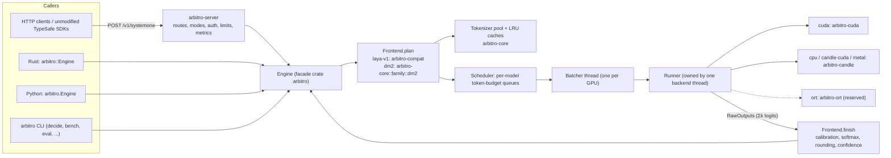
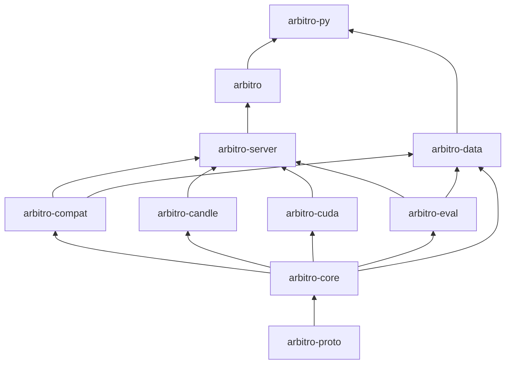
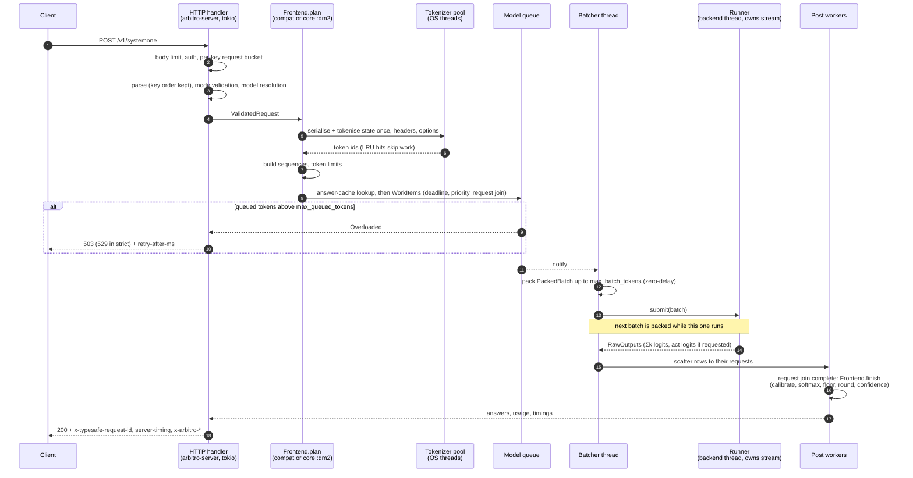
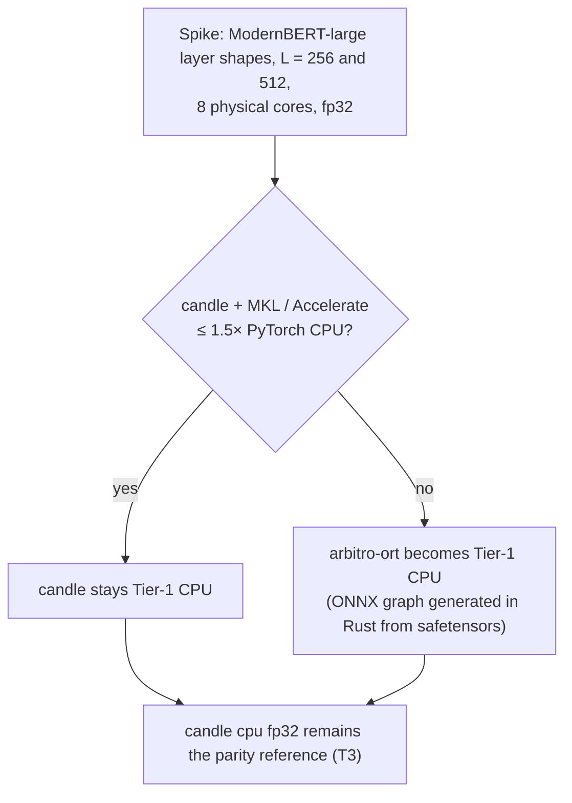
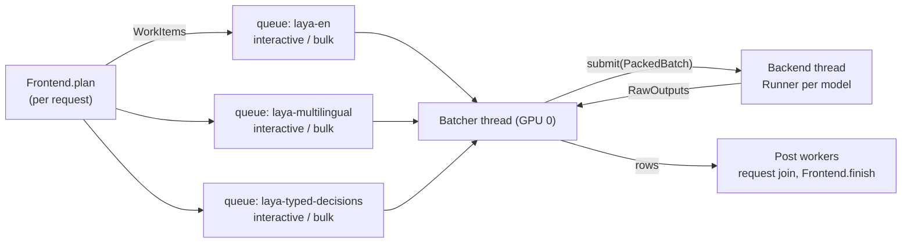

# Arbitro architecture

| | |
|---|---|
| Status | Design baseline, 2026-09-23. Nothing here is implemented or MEASURED yet. |
| Applies to | v0.1 "drop-in" → 1.0 "API freeze" (ADR-032) |
| Normative sources | The decision record [DECISIONS.md](DECISIONS.md) (ADR-001 … ADR-033, split into `docs/adr/` in M0). Where this document and an ADR disagree, the ADR wins. The errata this document found (O-20) are corrected there (DECISIONS.md Appendix C). |
| Name | "Arbitro" is the working name (Q1). The repository stays `Foxur/Rustify`. A rename is a mechanical token replacement (`arbitro` → `<name>`, `x_arbitro` → `x_<name>`). |

This document explains how the pieces fit together: crates, types, the path of one request, the numerics of every backend, the scheduler, the HTTP layer, calibration, determinism, performance targets and the test strategy. It does not repeat the rationale of the ADRs; it links to them. What Jev and Laya are, and how Laya's reference implementation computes an answer, is in [ANALYSIS.md](ANALYSIS.md).

---

## Contents

1. [Conventions](#1-conventions)
2. [System overview](#2-system-overview)
3. [Workspace and crates](#3-workspace-and-crates)
4. [Public API sketch](#4-public-api-sketch)
5. [Model registry and loading](#5-model-registry-and-loading)
6. [Request lifecycle](#6-request-lifecycle)
7. [Tokenization and sequence building](#7-tokenization-and-sequence-building)
8. [Inference engine (`arbitro-cuda`)](#8-inference-engine-arbitro-cuda)
9. [CPU, candle-CUDA, Metal and ONNX backends](#9-cpu-candle-cuda-metal-and-onnx-backends)
10. [Batching scheduler](#10-batching-scheduler)
11. [Serving layer (`arbitro-server`)](#11-serving-layer-arbitro-server)
12. [Calibration and post-processing](#12-calibration-and-post-processing)
13. [Determinism](#13-determinism)
14. [Performance targets](#14-performance-targets)
15. [Parity and test strategy](#15-parity-and-test-strategy)
16. [Open items](#16-open-items)
- [Appendix A: configuration reference](#appendix-a-configuration-reference)
- [Appendix B: evidence keys](#appendix-b-evidence-keys)

---

## 1. Conventions

**Number labels.** Every number carries one of these labels, as defined in the decision record:

| Label | Meaning |
|---|---|
| VERIFIED | Read in source or recomputed from raw data (by the research reports or the design session). "VERIFIED (arithmetic)" means computed from verified dimensions. |
| REPORTED | A third-party claim. |
| ESTIMATED | Modelled, not measured. M0 (week 2) or M4 replaces it. |
| MEASURED | Measured by this project. Nothing has this status yet. |
| GATE / GOAL | A target. A GATE blocks a release; a GOAL does not. |
| UNVERIFIED | Nobody has checked it. |

**IDs.** `P#`, `MEM#`, `S#`, `T#`, `Q-ref#`, `G-Q#`, `C#` refer to the canonical numbers table of the decision record ([DECISIONS.md §5](DECISIONS.md#5-canonical-numbers-downstream-documents-must-quote-these-identically)); `Q#` are its open questions (§2). The values are quoted here identically; when a value is re-based, that table changes first.

**Evidence keys** in square brackets, e.g. [CR C1] or [RIS §5.3], are listed in [Appendix B](#appendix-b-evidence-keys).

**Two "L"s.** *Parity levels* L0–L5 (§15) are unrelated to the dm2 *layouts*, which are always written "layout L0", "layout L2", "layout L3-k" and "layout T".

**Marks.** "Jev", "TypeSafe" and "Laya" are used only nominatively, to describe wire compatibility and checkpoint compatibility (ADR-031). The only exceptions in code are the wire-required identifiers (`/v1/systemone`, `x-typesafe-request-id`, the alias values `jev-latest` / `jev-preview`) and the optional `/typesafe/v1/*` path alias, which is off by default. `TYPESAFE_BASE_URL` appears in documentation only, as the client-side variable users change. The Laya descriptors (`laya` mode, `laya-v1`, `laya-*` registry ids) are nominative references to an Apache-2.0 project.

---

## 2. System overview

Arbitro is a self-hosted typed-decision engine. A request carries one *state* (string, JSON object or JSON array) and up to N *questions* of type `choice` (1–255 options), `score` (1–10 levels) or `noul` (yes/no). Each answer is a calibrated probability distribution; nothing is generated.

Two product tracks ship from one workspace and are never reported in one results table (ADR-001, ADR-027):

| Track | Model family | What runs | First release |
|---|---|---|---|
| A: compat runtime | `laya-v1` | User-downloaded Laya checkpoints `laya-en`, `laya-multilingual`, `laya-typed-decisions` with verified numerical parity | v0.1 (CPU + `candle-cuda`), v0.2 (custom `cuda` engine) |
| B: own-model track | `dm2` | `arbitro-en-large`, `arbitro-en-base` (Apache-2.0 weights, trained on one RTX 4090); `arbitro-multi-base` only after Q8 | v0.3 |



The split that matters most:

- **Frontend** (family-specific, backend-independent, CPU): validation, rendering, tokenization, sequence layout, and after the forward pass, calibration and answer formatting. `laya-v1` lives in `arbitro-compat`; `dm2` lives in `arbitro-core`.
- **Runner** (backend-specific, family-agnostic): executes a `PackedBatch` and returns raw logits. It never sees JSON, questions or calibration.
- **Scheduler** (between the two): turns work items from many requests into packed batches under a token budget.

---

## 3. Workspace and crates

### 3.1 Crates

Eight published crates, versioned in lockstep, plus three internal ones (ADR-003).

| Crate | Published | Responsibility | Main modules | Key dependencies |
|---|---|---|---|---|
| `arbitro-proto` | yes | Wire types, pydantic-style 422 builder, error bodies, OpenAPI document | `wire`, `error`, `openapi` | serde, `serde_json` (`preserve_order`, `arbitrary_precision`), indexmap |
| `arbitro-core` | yes | Domain types; tokenizer wrapper; registry and loader; `Backend`/`Runner`/`Frontend` traits; `PackedBatch`; `family::dm2` (layout planner, option chunking, none option); calibration *application*; shared post-processing. **Never depends on a GPU crate.** | `tok`, `registry`, `loader`, `backend`, `frontend`, `family::dm2`, `calib`, `post` | `tokenizers =0.23.2`, safetensors, half, blake3 |
| `arbitro-compat` | yes | Laya 0.3.7 behaviour, line by line | `pycompat` (json, fmt, unicode, npsum), `render`, `validate`, `sequence`, `temps`, `post`, the laya-v1 `Frontend`; `lang`/`router` (v0.2); `email`/`shortlist` (community) | core only; `fancy-regex` for email |
| `arbitro-candle` | yes | candle 0.11 backends `cpu`, `metal`, `candle-cuda`, with our own ModernBERT and head code (never candle-transformers' model) | `model::modernbert`, `model::laya_head`, `runner` | candle-core/-nn 0.11, candle-flash-attn 0.11 (feature `candle-cuda`) |
| `arbitro-cuda` | yes (feature-gated, needs nvcc) | The custom engine (ADR-008) | `kernels` (K1–K13, `.cu`), `gemm` (raw cuBLASLt), `fa2` (FFI), `arena`, `graphs`, `runner` | cudarc 0.19.9; vendored FA2 + CUTLASS in `third_party/` |
| `arbitro-server` | yes | axum routes, modes, scheduler (TEI-derived), auth, limits, metrics, config | `routes`, `modes`, `sched`, `auth`, `limits`, `metrics`, `config` | axum, tokio, tracing, subtle |
| `arbitro-eval` | yes | Metrics, suites, probes, statistics, gates, calibration *fitting*, claims check | `metrics`, `suites`, `probes`, `stats`, `gates`, `calib_fit`, `claims` | core |
| `arbitro` | yes | Facade library (`Engine`) and the `arbitro` binary (feature `cli`, on by default) | `engine`, `cli` | all of the above, per feature |
| `arbitro-data` | no | Dataset converters, augmentation, packer, manifests, licence gate, MinHash/13-gram checks | | core, compat, eval |
| `arbitro-py` | no | PyO3 abi3 wheel published on PyPI as `arbitro` | | arbitro, arbitro-data, pyo3/maturin |
| `xtask` | no | `cargo xtask goldens`, `parity`, `numbers`, `fetch-test-assets`, `release-check` | | |

`arbitro-ort` is reserved and exists only if the ADR-007 CPU spike fails (§9.4).



Arrows point from dependency to dependent: `proto ← core ← {compat, candle, cuda, eval} ← server ← arbitro` (ADR-003).

### 3.2 Features, toolchain, invariants

- **Facade features.** `arbitro` forwards `cuda`, `candle-cuda`, `metal`, `mkl`, `accelerate`; `cli` is on by default; `test-models` lists `test-tiny-en` / `test-tiny-multi`. OTLP export sits behind a feature (ADR-018).
- **Toolchain.** Edition 2024; `rust-toolchain.toml` pins 1.98.1 (VERIFIED current stable, 2026-09-23); MSRV 1.96, tested in CI.
- **Pinned dependencies.** `tokenizers =0.23.2` (1.0.0-rc.2 refuses the shipped tokenizer files [EA §8.4]); `candle-* 0.11`; `cudarc 0.19.9`.
- **CI invariants** (ADR-003): `arbitro-core` builds without GPU features; `cargo build -p arbitro --no-default-features` succeeds; MSRV job; `cargo-deny`; `cargo-semver-checks` from v0.2.
- **Library users and axum.** ADR-003 rejects a monolith so that axum and CUDA do not leak into library users. Because the facade depends on `arbitro-server` (for the scheduler), the HTTP stack inside `arbitro-server` must sit behind a feature that the facade's `cli` feature enables. This feature split is a proposal of this document (open item O-10).

### 3.3 CLI surface

| Subcommand | Crate doing the work | Purpose |
|---|---|---|
| `serve` | arbitro-server | HTTP server |
| `decide` | arbitro (Engine) | One request from a file or stdin |
| `pull`, `models`, `inspect` | arbitro-core (`registry`, `loader`) | Download and verify pinned checkpoints; list; show config, dtypes, sha256 |
| `calibrate` | arbitro-eval (`calib_fit`) | Refit temperatures on labelled JSONL, write a user `calibration.json` |
| `eval` | arbitro-eval | Suites, probes, gates, `eval verify-claims` |
| `bench` | arbitro + arbitro-server | Open-loop load generator (ADR-028) |
| `parity` | arbitro-core + backends | Compare backends against golden fixtures |
| `sweep-overflow` | arbitro-cuda (K11) | Per-GEMM max-abs sweep, the fp16 admission test T10 |
| `export-check`, `doctor`, `config` | various | Export parity (T9), environment diagnosis, resolved configuration |

`export-onnx` is reserved for the ADR-007 ORT path.

---

## 4. Public API sketch

The names and field semantics below come from ADR-004 and are normative. Items marked `// sketch` are this document's proposal for fields ADR-004 leaves open; they may change before 1.0 without an ADR.

### 4.1 Wire types (`arbitro-proto`)

```rust
use indexmap::IndexMap;
use serde_json::Value;

/// Key order is preserved everywhere (IndexMap, serde_json `preserve_order`).
pub struct DecideRequest {
    pub state: Option<Value>,                     // string | object | array; null only in `laya` mode
    pub model: Option<String>,                    // required in `strict`
    pub questions: IndexMap<String, Question>,    // answer order = this order
    pub x_arbitro: Option<RequestExt>,
    #[serde(flatten)]
    pub extra: serde_json::Map<String, Value>,    // accepted and ignored (SDK `extra_body`)
}

#[serde(tag = "type", rename_all = "lowercase")]
pub enum Question {
    Choice { instructions: Option<Value>, criteria: ChoiceCriteria },
    Score  { instructions: Option<Value>, criteria: Vec<Value> },
    Noul   { instructions: Option<Value>, criteria: Option<NoulCriteria> },
}

#[serde(untagged)]
pub enum ChoiceCriteria {
    Map(IndexMap<String, Option<Value>>),         // label -> description
    List(Vec<String>),                            // lenient / laya only
}

pub struct NoulCriteria { pub r#true: Option<Value>, pub r#false: Option<Value> }   // sketch

pub struct DecideResponse {
    pub model: String,                            // concrete id, e.g. "laya-en-c5d78730"; `laya` mode sends
                                                  // laya-serve's "laya-rl-agent" (byte parity, ADR-015)
    pub answers: IndexMap<String, Answer>,
    pub usage: Usage,
    pub x_arbitro: Option<ResponseExt>,
}

pub enum Answer {                                 // serialised with a mode-aware key order, see §11.4
    Choice { choice: String, confidence: f64, probabilities: IndexMap<String, f64> },
    Score  { score: f64, confidence: f64, legend: IndexMap<String, Value>,
             probabilities: IndexMap<String, f64> },           // keys "0".."n-1"
    Noul   { noul: f64 },                                      // P(yes); no confidence outside `laya` mode
}   // `laya` mode also emits `confidence` for noul and `action` on every answer (§11.4); its writer adds them

pub struct Usage { pub input_tokens: u64, pub output_tokens: u64 }   // processed tokens; output = 0

pub struct RequestExt {                           // wire key "x_arbitro" (ADR-018)
    pub include: Vec<Include>,                    // p_top, margin, entropy_confidence, p_correct, p_none,
                                                  // decision, truncation, logits, act, timing, routing
    pub rounding: Option<Rounding>,               // Full | Round2 | Round4
    pub permutations: Option<u8>,                 // K-order averaging, K x compute
    pub automate_alpha: Option<f64>,              // conformal error budget (dm2)
    pub priority: Option<Priority>,               // Interactive | Bulk
    pub deterministic: Option<bool>,              // reject (400) if not guaranteed
    pub deadline_ms: Option<u32>,                 // can only lower the server deadline
    pub shortlist_k: Option<u32>,                 // only once shortlist exists
}

pub struct ResponseExt {
    pub ext_version: u32,                         // frozen at 1.0
    pub backend: String, pub precision: String, pub calibration_id: String, pub model_family: String,
    pub timing_ms: Option<Timing>,                // tokenize, queue, forward, post
    pub routing: Option<Value>,
    pub answers: IndexMap<String, AnswerExt>,     // per-answer extras live here, never inside answers
}

pub struct AnswerExt {                            // all optional, filled per `include`
    pub p_top: Option<f64>, pub margin: Option<f64>, pub entropy_confidence: Option<f64>,
    pub p_correct: Option<f64>, pub p_none: Option<f64>, pub decision: Option<Decision>,
    pub truncated_state_tokens: Option<u32>, pub truncated_option_tokens: Option<u32>,
    pub options_kept: Option<u32>, pub logits: Option<Vec<f32>>, pub act_probability: Option<f64>,
}

pub enum ApiError {                               // variants: sketch; statuses and bodies: ADR-017
    JsonInvalid(PydanticError),                   // 422
    Validation(Vec<PydanticError>),               // 422 {"detail":[{type,loc,msg,input,ctx}]}
    TooManyChoices,                               // 400 string detail
    TooManyLevels,                                // 400 string detail
    MaxTokensExceeded { message: String },        // 400 {"detail":{"error_type":"max_tokens_exceeded",...}}
    UnknownModel(String),                         // 400 api_usage_error
    DeterminismUnavailable,                       // 400 api_usage_error
    Unauthenticated { strict: bool },             // 401, 403 in strict
    NotFound, PayloadTooLarge,                    // 404, 413
    RateLimited { retry_after_ms: u64 },          // 429, per key only
    Overloaded { retry_after_ms: u64, strict: bool }, // 503, 529 in strict (queue full or deadline)
    Internal { request_id: String },              // 500, never 422
}
```

### 4.2 Core traits and structs (`arbitro-core`)

```rust
pub trait Backend: Send + Sync + 'static {
    fn id(&self) -> &'static str;                                // "cpu" | "cuda" | "candle-cuda" | "metal"
    fn load(&self, m: Arc<ModelArtifacts>, o: &RunnerOptions) -> Result<Box<dyn Runner>>;
}

pub trait Runner: Send {                                         // owned by one backend thread; not async
    fn caps(&self) -> RunnerCaps;                                // precisions, max_batch_tokens, layouts, deterministic
    fn warmup(&mut self) -> Result<()>;                          // also captures CUDA graphs; /ready flips after this
    fn submit(&mut self, b: PackedBatch) -> Result<Ticket>;      // one batch in flight while the next is packed
    fn wait(&mut self, t: Ticket) -> Result<RawOutputs>;
}

pub trait Frontend: Send + Sync {                                // laya-v1 (arbitro-compat), dm2 (arbitro-core)
    fn plan(&self, req: &ValidatedRequest, tok: &TokenCache) -> Result<WorkPlan>;
    fn finish(&self, plan: &WorkPlan, raw: &RawOutputs, cal: &Calibration, out: &OutputOptions)
        -> Result<IndexMap<String, Answer>>;
}

pub struct PackedBatch {
    pub input_ids: Vec<u32>,
    pub position_ids: Vec<u32>,           // explicit; under layout L2 they continue after the state
    pub cu_seqlens_q: Vec<u32>,
    pub cu_seqlens_k: Vec<u32>,           // equals cu_seqlens_q for laya-v1 and layout L0
    pub max_seqlen_q: u32, pub max_seqlen_k: u32,
    pub kv_segments: Vec<KvSegment>,      // per query sequence: which state K/V (cached or in-batch) it reads
    pub qtype: Vec<u8>,                   // per sequence: choice 0, score 1, noul 2
    pub cu_markers: Vec<u32>, pub marker_rows: Vec<u32>,
    pub span_ranges: Vec<(u32, u32)>,     // dm2 option spans; empty for laya-v1
    pub want_act: bool,                   // laya-v1 act head (laya mode or on request)
}

pub struct RawOutputs { pub logits: Vec<f32>, pub act_logits: Option<Vec<f32>>, pub aux: Option<Vec<f32>> }

pub enum Precision { F32, Bf16, Fp16Checked, Fp8W8A8 }  // Fp8: per-channel weights, per-token activations

// ---- sketch: fields ADR-004 leaves open ----
pub enum KvSegment {
    SelfOnly,                                  // laya-v1, layout L0, and the state sequence itself
    InBatch { state_seq: u32 },                // layout L2: read the K/V of sequence `state_seq`
    Cached { key: [u8; 32], len: u32 },        // layout L2 + cross-request state K/V cache (M6)
}
pub struct RunnerOptions {
    pub precision: Precision, pub device: usize, pub max_batch_tokens: u32,
    pub determinism: Determinism /* BatchInvariant | Fast */, pub cuda_graphs: bool, pub threads: usize,
}
pub struct RunnerCaps {
    pub precisions: Vec<Precision>, pub max_batch_tokens: u32,
    pub layouts: LayoutSet /* L0, L2, L3k */, pub deterministic: bool,
}
pub struct WorkPlan {
    pub items: Vec<WorkItem>,                  // scheduler units (§10.2)
    pub questions: Vec<QuestionPlan>,          // qid, qtype, k, option labels, truncation, cache hits
    pub processed_tokens: u64,                 // -> usage.input_tokens
}
```

`PackedBatch` invariants (checked in debug builds and by the laya-v1 round-trip test of ADR-004):

| Invariant | laya-v1 / layout L0 | layout L2 |
|---|---|---|
| `input_ids.len() == position_ids.len() == *cu_seqlens_q.last()` | yes | yes |
| `qtype.len() + 1 == cu_seqlens_q.len() == cu_markers.len() == kv_segments.len() + 1` | yes | yes |
| `marker_rows.len() == *cu_markers.last()`; each is an absolute packed row index | yes | yes |
| `position_ids` restart at 0 per sequence | yes | state: 0…S−1; suffix: S… |
| `cu_seqlens_k == cu_seqlens_q` | yes | no (suffix keys = state ∪ self) |
| `span_ranges` | empty | one range per option |
| `RawOutputs.logits.len() == Σk`, aligned with `cu_markers` | yes | yes (+ none option) |
| `act_logits.len() == n_seq × 2` iff `want_act` | yes | never (dm2 has no act head) |

### 4.3 Facade and Python

```rust
let engine = arbitro::Engine::builder()
    .model("laya-en")
    .device(Device::Auto)
    .build()?;
let resp = engine.decide(req).await?;      // or engine.decide_blocking(req)
let models = engine.models();              // backs GET /v1/models
```

```python
import arbitro
engine = arbitro.Engine(model="laya-en")          # CPU inference in the wheel
resp = engine.decide(state, questions)
# migration shim for laya users: arbitro.compat.laya.Agent
```

The method is always `decide`. The identifiers `system_one` and `predict` are never used (ADR-004, ADR-031).

---

## 5. Model registry and loading

### 5.1 Registry

A built-in `registry.toml`, extendable via `~/.config/arbitro/models.toml` (ADR-005). Fields: `id`, `aliases`, `family` (`laya-v1` | `dm2`), `source` (`{hf, subfolder, revision}` with a 40-hex revision, `{dir}` or `{url}`), `files` (path → sha256), `license`, `redistribute`, budgets (`max_len`, `head_max_len`), `precision_allow`, `calibration`.

| Registry id | Family | Pinned source | Concrete id in responses | `max_len` / `head_max_len` |
|---|---|---|---|---|
| `laya-en` | laya-v1 | HF `convaiinnovations/laya` @ `c5d78730f3493e4fe16d61507ef4b78eef7318cf` | `laya-en-c5d78730` | 512 / 192 |
| `laya-multilingual` | laya-v1 | same repo, subfolder `multilingual` @ `1c5edc17a7acd8701df6fc341c0d179f1c62c982` | `laya-multilingual-1c5edc17` | 1024 / 256 |
| `laya-typed-decisions` | laya-v1 | HF `convaiinnovations/laya-typed-decisions` @ `f9ab0b228f0fc0f14d873dbc99038f135c2da1b2` | `laya-typed-decisions-f9ab0b22` | 1024 / 256 |
| `test-tiny-en`, `test-tiny-multi` | laya-v1 | Random weights from `tools/goldens` (never Laya weights) | same as id | test-only |
| `arbitro-en-large`, `arbitro-en-base` | dm2 | Our Hub org (Q9) | `<id>-<model semver>` | 8192 context |

Aliases: `models.aliases` maps `jev-latest` and `jev-preview` to `@default` (wire compatibility). In `laya` mode, `english`/`en`/`laya` → `laya-en`, `multilingual` → `laya-multilingual`, `typed-decisions` → `laya-typed-decisions`. Responses carry the concrete id in `model` in `strict` and `lenient` mode. `laya` mode returns laya-serve's `"laya-rl-agent"` in the body, because it must be byte-identical to laya-serve (ADR-015, parity level L5). The `x-arbitro-model` header carries the concrete id in every mode.

### 5.2 Loading a laya-v1 checkpoint

| Step | Rule | Evidence |
|---|---|---|
| Detect family | A directory containing `rl_agent_config.json` is `laya-v1`; `arbitro-model.json` is `dm2` | ADR-005 |
| Verify | sha256 per file against the registry; mismatch refuses to load. A registry entry without sha256 fails. | ADR-005 |
| Tokenizer config | Laya's `_fix_tokenizer_config` (`TokenizersBackend` → `PreTrainedTokenizerFast`; list `extra_special_tokens` → dict) applied **in memory only**; files are never rewritten | [LIS §6.3], [CR G2] |
| Special ids | From the tokenizer files, never from `encoder/config.json` (the multilingual config's `cls_token_id=1` is wrong; the tokenizer's `<bos>` = 2 is used) | [EA §2.1], [CR G2] |
| Encoder config | Accept both formats: `rope_parameters.{full_attention,sliding_attention}.rope_theta` or legacy `global_rope_theta`/`local_rope_theta` (local defaults to global); `layer_types` or `i % global_attn_every_n_layers`; `norm_eps` over `layer_norm_eps` | [EA §2.2] |
| Tensor set | Strict key set: 206 tensors (EN, typed-decisions), 170 (multilingual). Layer 0 has no `attn_norm`. | [EA §9.1] |
| Dtype | Read per tensor (F16/F32/BF16). On disk: F16 (VERIFIED by proxy; the header check is an M0 task). | [CR G1] |
| `temperature` buffer | Loaded for the strict key set, then ignored. Runtime temperatures come from `rl_agent_config.json`. | [CR C3] |
| RoPE buffers | Not in the file; recomputed (§8.1) | [EA §9.1] |
| Weight layout | PyTorch `[out, in]`; GEMMs use the transposed-B form rather than a pre-transposed copy | [EA §9.1] |

`arbitro pull` downloads into `$ARBITRO_HOME` (default `~/.cache/arbitro`), reuses the HF cache via `hf-hub`, verifies sha256, prints the licence line, and never mirrors Laya weights anywhere (ADR-005, ADR-031).

**Licence caveat.** Upstream declares the Laya weights Apache-2.0, but Laya's training mix includes CC-BY-NC-4.0 data (both REPORTED [LTR §5.2]; also [CR §3 #10]). Their licence status is therefore unclear. The licence line printed by `pull` repeats the upstream declaration and tells the user that this caveat exists. The user decides whether their own use is acceptable. Arbitro never redistributes Laya weights, never ships them in images or release assets, and never uses them to initialise or distil its own models (ADR-030, ADR-031).

### 5.3 Residency

All three Laya checkpoints stay resident on the GPU: ≈ 2.3 GB in bf16 (MEM3, ESTIMATED), with `models.max_resident = 3` and LRU eviction beyond that. This removes the 7–10 s reload stalls of Laya's router [BW §2.4]. Each resident model has its own scheduler queue, arena and set of CUDA graphs (§8.6, §10).

| Model | Parameters | Weights resident (bf16) |
|---|---|---|
| `laya-en`, `laya-typed-decisions` | 421,293,830 (MEM1, VERIFIED arithmetic) | 842.6 MB (803.6 MiB) |
| `laya-multilingual` | 321,908,998 (MEM2, VERIFIED arithmetic) | 643.8 MB (614.0 MiB) |

All values are 2 bytes per parameter (VERIFIED arithmetic, [EA §7.3]). The "615 MB" file size in the laya-hexagon-npu README is the MiB value (MEM2). The total is 842.6 + 842.6 + 643.8 ≈ 2,329 MB, consistent with MEM3's ≈ 2.3 GB.

Only the weights of the **bf16 GEMMs of §8.3** (the encoder's Wqkv, Wo, Wi and Wo_mlp, the head's four linears and scorer.1, plus their biases) are converted from fp16 to bf16 once at load. Direct fp16 → bf16 conversion with round-to-nearest-even gives the same values as autocast's per-call fp32 → bf16 cast, because fp16 → fp32 is exact. The reference keeps the non-GEMM tensors at their fp16-exact values inside fp32 parameters. These are the embedding tables, `type_emb`, and every LayerNorm weight and bias. Converting them to bf16 would add error that the reference does not have. The scorer.3 and act-head weights are also kept at fp16-exact values, because our fp32 tail runs them in fp32 by design (§8.4). All of these tensors stay in their stored fp16 and are widened to fp32 inside the kernels (K1, K4, K6, K7, K9, K10), so resident memory does not change. The fp16 copy of the GEMM weights is kept only when fp16 mode is enabled for that model (ADR-009).

---

## 6. Request lifecycle

### 6.1 Sequence



The in-process path (`Engine::decide`) skips the HTTP-only work: the body limit, auth, the per-key buckets (step 2), JSON parsing, and header emission. Mode validation and model resolution (the rest of step 3) still run, and everything from step 4 on is identical.

### 6.2 Stages, owners and costs

| # | Stage | Owner (crate, thread) | Failure exits | Timing segment |
|---|---|---|---|---|
| 1 | Body size, auth, per-key request bucket | server, tokio | 413; 401 (403 in strict); 429 | — |
| 2 | JSON parse with `preserve_order` + `arbitrary_precision` | proto, tokio | 422 `json_invalid` | — |
| 3 | Schema and mode rules (§11.2), S1/S2 limits, model resolution | proto + server, tokio | 422; 400 (options, levels, unknown model) | — |
| 4 | pycompat serialisation, rendering (§7.2–7.4) | compat or core, tokenizer pool | — | `tok` |
| 5 | Tokenisation: state once per request; headers and options (LRU) | core `tok`, tokenizer pool | — | `tok` |
| 6 | Sequence building, truncation accounting, S3/S4/`max_processed_tokens` checks | Frontend.plan | 400 `max_tokens_exceeded` | `tok` |
| 7 | Answer-cache lookup (only under `batch_invariant`); enqueue work items | server `sched` | 503/529 when above S10 | `queue` |
| 8 | Packing, H2D, forward, D2H | batcher + runner threads | 500 on a CUDA fault; 503/529 on deadline | `queue`, `gpu` |
| 9 | Join; calibration, softmax, floor, rounding, confidence, extensions | Frontend.finish, post workers | — | `post` |
| 10 | Serialise JSON (mode-aware key order), headers, metrics | server, tokio | — | — |

Planning costs (not gates): tokenisation of a 163-token state took 0.3 ms single-threaded (VERIFIED on the research sandbox's 4-core Xeon [RIS §4.7]). That is about 10 % of a 3 ms GPU request; the 3 ms figure is ESTIMATED. GPU time for one 250-token question is 2.5–3.5 ms in bf16 on the custom engine, plus ≈ 0.05 ms I/O (ESTIMATED [RIS §5.3]). Post-processing is O(Σk) on the CPU.

### 6.3 Threads

| Pool | Size | Notes |
|---|---|---|
| tokio runtime | default multi-thread | HTTP, validation, serialisation only; never blocks on the GPU |
| Tokenizer workers | physical cores − 2, each with its own `Tokenizer` | fed by a bounded channel (TEI pattern [RIS §3.3]) |
| Batcher | one per GPU | owns the per-model queues of that GPU |
| Backend thread | one per `Runner` | owns the CUDA stream(s); `Runner` is not async (ADR-004) |
| Post workers | small CPU pool | `Frontend.finish` and request joins |

### 6.4 Deadlines and cancellation

- Every work item carries its request deadline: `server.request_timeout_ms = 8000` (S5), which `x_arbitro.deadline_ms` can only lower. The SDK's per-attempt timeout is 10 s (VERIFIED [JAS §3.7]). If the server answered later, the client would already have retried, and the server would compute the request twice.
- The batcher drops expired items at pack time; the request fails with 503 (529 in `strict`) and `retry-after-ms`.
- A client disconnect cancels the request's queued items. Items already in a submitted batch finish and are discarded.
- `limits.max_processed_tokens = "auto"` rejects requests up front that could not finish inside the deadline even on an otherwise idle engine (§10.6, P12). Under load, the deadline check above applies instead.

---

## 7. Tokenization and sequence building

### 7.1 Tokenizers

`tokenizers =0.23.2` with `default-features = false, features = ["fancy-regex"]` loads both shipped `tokenizer.json` files and matched Python ids on all 20 probe strings for both tokenizers (VERIFIED [EA §8.4]).

| | English (`laya-en`, `laya-typed-decisions`) | Multilingual (`laya-multilingual`) |
|---|---|---|
| Type | ModernBERT byte-level BPE, NFC, GPT-2 regex; vocab 50,368 (ids 0..50367) | Gemma-2-derived BPE, Metaspace "always" prepend, byte fallback; vocab 256,000 |
| CLS / SEP / PAD / MASK | 50281 / 50282 / 50283 / 50284 | 2 `<bos>` / 1 `<eos>` / 0 `<pad>` / 4 `<mask>` |
| `" yes"` vs `"yes"` | different ids (leading space matters) | same id |
| File size / load time | 3.6 MB / 0.13 s | 34 MB / 1.6 s |
| Evidence | [EA §8.1, §8.4] VERIFIED | [EA §8.2, §8.4] VERIFIED |

- One `Arc<Tokenizer>` per model is loaded once; each tokenizer worker holds its own clone.
- **Special-token injection.** laya-v1 keeps `encode_special_tokens = false`, so literal `[SEP]`/`<eos>` in user text become special ids exactly as in Python (parity quirk, [CR G9]). dm2 trains and serves with `encode_special_tokens = true`, so user text cannot inject structure (ADR-019).
- The literal mask string (`[MASK]` / `<mask>`) is replaced by a space in instructions, options and state before tokenisation, as in Laya [LIS §2].

### 7.2 Python-compatible serialisation (`arbitro-compat::pycompat`)

A single escaping or float-formatting difference changes token ids [CR C11]. Parity is defined against CPython 3.11 with Unicode 14.0.0 tables (ADR-012).

| Input | Python call reproduced | Separators | ensure_ascii |
|---|---|---|---|
| state (non-string) | `json.dumps(state, ensure_ascii=False)` | `", "`, `": "` | False |
| criteria value (non-string) | `json.dumps(v, ensure_ascii=False, separators=(", ", ": "), default=str)` | `", "`, `": "` | False |
| instructions (non-string) | `str(json.dumps(ins))` | `", "`, `": "` | True |

- **Escapes** (VERIFIED in the reference venv, ADR-013): `"` `\` and `\n \r \t \b \f` short escapes; other U+0000–U+001F as `\u00XX` (lower-case hex). With `ensure_ascii=False`, DEL, U+2028/U+2029 and all other non-ASCII are emitted raw. With `ensure_ascii=True`, they become `\uXXXX`, with surrogate pairs for astral code points (`😀`).
- **Numbers** are parsed as raw text. Integers are exact big integers (`-0` → `0`); floats go through f64 and print as Python `repr`: shortest round-trip, fixed notation for −4 ≤ exp < 16 with at least `.0`, else `1e+16` / `1.5e-05`; `NaN`, `Infinity`, `-Infinity` literals; `1e400` → `Infinity`.
- **Objects** keep insertion order; a duplicate key keeps its first position and takes the last value.
- **Formatting:** `%r` with Python's quote rules; `%.0f` rounds half-even; `round(x, 4)` on the exact binary value.
- **numpy:** the float32 softmax denominator and the entropy reproduce numpy 2.4.6's pairwise summation order (`npsum`), for k ∈ {1…255}. The same applies to the float64 expected score `(np.arange(k) * p).sum()` (`agent.py:409`). numpy switches from a plain loop to 8 partial accumulators at n ≥ 8, so score questions with 8–10 levels need the numpy order too.
- **Unicode:** `isalpha`, `isalnum`, Python `re` `\w` and full `str.lower` come from committed tables generated from CPython 3.11 by `tools/goldens/gen_pyunicode.py`. Rust's `is_alphabetic()` and the `regex` crate's `\w` are never used on the compat path [CR G8].

### 7.3 Validation

| Mode | Validator | Errors |
|---|---|---|
| `strict` | The public OpenAPI schema | pydantic-style 422 with the discriminator tag in `loc` (e.g. `["body","questions","q","score","criteria",0]`) |
| `lenient` | OpenAPI schema plus the extensions of §11.2 (list criteria, `type: "boolean"`) | same |
| `laya` | Laya's `_check_question`: 8 checks in order, each a `ValueError` with the exact message and Python `%r` of the qid; the first invalid qid in dict order fails the whole request | Laya's error strings [LIS §1.2] |

Normalisation (laya-v1): list criteria become `{label: None}` with duplicates collapsed; noul criteria keys become `str(k).lower()`; non-string instructions go through `json.dumps` with `ensure_ascii=True` [LIS §1.3].

### 7.4 Option rendering (laya-v1)

| qtype | Options, in label-index order |
|---|---|
| choice | `k` if the description is `None` or `""`, else `"k: " + render(v)` (so `0` and `false` are real descriptions) |
| score | `"level i: " + render(c)` |
| noul | Always two, in the order `[false, true]`: `"false: " + (desc or "no, the statement does not hold")`, `"true: " + (desc or "yes, the statement holds")` |

`render(v)` passes strings through and serialises everything else with the criteria rule of §7.2 [LIS §1.4].

### 7.5 `build_sequence` (laya-v1)

Layout: `[CLS] <type> question: <instructions> [SEP] [MASK] opt0 [MASK] opt1 … [SEP] state [SEP]`. The port is line-by-line (ADR-012, [LIS §2]); in Rust-flavoured pseudocode:

```rust
// max_len, head_max_len from the registry budgets (MEM7); truncate_left = false at inference
let head_ids = enc(&format!("{t} question: {ins}"));             // mask literal -> " "
let mut opt_ids: Vec<Vec<u32>> = opts.iter()
    .map(|o| [vec![MASK], enc(&format!(" {o}"))[..min(48, len)].to_vec()].concat())  // leading space
    .collect();                                                   // <= 48 text tokens + 1 marker
let mut opt_budget = head_max_len as i64 - sum_len(&opt_ids);
if opt_budget < 16 {
    let per = max(4, (head_max_len - 16) / max(1, n));            // floor division; INCLUDES the marker
    opt_ids.iter_mut().for_each(|o| o.truncate(per));
    opt_budget = head_max_len as i64 - sum_len(&opt_ids);        // may be negative
}
let head = &head_ids[..min(head_ids.len(), max(8, opt_budget) as usize)]; // instructions keep >= 8 tokens
let mut ids = [&[CLS][..], head, &[SEP]].concat();
let markers: Vec<u32> = opt_ids.iter().map(|o| { let m = ids.len(); ids.extend(o); m as u32 }).collect();
ids.push(SEP);
let room = max_len.saturating_sub(ids.len() + 1);
let st = &state_ids[..min(room, state_ids.len())];               // keeps the HEAD of the state
ids.extend(st); ids.push(SEP);
ids.truncate(max_len);
let markers: Vec<u32> = markers.into_iter().filter(|&m| (m as usize) < max_len).collect();
// markers.len() != n  ->  error "question %r options exceed head_max_len=%d"
```

| Checkpoint | `max_len` / `head_max_len` | Minimum state room | Option ceiling |
|---|---|---|---|
| `laya-en` | 512 / 192 | 316 tokens when the option budget is full (VERIFIED with `build_sequence`, see ANALYSIS.md) | ≈ 125 options (MEM8) |
| `laya-multilingual`, `laya-typed-decisions` | 1024 / 256 (typed-decisions was *trained* at 512 / 192, MEM7) | 764 tokens when the option budget is full (VERIFIED with `build_sequence`) | ≈ 250 options (MEM8) |

The ceilings assume that every option still has ≥ 3 text tokens after the `per` cut, i.e. 4 tokens with its marker. Shorter options fit more: 150 single-token options at 512 / 192 keep all 150 markers (VERIFIED [LIS §2]). Options are cut to 3 text tokens long before the ceiling (MEM8). Truncation is never silent: `truncated_state_tokens`, `truncated_option_tokens` and `options_kept` are recorded per question and surface in `x-arbitro-truncated-questions` and `x_arbitro.answers.<qid>` (ADR-018).

Quirks reproduced deliberately and documented (ADR-012): `truncate_left` including its `st[-0:]` bug (behind a flag); typed-decisions' inherited EN bucket temperatures; its train/serve layout skew; `encode_special_tokens = false`. The mutation self-check (§15.3) proves the tests would notice if any of these were "fixed".

### 7.6 Tokenise the state once

laya-v1 tokenises the state independently of the question, so the ids can be computed once per request and sliced per question (`st[:room]`) with identical results [EA §8.3]. Caches:

- state ids: LRU keyed by blake3 of the serialised state (repeated states across requests);
- header ids and option ids: LRU keyed by their rendered text.

States over 64 KB may be tokenised in parallel at pre-tokenizer-safe split points only after a fuzz test proves identical ids. This is off by default (UNVERIFIED, ADR-010).

### 7.7 dm2 layouts

dm2 differs from laya-v1 in the sequence builder, not in the engine primitives (ADR-019). Fixed parts: the pretrained `[MASK]` as the per-option marker, per-option spans (`[MASK]` + ≤ 32 text tokens; the cap is ablated in X6), 8,192-token context with head+tail truncation beyond it, `encode_special_tokens = true`, and an explicit virtual "none" option (last).

| Layout | Sequences in the `PackedBatch` | `cu_seqlens_k` / `kv_segments` | Positions | Status |
|---|---|---|---|---|
| L0 | One per question: question then state, fully bidirectional | = q / `SelfOnly` | 0… per sequence | Baseline and final fallback |
| L2 (prefix-isolated) | `[CLS] state [SEP]` once, then per question a suffix `<type> instructions [SEP] [MASK] opt … [MASK] none [SEP]` | state: self; suffix: state ∪ self (`InBatch` or `Cached`) | suffix continues after the state | Preferred if it passes the pre-registered rule |
| L3-k | L2 for the lower layers; the top k ∈ {2, 4, 7} layers re-encode `[state; question]` | mixed | as L2, then L0 | Fallback |
| T | Isolated option branches with tied positions | branch-specific | tied | Ablation arm only |

The layout is Deferred-until-measured (M5, `docs/adr/ADR-019a-dm2-frozen.md`). The engine supports layout L0 natively, so a failed shared-state bet costs speed, not a release.

**Option-group chunking.** A choice question is split into groups of ≤ 64 options; each group is its own suffix over the same state, and all groups' logits go through one joint softmax. 255 options × 33 tokens = 8,415 tokens (VERIFIED arithmetic) would overflow any single budget; chunked, it becomes 4 groups of ≤ 2.2k tokens (ADR-019). Chunk invariance is gated at max |Δp| ≤ 0.02 (G-Q6).

**none option.** Always present at inference. `p_none` is its mass; the Jev-compatible `probabilities` are renormalised over the real options only.

### 7.8 Worked packing examples

**laya-v1, two questions** (illustrative lengths): a choice question of 12 tokens with 3 options (markers at 4, 6, 8) and a noul question of 9 tokens (markers at 3, 5).

```text
input_ids     = [q0: 12 ids][q1: 9 ids]                 21 rows
position_ids  = [0..=11, 0..=8]
cu_seqlens_q  = [0, 12, 21]        cu_seqlens_k = cu_seqlens_q
qtype         = [0, 2]
cu_markers    = [0, 3, 5]
marker_rows   = [4, 6, 8, 15, 17]   (absolute packed rows; 12 + 3, 12 + 5)
kv_segments   = [SelfOnly, SelfOnly]
logits        = 5 floats: q0 -> [0..3), q1 -> [3..5)
```

**dm2 layout L2, gather-then-dense reference** (illustrative): a 500-token state and two 60-token suffixes.

```text
seq 0 (state)   q = 500 rows, positions 0..=499,   keys = itself                 kv_segments[0] = SelfOnly
seq 1 (suffix)  q =  60 rows, positions 500..=559, keys = state K/V ∪ own K/V   kv_segments[1] = InBatch{state_seq: 0}
seq 2 (suffix)  q =  60 rows, positions 500..=559, keys = state K/V ∪ own K/V   kv_segments[2] = InBatch{state_seq: 0}
cu_seqlens_q = [0, 500, 560, 620];  per-sequence key lengths = [500, 560, 560]
processed tokens = 620 (layout L0 would process 2 × 560 = 1,120)
```

FA2's bottom-right alignment (offset `sk − sq`) gives the suffix rows the correct absolute window: a suffix query at position 500 + i attends to keys with |(500 + i) − j| ≤ 64 on local layers [CR G5]. The paged path (K3b, §8.5) replaces the gather with a block table.

---

## 8. Inference engine (`arbitro-cuda`)

The custom engine is the primary NVIDIA backend from v0.2 (ADR-006, ADR-008). It targets sm_80+ and is tuned for sm_89 (RTX 4090). Budget: 170 dev-h (M4); size: 3–5k lines of Rust plus 1–2k lines of CUDA (ESTIMATED [RIS §8]). If M4 exceeds 255 dev-h, cut rule C-3 keeps `candle-cuda` as the default GPU backend.

### 8.1 The model, in execution order

| | ModernBERT-large (`laya-en`, typed-decisions) | mmBERT-base (`laya-multilingual`) |
|---|---|---|
| Hidden D / heads / head dim | 1024 / 16 / 64 | 768 / 12 / 64 |
| Layers (global at i % 3 == 0) | 28 (10 global, 18 local) | 22 (8 global, 14 local) |
| GeGLU intermediate I (Wi out = 2I) | 2624 (5248) | 1152 (2304) |
| RoPE θ global / local | 160,000 / 10,000 | 160,000 / 160,000 |
| Local window | \|i − j\| ≤ 64 | same |
| Decision head | 2 × pre-LN `TransformerEncoderLayer` (biases, ReLU, FFN 4D, nhead = D/64) | same |
| Source | VERIFIED from the shipped `encoder/config.json` copies [EA §2.1]; head from `common.py:89-101` | same |

```text
per packed row r (position p = position_ids[r]):
  h = LN_nobias(E_tok[id])                                     K1   h: fp32 residual, x: bf16
  for layer l:
    a   = (l == 0) ? x : LN_nobias(h)                          K4   (layer 0 has no attn_norm)
    qkv = a · Wqkvᵀ                                            GEMM
    q,k = rope(q,k; θ(l), p)  (fp32 math, rounded once)        K2
    o   = FA2(q,k,v; window l local ? (64,64) : (-1,-1))       K3
    h  += o · Woᵀ                                              GEMM, fp32 C/D beta=1
    u   = LN_nobias(h) · Wiᵀ                                   K4 + GEMM
    h  += (gelu_erf(u[:I]) * u[I:]) · Wo_mlpᵀ                  K5 + GEMM, fp32 C/D beta=1
  h = LN_nobias(h) + type_emb[qtype(seq)]                      K6 (fused with head norm1)
  2 head layers (full attention per sequence, no RoPE)         K3, K7, GEMMs; layer 2 pruned (K8)
  logits[marker] = W3 · gelu_erf(W1 · LN(h[marker]) + b1) + b3 K7, GEMM, K9 (fp32 tail)
  act (optional): Linear(D+4 → 256) → GELU → Linear(256 → 2)  K10 on CLS rows
```

Exact op order and masking semantics: [EA §3–§4]. `rotate_half` is non-interleaved (`cat(-x[32:64], x[0:32])`); `inv[j] = 1/θ^(2j/64)`.

### 8.2 Kernels

| # | Kernel | Specification (ADR-008) |
|---|---|---|
| K1 | `embed_gather_ln` | Token gather + LayerNorm without bias, two-pass fp32 statistics. Writes the fp32 residual and a bf16 GEMM input. |
| K2 | `rope_qk_inplace` | cos/sin tables built in f64, stored as f32, per θ; gathered by packed `position_ids`; rotate-half. |
| K3 | `fa2_varlen_fwd_hdim64` | Vendored FA2 dense non-split kernels `flash_fwd_hdim64_{bf16,fp16}_sm80.cu`. Window (64,64) local, (−1,−1) global. `num_splits = 1`. Dispatch trimmed to non-causal hdim64 (recorded in `MODIFICATIONS.md`). |
| K3b | `fa2_paged_splitkv_hdim64` | Only for dm2 layout L2 (M6). `flash_fwd_splitkv_hdim64_{bf16,fp16}_sm80.cu`, because `flash_api.cu` routes every `block_table` call to `run_mha_fwd_splitkv_paged_` (VERIFIED). `num_splits = 1`; page size a multiple of 32. |
| K4 | `add_ln_nobias` | Residual add + LayerNorm, fp32 statistics, bf16 out; used whenever the GEMM epilogue did not fuse the add. |
| K5 | `geglu_erf` | Exact-erf GELU(u₁)·u₂ in fp32, bf16 out. Never the tanh epilogue. |
| K6 | `final_ln_type_headln` | `final_norm` + `type_emb[qtype]` on every row + head `norm1` (with bias), fused. |
| K7 | `ln_bias` | Head `norm2` (both layers), head layer 2's `norm1` (K6 covers only layer 1's `norm1`), and `scorer.0`. |
| K8 | `gather_rows` | CLS and marker rows; enables exact pruning of head layer 2. |
| K9 | `scorer_tail` | GELU-erf and the D → 1 projection in fp32 over Σk rows. |
| K10 | `act_head` | GPU. Features from the *untempered* fp32 softmax: top1, margin, entropy (1e-9 floor), k/255 with k clamped ≥ 2, top2 = 0 when k = 1 [LIS §5.3, CR C2]. Then the CLS row after the head layers → Linear(D+4 → 256) → exact-erf GELU → Linear(256 → 2) in fp32 (`nn.GELU()`, `common.py:101`, VERIFIED; [EA §3.2]). Only in `laya` mode or on request. |
| K11 | `absmax_probe` | Per-GEMM-output max-abs; `sweep-overflow` and debug builds only. |
| K12 | `quant_fp8_rowwise` | Per-token E4M3 quantisation (1.x). |
| K13 | `attn_varlen_f32_ref` | Debug-only fp32 path (Q17): a naive fp32 varlen attention with K3's window semantics, used with fp32 variants of K1 and K4–K7 for T5; a block-table mode (M6) serves T9's paged-vs-dense clause. Never a serving path, never graph-captured. |

**Head layer 2 pruning** (exact): layer 2 needs K/V for every row but Q, out_proj, norm2 and the FFN only for CLS and marker rows. K8 gathers those rows; FA2 then runs with `seqlens_q = 1 + k` per sequence and `seqlens_k` = the full sequence. This saves ≈ 2.5 % of FLOPs (ESTIMATED [RIS §7]).

### 8.3 GEMMs

cuBLASLt through the raw `cudarc::cublaslt::sys` API, because the safe `Matmul<T>` uses one T for A, B and C [CR G6]. Inputs bf16 (or fp16), compute fp32 only; FP16 accumulation is never used.

| GEMM | N × K (EN) | N × K (ML) | Output | Epilogue |
|---|---|---|---|---|
| Wqkv | 3072 × 1024 | 2304 × 768 | bf16 | none |
| Wo | 1024 × 1024 | 768 × 768 | **fp32 C/D, beta = 1** (fused residual add) | none |
| Wi | 5248 × 1024 | 2304 × 768 | bf16 | none (GeGLU in K5) |
| Wo_mlp | 1024 × 2624 | 768 × 1152 | **fp32 C/D, beta = 1** | none |
| head in_proj | 3072 × 1024 | 2304 × 768 | bf16 | bias |
| head out_proj | 1024 × 1024 | 768 × 768 | **fp32 C/D, beta = 1** | bias (with fp32 D: part of the O-1 probe) |
| head linear1 | 4096 × 1024 | 3072 × 768 | bf16 | exact `RELU_BIAS` |
| head linear2 | 1024 × 4096 | 768 × 3072 | **fp32 C/D, beta = 1** | bias |
| scorer.1 | 1024 × 1024 | 768 × 768 | bf16 | bias |

Shapes: VERIFIED arithmetic from [EA §2.1, §9.1]. The bf16-in / fp32-C/D / beta = 1 combination on sm_89 is an M0 probe; if it fails, the GEMM writes bf16 and K4 folds the add in (open item O-1). cuBLASLt's GELU epilogue is the tanh approximation (REPORTED/INFERRED [RIS §4.1]; TEI's source says the same [RIS §3.1]), so it is never used.

### 8.4 Precision policy

| Mode | GEMM inputs | Accumulate | Residual / LN / softmax / RoPE | Head, scorer, act head | Use |
|---|---|---|---|---|---|
| `fp32` | f32 | f32 | f32 | f32 | CPU default, the golden reference, T3 |
| `bf16` | bf16 | f32 | f32 | f32 | **GPU default for every Laya checkpoint and every dm2 model** |
| `fp16` | fp16 (the stored weights, exactly) | f32 | f32 | f32 | Opt-in per model only when T10 passes (`arbitro sweep-overflow`). A non-finite logit at runtime re-runs that batch in bf16 and increments `arbitro_nonfinite_fallbacks_total`. |
| `fp8` | E4M3 W8A8, encoder linears only (Wqkv, Wo, Wi, Wo_mlp) | f32 | f32 | bf16/f32; embeddings and head never quantised | 1.x only; per-precision `calibration.json` entry and the P11 gates; refused for Laya checkpoints unless the user runs `arbitro calibrate` |
| `int8` | — | — | — | — | Research only: naive INT8 moved probabilities by 0.151 on average (REPORTED [EA §6.3]) |

The "Head, scorer, act head" column covers the head's residual stream, its LayerNorms, its attention softmax, the scorer tail (GELU and the D → 1 projection, K9) and the act head (K10). In `bf16` and `fp16` mode, the head's four GEMMs and scorer.1 take bf16/fp16 inputs like the encoder GEMMs (§8.3).

Rules (ADR-009):

- `precision = "auto"` selects bf16 on GPU and fp32 on CPU. It never selects fp16.
- Why bf16: on sm_89 the PyTorch CUDA reference runs all three shipped checkpoints under bf16 autocast [CR C1]. `amp_dtype: "bf16"` was read in the EN and multilingual configs of the `1c5edc17` mirror, and typed-decisions inherits the EN config. The configs at the `c5d78730` and `f9ab0b22` pins are re-read in M0 together with the headers (O-13). bf16 also has no overflow risk; the multilingual encoder has a +3.3e4 GeGLU activation outlier (REPORTED [EA §6.2]), which leaves fp16 only ≈ 2× headroom.
- **FP8 route (M9):** per-output-channel weight scales, per-token activation scales computed inside K4/K5 (per-token scales preserve batch invariance), the exact GeGLU SmoothQuant trick (divide the Wi rows producing u₂ by sᵢ, multiply column i of Wo_mlp by sᵢ), and vLLM's CUTLASS 2.x sm89 `scaled_mm` epilogues (Apache-2.0). cuBLASLt on Ada supports only scalar A/B scales [RIS §6.5]; its outer-vector probe is informational. `OpMultiplyAddFastAccum` is checked for accuracy before use (UNVERIFIED).

**Numerics relative to the reference.** The PyTorch CUDA reference rounds every GEMM output to bf16 (scorer.3 included) and runs GELU in bf16 [EA §6.1]. Our `bf16` path keeps the residual C/D, GELU and the scorer tail in fp32, so it is *closer to fp32* than the reference, not bit-closest to it. T4 therefore budgets for the reference's own logit quantisation (a step of ≈ 0.03 at |z| ≈ 5, ESTIMATED), and the nightly job also reports bf16 vs the fp32 golden.

### 8.5 Varlen packing and FlashAttention-2

- **No padding anywhere.** All sequences of a batch are packed into `[Σ len, D]`; every GEMM and element-wise kernel runs on real rows only. For right-padded inputs, varlen and padded execution agree on valid tokens up to rounding (VERIFIED: 2.4e-7 max diff [EA §5]). Packing also removes the fully-masked-row NaN hazard of padded sliding-window attention [EA §4].
- **Window semantics.** FA2's allowed columns are `[row + sk − sq − wl, row + 1 + sk − sq + wr)`. With sk = sq and wl = wr = 64 this is exactly HF's |i − j| ≤ 64 (VERIFIED [CR G3]). An off-by-one produces 1.2e-2 error [EA §4], so a golden test with ragged lengths > 129 guards it (§15).
- **Scale.** `softmax_scale = 1/8` (head dim 64). Folding it into Q would also be exact (power of two).
- **Split-free.** `num_splits = 1` in K3 and K3b: each query row's reduction order is independent of batch composition (§13).
- **hdim64 only.** Encoder and head both use head dim 64, so only the hdim64 instantiations are vendored; candle-flash-attn 0.11 builds 53 `.cu` files (VERIFIED, decision record App. A #10).
- **Head attention** reuses K3 with window (−1,−1) and no RoPE; head layer 2 uses `seqlens_q ≠ seqlens_k` (§8.2).
- **Paged split-KV (K3b)** exists only if dm2 adopts layout L2 (M6): state pages shared by all suffixes of a request, copy-on-write of the last partial state page per question, and a cross-request state K/V cache (MEM5: 112 KiB/token for large models, 66 KiB/token for base-size). The gather-then-dense path is the reference, and T9 gates paged ≡ gather-then-dense at ≤ 1e-5 (fp32). The vendored FA2 kernels exist only in fp16/bf16, so this fp32 comparison runs on the debug reference attention K13 in its block-table mode (Q17), and K3b itself is covered by its float64 unit tests and T4. State rows skip the last layer's attention output, Wo and MLP, because only their K/V is needed. That holds only if the read-out adopted in X3 never reads the state rows' final hidden states, e.g. `head_layers = 0` or a head that runs over suffix rows only.

### 8.6 CUDA graphs

| Phase | What is captured | Host launches per forward | When |
|---|---|---|---|
| A (piecewise) | GEMMs and element-wise kernels per token bucket T ∈ {256, 512, 1k, 2k, 4k, 8k, 16k}; FA2 launched eagerly (28 + 2 launches for EN) | ≈ 61: 31 graph segments + 30 FA2 launches (ESTIMATED count, this document) | M4, first |
| B (whole forward) | One graph per bucket. Mechanism chosen in M4 by measurement: bucketed (n_seq, max_seqlen) grids relying on FA2's early exit, or a tile-list FA2 whose CTAs read `(seq, m_block)` from a device table | 1 | M4, second |

- Graphs are captured during `Runner::warmup`; `/ready` stays false until warm-up and capture finish (ADR-015).
- A batch of T tokens runs in the smallest bucket ≥ T. Rows between T and the bucket are computed and discarded; they cannot influence real rows, because GEMM and element-wise kernels are row-local and FA2 reads only the real `cu_seqlens`. Base-size models with `max_batch_tokens = 32,768` (S8) also need a 32k bucket (implied by S8; not listed in ADR-008).
- Without graphs, an eager forward is ≈ 270 kernel launches for EN (ESTIMATED count: 9 per encoder layer, namely 2 LayerNorms, 4 GEMMs, RoPE, FA2 and GeGLU, with layer 0 skipping its `attn_norm`, plus ≈ 20 for the head). At 3–5 µs each, that is ≈ 0.8–1.35 ms of launch overhead at batch 1 (ESTIMATED). candle-style op-by-op execution is ≈ 500 ops [RIS §2.2].
- cudarc provides stream capture (`begin_capture` / `end_capture` → `CudaGraph::launch`) [RIS §4.1].

### 8.7 Memory arena

One static arena per resident model, sized at load for `max_batch_tokens`. Buffer sizes (VERIFIED arithmetic; the four-slot aliasing plan is this document's proposal):

| Slot | Holds (in order of use) | EN @ 16,384 tokens | ML @ 32,768 tokens |
|---|---|---|---|
| R | fp32 residual stream (encoder, then head) | 64 MiB | 96 MiB |
| X | bf16 LayerNorm output (GEMM input) | 32 MiB | 48 MiB |
| BIG | max(qkv 3D, Wi out 2I, head linear1 4D), bf16 | max(96, **164**, 128) = 164 MiB | max(144, 144, 192) = 192 MiB |
| A | max(attention out D, GeGLU out I), bf16 | max(32, 82) = 82 MiB | max(48, 72) = 72 MiB |
| **Total** | | **342 MiB** | **408 MiB** |

The Wi output alone is 16,384 × 5,248 × 2 B = 172 MB (164 MiB) (MEM6). Without aliasing the EN arena is ≈ 0.6 GB [P-perf A3.5]. Add the cuBLASLt workspace (size set in M4), FA2's softmax LSE (16 heads × 16,384 × 4 B = 1 MiB), RoPE tables and staging buffers (each ≤ 1 MiB).

**I/O.** Pinned, double-buffered host staging; H2D of `input_ids`, `position_ids`, `cu_seqlens_*`, `marker_rows`, `qtype` on a copy stream behind an event; D2H copies only the Σk logits (plus act logits when requested).

**VRAM budget** (ESTIMATED): three resident Laya checkpoints ≈ 2.3 GB (MEM3) + three arenas ≈ 1.1 GB, well inside 24 GB. A display on the 4090 costs 0.3–1 GB (Q6).

### 8.8 Exact savers

Output-preserving optimisations (ADR-008):

- varlen packing without padding;
- in-batch deduplication of identical sequences;
- an answer cache keyed by (concrete model id, precision, calibration id, token ids, qtype), enabled **only** under `batch_invariant` (§10.5);
- head-layer-2 pruning;
- the act head only when needed;
- the state tokenised once per request.

### 8.9 Build and distribution

- nvcc produces a fatbin with sm_80/86/89/90 SASS plus compute_90 PTX. Running on sm_120 via PTX is UNVERIFIED.
- FA2 kernels and CUTLASS are vendored in `third_party/` at pinned revisions with file-level provenance; no build-time fetch (ADR-030). `arbitro-cuda` is declared `Apache-2.0 AND BSD-3-Clause`.
- CUDA libraries are loaded dynamically (cudarc default). Images use the official `nvidia/cuda` runtime base; binaries and images are prebuilt on the self-hosted runner (ADR-029). Early-warning signal: an image > 2 GB or a build > 30 min (R20).

### 8.10 Instrumentation

- `--dump-activations`: layer-by-layer comparison against PyTorch hooks at embedding LN, layer 0 (global), layer 1 (local), `final_norm`, head, logits and act logits.
- K11 and `arbitro sweep-overflow`: per-GEMM max-abs, written to `reports/`.
- Per-kernel microbenchmarks (TFLOP/s, GB/s) stored as regression baselines.
- NVML memory, clock, power and J/decision.

---

## 9. CPU, candle-CUDA, Metal and ONNX backends

### 9.1 Capability matrix

| Backend id | Crate | From | Tier | Precision | Attention | Graphs | `deterministic` cap | Parity gate |
|---|---|---|---|---|---|---|---|---|
| `cpu` | arbitro-candle | v0.1 | 1 | fp32 | candle-nn CPU flash varlen + window | — | false until proven (O-4); fixed thread count | T3, T6 |
| `candle-cuda` | arbitro-candle | v0.1 | 1 → 2 | bf16; fp32 debug-only (T5, Q17) | candle-flash-attn `flash_attn_varlen_windowed`; in fp32, the unfused masked attention of the `metal` path | no | false until proven (O-4) | T4, T5 |
| `cuda` | arbitro-cuda | v0.2 | 1 | bf16; fp16 opt-in; fp8 in 1.x; fp32 debug-only (T5, T9, Q17) | vendored FA2 hdim64; K13 in fp32 | yes (not in fp32) | `batch_invariant` default | T4, T5 |
| `metal` | arbitro-candle | v0.1, best effort | 2 | f32 (f16 later) | candle-metal SDPA, padded | no | — | CPU tests + macOS build |
| `ort` (reserved) | arbitro-ort | only if ADR-007 fails | 3 | fp32 | ORT, dense window mask | — | — | T3 |

All GPU paths use our own ModernBERT code. candle-transformers' ModernBERT is f32-only, builds a dense L×L window mask on the host every forward, and computes RoPE tables in the model dtype, which gives cos errors up to 1.56 in bf16 at L = 512 (VERIFIED [RIS §2.1]). TEI's flash path is fp16-only with tanh GELU and an fp16 residual [RIS §3.1]; its structure is reused, not its model code.

### 9.2 `cpu` (candle 0.11, fp32)

The CPU backend is the golden-parity path and a release-blocking Tier-1 target on every PR (ADR-006).

- **Model code** in TEI's structure with the fixes of [RIS §2.1]: RoPE tables in f64 → f32; exact-erf GELU; LayerNorm without bias routed to candle's fused `ops::layer_norm` with a zero bias (the no-bias path falls back to ≈ 10 unfused ops, [RIS §2.1, item 6]).
- **Attention:** candle-nn's fused varlen CPU flash attention with `window_left/right`, parallelised with rayon, f32/f16 (VERIFIED [RIS §2.4]). No dense masks, no padding.
- **Threads:** `engine.threads = 0` means physical cores; a fixed count is part of the determinism contract (§13).
- **GEMM:** a 6-layer ModernBERT-large forward (f32, batch 1, L = 256 / 512) with candle's default `gemm` crate and a dense mask ran at 62–70 GFLOP/s, against 232–246 GFLOP/s for PyTorch CPU: 3.3–3.9× slower (VERIFIED, 4-core Xeon [RIS §2.6]). MKL (x86, dynamic linking only, ADR-030) and Accelerate (macOS) are features.
- **Reference path.** PyTorch's CPU reference takes the fused `_transformer_encoder_layer_fwd` fast path for the head; CUDA does not [CR G12]. T3 is defined against the CPU fused path.
- **Limits.** `limits.max_processed_tokens = "auto"` derives from the measured CPU tok/s, so CPU deployments accept much smaller requests; the docs state the measured number (ADR-017).

**ADR-007 decision tree** (M0 spike, week 2, report `reports/spikes/cpu.md`):



Gate P7: ≤ 1.5× PyTorch CPU fp32 latency on the same machine (GATE); ≤ 1.0× (GOAL).

### 9.3 `candle-cuda` (v0.1 default GPU backend)

- bf16 through candle-core's cuBLAS path (`gemm_strided_batched_ex`, `CUBLAS_COMPUTE_32F`). The output dtype equals the input dtype, so every GEMM output is rounded to bf16, as in the PyTorch autocast reference; the residual add is done in f32 in our model code (explicit casts) [RIS §2.2].
- Attention: `candle-flash-attn` 0.11 `flash_attn_varlen_windowed` with window 64/64 on local layers; its `flash_api.cu` hard-wires `num_splits = 1` (VERIFIED, line 161).
- Performance: launch-bound at batch 1, ≈ 500 ops per forward, ≈ 8–10 ms at L = 512 (ESTIMATED [RIS §5.3]). Gate P6: ≤ 12 ms **and** ≤ the PyTorch-reference p50 measured in M0; saturated q/s ≥ the PyTorch reference (GATE); estimate 6–10 ms.
- candle's fused CUDA layernorm is one-pass `E[x²] − E[x]²` with f32 accumulation [RIS §2.2]; whether it passes T4 or needs a two-pass replacement is settled by the parity run.
- Build: candle-flash-attn compiles its kernels with nvcc and `--use_fast_math`, and fetches CUTLASS from GitHub at a pinned commit during the build (VERIFIED, `build.rs` via cudaforge). ADR-030's "no build-time fetch" binds our own crates; for this dependency, release and image builds pre-seed a sha256-checked CUTLASS checkout at that commit (Q16 default, O-9).
- From v0.2 `candle-cuda` becomes a debug fallback once `cuda` passes T4 and P1–P4 (ADR-006).

### 9.4 `metal` and `ort`

- **`metal`** (Tier-2): candle-metal's MLX-derived GEMM, SDPA with masks (bf16/f16/f32) and layernorm [RIS §2.5]. Runs the padded path with boolean masks and explicit zeroing of fully-masked rows [EA §4]. f32 first; f16 later. For context, laya-mlx runs 7.4–13.4 ms per short question on an M3 Max in fp16 (REPORTED [RIS §4.8]).
- **`ort`** (reserved, Tier-3 until promoted): ort 2.0.0-rc.13 / ONNX Runtime 1.28 with `load-dynamic`. The ONNX graph is generated in Rust from safetensors (`arbitro export-onnx`, no Python), with k padded to ≥ 2 so the `topk(2)` in the act features cannot break on single-option batches [RIS §4.2]. ORT has no bidirectional windowed varlen attention, so local layers use a dense mask (O(L²)).

---

## 10. Batching scheduler

The scheduler lives in `arbitro-server::sched` and follows TEI's router → queue → batcher → backend-thread structure (Apache-2.0, credited in the docs) [RIS §3.3].

### 10.1 Structure



### 10.2 Work units

| Family | Work item | Size in tokens |
|---|---|---|
| laya-v1 | One question sequence (≤ `max_len`) | its length |
| dm2 | One state group: the state plus its question suffixes (or option-group suffixes) | state + suffixes |

Large requests are split across batches at question or option-group boundaries, so interactive traffic interleaves with them (ADR-010). A dm2 state group larger than the budget is split at question boundaries; later parts read the state K/V from the cache (`KvSegment::Cached`) once K3b exists.

### 10.3 Zero-delay batching

```text
loop (batcher thread):
    wait until runner has a free slot AND some queue is non-empty
    model  <- queue with the highest priority class, then the oldest head item
    batch  <- pop items FIFO from that model's queue while Σ tokens ≤ max_batch_tokens,
              dropping cancelled items and items past their deadline
    runner.submit(batch)          # returns at once; at most one batch in flight
                                  # while the next one is being packed
    on completion: scatter RawOutputs rows to the owning requests
```

- `max_wait_us = 0` (S9): an idle GPU launches immediately and never waits for a batch to fill. Under load the queue builds up while the GPU is busy, which fills the next batch without any added latency (ADR-010).
- `max_batch_tokens`: 16,384 for large models, 32,768 for base-size models (S8).
- One batch holds one model (weights differ). The model-selection rule above is this document's proposal; ADR-010 fixes only one batcher per GPU and per-model queues.
- Packing order does not change results under `batch_invariant`, so length-aware packing is a legal throughput experiment.

### 10.4 Priorities, backpressure, rate limits

| Mechanism | Rule | Status code |
|---|---|---|
| Priority classes | `interactive` and `bulk` via `x_arbitro.priority`; interactive items are packed first; requests without the field count as interactive (proposal) | — |
| Global backpressure | New work is refused when queued tokens exceed `max_queued_tokens` = 131,072 (S10). That is 8 × `max_batch_tokens` for large models and 4 × for base-size models. A request is refused when queued tokens plus its processed tokens exceed S10; because the `auto` `max_processed_tokens` limit is capped at S10 (§10.6, Q18), an idle server admits every request that passes the limits. | 503 (529 in `strict`) + `retry-after-ms` (drain estimate = queued tokens / measured tok/s) + `retry-after` |
| Deadline | Items past the deadline are dropped at pack time | 503 (529 in `strict`) |
| Per-key limits | Token and request buckets per API key | 429 + `retry-after-ms`, `retry-after` |
| Disconnect | Queued items of a disconnected client are cancelled | — |

429 is used only for per-key rate limits, never for a full queue (ADR-017). The SDKs retry 408/429/5xx including 529 and honour `retry-after-ms` (S12). An aging rule that prevents bulk starvation is an M2 design item (O-12).

### 10.5 Caches and deduplication

- **Answer cache**: keyed by (concrete model id, precision, calibration id, token ids, qtype); valid only under `batch_invariant`, because only then is a cached result designed to be bitwise identical to a recomputed one (ADR-008, ADR-011). That guarantee stays UNVERIFIED until the nightly bitwise test passes for the serving backend (O-3, O-4). Proposal: it stores the calibrated per-question distribution, and rounding, confidence statistic and extensions are applied per request.
- **In-batch dedup**: identical sequences in one batch run once.
- **Tokenizer LRUs**: state ids (blake3 of the serialised state), header ids, option ids (§7.6).

### 10.6 `max_processed_tokens = "auto"`

The limit is the power-of-two floor of 0.5 × deadline × tok/s measured at warm-up, with a minimum of 4,096 and a maximum of `max_queued_tokens` (S10 = 131,072; Q18) (ADR-017). Example with the ESTIMATED custom-engine throughput of 128k tok/s [RIS §5.3]: 0.5 × 8 s × 128,000 = 512,000 → 262,144 tokens → capped at 131,072, i.e. ≈ 1 s of GPU time at that rate. This is how P12 is enforced (the largest accepted request finishes inside the 8 s deadline). The factor 0.5 leaves room for queueing. If queueing still pushes an accepted request past its deadline, the request fails with 503/529 (§6.4) instead of answering late. laya-v1 re-encodes the state once per question, so processed tokens can far exceed the request's own token count; the 400 message names the qid, k and budget and suggests fewer questions or options.

---

## 11. Serving layer (`arbitro-server`)

### 11.1 Routes

| Route | Purpose |
|---|---|
| `POST /v1/systemone` | Decide (the wire-required path) |
| `GET /v1/models` | `{"models":[{"name","description","release_date"}]}` [JAS §3.5]; aliases listed only with `models.list_aliases = true` |
| `GET /health` | Liveness; reports `degraded` after a sticky CUDA error, and `"auth":"disabled"` on a non-loopback bind without keys |
| `GET /ready` | False until every preloaded model is loaded, warmed up and graph-captured |
| `GET /metrics` | Prometheus, prefix `arbitro_` |
| `GET /openapi.json` | The served OpenAPI document |
| `POST /api/alpha/decisions`, `/typesafe/v1/*` | Optional path aliases, off by default (`server.path_aliases`) |

HTTP/1.1 and h2c; at most 512 concurrent requests (S7); bodies up to 8,388,608 bytes (S6); default bind `127.0.0.1:8080`. The Docker images set `ARBITRO__SERVER__BIND=0.0.0.0:8080` and `ARBITRO_HOME=/cache`, so `docker run -p 8080:8080 -v …:/cache` works (ADR-017).

### 11.2 Modes

`server.mode` changes validation and output numerics, never the model (ADR-015). Default: `lenient`.

| Behaviour | `strict` | `lenient` (default) | `laya` |
|---|---|---|---|
| Purpose | Test clients against the Jev contract | SDK drop-in | Migrate laya-serve users |
| `model` missing | 422 `missing` | → `models.default` | routing (`explicit` → default) |
| `jev-latest`, `jev-preview` | → default | → default | routing |
| Other unknown ids | 400 `api_usage_error` "Unknown model: X" | other `jev-*` → default; else the same 400 | routing |
| List-form choice criteria | 422 | accepted | accepted |
| `type: "boolean"` | 422 | treated as noul | Laya's behaviour |
| `state` null or missing | 422 | 422 | serialised as `"null"` |
| Empty `questions` | 422 | 422 | 200 with an empty answer set |
| > 255 options / > 10 levels | exact Jev 400 bodies | same | no cap beyond the model budget |
| Option overflow of the model budget | 400 `max_tokens_exceeded` with a message | same | Laya's error string |
| Validation rules | OpenAPI schema | OpenAPI schema + the extensions above | Laya's `_check_question` |
| Missing API key | 403 | 401 | 401 |
| Choice confidence | rescaled peak | rescaled peak | entropy confidence |
| Score confidence | `output.score_confidence` (default `peak`) | same | entropy confidence |
| Noul fields | `{type, noul}` | `{type, noul}` | adds `confidence`, `action` |
| Default rounding | `round2` | `full` | `round4` |
| Extras | only via `x_arbitro` | under `x_arbitro`, when requested | `routing`, `action.act_probability`, `model: "laya-rl-agent"` |

Routing in v0.1 is `explicit` (the `model` field or an alias). The `laya-heuristic` router arrives in v0.2 (M4c); `lid` routing belongs to dm2 multilingual.

### 11.3 Errors

| Condition | Status and body (ADR-017) |
|---|---|
| Malformed JSON | 422 pydantic `json_invalid` (`laya` mode follows laya-serve) |
| Schema errors | 422 `{"detail":[{type, loc:["body",…], msg, input, ctx}]}` with the discriminator tag in `loc` |
| > 255 options | 400 `{"detail":"Too many choices. Must have at most 255 choices."}` (VERIFIED Jev body) |
| > 10 score levels | 400 with a string `detail`; the exact Jev text is UNVERIFIED |
| Token limits (S3, S4, `max_processed_tokens`) | 400 `{"detail":{"error_type":"max_tokens_exceeded","message":…}}` |
| Unknown model; `x_arbitro.deterministic` unsatisfiable | 400 `api_usage_error` |
| Missing / invalid key | 401 (403 in `strict`) / 401 `{"detail":{"error_type":"authentication_error","message":…}}` |
| Unknown path / oversized body | 404 `{"detail":"Not Found"}` / 413 |
| Per-key rate limit | 429 with `retry-after-ms` and `retry-after` |
| Queue above S10 or deadline exceeded | 503, or 529 in `strict`, with `retry-after-ms` and `retry-after` |
| Internal or CUDA fault | 500 `{"detail":{"error_type":"internal_error","message":…}}` with the request id, never 422. A sticky CUDA error sets `/health` to `degraded` and exits the process so a supervisor restarts it. |

The SDKs render `detail` messages in a fixed extraction order and map 400/401/403/404/422/429/≥500 to typed errors [JAS §3.6]; the conformance suite (§15.4) pins every path.

### 11.4 Output shapes

- `answers` follow request order; choice `probabilities` follow criteria order (not Jev's per-request random order).
- Score: `score` = Σ i·pᵢ (f64); `legend` echoes the criteria under keys `"0"…"n−1"`; `probabilities` uses the same keys.
- **Key order is mode-aware**, because `laya` mode must be byte-identical to laya-serve (parity level L5): Jev order is `type, choice, confidence, probabilities` / `type, score, legend, probabilities, confidence` / `type, noul` [JAS §3.4]; Laya order is `type, choice, probabilities, confidence, action` / `type, score, legend, probabilities, confidence, action` / `type, noul, confidence, action` [LIS §7.3].

### 11.5 Auth

- Bearer keys from `ARBITRO_API_KEYS` (comma-separated) or a file of SHA-256 hashes (`auth.api_keys_file`), compared in constant time (`subtle`).
- Keys can be labelled; each has token and request buckets.
- A non-loopback bind without keys logs a WARN every 10 minutes and `/health` reports `"auth":"disabled"`.

### 11.6 Headers and extensions

Always sent: `x-typesafe-request-id: req_<32 hex>` (wire-required; the Python SDK raises without it [JAS §9.4 #2]), `x-arbitro-model`, `x-arbitro-truncated-questions: <n>`, `server-timing: tok;dur=…, queue;dur=…, gpu;dur=…, post;dur=…`. `x-request-id` is echoed when sent. With CORS, `Access-Control-Expose-Headers` includes the request-id header.

`x_arbitro` is a top-level request and response field; per-answer extras live at `x_arbitro.answers.<qid>`, never inside the answer objects, because the Python SDK's answer models are strict about types (ADR-018). Fields: §4.1.

### 11.7 Usage accounting

`usage.input_tokens` = tokens actually processed, in every mode. For laya-v1 that is the sum over the per-question sequences (equal to laya-serve's number); for dm2 layout L2 it is the state once plus the question suffixes. `output_tokens` = 0. Documented as "honest compute, not Jev billing" [JAS §9.4 #11].

### 11.8 Observability

- `tracing` JSON logs: request id, model, number of questions, tokens, queue wait, forward time, status. Bodies are never logged unless `observability.log_bodies = true`.
- Prometheus metrics: `arbitro_requests_total{model,status}`, `arbitro_request_seconds`, `arbitro_queue_tokens`, `arbitro_batch_tokens`, `arbitro_forward_seconds{backend,bucket}`, `arbitro_tokenize_seconds`, `arbitro_truncated_questions_total`, `arbitro_model_resident{model}`, `arbitro_graph_hits_total`, `arbitro_nonfinite_fallbacks_total`, plus NVML memory, clock and power.
- OTLP behind a feature. No telemetry is ever sent anywhere.

---

## 12. Calibration and post-processing

### 12.1 Where it lives

| Concern | Module |
|---|---|
| Applying a calibration (temperatures, Platt, feature-conditioned T, `p_correct` model) | `arbitro-core::calib` |
| Shared output numerics (floor, renormalise, confidence statistics, `round2`) | `arbitro-core::post` |
| Laya-exact numerics (float32 softmax with numpy summation order, entropy confidence, `round4`) | `arbitro-compat::{temps, post}` |
| Fitting (`calib_fit`), used by `arbitro calibrate` and the dm2 release pipeline | `arbitro-eval` |

### 12.2 Laya shipped temperatures

The runtime temperatures come from `rl_agent_config.json`; the `temperature` tensor in the weights is ignored [CR C3].

- `clamp_temperature(t)`: Python `float()` semantics (numeric strings accepted; `True` → 1.0; `None`, `[]`, `{}`, `""`, NaN, ±inf → 1.0), then clamped to [0.5, 5.0]. One `RuntimeWarning`-equivalent log line lists every changed entry with Laya's exact text [LIS §7.1].
- Lookup: `T = temperature_by_options.get(bucket(qtype, k), temperature[qtype])`, with buckets `2` (k ≤ 2, including k = 1), `3-5`, `6-10`, `11+`. A bucket always beats the per-type value. `k` is the number of markers actually kept.
- `laya-en` ships `choice:11+ = 0.10058…`, which clamps to 0.5 [LIS §6.2]. `laya-typed-decisions` @ `f9ab0b22` carries the inherited EN bucket table (e.g. choice:3-5 → 1.760, noul:2 → 1.983, score:3-5 → 1.251), so it is effectively calibrated with the base model's temperatures [CR C10]. Both are reproduced exactly and documented; the docs point users to `arbitro calibrate`.

### 12.3 `calibration.json`

One file per model, keyed by precision, recording the hash of the fitting split (ADR-021). Sketch:

```json
{
  "calibration_id": "laya-en-c5d78730/user-2026-10-01-3f9a",
  "model": "laya-en-c5d78730",
  "entries": {
    "bf16": {
      "kind": "temperature",
      "temperature": [1.62, 1.25, 1.98],
      "temperature_by_options": {"choice:2": 1.9, "choice:11+": 1.4},
      "fit": {"split_sha256": "…", "n_items": 4000, "group_key": "state_id", "held_out": true}
    },
    "fp32": { "kind": "temperature", "…": "…" }
  }
}
```

The values above are placeholders. `calibration_id` appears in `x_arbitro.calibration_id` and in the answer-cache key. `fp8` has no entry unless one was fitted, and fp8 is refused without one (ADR-009).

### 12.4 Post-processing per rounding mode

| Step | `full` (lenient default) | `round2` (strict default) | `round4` (laya default) |
|---|---|---|---|
| Input | f32 logits `z[0..k)` from `RawOutputs` | same | same |
| Temperature | calibrated T (§12.2, §12.5) | same | same |
| Softmax | f64 | f64 | **float32**, numpy pairwise summation order |
| Floor | pᵢ ← max(pᵢ, 1e-6), renormalise; Σ = 1 within 1e-9; no hard zeros (S11) | — | — |
| Rounding | none; shortest round-trip f64 | 2 decimals, Σ ≤ 1 (0.99 allowed), noul clipped to [0.01, 0.99], `choice` = argmax of the unrounded p; Jev's exact rounding rule is unknown (ADR-016, AM-15). `score` and `confidence` are also shown with 2 decimals, as observed [JAS §3.4 #6]. | Python `round(x, 4)` on the exact binary value |
| `choice` | argmax, first max on ties | argmax of the *rounded* p, ties by criteria order | argmax of unrounded p, first max |
| Choice confidence | rescaled peak (n·p_max − 1)/(n − 1), clipped to [0, 1], 1.0 when n = 1, on unrounded calibrated p | same, then rounded | entropy confidence 1 − H/ln k with H = −Σ p·ln(clip(p, 1e-12, 1)) in float32, clipped to [0, 1]; 1.0 when k < 2; rounded (`common.py:210-216`) |
| Score confidence | `peak` (default) or `rescaled_peak` | same | entropy confidence |
| Noul | P(yes) = p[true] | same, clipped | P(yes) + `confidence` = max(p, 1 − p) + `action` |

A request may override the mode with `x_arbitro.rounding`. Score confidence defaults to `peak` because the empirical fit (81/150 samples vs 48/150 for the documented formula, [CR G7]) overrides the documented formula; the evidence is thin and the choice is documented as deliberate (ADR-016).

### 12.5 dm2: dual channel and conformal gating

| Channel | Content | Fitting |
|---|---|---|
| 1: calibrated distribution | Hierarchical temperatures T(qtype, k-bucket) with shrinkage; feature-conditioned log T (script/language, log state length, truncation); Platt scaling for noul; `confidence` = rescaled peak | Only on data held out by group (group = state id); a temperature at a clamp bound fails G-Q3 |
| 2: `p_correct` | Logistic model or 2-layer MLP over p_max, margin, entropy, log k, qtype, script id, log state length, truncation flags, p_none, and the K-permutation disagreement when `permutations` is on | Out-of-fold on held-out predictions; never trained jointly, never on training items |

Learn-then-Test thresholds on `p_correct` for α ∈ {0.01, 0.02, 0.05, 0.10}, δ = 0.05, produce `decision = automate | review` under `x_arbitro.automate_alpha` (ADR-021). The documentation recommends gating automation on `p_correct` / `decision`, not on `confidence`.

### 12.6 laya-plus

Opt-in fixes applied to Laya checkpoints, reported in their own rows and never called parity (ADR-001): held-out recalibration via `arbitro calibrate` (refit on the user's labelled JSONL with a held-out split), `x_arbitro.permutations` (K-order averaging in `Frontend.plan`/`finish`, K× compute), and the noul empty-state prior correction.

Calibration is always reported three ways: raw (T = 1), shipped, and held-out refit (ADR-027). Every precision needs its own fit.

---

## 13. Determinism

**Claim (ADR-011).** The same request on the same binary, device, precision, model and calibration gives bitwise-identical JSON, whether it runs alone or co-batched with any traffic. Until the bitwise test passes, documents say the engine is *designed to be batch-invariant*, not that it *is*.

Why it is not automatic: under dynamic batching a request's rows are computed with different GEMM M, and cuBLASLt heuristics can then pick a different kernel or split-K, moving the last bits; `round4` output can change with co-batched traffic [RIS §6.7]. Jev itself is nondeterministic: noul answers varied 0.46–0.54 over 60 identical calls (REPORTED [BW J5]).

| Mechanism (`engine.determinism = "batch_invariant"`, the default) | Where |
|---|---|
| One cuBLASLt algorithm per (N, K, dtype), chosen at warm-up across the M buckets and reused for every M | `arbitro-cuda::gemm` |
| split-K = 1 | same |
| FA2 `num_splits = 1` (K3 and K3b) | `arbitro-cuda::fa2` |
| Row-local LayerNorm and element-wise kernels; graph-bucket padding rows cannot reach real rows | kernels |
| Per-token FP8 activation scales (1.x) | K4/K5, K12 |
| Fixed CPU thread count | `cpu` backend |
| Post-processing is a pure function of (logits, calibration, output options) | core, compat |

- **Test** (nightly on the self-hosted 4090): every golden question must give bitwise-identical logits alone, inside a 50-question mixed-length batch, across token-bucket boundaries, and under concurrent open-loop load.
- **`fast` mode** uses autotuned algorithms; opt-in, shipped only if > 5 % faster.
- **Cost** (P10): ≤ 10 % of saturated throughput (GATE, UNVERIFIED). If exceeded, `batch_invariant` stays the default (Q11) and a fixed-K-chunk CUTLASS GEMM goes on the post-1.0 list.
- **`x_arbitro.deterministic: true`** is rejected with 400 `api_usage_error` when the serving backend or mode cannot guarantee determinism (`RunnerCaps.deterministic == false`).
- **Not claimed:** bitwise equality across backends, devices or precisions. Cross-backend agreement is a tolerance (T3–T5), not an identity.
- The answer cache (§10.5) and the paired statistics of the evaluation harness depend on this property.

---

## 14. Performance targets

All values are for an RTX 4090, `laya-en` (ModernBERT-large), warm, unless noted. The kind of each value is given per row; every performance value for our own backends is ESTIMATED until the M0/M4 measurements re-base it. The gates are the release criteria.

| ID | Quantity | Value | Kind |
|---|---|---|---|
| P1 | 1 question × 250 tokens, in-process p50, `cuda` engine, bf16 | ≤ 6 ms (gate, v0.2); 3–4 ms (goal) | GATE / GOAL, ESTIMATED |
| P2 | Same over HTTP loopback | p50 ≤ 8 ms and p99 ≤ 15 ms (gate); p50 ≤ 5 ms (goal) | GATE / GOAL, ESTIMATED |
| P3 | Saturated throughput, 250-token questions, bf16 | ≥ 350 q/s (gate); ≥ 450 q/s (goal); planning figure ~500 q/s | GATE / GOAL, ESTIMATED |
| P4 | 1 request × 50 questions × 250 tokens (12.5k processed tokens, laya-v1 layout) | ≤ 150 ms (gate); ≤ 100 ms (goal) | GATE / GOAL, ESTIMATED |
| P5 | Custom engine throughput vs the PyTorch reference on the same 4090 | ≈ 2.5× tokens/s (goal); no "10×" claim anywhere | GOAL, ESTIMATED |
| P5a | PyTorch ModernBERT-large on a 4090 | 52.3k tok/s (512 fixed length) | REPORTED (ModernBERT paper) |
| P6 | v0.1 `candle-cuda`, 1 × 250 tokens, in-process p50 | ≤ 12 ms **and** ≤ the PyTorch-reference p50 measured in M0 (gate); saturated q/s ≥ PyTorch reference (gate); estimate 6–10 ms | GATE, ESTIMATED |
| P7 | `cpu` backend, 8 physical cores, 1 × 250 tokens, fp32 | ≤ 1.5× PyTorch CPU fp32 latency on the same machine (gate); ≤ 1.0× (goal) | GATE / GOAL |
| P8 | `laya-multilingual` (mmBERT-base) cost per token vs EN | ≈ 2.8× cheaper | ESTIMATED |
| P9 | dm2 layout L2: 500-token state + 10 questions × 60 tokens (instructions + 4 options) | p50 ≤ 1.5× the p50 of the same state with 1 question (gate); ≤ 1.2× (goal) | GATE / GOAL, ESTIMATED |
| P9a | dm2 layout L2: 600-token state + 5 × 120-token questions (1,200 processed tokens) | p50 ≤ 12 ms (goal) | GOAL, ESTIMATED |
| P10 | Cost of `batch_invariant` vs `fast` | ≤ 10 % of saturated throughput (it stays the default either way, Q11) | GATE, UNVERIFIED |
| P11 | FP8 W8A8 (1.x only) | ≥ 650 q/s (goal; estimate ~800). Gates vs bf16: argmax agreement ≥ 99.5 %, max \|Δp\| ≤ 0.02, ΔNLL ≤ +0.01 nats and ΔECE ≤ +0.005 after a per-precision refit, flip rate non-inferior | GOAL / GATE, ESTIMATED |
| P12 | Largest accepted request | Must complete inside the 8 s deadline, enforced by `limits.max_processed_tokens = "auto"` | GATE |
| P13 | Nightly perf-regression gate | Fails if p50 rises > +5 % or saturated throughput falls > 5 % (median of 3 runs) vs the last release's `reports/perf.json` | GATE |
| P14 | Laya reference latency, T4, PyTorch fp16 | 39.5 ms for 1 question; ≈ 14.2 ms + 15.1 ms per question (EN); multilingual 32.8 ms | VERIFIED / fit ESTIMATED |
| P15 | Jev end-to-end latency | 236–276 ms p50 direct; 800 questions in 985 ms | REPORTED |

The evidence for each row is in the decision record's §5.1 Evidence column. P10's gate also puts a post-1.0 fixed-K GEMM on the list if it fails. Release gates by version (ADR-028): v0.1 P6, P7; v0.2 P1–P4 (P10 reported); v0.3 P9.

### 14.1 Where the numbers come from

Hardware (REPORTED [RIS §5.1]): 165 TFLOPS dense bf16/fp16 with fp32 accumulate; 330 FP8 with fp32 accumulate; 1,008 GB/s; 72 MB L2; 128 SMs.

| Quantity | Value | Kind / source |
|---|---|---|
| FLOPs per token, L = 512 | ModernBERT-large + head ≈ 0.78 GFLOP; mmBERT-base + head ≈ 0.28 GFLOP (MEM4) | ESTIMATED [RIS §5.2], [EA §7] |
| Compute floor, 1 × 512 tokens EN | 394.6 GFLOP → 2.39 ms at 100 % of 165 TFLOPS | VERIFIED arithmetic [EA §7.1] |
| Batch-1 decomposition, 250 tokens | GPU 2.5–3.5 ms + tokenisation ≈ 0.3 ms + I/O ≈ 0.05 ms → 3–4 ms e2e | ESTIMATED [RIS §5.3], [CR C6] |
| Batch-1 L = 512, bf16, with graphs | 5–6.5 ms. The ≈ 8–10 ms figure in [RIS §5.3] is for candle/TEI-style op-by-op execution (≈ 500 ops, no graphs), not for this engine run eagerly (≈ 270 launches, §8.6). | ESTIMATED [RIS §5.3] |
| B = 32 × 512 bf16 (16,384 tokens) | encoder GEMM 97 ms + head GEMM 7 + FA2 7.2 + element-wise 16 = 128 ms → 250 seq/s, 128k tok/s (conservative 182 ms; ceiling 88 ms) | ESTIMATED [RIS §5.3] |
| Same, FP8 encoder GEMMs | 79 ms → ≈ 405 seq/s, 207k tok/s | ESTIMATED [RIS §5.3] |
| Amortised saturated cost per 250-token question | 1.5–2 ms (≈ 195 GFLOP at ≈ 60 % MFU) | ESTIMATED [CR C6] |

The 3–4 ms batch-1 figure and the 1.5–2 ms amortised figure describe different quantities (latency vs throughput) and are both consistent [CR C6].

### 14.2 Methodology (ADR-028)

- `arbitro bench` workloads are checked-in files: questions per call ∈ {1, 5, 10, 50, 255}; lengths 64 … 8k; options 2 … 255; mixed lengths; distinct vs repeated states; the P1–P4 and P9 workloads exactly.
- Warm-up, then ≥ 30 s of steady state (≥ 1,000 requests); open-loop Poisson arrivals at concurrency sweeps {1, 4, 8, 16, 32, 64}; p50/p95/p99/p99.9 and throughput; segmented breakdown from `server-timing`; a separate nsys run.
- GPU clocks locked (`nvidia-smi -lgc`), power limit recorded, J/decision via NVML. Every report records GPU, driver, CUDA, CPU and threads, precision, determinism mode, graphs on/off, batch policy, exact token counts and git SHA.
- The baseline is the Laya PyTorch reference on the **same** machine, measured in M0 and written to `docs/perf-baseline.md`.
- Benchmarks never run while the GPU trains (ADR-026).

---

## 15. Parity and test strategy

### 15.1 Parity levels (ADR-014)

| Level | What | Fixtures | Gate | Runs |
|---|---|---|---|---|
| L0 | Pure functions: `pycompat`, render, validate, temps, post, loading (v0.2 adds lang and router) | [LIS §13] literal vectors: #1–29 in v0.1, #30–47 in v0.2, #48–54 when ported; ≥ 5k generated inputs per function | Byte-identical (T2) | Every PR (CPU) |
| L1 | Tokenisation + `build_sequence` | ≥ 10k random items per tokenizer: all qtypes; k ∈ {1, 2, 3, 5, 11, 20, 77, 125, 150, 255}; non-ASCII; JSON states with floats and big ints; embedded `[MASK]`/`[SEP]`/`<eos>` literals; over-budget cases | T1 | Every PR |
| L2 | Model math on `test-tiny-en` / `test-tiny-multi` (D = 128, 6 layers, window 16, ragged lengths > 129), fixed seeds | Committed fp32 safetensors (random weights) + logits and act logits | T6 (CPU); T5 on CUDA (debug fp32 path, Q17) | Every PR (CPU); nightly (CUDA) |
| L3 | Real checkpoints at the pins | 2k-question golden set: k ∈ {1, 2, 77, 125, 255}, score levels 2–10, noul without criteria, full context, the `choice:11+` bucket, special-token literals, the laya-mlx 16-case set; outputs only | T3 (CPU fp32); T4 (GPU bf16); T5 | Nightly on the self-hosted 4090; locally via `cargo xtask parity` |
| L4 | Upstream tables | feishu_zh 128 requests; MASSIVE 51-language sweep; router golden for 11 languages (v0.2) | T7, T8 | Release candidates |
| L5 | End-to-end HTTP in `laya` mode | laya-serve cases #55–60 on the tiny model; replayed feishu requests on real weights | Byte-identical JSON except the documented deviations (request-id header always sent; internal errors 500 instead of 422; `/v1/models` exists) | Every PR (tiny); release candidates (real) |

### 15.2 Tolerances

| ID | Comparison | Gate |
|---|---|---|
| T1 | Token ids, `build_sequence` ids, markers and errors (≥ 10k items per tokenizer) | 100 % identical |
| T2 | Post-processing given identical logits | Byte-identical JSON |
| T3 | `cpu` fp32 vs PyTorch CPU fp32 (fused fast path) on real weights | max \|Δlogit\| ≤ 1e-4 and max \|Δp\| ≤ 1e-4. Argmax 100 %, except items whose reference top-2 margin is < 1e-3 (listed, not failed). `input_tokens` exact. `round4` JSON identical on ≥ 99.9 % of answers. |
| T4 | GPU bf16 (`candle-cuda` or `cuda`) vs PyTorch CUDA bf16 autocast on the same 4090 | mean \|Δp\| ≤ 2e-3 and max \|Δp\| ≤ 2e-2. Argmax identical wherever the reference top-2 margin is > 0.05; ≥ 99.5 % overall. |
| T5 | Rust CUDA fp32 (the debug-only fp32 GPU path, Q17) vs Rust CPU fp32 | max \|Δp\| ≤ 1e-4 |
| T6 | Tiny random-weight models, CPU fp32 | max \|Δlogit\| ≤ 1e-5 |
| T7 | feishu_zh (multilingual, MPS fp32 archive, 128 requests) | `input_tokens` exact, \|Δp\| ≤ 2e-4, argmax 128/128 |
| T8 | MASSIVE 51-language EN sweep (upstream ran laya 0.2.0 / torch 2.8) | Each per-language accuracy within ±1 item of the 100; macro 0.2269 ± 0.002. Every deviation must be a near-tie (reference margin < 1e-3). |
| T9 | dm2 export parity (Rust vs the PyTorch trainer module) | fp32: \|Δp\| ≤ 1e-4 and argmax 100 %. bf16: max \|Δp\| ≤ 2e-2 and argmax ≥ 99.5 %. Paged-KV attention vs gather-then-dense: ≤ 1e-5 (fp32, on K13's block-table mode, Q17). |
| T10 | fp16 mode admission | ≥ 4× headroom below 65,504 at every GEMM output on the golden set |

Act logits (magnitudes around ±4,000, REPORTED [BW §2.3]) are reported separately and not gated.

### 15.3 Fixtures and harness checks

- **Reference environment** (`tools/goldens`, uv lockfile): laya 0.3.7 (commit `010bacef`), torch 2.14.0, transformers 5.17.0, tokenizers 0.23.2, numpy 2.4.6, CPython 3.11 with Unicode 14.0.0 (ADR-012).
- **Fixture policy:** small fixtures (ids, logits, answers) are committed; large ones are versioned release assets with sha256; weights are never committed. Fixtures produced from Laya weights are test outputs. They are kept minimal, and NOTICE and `docs/clean-room.md` record that they are never used for training, calibration or model selection (ADR-030, ADR-031). Both `tokenizer.json` files are fetched at the pinned revision and verified by `cargo xtask fetch-test-assets`. Tiny models are random initialisations, not Laya weights. A weekly job regenerates the references and diffs them.
- **Mutation self-check:** CI flips known quirks one at a time (`st[:room]` → `st[-room:]`; `per` excluding the marker; ensure_ascii for instructions) and asserts that L1 or L0 fails.
- **Near-ties:** T3 exempts and lists argmax disagreements with a reference top-2 margin < 1e-3; T8 allows ±1 item per language, only on near-ties.
- **pycompat property tests** against a Python subprocess: 10k cases per PR, 10⁶ nightly (ADR-013).

### 15.4 Other test layers

| Layer | What | Where |
|---|---|---|
| Kernel unit tests | Each K-kernel vs float64 numpy on tiny shapes, including ragged varlen lengths > 129 and window edges | `arbitro-cuda`, nightly |
| Activation dump | `--dump-activations` vs PyTorch hooks, layer by layer (§8.10) | on demand, M4 |
| SDK conformance | Unmodified clients pinned by Renovate: `typesafe-sdk` 0.7.1, `@typesafe-ai/sdk` 0.6.0, `@ai-sdk/typesafe-ai` 3.0.4, `pydantic-ai-slim` 2.48.0 (optionally `hs-jev` nightly), against a server backed by `test-tiny-en`. Covers every qtype, every error status and body, the request id, retries on 429/503/529 with `retry-after-ms`, `models.list()`, extra-field tolerance, and the third-party validator checks (`choice ∈ criteria`, `set(probabilities) == set(criteria)`, \|Σ − 1\| < 0.02, `probabilities[choice] ≥ max − 1e-6`). | `tests/conformance`, every PR, 100 % required |
| Output-numerics properties | Sum, floor, no zeros, argmax consistency, legend key shapes; `round2` sums ∈ {0.99, 1.00}, never > 1 | every PR |
| Bitwise batch invariance | §13 | nightly, self-hosted |
| Load tests | Open loop at 2× saturation returns only 503/529 with retry hints; largest accepted request < 8 s (P12); concurrency-1 HTTP p50 within +2 ms of in-process p50 | release candidates |
| Perf regression | P13 | nightly, self-hosted |
| Usage accounting | `usage` vs hand counts | every PR |
| Claims check | README numbers rendered from `reports/*.json` by `cargo xtask numbers`; `arbitro eval verify-claims` fails CI on drift | every PR |

Recorded third-party Jev responses are used only as response *shapes*, referenced by URL and commit, never vendored, and never used as labels, for calibration or for selection. No TypeSafe account is used to develop, test or benchmark the project (ADR-031).

### 15.5 CI topology (ADR-029)

| When | Where | Checks |
|---|---|---|
| Every PR | GitHub-hosted Linux x86_64 | fmt; clippy `-D warnings`; tests; `cargo-deny`; `cargo-audit`; MSRV build; L0, L1, L2 (CPU), L5 (tiny); pycompat property tests (10k); SDK conformance; claims check and metrics meta-tests; docs build; tiny-model training smoke test; `--no-default-features` build |
| Every PR (Tier-2) | GitHub-hosted macOS arm64 | Build including `metal`; CPU tests |
| Weekly | Windows x64 (Tier-3), Linux aarch64 (Tier-2) | Build only; CPU tests on aarch64 |
| Nightly | Self-hosted 4090 (`main` and scheduled jobs only, never fork PRs, no secrets) | L2 on CUDA; L3 (T3–T5); bitwise batch-invariance test; P13; fp16/fp8 max-abs sweeps; pycompat 10⁶; 10-minute training smoke run |
| Weekly | Self-hosted | Regenerate reference goldens and diff |
| Release candidate | Self-hosted + hosted | L4; release performance gates; for model releases E-T1…E-T4 and G-Q1…G-Q6; `cargo xtask release-check` |

v0.1 requires L0–L3 green for all three checkpoints on `cpu` fp32 and `candle-cuda` bf16 (T1–T6) (ADR-001).

---

## 16. Open items

Each item names the measurement or decision that settles it. The M0 probes are recorded in `reports/spikes/`.

| # | Item | Status | Settled by |
|---|---|---|---|
| O-1 | cuBLASLt bf16 A/B with fp32 C/D and beta = 1 on sm_89 (fused residual add) | UNVERIFIED [CR G6] | M0 probe; fallback K4 |
| O-2 | CUDA graph Phase B mechanism: bucketed grids vs tile-list FA2 | Deferred-until-measured | M4 |
| O-3 | Batch-invariance guarantee on `cuda`; cost P10 | UNVERIFIED | Nightly bitwise test; M4 |
| O-4 | Determinism of `candle-cuda` and `cpu` under co-batching (candle's cuBLAS path and CPU gemm choose per shape) | UNVERIFIED; `RunnerCaps.deterministic = false` until proven | Bitwise test per backend |
| O-5 | fp16 admission per checkpoint (EN outliers unknown; ML +3.3e4 REPORTED) | Deferred-until-measured | `arbitro sweep-overflow`, T10 |
| O-6 | FP8: CUTLASS sm89 `scaled_mm` accuracy; `OpMultiplyAddFastAccum`; cuBLASLt outer-vector scales (informational) | UNVERIFIED | M0 probe, M9 |
| O-7 | sm_120 via compute_90 PTX | UNVERIFIED | Test on hardware when available |
| O-8 | CPU backend: candle + MKL/Accelerate vs `arbitro-ort` | Deferred-until-measured | ADR-007 spike, week 2 |
| O-9 | `candle-cuda` inherits candle-flash-attn's build-time CUTLASS fetch (VERIFIED in its `build.rs`); does ADR-030's "no build-time fetch" apply to dependencies? | Open as Q16; default: accept the dependency, pre-seed a sha256-checked checkout in release and image builds | The maintainer, before M2 |
| O-10 | Feature split in `arbitro-server` so library users of the facade do not pull axum (ADR-003's rationale) | Proposal of this document | M1 crate skeleton |
| O-11 | Parallel tokenisation of states > 64 KB | UNVERIFIED, off by default | Fuzz test proving identical ids |
| O-12 | Bulk-class aging and cross-model selection policy in the batcher | Proposal of this document (§10.3) | M2 load tests |
| O-13 | Safetensors headers F16; EN weights at `c5d78730` vs `1c5edc17` identical? `amp_dtype` in the configs at the `c5d78730` and `f9ab0b22` pins | VERIFIED by proxy only [CR G1]; `amp_dtype` read only at `1c5edc17` | M0 header check, sha256 comparison, config read |
| O-14 | Exact Jev body for > 10 levels; score-confidence statistic; auth-vs-validation ordering | UNVERIFIED [JAS §13] | Public sources only (never a TypeSafe account); conformance suite pins our behaviour |
| O-15 | dm2 layout, read-out and head | Deferred-until-measured | M5 ablations X1–X7, `ADR-019a` |
| O-16 | Admission vs backpressure. An uncapped `auto` `max_processed_tokens` (e.g. 262,144, §10.6) would exceed S10 = 131,072, so the largest allowed requests would get 503/529 even on an idle server. | Open as Q18; default adopted in ADR-010/ADR-017: `auto` is capped at S10 | The maintainer, before M2; M2 load tests |
| O-17 | T5 (Rust CUDA fp32 vs Rust CPU fp32) and L2's "T5 on CUDA" need an fp32 GPU forward, but FA2 (K3, candle-flash-attn) exists only in fp16/bf16. | Open as Q17; default adopted in ADR-006/008/014: a debug-only fp32 path (`candle-cuda`: unfused masked attention; `cuda`: K13 + fp32 element-wise variants) | The maintainer, before M2 (v0.1 T5); K13 in M4 |
| O-18 | T9's "paged ≡ gather-then-dense ≤ 1e-5 (fp32)" cannot run on FA2 kernels, which exist only in fp16/bf16 | Open as Q17; default: the fp32 clause runs on K13's block-table mode, K3b is covered by float64 unit tests and T4 | Before M6 |
| O-19 | RoPE tables. K2 builds cos/sin in f64 → f32. The reference builds them in fp32 [EA §3.1]. The maximum cos difference is 1.8e-5 (θ = 10k) and 2.4e-5 (θ = 160k) at L = 512, and 3.6e-5 and 5.3e-5 at L = 1024 (VERIFIED: recomputed with torch 2.14 in the reference venv during this review). That is within an order of magnitude of T3's 1e-4 budget. | Risk for T3 | L3 at full context; if T3 fails at long positions, the `cpu` parity path builds its tables with the reference's fp32 arithmetic |
| O-20 | Decision-record errata found in this review: ADR-008 K10 said ReLU (the source uses GELU, `common.py:101`); MEM2's "≈ 615 MB" is 614 MiB = 643.8 MB; ADR-008's K7 omitted head layer 2's `norm1`; §3.5 and ADR-005 said "responses always carry the concrete id", contradicting `laya` mode's `"laya-rl-agent"`; ADR-009's fp16 → bf16 conversion covered all weights instead of the GEMM weights (§5.3) | Fixed in the decision record, 2026-09-23 ([DECISIONS.md](DECISIONS.md) Appendix C, AM-1…AM-5) | — |

---

## Appendix A: configuration reference

Precedence, lowest to highest: `arbitro.toml` → environment `ARBITRO__<SECTION>__<KEY>` → CLI flags. API keys: `ARBITRO_API_KEYS`. Cache root: `ARBITRO_HOME` (default `~/.cache/arbitro`). User registry: `~/.config/arbitro/models.toml`. Canonical defaults ([DECISIONS.md §3.3](DECISIONS.md#33-configuration-arbitrotoml)):

```toml
[server]
bind = "127.0.0.1:8080"         # the Docker images set 0.0.0.0:8080 (ADR-017)
mode = "lenient"                 # strict | lenient | laya
request_timeout_ms = 8000
max_body_bytes = 8388608
max_concurrent_requests = 512
path_aliases = false             # optional /api/alpha/decisions and /typesafe/v1/* aliases

[auth]
api_keys_env = "ARBITRO_API_KEYS"
api_keys_file = ""               # file of SHA-256 key hashes
missing_key_status = 401         # 403 in strict mode

[models]
default = "laya-en"
preload = ["laya-en"]
max_resident = 3
routing = "explicit"             # explicit | laya-heuristic (v0.2) | lid (dm2 multilingual)
aliases = { "jev-latest" = "@default", "jev-preview" = "@default" }  # accepted input values (wire compatibility)
list_aliases = false             # aliases are not listed in GET /v1/models by default

[engine]
backend = "auto"                 # auto | cpu | cuda | candle-cuda | metal
device = 0
precision = "auto"               # auto (bf16 on GPU, fp32 on CPU) | fp32 | bf16 | fp16 | fp8
determinism = "batch_invariant"  # batch_invariant | fast
cuda_graphs = true
threads = 0                      # 0 = physical cores

[scheduler]
max_batch_tokens = 16384         # 32768 for base-size models
max_wait_us = 0                  # zero-delay batching
max_queued_tokens = 131072       # 8 x max_batch_tokens
priorities = true                # interactive | bulk

[limits]
max_options = 255
max_score_levels = 10
max_request_tokens = 65536
max_state_plus_question_tokens = 32768
max_processed_tokens = "auto"    # 0.5 x deadline x measured tok/s, power-of-two floor, min 4096, capped at max_queued_tokens (Q18)

[output]
rounding = "@mode"               # full (lenient) | round2 (strict) | round4 (laya)
prob_floor = 1e-6
score_confidence = "peak"        # peak | rescaled_peak
extensions = true

[observability]
log_format = "json"
metrics = true
log_bodies = false
otlp_endpoint = ""
```

---

## Appendix B: evidence keys

| Key | Source |
|---|---|
| ADR-NNN, Q# | The decision record [DECISIONS.md](DECISIONS.md); split into `docs/adr/ADR-NNN-<slug>.md` in M0 |
| [LIS] | Research report `laya-inference-spec.md`: behavioural spec of Laya 0.3.7 inference, 63 acceptance tests |
| [JAS] | Research report `jev-api-spec.md` + the mirrored public OpenAPI document |
| [LTR] | Research report `laya-training-recipe.md` |
| [BW] | Research report `benchmarks-weaknesses.md` |
| [EA] | Research report `encoder-architecture.md`: ModernBERT/mmBERT/head architecture, tokenizers, numerics, FLOPs |
| [RIS] | Research report `rust-inference-stack.md`: candle/ort/burn/TEI/cudarc evaluation, 4090 estimates |
| [RT] | Research report `rust-training-4090.md` |
| [CR] | Research report `critic.md`: resolved contradictions; overrides the other reports |
| [P-perf], [P-acc], [P-prod] | The three design proposals that the decision record consolidated |

The research reports and proposals are design-phase notes that are not in the repository yet (Q15); DECISIONS.md Appendix B describes them. [ANALYSIS.md](ANALYSIS.md) summarises the reports' findings on Jev and Laya, with links to the upstream sources.

Upstream sources cited: Laya 0.3.7 (`NandhaKishorM/laya` @ `010bacef`), the `EricYu123456/laya-hexagon-npu` mirror of the Laya configs and tokenizers at `1c5edc17`, candle-flash-attn 0.11.0, cudaforge 0.1.6, transformers 5.17.0.

*Not affiliated with or endorsed by TypeSafe AI or Convai Innovations.*
