# Arbitro roadmap

| | |
|---|---|
| Status | Design baseline, 2026-09-23. Nothing is implemented and nothing is MEASURED yet. |
| Normative sources | ADR-032 (roadmap and capacity plan), ADR-033 (risk register and cut policy) and ADR-026 (GPU operations and compute budget) in the decision record [DECISIONS.md](DECISIONS.md), split into `docs/adr/` in M0. Where this document and an ADR disagree, the ADR wins. |
| Capacity assumption | One maintainer at about 12 h/week (Q7). One RTX 4090 24 GB serves as development machine, CI runner, trainer and labeller. |
| Name | **Arbitro** (decided 2026-09-24, Q1). The repository stays `Foxur/Rustify` for now. |
| Re-baselined | After the M0 measurements (week 2) and at every milestone exit. |

This document turns the decision record into a schedule: what gets built in which order, what must be true before a milestone counts as done, what it costs in maintainer hours and 4090 hours, what can go wrong, and which decisions the maintainer owes the plan. Architecture and rationale are in [ARCHITECTURE.md](ARCHITECTURE.md) and the ADRs, and the evidence about Jev and Laya behind them is in [ANALYSIS.md](ANALYSIS.md); they are not repeated here.

---

## Contents

1. [Conventions](#1-conventions)
2. [Releases at a glance](#2-releases-at-a-glance)
3. [Capacity model](#3-capacity-model)
4. [Milestone plan](#4-milestone-plan)
5. [Milestones in detail](#5-milestones-in-detail)
6. [The first two weeks, task by task](#6-the-first-two-weeks-task-by-task)
7. [Compute plan (RTX 4090)](#7-compute-plan-rtx-4090)
8. [Cut rules and re-planning](#8-cut-rules-and-re-planning)
9. [Risk register](#9-risk-register)
10. [Open questions for the maintainer](#10-open-questions-for-the-maintainer)
11. [Tracking progress](#11-tracking-progress)
- [Appendix A: gate values referenced](#appendix-a-gate-values-referenced)
- [Appendix B: evidence keys](#appendix-b-evidence-keys)

---

## 1. Conventions

**Number labels** (as defined in the decision record):

| Label | Meaning |
|---|---|
| VERIFIED | Read in source or recomputed from raw data. |
| REPORTED | A third-party claim. |
| ESTIMATED | Modelled, not measured. The M0 or M4 measurements replace it. |
| MEASURED | Measured by this project. Nothing has this status yet. |
| GATE / GOAL | A target. A GATE blocks a release; a GOAL does not. |
| UNVERIFIED | Nobody has checked it. |

**Every hour, week and GPU-h figure in this document is ESTIMATED.** The dev-h values already include the review panels' upward corrections (ADR-032: the earlier estimates for M2 and the engine were about 1.5× optimistic); there is no extra buffer on top (ADR-032).

**Units.**
- *dev-h*: maintainer hours. *GPU-h*: RTX 4090 hours.
- *Week n*: the n-th week of development at 12 h/week, not a calendar date. For the serial milestones, the end week is ⌈cumulative dev-h / 12⌉. E1 is interleaved with M1 and M2; its 18 dev-h are part of the cumulative total, which is why v0.1 lands in week 14 rather than week 12. The table books E1's hours after M1 (cumulative 80 → 98), so M1's "week 7" end assumes E1 work starts in earnest after it; if E1 hours are spread over weeks 5–11, M1 ends about a week later. Only the cumulative end of M2 (week 14) is binding.
- *GPU night*: the unattended window of about 23:00–08:00 (ADR-026).

**IDs.** `P#`, `T#`, `G-Q#`, `C#`, `S#`, `MEM#` refer to the canonical numbers table ([DECISIONS.md §5](DECISIONS.md#5-canonical-numbers-downstream-documents-must-quote-these-identically)); the values used here are quoted in [Appendix A](#appendix-a-gate-values-referenced). `C-1`…`C-5` are cut rules, `R1`…`R20` risks, `Q1`…`Q18` open questions. `O-#` items are the open items of [ARCHITECTURE.md §16](ARCHITECTURE.md#16-open-items).

**Two "L"s.** *Parity levels* L0–L5 (ADR-014) are unrelated to the dm2 *layouts*, which are always written "layout L0", "layout L2", "layout L3-k" and "layout T".

---

## 2. Releases at a glance

| Release | Cum. dev-h | ≈ Week | ≈ Month | Contents | Release gates |
|---|---|---|---|---|---|
| **v0.1 "drop-in"** | 158 | 14 | 3.2 | `cpu` fp32 and `candle-cuda` bf16 backends with our own ModernBERT code; the Jev-compatible server (`strict` / `lenient` / `laya`); Laya parity L0–L3; the SDK conformance suite; Docker images | v0.1 definition of done (ADR-001, [§5 M2](#m2-v01-drop-in)); P6, P7 |
| **v0.2 "engine"** | 364 | 31 | 7.1 | Custom cudarc + cuBLASLt + vendored FlashAttention-2 engine (laya-v1 kernel subset), zero-delay batching, CUDA graphs, batch-invariant by default; `laya-heuristic` router | T4, T5 (on the debug fp32 path, Q17), P1–P4 on `cuda`; bitwise batch-invariance test; P10 reported |
| **v0.3 "first own model"** | 505 | 43 | 9.9 | `arbitro-en-large` and `arbitro-en-base` (family dm2, Apache-2.0 weights); public PyPI wheel `arbitro` | G-Q1…G-Q6, T9, P9, hygiene gates |
| **1.0 "API freeze"** | 535 | 45 | 10.4 | `/v1` and `x_arbitro` v1 frozen; semver checks | Release checklist |
| 1.1 multilingual (only if Q8 clears) | 575 | 48 | 11.0 | `arbitro-multi-base`, `lid` routing | Per-language gates vs `laya-multilingual` |
| 1.2 FP8 opt-in | 605 | 51 | 11.7 | FP8 W8A8 on encoder linears via CUTLASS sm89 | P11 |

- Model weights carry their own semver, starting at `1.0.0`, independent of software versions. The first own model ships in software v0.3.0.
- **Time-budget sensitivity** (ADR-032): at 10 h/week multiply the week numbers by 1.2; at 8 h/week by 1.5, which puts 1.0 at about week 67 (about 15.5 months).

---

## 3. Capacity model

- **Hours are serial.** A solo developer cannot parallelise their own hours. Only GPU nights run in parallel with coding (ADR-032). "Engine and model in parallel" is therefore not an option.
- **Order after v0.1 is engine first** (default of Q14). The alternative, model first (M3a → M3b → M5 → M6, then M4), delivers the first own model at ≈ week 27 (158 + 24 + 46 + 35 + 60 = 323 dev-h), served on `candle-cuda` (with the gather-then-dense path if layout L2 is adopted), and moves the custom engine from ≈ week 31 to ≈ week 43. It is a pure re-ordering with no redesign.
- **GPU nights are not the bottleneck.** A 9-hour window minus the ≈ 45-minute nightly CI job leaves about 8 GPU-h per night, about 57 GPU-h per week (ESTIMATED, arithmetic on ADR-026's schedule). The busiest phase, M5 at 55–80 GPU-h over weeks 35–38 (3–4 weeks of nights, ≈ 170–230 GPU-h available), uses roughly a quarter to a half of that. The plan is bound by dev-h.
- **Days vs nights.** Days are for engine development and benchmarks; training and labelling run at night; benchmarks never run while the GPU trains (ADR-026).

---

## 4. Milestone plan

| Milestone | Dev-h | Cum. | ≈ Weeks | GPU-h | Exit gate | Release |
|---|---|---|---|---|---|---|
| **M0** Foundations & measurement | 24 | 24 | 1–2 | 4–6 | Four spike reports; C1 measured; L0 `pycompat` green; L1 ≥ 1k items; Q6, Q7 answered or defaulted | — |
| **M1** Compat core + CPU runtime | 56 | 80 | 3–7 | in line #1 of ADR-026 | L0–L3 green for all three checkpoints on `cpu` fp32 | — |
| **E1** Early model signal (interleaved) | 18 | 98 | 5–11 | 10–15 | ADR-020a signal recorded | — |
| **M2** v0.1 "drop-in" | 60 | 158 | 8–14 | in line #8 | v0.1 definition of done | **v0.1 (~week 14)** |
| **M3a** Data & teacher pipeline | 24 | 182 | 15–16 | 20–35 (nights, during M4) | Overlap report clean; labelling running | — |
| **M4** Custom CUDA engine | 170 | 352 | 16–30 | in line #8 | T4, T5, P1–P4, bitwise test | — |
| **M4c** Compat completion | 12 | 364 | 30–31 | — | L0/L4 router goldens | **v0.2 (~week 31)** |
| **M3b** Trainer, calibration & eval foundation | 46 | 410 | 31–35 | 1–2 | Trainer validation (ADR-023); T9 on the tiny model | — |
| **M5** Ablation programme | 35 | 445 | 35–38 | 55–80 | All decisions made with CIs | — |
| **M6** First own model | 60 | 505 | 38–43 | 28–43 | G-Q1…G-Q6, T9, P9 | **v0.3 (~week 43)** |
| **M7** 1.0 hardening | 30 | 535 | 43–45 | ~2 | Release checklist | **1.0 (~week 45)** |
| M8 Multilingual (only if Q8 clears) | 40 | 575 | 45–48 | 20–40 | Per-language gates vs `laya-multilingual` | 1.1 |
| M9 FP8 opt-in | 30 | 605 | 48–51 | ~5 | P11 | 1.2 |

"Line #n" refers to the GPU budget table in [§7](#7-compute-plan-rtx-4090).

```mermaid
flowchart LR
    M0["M0 Foundations<br/>wk 1–2 · 24 h"] --> M1["M1 Compat core + CPU<br/>wk 3–7 · 56 h"]
    M1 --> M2["M2 Server + candle-cuda<br/>wk 8–14 · 60 h"]
    M2 --> V01(["v0.1 drop-in · ~wk 14"])
    V01 --> M3a["M3a Data + teachers<br/>wk 15–16 · 24 h"]
    M3a --> M4["M4 Custom CUDA engine<br/>wk 16–30 · 170 h"]
    M4 --> M4c["M4c Router<br/>wk 30–31 · 12 h"]
    M4c --> V02(["v0.2 engine · ~wk 31"])
    V02 --> M3b["M3b Trainer + eval<br/>wk 31–35 · 46 h"]
    M3b --> M5["M5 Ablations X1–X7<br/>wk 35–38 · 35 h"]
    M5 --> M6["M6 First own model<br/>wk 38–43 · 60 h"]
    M6 --> V03(["v0.3 own model · ~wk 43"])
    V03 --> M7["M7 Hardening<br/>wk 43–45 · 30 h"]
    M7 --> V10(["1.0 API freeze · ~wk 45"])
    V10 -.->|"only if Q8 clears"| M8["M8 Multilingual → 1.1"]
    V10 -.-> M9["M9 FP8 → 1.2"]
    M0 -.->|"GPU nights"| E1["E1 Early model signal<br/>wk 5–11 · 18 h"]
    E1 -.->|"backbone + layout signal"| M5
    M3a -.->|"teacher labelling on GPU nights during M4"| M5
```

Solid arrows are the serial path of maintainer hours. Dotted arrows are GPU-night work or information flow.

---

## 5. Milestones in detail

Each milestone lists its goal, deliverables, exit gate, effort, the decisions it needs and the risks it carries. Gate values are quoted in [Appendix A](#appendix-a-gate-values-referenced).

### M0 Foundations & measurement

**Goal.** Replace the modelled numbers with measured ones before any engine or trainer code is written, and pin the reference.

**Deliverables.**
- Workspace, CI, LICENSE / NOTICE / DCO, `docs/clean-room.md` (ADR-031: exists from week 1).
- 4090 bring-up; the checkpoint pins, the safetensors header check and the per-file sha256 values (ADR-005).
- The PyTorch Laya baseline on the 4090, written to `docs/perf-baseline.md` as "the number to beat" (ADR-028).
- Four spikes: training tokens/s, CPU backend (ADR-007), cuBLASLt/FA2 (ADR-008 probes), fp16 headroom.
- `tools/goldens` (the pinned reference environment, ADR-012) and the start of `pycompat` (ADR-013).

**Exit gate.**
- Four spike reports committed under `reports/spikes/`.
- C1 measured. If ModernBERT-large trains at < 20k tok/s, the GPU budget is scaled linearly and the plan is re-baselined before M3a (ADR-026).
- L0 `pycompat` green; L1 ≥ 1k items identical.
- Q6, Q7 answered or defaulted (Q1 and Q2 were answered on 2026-09-24).

**Effort.** 24 dev-h; 4–6 GPU-h (line #1). Task breakdown in [§6](#6-the-first-two-weeks-task-by-task).

**Status (2026-09-24).** The GPU-side tooling for W1.2, W1.3, W1.4 and N1 is in the repository and CPU-tested: `training/` (packed ModernBERT, self-test, `bench/env|gemm|train_throughput`, `m0_gpu.sh`) and `tools/goldens/` (`fetch_checkpoints.py`, `laya_baseline.py`, `registry.toml`, uv lockfiles). Runbook: [training/README.md](../training/README.md). The reference environment installs laya from git at `010bacef`, because 0.3.7 is no longer on PyPI (AM-17).

**Risks.** R8 (modelled 4090 numbers wrong) gets its first answer here: trainer throughput (C1), the PyTorch baseline and the GEMM/FA2 probes are measured, but the engine numbers (P1–P4) can only be measured in M4. R15 (CPU speed) gets its first signal from the CPU spike.

### M1 Compat core + CPU runtime

**Goal.** Run all three Laya checkpoints on CPU with byte- and number-exact parity.

**Deliverables.**
- `arbitro-proto`: wire types, pydantic-style 422 builder, error bodies, OpenAPI.
- `arbitro-core`: tokenizer wrapper (`tokenizers =0.23.2`); registry and loader (safetensors mmap; strict key set of 206 tensors for EN and typed-decisions, 170 for multilingual; dtype read per tensor; the `temperature` buffer loaded and ignored; special-token ids from the tokenizer files, never from `encoder/config.json`).
- `arbitro-compat`: `pycompat`, `render` / `validate` (including the 8 `ValueError` messages in check order), `sequence` (`build_sequence` line by line), `temps`, `post`, the act head.
- `arbitro-candle`: the `cpu` backend with our own ModernBERT and head code, fp32. If the week-2 CPU spike selected MKL/Accelerate, it is linked dynamically (ADR-007, ADR-030).
- CLI: `arbitro decide`, `arbitro pull` (sha256-verified download to `$ARBITRO_HOME`, prints the licence line, never mirrors Laya weights).

**Exit gate.** Parity levels L0–L3 green for `laya-en`, `laya-multilingual` and `laya-typed-decisions` on `cpu` fp32 (T1, T2, T3, T6).

**Effort.** 56 dev-h (cumulative 80), weeks 3–7. GPU time is covered by line #1 (golden generation).

**Decisions needed.** None new; runs on the M0 defaults.

**Risks.** R11 (Laya reference or Hub drift), R15. ADR-032 budgets no dev-h for the `arbitro-ort` fallback: if the CPU spike fails, the M0 exit review estimates it and C-1 applies to M1 (ADR-007).

### E1 Early model signal (interleaved, weeks 5–11)

**Goal.** Get a backbone and layout signal about 24 weeks before the M5 ablations start (week 35), because ModernBERT-large cold start is rated M-H / H (R2).

**Deliverables.**
- A spike trainer: packed ModernBERT, layouts L0 and L2.
- A gold-only mini-mixture of ≈ 100–200k decisions from pool-T candidates (CLINC150, PAWS, HellaSwag, GoEmotions), with their manifests written during E1. No teachers.
- A provisional OOD-S dev set: MASSIVE-en validation split, ANLI dev.
- Arms, layout L0, hybrid read-out, warmup 6 %, LLRD 0.9, one seed each at ~100M tokens (a second seed for ModernBERT-large): ModernBERT-large; ModernBERT-base; Ettin-encoder-400m only if its weight licence checks out (UNVERIFIED; its code repo is MIT, VERIFIED); DeBERTa-v3-large padded to 512 as the reference arm.
- Layout L0 vs layout L2 on ModernBERT-base.

**Exit gate.** Learning curves on OOD-S dev; the signal recorded in `ADR-020a`. E1 informs, it does not decide: the backbone rule is applied in X1 (M5).

**Effort.** 18 dev-h (counted in the cumulative total), 10–15 GPU-h (line #2).

**Risks.** R2, R5.

### M2 v0.1 "drop-in"

**Goal.** A Laya checkpoint behind the Jev wire contract, usable from the unmodified SDKs, on CPU and GPU.

**Deliverables.**
- `arbitro-server`: routes (`POST /v1/systemone`, `GET /v1/models`, `/health`, `/ready`, `/metrics`, `/openapi.json`); the three modes; errors, deadlines and overload codes (ADR-017); auth; limits; metrics; the extensions and headers (ADR-018).
- `candle-cuda` bf16 backend (the default GPU backend in v0.1).
- The SDK conformance suite (`tests/conformance`), clients unmodified and pinned: `typesafe-sdk` 0.7.1, `@typesafe-ai/sdk` 0.6.0, `@ai-sdk/typesafe-ai` 3.0.4, `pydantic-ai-slim` 2.48.0.
- Docker images `ghcr.io/foxur/arbitro:<version>-cpu` and `-cuda` (never containing weights). They set `ARBITRO__SERVER__BIND=0.0.0.0:8080` and `ARBITRO_HOME=/cache`, so item 1 below works (ADR-017).
- cargo-dist binaries for Linux x86_64 and macOS arm64.
- mdBook quickstart and migration guide (laya-serve → `laya` mode; Jev SDK → `lenient` mode).

**Exit gate: v0.1 definition of done** (ADR-001; all must hold):
1. `docker run -p 8080:8080 -v arbitro-cache:/cache ghcr.io/foxur/arbitro:0.1.0-cpu serve --preload laya-en` downloads the pinned checkpoint on first start (printing its licence line) and serves requests.
2. The unmodified `typesafe-sdk==0.7.1` quickstart (`examples/sdk_quickstart.py`) succeeds with only `TYPESAFE_BASE_URL` and a local `TYPESAFE_API_KEY` changed.
3. The SDK conformance suite passes 100 % (ADR-015).
4. Parity levels L0–L3 are green for all three checkpoints on `cpu` fp32 and `candle-cuda` bf16 (T1–T6).
5. Gates P6 and P7 are met.
6. The README states the non-goals and the non-affiliation disclaimer.

Also verified in M2, from the ADR validation gates: at concurrency 1, HTTP p50 within +2 ms of in-process p50 (ADR-010); an open-loop load test at 2× saturation returns only 503/529 with retry hints (ADR-017); the largest accepted request completes in < 8 s (P12).

**Effort.** 60 dev-h (cumulative 158), weeks 8–14; GPU time in line #8.

**Decisions needed.** A recorded trademark search for "Arbitro" before the first publish (Q1 itself is answered); Q5 (platform tiers); Q9 (image registry); Q16 (CUTLASS fetch in the `-cuda` build), Q17 (the fp32 path behind T5 in item 4) and Q18 (the admission rule behind P12), all in [§10](#10-open-questions-for-the-maintainer).

**Risks.** R1, R10 (Jev contract drift, caught by the pinned conformance suite), R20 (CUDA build and distribution).

### M3a Data & teacher pipeline

**Goal.** Licence-clean, contamination-checked training data and running teacher labelling, so that GPU nights during M4 are productive.

**Deliverables.**
- `data/manifests/<source>.toml` per source: URL, revision, sha256 per file, SPDX id, `allowed_use`, split policy. `arbitro-data` refuses to pack any source without `train` in `allowed_use`. Each run writes a `data.lock`.
- Pool assignment T / O / J / L, frozen in `evals/registry.toml` (ADR-024). The exclusion list (never in pool T): Banking77, AG News, DAIR emotion, SMS spam, tweet_topic, fin_topic, daily_dialog, MMLU/MMLU-Pro, WANLI, all of MASSIVE, typed-decisions, Tobi-Bueck/customer-support-tickets.
- Converters for mixture v1.
- The MinHash/13-gram overlap check of T against O ∪ J ∪ L.
- vLLM labelling scripts (ADR-025): allowed teachers only (Qwen3-8B, Qwen3-30B-A3B in 4-bit AWQ/GPTQ, gpt-oss-20b in MXFP4, Phi-4, Mistral-Small 3.x, OLMo 2), each teacher's weight licence re-verified at use; never Gemma, Llama, hosted APIs, Jev (including third-party Jev logs) or Laya outputs; option-letter log-probabilities averaged over ≥ 2 cyclic option orders; teacher temperature fitted on gold dev first; two teacher families ensembled; the teacher gate.
- Synthesis generator specifications committed before any pool-J result is viewed.

**Exit gate.** Overlap report clean; labelling running.

**Effort.** 24 dev-h (cumulative 182), weeks 15–16; 20–35 GPU-h (line #3) on nights during M4. C4: ≈ 300M prefill tokens per 1M decisions per teacher, ≈ 10–17 GPU-h (ESTIMATED).

**Decisions needed.** Q4 (share-alike data; default: exclude), Q13 (commercial use; default: yes, conservative licences).

**Risks.** R6 (evaluation contamination), R7 (legal).

### M4 Custom CUDA engine

**Goal.** The performance headline: the laya-v1 kernel subset on a custom engine, with parity and batch invariance.

**Deliverables** (`arbitro-cuda`, ADR-008):
- Kernels K1–K11: embedding gather + LN, RoPE, vendored FA2 dense varlen hdim64 (`num_splits = 1`), add + LN, exact-erf GeGLU, fused final LN + type embedding + head LN, bias LN, row gather (with head-layer-2 pruning), scorer tail, act head, absmax probe. Plus the debug-only fp32 path of Q17: K13 (naive fp32 varlen attention) and fp32 variants of the element-wise kernels, for T5.
- GEMMs through the raw `cudarc::cublaslt::sys` API: bf16 inputs, fp32 compute, fp32 C/D with beta = 1 on the residual-writing GEMMs (subject to the M0 probe; fallback K4).
- FA2 vendoring in `third_party/flash-attention/` with `MODIFICATIONS.md`; CUTLASS vendored at a pinned tag, no build-time fetch.
- Static per-model arena, pinned double-buffered H2D.
- CUDA graphs: Phase A piecewise per token bucket T ∈ {256, 512, 1k, 2k, 4k, 8k, 16k}; then Phase B whole-forward (mechanism chosen by measurement).
- `batch_invariant` determinism (the default) and the opt-in `fast` mode; fp16 mode behind `arbitro sweep-overflow` (T10).
- `arbitro bench` with the ADR-028 methodology (open-loop Poisson, clocks locked, `reports/perf.json`).

**Exit gate.** T4 and T5 on `cuda` (T5 on the debug-only fp32 path with K13, Q17); P1–P4; the bitwise batch-invariance test (ADR-011); P10 reported. Per-kernel unit tests against float64 numpy and the layer-by-layer `--dump-activations` comparison pass. `candle-cuda` remains the default GPU backend until `cuda` passes T4 and P1–P4.

**Effort.** 170 dev-h (cumulative 352), weeks 16–30. GPU time in line #8. **Burn-down check at week 23** (R4 early signal). **C-3** triggers at 255 dev-h.

**Decisions needed.** Q11 (keep batch invariance on by default even at up to 10 % cost; default yes).

**Risks.** R4, R9, R19, R20.

### M4c Compat completion

**Goal.** Close the last laya-serve migration gap: automatic routing.

**Deliverables.** `lang` and the `laya-heuristic` router with Python semantics (General-Category `isalpha`, a hand-coded Python `\w`, `lower()` length changes, `%.0f` half-even, tie-breaks, Unicode 14 tables). Passes LIS §13 #30–47 and #63.

**Exit gate.** L0/L4 router goldens → **release v0.2 (~week 31)**, together with the M4 gates. `cargo-semver-checks` is enforced from v0.2.

**Effort.** 12 dev-h (cumulative 364), weeks 30–31.

**Decisions needed.** Q14 must be answered by v0.1 (week ~14), because it decides whether M4 or M3b follows M3a (M3a comes right after v0.1 in both orders).

### M3b Trainer, calibration & eval foundation

**Goal.** A validated, licence-clean trainer and the evaluation core that every model claim will depend on.

**Deliverables.**
- Production trainer in `training/` (uv project `arbitro_train`, PyTorch 2.14): our packed ModernBERT module on `varlen_attn` (window (64, 64) local, (−1, −1) global); bf16 autocast with fp32 master weights; fused AdamW; `torch.compile` over a static 12,288-token micro-batch; accumulation × 4 (C3).
- The PyO3 data path (`arbitro.data`): layouts, augmentation, packer, ChaCha RNG keyed by (seed, epoch, example_id), training at the serving layout.
- `arbitro-eval`: suites, metrics, statistics (paired record-clustered bootstrap, McNemar), `calib_fit`, `arbitro eval verify-claims`.
- Export parity (T9); CPU CI trains the tiny model for 20 steps; a nightly 10-minute GPU smoke run.
- Optional P1 reproduction of Laya's typed-decisions fine-tune, private and never published, only if Q3 = yes.

**Exit gate.** Trainer validation (ADR-023): our packed trainer vs a naive padded HF-transformers reference on the same pool-T subset and seeds, final OOD-S dev accuracy within 1 pp and loss curves within seed noise; packed vs padded gradients within 1e-4 on the tiny model; T9 on the tiny model.

**Effort.** 46 dev-h (cumulative 410), weeks 31–35; 1–2 GPU-h (line #4).

**Decisions needed.** Q3 (typed-decisions reproduction; default no).

**Risks.** R13 (calibration transfer).

### M5 Ablation programme

**Goal.** Decide layout, read-out, head, loss and backbone with pre-registered rules and confidence intervals.

**Deliverables.**
- `docs/ablations.md` written before any run (pre-registration).
- X1 backbone (the E1 arms, 2 seeds each, mixture v1 with teacher labels); X2 layout (L0 / L2 / L3-k with k ∈ {2, 4, 7} / T as an arm); X3 read-out and head (marker-only / span-mean / hybrid, `head_layers` ∈ {0, 2}); X4 loss (`w_sph`, perm-KL, teacher α); X5 none-option and unknowable share; X6 chunking and span cap; X7 JSON state rendering.
- `reports/ablation-X*.json` with CIs; `ADR-019a-dm2-frozen.md` and `ADR-020a` frozen.

**Decision rules** (pre-registered, ADR-019 and ADR-020):
- Layout: the cheapest layout whose OOD-S dev macro accuracy is within 1 pp of layout L0, with a paired-bootstrap CI lower bound > −1.5 pp; otherwise the smallest passing k of layout L3; otherwise ship layout L0 in v0.3. Layout T is adopted only if it passes the same rule **and** its P9 serving cost is ≤ that of layout L2.
- Backbone: prefer the best ModernBERT-architecture arm. DeBERTa-v3-large wins only by > 3 pp with a CI lower bound > +1 pp; it then becomes the teacher and is distilled into a ModernBERT-architecture student (C-4). `arbitro-en-base` becomes the default if within 1 pp of large.
- Head: prefer `head_layers = 0` when within 0.5 pp.

**Exit gate.** All decisions made with CIs.

**Effort.** 35 dev-h (cumulative 445), weeks 35–38; 55–80 GPU-h (line #5, ≈ 5B tokens).

**Risks.** R2, R3, R5, R14.

### M6 First own model

**Goal.** `arbitro-en-large` and `arbitro-en-base` (family dm2) that clearly beat `laya-en` on held-out sources, with honest, reproducible numbers.

**Deliverables.**
- The dm2 frontend in `arbitro-core`: option-group chunking (≤ 64 options per group, one joint softmax), the none option, the dual channel (calibrated distribution + out-of-fold `p_correct`), conformal `decision` (Learn-then-Test, α ∈ {0.01, 0.02, 0.05, 0.10}, δ = 0.05).
- K3b paged split-KV FA2 and the state K/V cache, **only if** layout L2 was adopted.
- Final training: `arbitro-en-large` × 3 seeds and `arbitro-en-base` × 3 seeds; calibration (`calibration.json` keyed by precision); model cards (data manifest, teacher disclosure, eval report); the eval report; the public PyPI wheel.

**Exit gate.** G-Q1…G-Q6, T9 (its fp32 paged-KV clause runs on K13's block-table mode, Q17), P9 (if layout L2 is adopted), plus the hygiene gates: licence gate passed; overlap of pool T vs O ∪ J ∪ L below threshold with flagged items removed; group splits hold; every test read logged in `reports/test-reads.jsonl` → **release v0.3 (~week 43)**.

If G-Q1 fails (C-5): a CI lower bound > 0 but < +5 pp ships as `arbitro-en-large-<ver>-preview` with honest numbers and no "beats Laya clearly" claim; a CI lower bound ≤ 0 means no release and a return to M5.

**Effort.** 60 dev-h (cumulative 505), weeks 38–43; 28–43 GPU-h (lines #6 and #7). With C-4: +10 dev-h, +30 GPU-h.

**Decisions needed.** Q9 (Hugging Face org for our weights).

**Risks.** R3, R13, R14.

### M7 1.0 hardening

**Deliverables.** API freeze (`/v1`, `x_arbitro` v1 with its `ext_version`), `cargo-semver-checks`, complete documentation, a security review, SBOM (`cargo cyclonedx`) and signed artifacts, `cargo xtask release-check` (NOTICE and THIRD_PARTY_LICENSES regenerated; no `*.safetensors` in images).

**Exit gate.** Release checklist → **1.0 (~week 45)**.

**Effort.** 30 dev-h (cumulative 535), weeks 43–45; ~2 GPU-h.

**Decisions needed.** Q8 (multilingual scope and counsel) decides whether M8 happens; Q12 (post-1.0 decoder tier) is due before 1.0.

### M8 Multilingual (only if Q8 clears)

`arbitro-multi-base` on mmBERT-base (frozen or low-LR embeddings), `lid` routing, per-language evaluation. Released only after counsel clears mmBERT's Gemma-2-derived tokenizer. Gate: per-language gates vs `laya-multilingual` → 1.1. Effort: 40 dev-h, weeks 45–48, 20–40 GPU-h (including translate-train).

### M9 FP8 opt-in

K12 (per-token E4M3 quantisation), vLLM's CUTLASS 2.x sm89 `scaled_mm` epilogues (Apache-2.0) as the planned kernel route, the exact GeGLU SmoothQuant rescaling, per-precision calibration. For Laya checkpoints FP8 is refused unless the user supplies labelled data to `arbitro calibrate`. Never the default in 1.x. Gate: P11 → 1.2. Effort: 30 dev-h, weeks 48–51, ~5 GPU-h.

---

## 6. The first two weeks, task by task

M0 is 24 dev-h: 12 in week 1, 12 in week 2 (ADR-032). Task IDs are local to this document.

**Prerequisites.** The 4090 machine with driver ≥ 580 and CUDA 13; ≥ 1 TB free disk recommended (Q6); network access to Hugging Face for the pinned checkpoints.

### Week 1 (12 h)

| ID | h | Task | Output | Done when |
|---|---|---|---|---|
| W1.1 | 2 | **Repository skeleton.** Cargo workspace (edition 2024); `rust-toolchain.toml` pinned to 1.98.1 (MSRV 1.96); `deny.toml`; LICENSE (Apache-2.0); NOTICE; README (scope, non-goals, disclaimer); CONTRIBUTING (DCO; "Do not use a TypeSafe account to develop, test, or benchmark this project."); SECURITY.md; `docs/clean-room.md`; a PR template with the account-rule checkbox; GitHub Actions for fmt, clippy, test and deny. | Repository root, `.github/` | CI is green on `main` |
| W1.2 | 3 | **4090 bring-up and pins.** `tools/goldens` uv environment (laya 0.3.7 @ `010bacef`, torch 2.14.0, transformers 5.17.0, tokenizers 0.23.2, numpy 2.4.6, CPython 3.11). Fetch the three checkpoints at their pins (`c5d78730…`, `1c5edc17…` subfolder `multilingual`, `f9ab0b22…`); record every file's sha256; read the safetensors headers (F16?); fetch the EN root at both `c5d78730` and `1c5edc17` and compare. | `tools/goldens/` with lockfile; `registry.toml` pins; header and comparison notes in `docs/perf-baseline.md` | Every registry entry has a 40-hex revision and per-file sha256; the on-disk dtype question [CR G1] and the EN revision question [CR §3 #9] are settled |
| W1.3 | 3 | **CUDA microbenchmarks.** GEMM TFLOPS for bf16 / fp16-with-fp32-accumulate / FP8 at the model's (N, K) and M ∈ {256, 1k, 4k, 16k}; cuBLASLt bf16 → fp32 C/D with beta = 1 on sm_89; FA2 hdim64 windowed varlen throughput; the FP8 outer-vector-scale probe (informational). | `reports/spikes/cuda.md` | Each probe has a yes/no answer and a number; open item O-1 of ARCHITECTURE.md is resolved or falls back to K4 |
| W1.4 | 4 | **PyTorch Laya baseline.** On the 4090: batch-1 latency at 250 tokens, saturated q/s, 5- and 50-question requests; the EN max-abs sweep. | `docs/perf-baseline.md` ("the number to beat"); fp16 headroom report in `reports/spikes/` | The PyTorch-reference p50 that gate P6 compares against is recorded |
| N1 | GPU night | **Training-throughput spike.** Padded + checkpointing vs packed + compile at L ∈ {128, 512, 1024} for ModernBERT-large, ModernBERT-base and mmBERT-base, plus DeBERTa-v3-large padded to 512. | `reports/spikes/` training report | C1 measured; if ModernBERT-large < 20k tok/s, flag the re-plan (§8) |

### Week 2 (12 h)

| ID | h | Task | Output | Done when |
|---|---|---|---|---|
| W2.1 | 4 | **`pycompat`.** `json.dumps` in both `ensure_ascii` modes (the ADR-013 escape table), `repr(float)`, `round`, `%r`; property tests against a Python 3.11 subprocess. | `arbitro-compat::pycompat` + tests | L0 `pycompat` green at 10k cases |
| W2.2 | 3 | **Tokenizer wrapper, L1 generator, first `build_sequence` port.** `tokenizers =0.23.2`; special-token ids from the tokenizer files; `tokenizer.json` files fetched and sha256-verified by `cargo xtask fetch-test-assets`, never committed. | `arbitro-core` tokenizer module; L1 generator in `tools/goldens` | L1 ≥ 1k items identical |
| W2.3 | 2 | **CPU spike (ADR-007).** candle default gemm vs candle + MKL (x86) or Accelerate (macOS) vs PyTorch CPU fp32, ModernBERT-large layer shapes at L = 256 and 512, 8 physical cores. | `reports/spikes/cpu.md` | Decision recorded: candle stays Tier-1 CPU if ≤ 1.5× PyTorch, otherwise `arbitro-ort`, estimated at the M0 exit (ADR-007) |
| W2.4 | 2 | **Golden generation.** L3 seed of 500 questions on CPU fp32 and CUDA bf16; the tiny random-weight models `test-tiny-en` and `test-tiny-multi` (D = 128, 6 layers, window 16), built with fixed seeds, never from Laya weights. | Fixtures under `tests/goldens/`: from real checkpoints only outputs (ids, logits, answers), never Laya weights, documented in NOTICE and `docs/clean-room.md` as never used for training (ADR-030); the tiny random-weight models are committed as small fp32 safetensors (ADR-014) | Fixture headers record revision and sha256 |
| W2.5 | 1 | **Pre-registration and ADRs.** Skeleton of `docs/ablations.md`; ADR-001…ADR-033 split verbatim from [DECISIONS.md](DECISIONS.md) into `docs/adr/` (the errata found in the documentation review are already corrected there, Appendix C). | `docs/ablations.md`, `docs/adr/` | Files merged |
| N2 | GPU night | **Finish the L3 fixtures:** 2k questions on all three checkpoints. | L3 fixtures | 2k-question golden set complete |

**Order.** W1.2 unblocks W1.4, N1, W2.4 and N2. W2.1 comes before W2.2, because `build_sequence` tokenises Python-serialised JSON. W1.3 and W2.3 are independent.

**Decisions due in M0, no dev-h budgeted:** Q6 (hardware and runner), Q7 (time budget). The M0 exit review (`reports/milestones.md`) closes week 2; ADR-032 gives it no separate budget.

---

## 7. Compute plan (RTX 4090)

**Budget to v0.3** (ADR-026; ESTIMATED at C1):

| # | Job | Milestone | GPU-h |
|---|---|---|---|
| 1 | Spikes, PyTorch baselines, golden generation | M0 (and M1 goldens) | 4–6 |
| 2 | Early backbone and layout signal | E1 | 10–15 |
| 3 | Teacher labelling (2 teachers × 1M decisions ≈ 600M prefill tokens) | M3a, on nights during M4 | 20–35 |
| 4 | Trainer validation (+ P1 if Q3 = yes) | M3b | 1–2 |
| 5 | Ablations X1–X7 (≈ 5B tokens) | M5 | 55–80 |
| 6 | Final training: `arbitro-en-large` 3 seeds (18–28) + `arbitro-en-base` 3 seeds (7–10) | M6 | 25–38 |
| 7 | Calibration, out-of-fold correctness head, evaluation | M6 | 3–5 |
| 8 | Engine benchmarking and nightly CI over the period | M2, M4, all | 8–12 |
| | **Total** | | **126–193** |
| | **With 25 % retry slack** | | **158–241** |

After v0.3: M8 multilingual 20–40 GPU-h (including translate-train); M9 FP8 calibration tables about 5 GPU-h.

**Operating rules** (ADR-026, ADR-029):
- The GPU night runs about 23:00–08:00. The nightly CI job runs first (≈ 45 min), then training or labelling.
- Training runs at a 350–380 W power limit (C6; costs about 5–10 % throughput, ESTIMATED). Benchmarks run with clocks locked and the power limit recorded.
- Every job is resumable: checkpoints carry optimiser state, RNG and the Rust sampler cursor.
- Runs are local-first under `runs/<date>-<slug>/`; release-run summaries go to `reports/`.
- The self-hosted runner executes `main` and scheduled jobs only, never fork PRs, with no secrets.

**Memory planning figures** (ESTIMATED): training ModernBERT-large needs 6.3–7.0 GiB static plus 1.0–1.2 MiB per token of activations, ≈ 12k tokens per micro-batch without checkpointing (C2). All three Laya checkpoints resident for serving need ≈ 2.3 GB in bf16 (MEM3).

---

## 8. Cut rules and re-planning

| Rule | Trigger | Response |
|---|---|---|
| **C-1** | Any milestone > 50 % over its dev-h | Re-plan at the next milestone boundary |
| **C-2** | Two milestones > 50 % over | Drop M8 and M9 from the 1.x plan |
| **C-3** | M4 > 255 dev-h | `candle-cuda` stays the default GPU backend; M4c ships as v0.1.x; the engine continues into a later v0.2 |
| **C-4** | DeBERTa wins X1 | Add a distillation round (+30 GPU-h, +10 dev-h) to M6 |
| **C-5** | G-Q1 fails | The preview-release path (ADR-022) |

**Other re-plan triggers.**
- M0 measures < 20k tok/s for ModernBERT-large (C1): scale the GPU budget linearly and re-baseline before M3a (ADR-026).
- Any ESTIMATED number re-based by M0 or M4: change the canonical numbers table (DECISIONS.md §5) first, record it in `reports/`, then the prose.
- Milestone slip > 30 %: the R1 early signal; review scope against the non-goals before hours are added.

---

## 9. Risk register

From ADR-033; reviewed at every milestone exit. L / I = likelihood / impact.

| # | Risk | L / I | Mitigation | Early signal |
|---|---|---|---|---|
| R1 | **Solo bandwidth or burnout.** One maintainer carrying five deliverables | H / H | Tiers, non-goals, cut rules C-1…C-5, nothing Tier-2 blocks a release, self-checking "good first issues" | Milestone slip > 30 % |
| R2 | **ModernBERT-large does not learn from a cold start** [CR C9; kotoba] | M-H / H | E1 in weeks 5–11; ModernBERT-base and Ettin arms; warmup + LLRD + hybrid read-out; DeBERTa as teacher → distillation (ADR-020) | E1 learning curves |
| R3 | dm2 does not clearly beat Laya, or stays far from Jev on hard zero-shot | M / H | Pre-registered ablations, teachers, targeted synthesis, the preview path, honest G-Q2 reporting; the runtime has value regardless | M5 X-results on OOD-S dev |
| R4 | The custom engine overruns its 170 h | M / H | laya-v1 subset first; piecewise graphs first; kernels added one at a time behind T4; C-3 | M4 burn-down at week 23 |
| R5 | Shared state (layout L2) costs accuracy | M / M | Layout L3-k; layout L0 fallback; the engine supports L0 natively | E1 L0-vs-L2 signal; X2 |
| R6 | Evaluation contamination makes the Jev comparisons dishonest | M / H | Pools, exclusion list, MinHash, contamination tags, test-read log | CI overlap report |
| R7 | Legal: data licences, the Gemma-derived tokenizer, our trademark | M / H | Manifest gate, conservative defaults (Q4, Q8, Q13), English first, counsel on 3 items | Ingestion review |
| R8 | The modelled 4090 numbers are wrong | M / M | M0 spikes; gates re-based and recorded | M0 |
| R9 | FP8 per-token / per-channel scaling unavailable in cuBLASLt on Ada | H / L | CUTLASS sm89 is the plan, not a fallback; FP8 is post-1.0 anyway | M0 probe |
| R10 | Jev contract drift (young SDKs, no changelog) | M / L | Pinned SDK conformance + Renovate | A red conformance test |
| R11 | Laya reference or Hub drift | H / L | Pins + sha256; compat targets 0.3.7, installed from git by commit (0.3.7 left PyPI on 2026-09-24, AM-17); weekly regeneration | Nightly L3 |
| R12 | One 4090 is dev machine, CI runner and trainer at once | H / M | The GPU-night schedule; CPU CI covers PRs | Queue conflicts |
| R13 | Calibration does not transfer out of distribution | M / M | Feature-conditioned T, correctness head, conformal; the OOD-S dev gate | G-Q3 on dev |
| R14 | Option budgets overflow (255 options × spans) | M / M | Option-group chunking + random chunking in training; the chunk-invariance gate | X6 |
| R15 | CPU speed spoils first impressions | M / M | MKL/Accelerate or ORT (ADR-007); `arbitro-en-base`; honest `auto` limits | Week-2 spike |
| R16 | Self-hosted runner security | L / H | `main` and scheduled jobs only, no fork PRs, no secrets (ADR-029) | Quarterly audit |
| R17 | Bus factor | H / M | Docs-as-code, reproducible `xtask`, ADRs, fixtures | — |
| R18 | Prior art moves (`laya` 0.1.1, `laya-rs` 0.1.0, a Convai Rust server) | M / M | Differentiate on the Jev contract, parity, CUDA speed and own models; offer `pycompat` upstream (Q10) | Watch the repos |
| R19 | Batch invariance too expensive or unattainable | M / L | `fast` mode; a post-1.0 fixed-K GEMM; the "designed to be" wording until proven | P10 in M4 |
| R20 | CUDA build and distribution (nvcc, versions, image size) | M / M | Prebuilt binaries and images, dynamic CUDA loading, hdim64-only FA2 | Image > 2 GB, or a build > 30 min |

---

## 10. Open questions for the maintainer

Each question has a default; the project proceeds on the default until the maintainer answers ([DECISIONS.md §2](DECISIONS.md#2-decisions-needing-the-maintainers-input)). Answers are recorded in the relevant ADR with a date.

| # | Question | Default if unanswered | Needed by |
|---|---|---|---|
| Q1 | **ANSWERED 2026-09-24: Arbitro.** **Name:** "Arbitro" (free on crates.io, PyPI and npm, re-checked 2026-09-23; trademark search UNVERIFIED), "Rustify" (crates `rustify-*`, facade `rustify-decide`, because `rustify` is an unrelated 12.4M-download HTTP client), or another? | Arbitro; no `cargo publish` until answered | M0 exit; at the latest before the first publish (M2) |
| Q2 | **ANSWERED 2026-09-24: Apache-2.0 only.** **Licence:** Apache-2.0 only, or MIT OR Apache-2.0? | Apache-2.0 only (vendored and derived code is Apache-only) | M0 |
| Q3 | **typed-decisions:** may `LocalLLaMA/typed-decisions` be used privately, never published, to reproduce Laya's fine-tune (P1) from Laya weights you downloaded? Its licence and teacher are unknown. | No; licence-clean trainer validation instead | M3b (week ~31) |
| Q4 | **Share-alike data:** may CC-BY-SA or CDLA-Sharing sources (SNLI, BoolQ, ARC, FEVER, SGD, SIB-200, Belebele, Civil Comments text) train Apache-2.0 weights? | Exclude from training; usable for evaluation | M3a (week ~15) |
| Q5 | **Platforms:** which tiers? | Tier-1 Linux x86_64 CPU + NVIDIA CUDA; Tier-2 macOS arm64 (CPU/Metal), Linux aarch64 CPU; Tier-3 Windows x64 CPU (build-only) | M2 |
| Q6 | **Hardware and operations:** headless 4090 (a display costs 0.3–1 GB VRAM)? Which CPU (AVX-512?), how much RAM and free disk (≥ 1 TB recommended)? 24/7 at 350–380 W acceptable? May the 4090 be a self-hosted CI runner (`main` and scheduled jobs only)? | Desktop headless at night; runner runs nightly only | M0 |
| Q7 | **Time budget:** is ~12 h/week realistic? | At 8 h/week, 1.0 moves from ~week 45 to ~week 67 | M0 |
| Q8 | **Multilingual:** which languages? Risk tolerance on mmBERT's Gemma-2-derived tokenizer? Is a lawyer available? | English-only weights until counsel clears the tokenizer | M7 |
| Q9 | **Distribution:** Hugging Face org for our weights? `ghcr.io/foxur`? A Homebrew tap? | `ghcr.io/foxur`; HF org to be decided; no tap before 1.0 | M2 (images), M6 (weights) |
| Q10 | **Outreach:** contact Convai and the `laya` / `laya-rs` authors about the typed-decisions licence, fixtures or collaboration? | Yes, informational only, after v0.1 | v0.1 |
| Q11 | **Determinism:** keep batch invariance on by default even at up to 10 % throughput cost? | Yes | M4 |
| Q12 | **Post-1.0 accurate tier:** is a 4–8B decoder tier of interest? Any cloud budget for a larger teacher? | No; non-goal before 1.0 | Before 1.0 |
| Q13 | **Commercial use:** planned by you or expected users? | Assume yes; conservative licence defaults | M3a |
| Q14 | **Order after v0.1:** engine first (v0.2 ≈ week 31, own model ≈ week 43) or model first (own model ≈ week 27, engine ≈ week 43)? | Engine first | v0.1 (week ~14) |
| Q15 | **Research reports:** publish the design-phase reports behind the evidence keys ([LIS], [JAS], [BW], …)? They contain analyses of third-party Jev logs and REPORTED terms-of-service quotes. | Publish under `docs/research/` after a review that removes verbatim third-party content beyond short quotations; until then every document says the reports are not public | Before the first public announcement |
| Q16 | **CUTLASS fetch in a dependency:** candle-flash-attn 0.11 (`candle-cuda`) fetches CUTLASS commit `7d49e6c7` at build time (VERIFIED, `build.rs` via cudaforge; ARCHITECTURE.md O-9). Does ADR-030's "no build-time fetch" bind dependencies? | Accept the dependency; release and image builds pre-seed a sha256-checked checkout under `$CUDAFORGE_HOME`, which cudaforge 0.1.6 reuses instead of cloning (VERIFIED, `src/dependency.rs`) | Before M2 |
| Q17 | **fp32 on the GPU for T5 and T9:** FA2 (K3, K3b, candle-flash-attn) exists only in fp16/bf16 (VERIFIED), so T5, L2's "T5 on CUDA" and T9's fp32 paged-vs-dense clause had no path to run on (ARCHITECTURE.md O-17, O-18). | A debug-only fp32 path, never a serving mode: `candle-cuda` uses the unfused masked attention written for `metal`; `cuda` adds fp32 element-wise variants and K13 (naive fp32 varlen attention, block-table mode from M6) inside M4's 170 dev-h (UNVERIFIED that it fits; C-3 applies) | Before M2 (v0.1 T5) |
| Q18 | **Admission vs backpressure:** an uncapped `auto` `max_processed_tokens` (e.g. 262,144) exceeds S10 = 131,072, so the largest allowed requests would get 503/529 even on an idle server (ARCHITECTURE.md O-16). | Cap `auto` at S10; refuse when queued + new tokens exceed S10 (ADR-010, ADR-017) | Before M2 |

**Planning gaps found while writing this roadmap** are now in the decision record (DECISIONS.md Appendix C): the research reports (Q15), the CUTLASS fetch (Q16), the fp32 GPU path for T5/T9 (Q17) and the admission rule (Q18) are open questions with defaults above; the missing dev-h budget of the `arbitro-ort` fallback is handled in ADR-007 (the M0 exit estimates it, C-1 applies); the container bind for the v0.1 definition of done is fixed in ADR-017 (the images set `ARBITRO__SERVER__BIND=0.0.0.0:8080` and `ARBITRO_HOME=/cache`).

---

## 11. Tracking progress

- **Milestone exit review.** Each exit writes `reports/milestones.md`: dev-h and GPU-h actuals vs plan, gates met, questions answered (ADR-032).
- **GPU-h ledger.** A per-milestone actuals vs plan table in `reports/` (ADR-026).
- **Numbers.** README and documentation numbers are rendered from `reports/*.json` by `cargo xtask numbers`; every claim is listed in `reports/claims.toml`, and `arbitro eval verify-claims` fails CI on drift (ADR-027).
- **Performance.** Every release writes `reports/perf.json`; the nightly regression gate P13 compares against the last release.
- **Suggested, not decided:** one GitHub milestone per M#, with issues labelled by milestone, so that slips are visible from the issue tracker.

---

## Appendix A: gate values referenced

Quoted identically from the canonical numbers table (DECISIONS.md §5). All performance values are for an RTX 4090 and `laya-en` (ModernBERT-large), warm, unless noted.

| ID | Quantity | Value | Kind |
|---|---|---|---|
| P1 | 1 question × 250 tokens, in-process p50, `cuda` engine, bf16 | ≤ 6 ms (gate, v0.2); 3–4 ms (goal) | GATE / GOAL, ESTIMATED |
| P2 | Same over HTTP loopback | p50 ≤ 8 ms and p99 ≤ 15 ms (gate); p50 ≤ 5 ms (goal) | GATE / GOAL, ESTIMATED |
| P3 | Saturated throughput, 250-token questions, bf16 | ≥ 350 q/s (gate); ≥ 450 q/s (goal); planning figure ~500 q/s | GATE / GOAL, ESTIMATED |
| P4 | 1 request × 50 questions × 250 tokens (12.5k processed tokens, laya-v1 layout) | ≤ 150 ms (gate); ≤ 100 ms (goal) | GATE / GOAL, ESTIMATED |
| P6 | v0.1 `candle-cuda`, 1 × 250 tokens, in-process p50 | ≤ 12 ms **and** ≤ the PyTorch-reference p50 measured in M0 (gate); saturated q/s ≥ PyTorch reference (gate); estimate 6–10 ms | GATE, ESTIMATED |
| P7 | `cpu` backend, 8 physical cores, 1 × 250 tokens, fp32 | ≤ 1.5× PyTorch CPU fp32 latency on the same machine (gate); ≤ 1.0× (goal) | GATE / GOAL |
| P9 | dm2 layout L2: 500-token state + 10 questions × 60 tokens (instructions + 4 options) | p50 ≤ 1.5× the p50 of the same state with 1 question (gate); ≤ 1.2× (goal) | GATE / GOAL, ESTIMATED |
| P10 | Cost of `batch_invariant` vs `fast` | ≤ 10 % of saturated throughput (it stays the default either way, Q11) | GATE (triggers a post-1.0 fixed-K GEMM item), UNVERIFIED |
| P11 | FP8 W8A8 (1.x only) | ≥ 650 q/s (goal; estimate ~800). Gates vs bf16: argmax agreement ≥ 99.5 %, max \|Δp\| ≤ 0.02, ΔNLL ≤ +0.01 nats and ΔECE ≤ +0.005 after a per-precision refit, flip rate non-inferior | GOAL / GATE, ESTIMATED |
| P12 | Largest accepted request | Must complete inside the 8 s deadline, enforced by `limits.max_processed_tokens = "auto"` | GATE |
| P13 | Nightly perf-regression gate | Fails if p50 rises > +5 % or saturated throughput falls > 5 % (median of 3 runs) vs the last release's `reports/perf.json` | GATE |
| C1 | Trainer throughput, ModernBERT-large, packed varlen + compile | 20–30k tok/s planning figure; base-size models ≈ 2.4× that. M0 exit gate: ≥ 20k tok/s, otherwise re-plan. | ESTIMATED / GATE |

| ID | Parity comparison (ADR-014) | Gate |
|---|---|---|
| T1 | Token ids, `build_sequence` ids, markers and errors (≥ 10k items per tokenizer) | 100 % identical |
| T2 | Post-processing given identical logits | Byte-identical JSON |
| T3 | `cpu` fp32 vs PyTorch CPU fp32 (fused fast path) on real weights | max \|Δlogit\| ≤ 1e-4 and max \|Δp\| ≤ 1e-4. Argmax 100 %, except items whose reference top-2 margin is < 1e-3 (listed, not failed). `input_tokens` exact. `round4` JSON identical on ≥ 99.9 % of answers. |
| T4 | GPU bf16 (`candle-cuda` or `cuda`) vs PyTorch CUDA bf16 autocast on the same 4090 | mean \|Δp\| ≤ 2e-3 and max \|Δp\| ≤ 2e-2. Argmax identical wherever the reference top-2 margin is > 0.05; ≥ 99.5 % overall. |
| T5 | Rust CUDA fp32 (the debug-only fp32 GPU path, Q17) vs Rust CPU fp32 | max \|Δp\| ≤ 1e-4 |
| T6 | Tiny random-weight models, CPU fp32 | max \|Δlogit\| ≤ 1e-5 |
| T9 | dm2 export parity (Rust vs the PyTorch trainer module) | fp32: \|Δp\| ≤ 1e-4 and argmax 100 %. bf16: max \|Δp\| ≤ 2e-2 and argmax ≥ 99.5 %. Paged-KV attention vs gather-then-dense: ≤ 1e-5 (fp32, on K13's block-table mode, Q17). |
| T10 | fp16 mode admission | ≥ 4× headroom below 65,504 at every GEMM output on the golden set |

T5 and the fp32 clause of T9 run on the debug-only fp32 GPU path: `candle-cuda` with unfused masked attention, `cuda` with K13 (Q17 default).

| ID | dm2 release gate (ADR-022; on the OOD-S test split unless noted) |
|---|---|
| G-Q1 (primary) | Macro accuracy Δ vs `laya-en` ≥ +10 pp, with the paired-bootstrap CI lower bound > +5 pp. NLL and Brier better, with CIs excluding 0. |
| G-Q2 (reported, not blocking) | Recover ≥ 50 % of the (Jev − Laya) accuracy gap, macro-averaged over the pool-J suites, using third-party published Jev numbers only |
| G-Q3 | Distribution ECE-15 ≤ 0.05 after an in-domain fit; `p_correct` ECE ≤ 0.03; no temperature at a clamp bound |
| G-Q4 | Coverage at ≤ 5 % error ≥ 0.60; "unknowable" items answered at ≥ 0.9 confidence in ≤ 5 % of cases |
| G-Q5 | Flip rate ≤ 0.05 on the 20-option MASSIVE-en permutation probe; noul label-swap consistency ≥ 0.90; shuffled-context accuracy within 2 pp of the label prior; question isolation bitwise under layout L2 |
| G-Q6 | Code-word test (DMB S3 protocol) ≥ 0.98 at k = 255; Banking77-77 (held-out source) ≥ `laya-en` + 20 pp (goal ≥ 0.75); chunk invariance max \|Δp\| ≤ 0.02 |

---

## Appendix B: evidence keys

| Key | Source |
|---|---|
| ADR-NNN, Q# | The decision record [DECISIONS.md](DECISIONS.md); split verbatim into `docs/adr/ADR-NNN-<slug>.md` in M0 |
| [LIS] | Research report `laya-inference-spec.md`: behavioural spec of Laya 0.3.7 inference, 63 acceptance tests |
| [JAS] | Research report `jev-api-spec.md` + the mirrored public OpenAPI document |
| [LTR] | Research report `laya-training-recipe.md` |
| [BW] | Research report `benchmarks-weaknesses.md` |
| [EA] | Research report `encoder-architecture.md` |
| [RIS] | Research report `rust-inference-stack.md` |
| [RT] | Research report `rust-training-4090.md` |
| [CR] | Research report `critic.md`: resolved contradictions; overrides the other reports |

The research reports are design-phase notes that are not in the repository yet; whether and how to publish them is Q15. [ANALYSIS.md](ANALYSIS.md) summarises their findings on Jev and Laya.

*Not affiliated with or endorsed by TypeSafe AI or Convai Innovations.*
