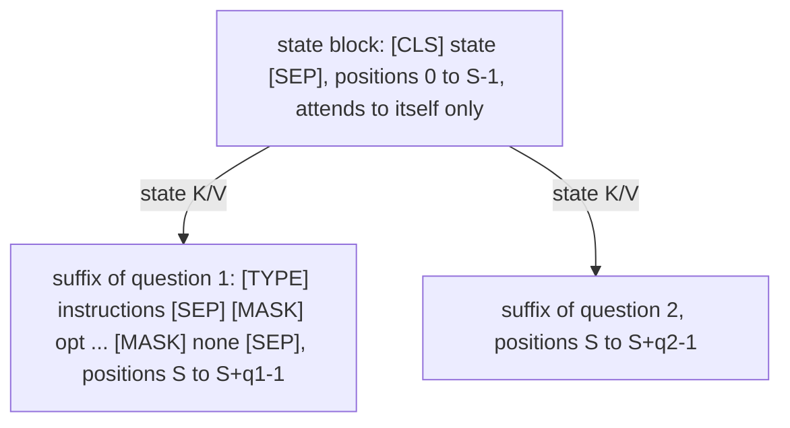

# Arbitro training plan: the own-model track (dm2) on one RTX 4090

| | |
|---|---|
| Status | Design baseline, 2026-09-23. Nothing here is implemented, trained or MEASURED yet. |
| Applies to | Own-model track (track B, ADR-001): M0 spike → E1 (weeks 5–11) → M3a → M3b → M5 → M6 = v0.3 "first own model" (~week 43) → M8 multilingual (only if Q8 clears) |
| Hardware | One RTX 4090 24 GB. It is also the development machine, the nightly CI runner and the teacher labeller (ADR-026). |
| Normative sources | ADR-019 … ADR-027 and ADR-030 … ADR-033 in the decision record [DECISIONS.md](DECISIONS.md), split into `docs/adr/` in M0. Where this document and an ADR disagree, the ADR wins. |
| Companion documents | [`ARCHITECTURE.md`](ARCHITECTURE.md) (engine, serving-side dm2 layouts in §7.7, calibration application in §12, parity in §15), [`ANALYSIS.md`](ANALYSIS.md) (Laya's model, training recipe and failure modes, and the Jev evidence that dm2 answers), `docs/ablations.md` (pre-registrations), `docs/clean-room.md` |
| Name | "Arbitro" is the working name (Q1). The repository stays `Foxur/Rustify`. |

This document is the model and training plan. It covers:
- what dm2 changes relative to Laya's laya-v1 family, and which changes must first win an ablation;
- how the backbone is chosen;
- the trainer: PyTorch with a Rust data core over PyO3;
- packed varlen training, losses and augmentation;
- calibration and abstention;
- data sources, licence policy and manifests;
- soft labels from open-weight LLM teachers;
- memory, throughput and wall-clock budgets;
- experiment tracking, export format and parity gates;
- the evaluation protocol that decides whether a model ships.

**Naming.** The research notes gave this model a bare version-number label. This document follows the naming rule of the decision record (§3.5) and never uses one: the family is **dm2**, the product track is the **own-model track**, and released weights are `arbitro-en-large`, `arbitro-en-base` and, after Q8, `arbitro-multi-base`.

---

## Contents

1. [Conventions](#1-conventions)
2. [Summary](#2-summary)
3. [Ground rules](#3-ground-rules)
4. [dm2 architecture](#4-dm2-architecture)
5. [Backbone selection](#5-backbone-selection)
6. [Ablation programme](#6-ablation-programme)
7. [Trainer](#7-trainer)
8. [Packed varlen training](#8-packed-varlen-training)
9. [Losses, targets and augmentation](#9-losses-targets-and-augmentation)
10. [Calibration and abstention](#10-calibration-and-abstention)
11. [Data: licence policy, pools, manifests](#11-data-licence-policy-pools-manifests)
12. [Teachers and targeted synthesis](#12-teachers-and-targeted-synthesis)
13. [Memory and throughput budget](#13-memory-and-throughput-budget)
14. [Compute and wall-clock budget](#14-compute-and-wall-clock-budget)
15. [Experiment tracking and provenance](#15-experiment-tracking-and-provenance)
16. [Export format and parity gates](#16-export-format-and-parity-gates)
17. [Evaluation protocol](#17-evaluation-protocol)
18. [Schedule](#18-schedule)
19. [Risks, cut rules and open questions](#19-risks-cut-rules-and-open-questions)
- [Appendix A: training configuration sketch](#appendix-a-training-configuration-sketch)
- [Appendix B: evidence keys](#appendix-b-evidence-keys)

---

## 1. Conventions

**Number labels.** Every number carries one of these labels, as defined in the decision record:

| Label | Meaning |
|---|---|
| VERIFIED | Read in source or recomputed from raw data, by the research reports, the design session or while writing this document. "VERIFIED (arithmetic)" means computed from verified dimensions. |
| REPORTED | A third-party claim. |
| ESTIMATED | Modelled, not measured. The M0 spike, E1 or M3b replaces it. |
| MEASURED | Measured by this project. Nothing has this status yet. |
| GATE / GOAL | A target. A GATE blocks a release; a GOAL does not. |
| UNVERIFIED | Nobody has checked it. |

**Canonical IDs.** `C#`, `MEM#`, `P#`, `T#`, `Q-ref#`, `G-Q#`, `R#`, `Q#` and `C-#` refer to the tables and lists of the decision record [DECISIONS.md](DECISIONS.md) (§2, §5, ADR-032, ADR-033). Their values are quoted identically here. When a value is re-based, the decision record changes first.

**Proposals.** A detail marked **(proposal)** is not fixed by any ADR. It becomes binding only when it is written into `docs/ablations.md` (before the run it governs) or into an ADR.

**Evidence keys** in square brackets, such as [RT §4.4] or [CR C7], are listed in [Appendix B](#appendix-b-evidence-keys).

**Two "L"s.** *Parity levels* L0–L5 belong to the compat runtime (ADR-014). The dm2 *layouts* are always written "layout L0", "layout L2", "layout L3-k" and "layout T".

**Units.** GiB = 2³⁰ bytes, MiB = 2²⁰ bytes, KiB = 2¹⁰ bytes. "Tokens" in throughput figures are *processed* tokens: the rows that actually go through the encoder (the decision record's glossary). GPU-h are RTX 4090 hours; dev-h are maintainer hours.

---

## 2. Summary

| Topic | Decision | Source |
|---|---|---|
| Goal | Beat `laya-en` clearly on held-out sources. Primary gate G-Q1: OOD-S test macro accuracy Δ ≥ +10 pp, CI lower bound > +5 pp, with better NLL and Brier (GATE). | ADR-022 |
| Fixed architecture | Pretrained `[MASK]` marker per option; a ModernBERT-architecture encoder; `encode_special_tokens = true`; per-option spans; option-group chunking (≤ 64 options per group, joint softmax); an explicit "none" option; dual-channel output; 8,192-token context. | ADR-019 |
| Ablated architecture | Layout (L0 / L2 / L3-k, plus the arm T), read-out and head, loss weights, none and unknowable share, chunking and span cap, JSON state rendering. Pre-registered rules. | ADR-019, §6 |
| Backbone | ModernBERT-large, ModernBERT-base, Ettin-encoder-400m (licence permitting) and DeBERTa-v3-large as the reference arm. Early signal E1 by ~week 11, final X1 in M5. DeBERTa is adopted only as a teacher and distilled into a ModernBERT-family student. | ADR-020 |
| Trainer | PyTorch 2.14 with our own ~300-line packed ModernBERT on `varlen_attn`; bf16 autocast with fp32 master weights; fused AdamW; `torch.compile` over a static 12,288-token micro-batch; no activation checkpointing. | ADR-023 |
| Rust in training | `arbitro-data` and `arbitro-core` (via the PyO3 wheel `arbitro`) own tokenisation, sequence building, augmentation, packing, manifests and the licence gate; `arbitro-eval` owns calibration fitting, metrics and gates. Training and serving share one sequence builder. | ADR-023 |
| Loss | Soft CE (log floor −9.21) + w_sph·(−spherical) + w_rps·RPS for score questions; w_sph = 0.5 and w_rps = 1.0 to start. No label smoothing. The RLCD estimator exists only as a parity flag. | ADR-023 |
| Calibration | Channel 1: hierarchical temperatures with shrinkage, feature-conditioned log T, Platt scaling for noul. Channel 2: out-of-fold `p_correct`. Learn-then-Test thresholds give `decision = automate \| review`. | ADR-021 |
| Data | Four source-disjoint pools (T / O / J / L); a manifest per source; a licence allowlist; CC-BY-SA excluded by default (Q4); MinHash/13-gram overlap checks; an exclusion list that keeps every Jev-comparable source out of training. | ADR-024 |
| Teachers | Apache-2.0 or MIT open-weight LLMs on the 4090 (vLLM, logprob scoring over option letters). Never Jev, Gemma, Llama, hosted APIs or Laya outputs. | ADR-025 |
| Compute | C5: 126–193 GPU-h to v0.3, or 158–241 GPU-h with 25 % retry slack (ESTIMATED), planned at C1 = 20–30k tok/s for ModernBERT-large (ESTIMATED; M0 exit GATE ≥ 20k). | ADR-026 |
| Release | `arbitro-en-large` and `arbitro-en-base`, model semver 1.0.0, in software v0.3.0 (~week 43). Preview path if G-Q1's CI lower bound is above 0 but below +5 pp. | ADR-022, ADR-032 |

```mermaid
flowchart LR
  subgraph RUST["Rust: arbitro-data, arbitro-core, arbitro-eval"]
    MAN["data/manifests/*.toml"] --> GATE{"licence gate"}
    GATE -->|"allowed_use has train"| CONV["converters: source to decisions"]
    CONV --> OVL["MinHash / 13-gram vs pools O, J, L"]
    OVL --> AUG["augment, render, tokenise"]
    AUG --> PACK["packer: static 12,288-token micro-batches"]
  end
  TEACH["teacher soft labels: vLLM, Apache/MIT weights"] --> CONV
  PACK -->|"PyO3, zero-copy numpy"| TRAIN["PyTorch 2.14 trainer: packed ModernBERT, bf16 autocast, fp32 master"]
  TRAIN --> CKPT["runs/DATE-SLUG/ckpt"]
  CKPT --> EXP["export: fp32 + bf16 safetensors, arbitro-model.json"]
  EXP --> T9{"arbitro export-check: T9"}
  T9 --> CAL["calib_fit on Rust-engine logits, per precision"]
  CAL --> EVAL["arbitro eval --release: G-Q1 to G-Q6, hygiene"]
  EVAL --> REL["weights, model card, reports/"]
```



---

## 3. Ground rules

These rules come from ADR-024, ADR-025, ADR-030 and ADR-031. They are enforced in code where possible, and they are not open to per-run exceptions.

1. **No Jev outputs, ever.** This includes third-party published Jev logs. They are never used as training labels, for calibration, for checkpoint selection, for synthesis or for teacher gating. No TypeSafe account is used to develop, test or benchmark (MCA §2.3(b) and (f), REPORTED [JAS §8]). Jev numbers appear only as third-party published figures (§17.5).
2. **No Laya weights and no Laya outputs in training.** Laya weights are never redistributed, never used to initialise a dm2 model, and Laya outputs are never distilled (Laya's training mix includes CC-BY-NC data [LTR §5.2]). `laya-en` appears only as the evaluated baseline, run by us through the compat runtime. The private typed-decisions reproduction P1 exists only if the maintainer answers yes to Q3 (§7.5).
3. **Training data passes the licence gate.** Allowlist: Apache-2.0, MIT, BSD, CC0, CC-BY, ODC-BY and CDLA-Permissive. CC-BY-SA and CDLA-Sharing are excluded unless Q4 decides otherwise. NC or unknown licences are evaluation-only. `arbitro-data` refuses to pack any source whose manifest lacks `train` in `allowed_use` (§11).
4. **Teachers are Apache-2.0 or MIT weights only** (§12).
5. **Pool T is disjoint from pools O, J and L at source level**, and item-level overlap is checked by MinHash/13-gram on every data build (§11.5).
6. **Released weights are Apache-2.0** and only after the licence gate passes. Each release carries a model card with the data manifest, the teacher and synthesis disclosure and the evaluation report (ADR-030). mmBERT-derived weights stay unreleased until counsel clears the Gemma-2-derived tokenizer (Q8).

---

## 4. dm2 architecture

### 4.1 What changes relative to laya-v1

"Fixed" means the change is not ablated. "Ablated" means an arm of §6 decides it; the result is frozen in `docs/adr/ADR-019a-dm2-frozen.md`. The laya-v1 baseline is described in [ANALYSIS.md §4](ANALYSIS.md#4-laya-architecture), and the failure modes these changes answer in [ANALYSIS.md §7.1](ANALYSIS.md#71-laya-model-and-post-processing).

| # | Aspect | laya-v1 (Laya 0.3.7 checkpoints) | dm2 | Status | Evidence |
|---|---|---|---|---|---|
| 1 | Option marker | The pretrained `[MASK]` token before each option | Same: the pretrained `[MASK]` (`<mask>` in the mmBERT vocabulary) | Fixed | Fresh marker tokens did not learn [LTR §3; kotoba README] |
| 2 | Sequence layout | One sequence per question: `[CLS] <type> question: <instructions> [SEP] [MASK] opt … [SEP] state [SEP]`, with the state last and cut from the right | Layout L0, L2 or L3-k; T as an ablation arm only (§4.2) | Ablated (X2; early signal in E1) | [LTR §3], [CR G5], ADR-019 |
| 3 | Option budget | One shared `head_max_len` budget (192 or 256 tokens); options capped at 48 tokens and reflowed to `max(4, (hml−16)//k)` tokens including the marker; hard ceiling ≈ 125 (EN) / ≈ 250 options (MEM8, VERIFIED) | A span per option: `[MASK]` + ≤ 32 text tokens. Option-group chunking into groups of ≤ 64 options with one joint softmax (§4.3). | Chunking fixed; span cap ablated (X6) | [CR G11], [BW F9] |
| 4 | Abstention | None. The act head reads 1.0 on almost every input, and its logits have AUROC 0.30 against correctness (REPORTED) | A virtual "none" option; the act head is dropped; dual channel with `p_correct` and conformal gating (§10) | Fixed; the none option's cost is gated in X5 | [BW F13, J4], ADR-021 |
| 5 | Read-out and head | Gather at markers → 2 × `TransformerEncoderLayer` (pre-LN, no final LayerNorm; residual norm ≈ 10,838 after the head, REPORTED) → scorer LN → Linear → GELU → Linear | Marker-only / span-mean / hybrid read-out × `head_layers` ∈ {0, 2}; a final LayerNorm whenever a head is kept | Ablated (X3) | [BW §2.3], [EA §7.2], [CR G10] |
| 6 | Context | 512 tokens (EN) or 1,024 (multilingual, typed-decisions); state cut from the right | 8,192 tokens with native RoPE; 10–20 % of training steps use 2–8k-token states; head+tail truncation beyond 8k, always reported | Fixed | [BW F10], [EA §2.1] |
| 7 | Special tokens in user text | `encode_special_tokens = false`: a literal `[SEP]` in user text becomes a special id | `encode_special_tokens = true` | Fixed | [CR G9] |
| 8 | noul | Options fixed as [false, true] with default texts; the answer follows the label tokens (#156) | Two neutral options in random order; label-swap augmentation (the true/false descriptions swap together with the target); negation pairs | Fixed | [BW F7], [LTR §10.2] |
| 9 | score | Levels rendered as `level i: …` | Same rendering, plus RPS in the loss and random scale reversal | Fixed | [BW F15] |
| 10 | choice order in training | Never shuffled (`build_sequence(option_order=…)` exists but is unused) | Shuffled every epoch | Fixed | [CR C8], [BW F8] |
| 11 | Train/serve layout | `laya-typed-decisions` was tokenised at 512/192 for training and is served at 1024/256 | Training uses the serving layout through the shared Rust builder | Fixed | [CR G13] |
| 12 | Objective | RLCD evolution-strategies estimator + soft CE, w_sph = 0.75 | Analytic soft CE + spherical + RPS (§9) | Form fixed; weights ablated (X4) | [LTR §4.5] |
| 13 | Calibration | The fine-tune notebook fits one temperature per question type (LBFGS on log T, clamp [0.1, 10]); before fix #191 it fitted on training items. The EN base config ships a per-bucket table that overrides the per-type values at runtime, including the degenerate `choice:11+` = 0.1006; the published typed-decisions checkpoint still carries that inherited EN table, so its own fit is effectively unused [CR C10]. Runtime clamp [0.5, 5] (0.1006 → 0.5) | Hierarchical T(qtype, k-bucket) with shrinkage, feature-conditioned log T, Platt for noul; fitted on group-held-out data only; a temperature at a bound fails the gate | Fixed | [LTR §7], [CR C10], [BW F1], ADR-021 |
| 14 | State rendering | `json.dumps(state, ensure_ascii=False)` | JSON vs labelled lines (`path.to.key: value`) vs mixed | Ablated (X7) | [LTR §5.2] |
| 15 | Question-type signal | `<type>` text in the question, plus `type_emb[qtype]` added to every row after the encoder | A `<type>` token at the start of each question (ADR-019 layout). Tokens `[unused0]`–`[unused2]` in the EN vocabulary (proposal), inserted by id by the builder and marked `special` in the bundled tokenizer (§4.4); a type embedding on question tokens only is [P-acc A6.2(h)]'s proposal, decided with X3. | Token fixed; embedding (proposal) | The EN tokenizer has 83 `[unused*]` tokens (`[unused0]`–`[unused82]`, ids 50285…) and the multilingual one has `<unused0>`–`<unused99>`, all added tokens with `special: false` (VERIFIED in the mirrored `tokenizer.json` files at `1c5edc17`) |
| 16 | Training precision | fp16 autocast + GradScaler on T4; weights saved with `.half()` | bf16 autocast, fp32 master weights, fp32 canonical export plus a bf16 copy | Fixed | [RT §4.4], [LTR §6] |
| 17 | Backbone | ModernBERT-large (EN, fine-tuned from an undisclosed earlier checkpoint); mmBERT-base (multilingual, head trained from scratch) | Chosen by E1 and X1 (§5) | Ablated | ADR-020 |

### 4.2 Sequence layouts

| Layout | Attention pattern | State cost for N questions | Role |
|---|---|---|---|
| **L0** | One sequence per question: question, then state; fully bidirectional | N × state | Baseline and final fallback |
| **L2** (prefix-isolated) | `[CLS] state [SEP]` attends only to itself. Each question suffix `<type> instructions [SEP] [MASK] opt … [MASK] none [SEP]` attends to state ∪ itself. RoPE positions of a suffix continue after the state. | 1 × state | Preferred if it passes the rule |
| **L3-k** | Layout L2 in the lower N_L − k layers; the top k ∈ {2, 4, 7} layers re-encode `[state; question]` per question | (N_L − k)/N_L + k·N/N_L | Fallback if L2 fails |
| **T** (arm) | Isolated option branches with tied positions, plus a 2-layer set-transformer head without positional encoding | 1 × state | Ablation only. It needs the `level i:` rendering for score questions. FA2 wastes about 5× of the QK/PV tile work on short branches in global layers, so it is not competitive without a multi-range kernel, which is not planned. |
| L1 | All questions in one sequence | — | **Rejected**: answers would depend on co-asked questions [JAS §3.3] |



Question suffixes never attend to each other, so an answer cannot depend on which other questions were asked in the same request (G-Q5 checks this bitwise under layout L2).

**Cost example** (VERIFIED arithmetic, the example of [LTR §9.3]): a 600-token state with 5 questions of 150 tokens is 5 × 750 = 3,750 processed tokens under layout L0 and 600 + 750 = 1,350 under layout L2, i.e. 2.8× fewer. Training and serving both gain.

**Pre-registered decision rule** (ADR-019; written into `docs/ablations.md` before any run):
- Take the cheapest layout whose OOD-S *dev* macro accuracy is within 1 pp of layout L0, with a paired-bootstrap CI lower bound > −1.5 pp.
- Otherwise take the smallest passing k of layout L3.
- Otherwise ship layout L0 in v0.3 and move shared state to a later release.
- Layout T is adopted only if it passes the same rule against layout L0 **and** its measured serving cost on P9 is ≤ that of layout L2.

**Known limitation of layout L2.** In windowed layers a question token sees at most the last 64 state positions (the suffix token at offset j sees 64 − j of them, none from offset 64 on). Full state access comes from the global layers, every third layer. Layout L3 partly exists to test whether this matters (ADR-019).

**Consequence for the engine.** Layout L0 is natively supported by the laya-v1 kernel subset, so a failed shared-state bet costs speed, not a release. The paged K3b path is built in M6 only if layout L2 is adopted (ADR-006, ADR-008).

### 4.3 Options, chunking and the none option

- **Per-option spans.** Each option is `[MASK]` followed by ≤ 32 text tokens; X6 compares caps of 16 and 32. A longer option is cut and the cut is reported in `x_arbitro.answers.<qid>.truncated_option_tokens` (ADR-018).
- **Option-group chunking.** A choice question is split into groups of ≤ 64 options. Each group is its own suffix over the same state (under layout L2 the state is encoded once), and the logits of all groups go through one joint softmax. 255 options × 33 tokens = 8,415 tokens would overflow any single budget; chunked, they become 4 groups of ≤ 2.2k tokens (64 × 33 = 2,112) (VERIFIED arithmetic).
- **Chunk invariance.** Training chunks 20 % of choice questions at random, so chunked and unchunked logits stay comparable. Gate: max |Δp| between chunked and whole ≤ 0.02 (G-Q6).
- **none option.** A virtual last option, "none of the options applies", on choice questions [P-acc A6.2(e)]. It is always present at inference and present in 50 % of training questions. Its softmax mass is `p_none`; the Jev-compatible `probabilities` are renormalised over the real options only. Under chunking the none marker appears exactly once per question, in the last group (proposal). X5 gates its cost on answerable items at ≤ 0.5 pp.
- **Unanswerable items** (CLINC150 out-of-scope, mismatched states, evidence-removed states) put the target mass on none for choice questions and use a uniform target for score and noul questions [P-acc A6.2(e)].

### 4.4 Question types, rendering and input hardening

| Type | Options the model sees | Training-time treatment | Answer on the wire |
|---|---|---|---|
| choice | The criteria, 1–255 options, plus none | Shuffle every epoch; distractor sampling and hard negatives (§9.3); random chunking | Argmax; `probabilities` over the real options; rescaled-peak confidence |
| score | Levels rendered as `level i: …` (up to 10) | RPS term in the loss; random scale reversal | `score` = Σ i·pᵢ; `peak` confidence by default (ADR-016) |
| noul | Two neutral options carrying the true/false descriptions | Random order; label swap; negation pairs | P(yes); no confidence field outside `laya` mode |

- User text never produces special ids: `encode_special_tokens = true` [CR G9].
- **That flag alone does not cover the type tokens.** It only neutralises added tokens flagged `special`. The `[unused*]` / `<unused*>` entries are added tokens with `special: false`, so a literal `[unused0]` in user text still encodes to id 50285 (EN) and `<unused0>` to id 7 (multilingual) with the flag on (VERIFIED with `tokenizers` 0.23.2 on the mirrored files). ADR-019 (amended 2026-09-23) therefore fixes that the builder inserts type-token ids directly, never through text, and that the dm2 bundle's `tokenizer.json` sets `special: true` on every `[unused*]` / `<unused*>` entry; with that change the same literal splits into ordinary text tokens (VERIFIED, same setup). The builder-identity gate (§16.3) includes such literals.
- JSON states: X7 compares JSON, labelled lines (`path.to.key: value`) and a 50/50 mix in training [P-acc A6.2(h)]. Serving uses the winning rendering, and the rendering is recorded in `arbitro-model.json` (§16) so that training and serving cannot diverge.

### 4.5 Read-out and head (X3)

- **Arms.** Marker-only; span-mean (the mean of the option's text tokens); hybrid `z_j = MLP(LN([h_mask_j; mean(h_opt_j); h_q ⊙ h_mask_j]))`, where `h_q` is the mean over the instruction tokens [P-acc A6.2(b)]. Each is crossed with `head_layers` ∈ {0, 2}.
- **Rule.** Prefer `head_layers = 0` when it is within 0.5 pp: that is less engine code, and the Laya-style head costs 7–12 % of FLOPs [EA §7.2].
- **If a head is kept** it gets a final LayerNorm, because its absence causes Laya's ~1e4 residual norm [BW §2.3]. Its two layers use the attention pattern of the adopted layout (proposal).
- **Precision.** The scorer's last projection runs in fp32 in training (ADR-023) and in serving (ADR-008 K9).
- **Engine note.** If the hybrid read-out wins, `PackedBatch` gains an instruction-range field next to `span_ranges`. This is additive for laya-v1 behaviour, in line with ADR-004's "dm2 adds no breaking change". A new public field on a public struct is still a Rust semver break unless the struct is `#[non_exhaustive]`, so the field must land before the 1.0 API freeze (v0.3 precedes it) or `PackedBatch` must be marked `#[non_exhaustive]` (proposal).

### 4.6 Context and truncation

- 8,192 tokens, ModernBERT's native RoPE context (`max_seq_len: 8192` in `AnswerDotAI/ModernBERT/yamls/modernbert/modernbert-base-context-extension.yaml:7`, VERIFIED; large per [EA §2.2]).
- 10–20 % of training steps use buried-record states of 2–8k tokens (ADR-019).
- Beyond 8k tokens, v0.3 truncates head+tail and reports `truncated_state_tokens`. BM25/salience packing is post-1.0 research.
- Cost (ESTIMATED, the FLOP convention of [EA §7]): at 8,192 tokens the ModernBERT-large forward costs ≈ 1.03 GFLOP/token, against 0.72 at 512 tokens, because the 10 global layers attend over the full length. Long steps therefore cost up to ≈ 1.4× per token. If every long step used an 8k-token state, the 10–20 % quota would add ≈ 4–9 % (0.10–0.20 × 0.43) to total training compute; shorter long states add less (a 2k-token state costs ≈ 1.09× per token).

### 4.7 v0.3 scope

*Must have* (ADR-019): the marker (or hybrid) read-out; the adopted layout; chunking; the none option; the dual channel with conformal thresholds; augmentation; 8k context with head+tail truncation.

*Deferred past v0.3*: salience/BM25 packing; APS/RAPS prediction sets; a cumulative-link ordinal head; multilingual weights (M8, Q8).

---

## 5. Backbone selection

### 5.1 Candidates

| Arm | Parameters | Engine fit | Context | Licence | Role |
|---|---|---|---|---|---|
| ModernBERT-large | Encoder 394.8M (343.2M non-embedding + 51.6M embedding), VERIFIED (arithmetic) [EA §7.1] | ModernBERT architecture: the FA2 engine applies directly | 8,192 | Code Apache-2.0 (VERIFIED, `AnswerDotAI/ModernBERT/LICENSE`); weights Apache-2.0 (REPORTED) | Primary candidate; `arbitro-en-large` |
| ModernBERT-base | Encoder 149.0M (110.3M non-embedding + 38.7M embedding), VERIFIED (arithmetic) from the base yaml (22 layers, D = 768, I = 1,152, 12 heads, vocabulary 50,368; `…/modernbert-base-context-extension.yaml:23-28`) | Same | 8,192 | Same | Candidate; `arbitro-en-base` |
| Ettin-encoder-400m | ≈ 400M (REPORTED) | REPORTED to use the ModernBERT architecture and tokenizer | REPORTED | Code MIT (VERIFIED); weight licence UNVERIFIED (Hugging Face was unreachable) | Arm only if the weight licence checks out |
| DeBERTa-v3-large | 435M [RT §4.6] | Disentangled attention: no FA2 path; serving would need ORT/TensorRT, a second engine | 512 | UNVERIFIED; checked at E1 entry | Reference arm; teacher only (§5.4) |
| mmBERT-base (M8) | Encoder 306.9M, of which 196.6M (64.1 %) is embedding, VERIFIED (arithmetic) [EA §7.2] | ModernBERT architecture | 8,192 | MIT (REPORTED); the Gemma-2-derived tokenizer needs counsel (Q8) | Multilingual backbone after Q8 |
| gte-multilingual-mlm-base (M8 alternative) | — | Different architecture ("NewModel"); engine work UNVERIFIED | 8,192 (REPORTED) | Apache-2.0 (REPORTED) | Fallback if Q8 blocks mmBERT |

### 5.2 Cold-start evidence on ModernBERT-large (risk R2, rated M-H/H)

| Evidence | What it shows | Label |
|---|---|---|
| kotoba: ModernBERT-large stayed at the label prior (0.388–0.399) at 3k states / 1 epoch across every learning rate tried, with fresh-marker and span heads; DeBERTa-v3-large reached 0.787 on the same data and 0.855 at 18k states (Q-ref11) | Against cold start, but on short runs | REPORTED |
| Laya's multilingual head was trained **from scratch** on mmBERT-base, a ModernBERT-architecture model: 15,987 updates, 4 epochs, 4.97 h (Q-ref12) | For: a ModernBERT-architecture model does learn this task | VERIFIED (config) |
| verdict2: ModernBERT-base with a plain marker read-out and no 2-layer head reaches 0.771 on typed-decisions (Q-ref3) | For, on base size | REPORTED |
| Laya EN is a working ModernBERT-large, but was fine-tuned from an earlier decision checkpoint (7,313 updates, 1 epoch) | Says nothing about cold start [CR C9] | VERIFIED (config) |
| kotoba: span-mean pooling made ModernBERT-base learn (0.539 at 3k states / 1 epoch) where a read-out at a *fresh* `[OPT]` marker token did not; ModernBERT-large stayed at 0.39 under span pooling too | Motivates the hybrid read-out; says nothing about the pretrained-`[MASK]` marker, and does not show that span pooling rescues large | REPORTED [BW F6]; kotoba README "The ablation that mattered" |

Every ModernBERT-large arm therefore carries the known stabilisers: 6 % warmup, layer-wise LR decay, the hybrid read-out, the pretrained `[MASK]` marker, fp32 master weights (without them 82–91 % of each update is lost at LR 1–3e-5, VERIFIED simulation [RT §4.4]), and a second seed.

### 5.3 E1: the early signal (weeks 5–11)

| Item | Value (ADR-020) |
|---|---|
| Budget | 18 dev-h, 10–15 GPU-h on GPU nights (ESTIMATED) |
| Data | A gold-only mini-mixture of ≈ 100–200k decisions from pool-T candidates whose manifests are written during E1: CLINC150, PAWS, HellaSwag, GoEmotions. No teachers. |
| Evaluation | A provisional OOD-S dev set: MASSIVE-en validation split and ANLI dev |
| Setup | Layout L0, hybrid read-out, warmup 6 %, LLRD 0.9 |
| Arms | 1 seed each at ~100M tokens: ModernBERT-large (plus a second seed), ModernBERT-base, Ettin-encoder-400m (licence permitting), DeBERTa-v3-large padded to 512. Also layout L0 vs L2 on ModernBERT-base. |
| Output | Learning curves on OOD-S dev and a signal recorded in `docs/adr/ADR-020a` |

E1 runs on a spike trainer (packed ModernBERT, layouts L0 and L2) before the production data path exists (M3b). Its numbers are signals, never model results, and are never quoted as such.

**Reading the signal (proposal).** An arm "learns" if its OOD-S dev macro accuracy has a paired-bootstrap CI lower bound above the label-prior baseline at the end of its budget. If both ModernBERT-large seeds fail to learn while DeBERTa learns, R2 materialises early: the distillation path (§5.4) is planned into M5 immediately instead of waiting for X1.

### 5.4 X1 and the decision rule

X1 (M5) runs the same arms with 2 seeds each on mixture v1 with teacher labels. The ModernBERT-large arm also compares LLRD 0.9 and 0.95 [P-acc A6.3]. The pre-registered rule (ADR-020):

- Prefer the best ModernBERT-architecture arm (ModernBERT-large, ModernBERT-base, Ettin).
- DeBERTa-v3-large "wins" only if it leads by > 3 pp with a CI lower bound > +1 pp.
- If it wins, it becomes the **teacher and accuracy reference**, and it is **distilled into the best ModernBERT-architecture student**, which is served on the FA2 engine. Cost: +30 GPU-h and +10 dev-h in M6 (cut rule C-4).
- There is no second serving engine before 1.0. If the distilled student still trails DeBERTa by > 3 pp, the student ships and serving DeBERTa via ORT goes on the post-1.0 list.
- `arbitro-en-base` becomes the default model if it is within 1 pp of `arbitro-en-large`.

The distillation round reuses the teacher machinery of §12: DeBERTa soft labels over pool T and the synthetic sets replace or mix with the LLM teacher targets under the same α rule. DeBERTa is our own fine-tune, so it may act as a teacher once its base-weight licence is verified to be MIT or Apache-2.0 (ground rule 4).

### 5.5 Multilingual (M8, only if Q8 clears)

- `arbitro-multi-base` on mmBERT-base, with the 196.6M-parameter embedding frozen or at a low LR. Freezing saves ≈ 2.2 GiB of gradient and Adam state (196.6M × 12 B) [RT §4.5] and helps keep cross-lingual alignment [LTR §10.12].
- Translate-train data from permissively licensed MT models (licences checked per model), per-script calibration features, `lid` routing and per-language gates against `laya-multilingual`.
- Budget: 20–40 GPU-h (ESTIMATED, ADR-026), 40 dev-h.
- The multilingual data rules are decided in M7 and follow §11.

---

## 6. Ablation programme

### 6.1 Pre-registration mechanics

Before an ablation runs, `docs/ablations.md` and `evals/registrations/<id>.toml` record:
- the arms and the frozen configuration they share;
- the primary metric (OOD-S dev macro accuracy) and the secondary metrics (NLL, Brier, ECE-15, flip rate, processed tokens per decision);
- the decision rule;
- the seeds, the token budget and the `data.lock` hash.

Results go to `reports/ablation-X*.json` with CIs. The decisions are frozen in `docs/adr/ADR-019a-dm2-frozen.md` and `ADR-020a`. The OOD-S **test** split is never read in E1 or M5.

### 6.2 The ablations

| ID | Question | Arms | Decision rule | Budget (GPU-h) |
|---|---|---|---|---|
| E1 | Early backbone and layout signal | §5.3 | Signal only, recorded in ADR-020a | 10–15 (ADR-026, ESTIMATED) |
| X1 | Backbone | ModernBERT-large (LLRD 0.9 / 0.95), ModernBERT-base, Ettin-encoder-400m (licence permitting), DeBERTa-v3-large; 2 seeds each; mixture v1 with teacher labels | §5.4 | ≈ 20 |
| X2 | Layout | L0, L2, L3-k with k ∈ {2, 4, 7}, and the arm T | §4.2 | ≈ 15 |
| X3 | Read-out and head | marker / span / hybrid × `head_layers` ∈ {0, 2} | Prefer `head_layers = 0` within 0.5 pp; a kept head gets a final LayerNorm | ≈ 8 |
| X4 | Loss | w_sph ∈ {0, 0.25, 0.75} against the default 0.5; perm-KL ∈ {0, 0.1, 0.5} on top of shuffling [CR C8]; teacher α ∈ {1.0, 0.8, 0.6} | (proposal) Best OOD-S dev macro accuracy; arms within 0.5 pp of the best are resolved toward the simpler setting (smaller w_sph, perm-KL 0, larger α), with NLL as the tie-breaker | ≈ 12 |
| X5 | none and unknowables | none in training always / 50 % / never; unknowable share 0 / 5 / 10 % | none: its cost on answerable items ≤ 0.5 pp (ADR-019). Unknowable share (proposal): the smallest share that meets G-Q4's "≥ 0.9 confidence on ≤ 5 % of unknowable items" on OOD-S dev | ≈ 6 |
| X6 | Chunking and span cap | random chunking 0 / 20 %; span cap 16 / 32 | Chunk invariance ≤ 0.02 is required (G-Q6). Span cap (proposal): 16 if within 0.5 pp of 32 | ≈ 4 |
| X7 | JSON state rendering | JSON / labelled lines / mixed | (proposal) Best OOD-S dev macro accuracy; within 0.5 pp, prefer mixed | ≈ 3 |

The per-ablation split of ≈ 68 GPU-h is [P-acc A6.3]'s indicative allocation. The binding figure is ADR-026's M5 line: 55–80 GPU-h for ≈ 5B tokens (ESTIMATED).

### 6.3 Order and statistical design

1. X1 first, on layout L0: it settles the engine question.
2. X2 on the winning backbone.
3. X3–X7 in a factorial-light design on the winner and the adopted layout [P-acc A6.3].

Each comparison is paired on the same OOD-S dev items, with a record-clustered bootstrap (cluster = state id, ≥ 2,000 resamples, fixed seed; ADR-027) and 2 seeds per arm.

**Size of OOD-S dev (ESTIMATED).** A paired accuracy difference has a standard error of about √(d/n), where d is the share of discordant items. With d = 0.10, the 95 % half-width is ≈ 1.4 pp at n = 2,000, ≈ 0.9 pp at n = 5,000 and ≈ 0.6 pp at n = 10,000; clustering by state widens it. The X2 rule has to resolve 1 pp, so OOD-S dev should hold **≥ 5,000 items** across its suites (proposal; checked when pools are frozen in M3a).

### 6.4 Not ablated

Everything in §4.1 marked "Fixed" and the optimiser defaults of §7.4 are not ablated, apart from LLRD inside X1. The learning rates and the schedule stay fixed so that the ablation budget goes to architecture and data questions. Changing them requires a new registration.

---

## 7. Trainer

### 7.1 Decision

**PyTorch 2.14 is the training engine, and Rust owns everything around the training loop via PyO3** (ADR-023). Python overhead is below 1 % at ≥ 10k tokens per micro-batch (ESTIMATED [RT §0]), so a Rust training loop cannot buy speed, and no Rust framework has the required primitives today:

| Option | Blocking gaps (VERIFIED in source [RT §3]) | Throughput vs optimised PyTorch, ModernBERT-large at L = 512 (ESTIMATED [RT §3.6]; lower at L = 1024) | Verdict |
|---|---|---|---|
| burn 0.21 / 0.22-pre / `main` of 2026-09-22 | No flash-attention backward (autodiff falls back to materialised attention); no varlen or sliding window; no AMP (issue #5696 open) | ≈ 0.45–0.6× | Revisit when a tensor-core flash backward with varlen and window support is wired into autodiff **and** AMP lands |
| candle 0.11 | Fused LayerNorm/softmax/SDPA ops have no backward and silently cut gradients (LayerNorm-with-bias takes that path); forward-only flash attention; no AMP | ≈ 0.4–0.5× | Unsuitable |
| tch-rs 0.26 (libtorch 2.13) | Autocast is fixed to fp16; no custom autograd, so varlen flash cannot join autograd; no `torch.compile`; ~2 GB libtorch pin | ≈ 0.6–0.75× | Same heavy dependency as Python torch, fewer tools |
| Custom Rust trainer (cudarc + cuBLASLt + FA2 backward) | Everything must be written; the FA2 backward needs long nvcc builds | Possibly ≥ 1× | Post-1.0 showcase only |
| **PyTorch 2.14** | `torch.nn.attention.varlen.varlen_attn` has a window and a registered backward; on sm_89 it always uses FA2 (VERIFIED [CR G4]) | 1.0× | **Adopted** |

Acceptance criteria for any future Rust trainer, proposed in [RT §7 P5]: per-parameter gradient cosine > 0.999 and relative L2 < 1e-2 in bf16 on 100 fixed batches against the PyTorch trainer, loss-curve parity over 2k steps, and equal or better tokens/s. The PyTorch trainer remains the gradient-parity reference (ADR-023).

### 7.2 Division of labour

| Concern | Owner | Where |
|---|---|---|
| Tokenizer (`tokenizers =0.23.2`), dm2 sequence builder (layouts, spans, chunking, none option, rendering) | Rust | `arbitro-core::family::dm2`, the **same code** the server uses |
| Converters, augmentation, packer, sampler, splits | Rust | `arbitro-data`, exposed as `arbitro.data` |
| Manifests, licence gate, MinHash/13-gram checks, `data.lock` | Rust | `arbitro-data` |
| Model forward/backward, optimiser, schedule, EMA, checkpoints | Python | `training/` (uv project `arbitro_train`) |
| Teacher labelling (vLLM) | Python | `training/teacher/` (proposal) |
| Calibration fitting (`calib_fit`) | Rust | `arbitro-eval`, exposed as `arbitro.calib` |
| Metrics, suites, probes, statistics, gates, claims check | Rust | `arbitro-eval`, `arbitro.eval`, `arbitro eval` |
| Export parity | Rust | `arbitro export-check` |

The PyO3 wheel is built from the internal crate `arbitro-py` (abi3: proposal). The packer runs on Rust worker threads with the GIL released (proposal) and hands out numpy arrays without copying (ADR-023). Index-like arrays reach torch as int32 (§8.1). **Throughput goal (proposal):** the data path sustains ≥ 3× the trainer's token rate on the M0 machine, so the GPU never waits; M3b measures it.

Proposed module layout of `training/` (after [RT §8.1]): `model.py` (the packed ModernBERT and the dm2 read-out/head), `losses.py`, `train.py`, `export.py`, `teacher/`, `configs/`.

### 7.3 Trainer internals

- Our own ~300-line packed ModernBERT module on `varlen_attn`, with window (64, 64) on local layers and (−1, −1) on global layers. transformers 5.17 no longer unpads ModernBERT [EA §5], so the HF module is not used for training. Weights load by key name from the base checkpoint (`model.` prefix stripped; the Hub key names are INFERRED from `convert_to_hf.py` [EA §9.2] and checked at M0 bring-up).
- bf16 autocast with **fp32 master weights**.
- Fused AdamW.
- `torch.compile` over a **static** 12,288-token micro-batch padded with a dummy tail segment. `torch.compile` on variable-length batches recompiled per shape and was 6× slower in the browser-agent fine-tune documented in Laya's repository, a third-party run on an RTX 4070 Ti SUPER (VERIFIED doc text, `docs/finetune_browser_agent.md:69-70` [RT §3.4]).
- No activation checkpointing at ≤ 12k tokens; turning it off was a 1.25× wall-time win (VERIFIED doc [LTR §9.2]). Gradient accumulation × 4 ≈ 49k tokens per optimiser step (C3).
- The scorer's last projection runs in fp32.
- mmBERT's embedding is frozen.

### 7.4 Optimiser and precision defaults

| Setting | dm2 default (ADR-023) | Laya notebook HEAD, for comparison [LTR §6] |
|---|---|---|
| Optimiser | AdamW, β = (0.9, 0.98), eps 1e-6, weight decay 0.01 excluding norms, biases and embeddings; fused | AdamW, β = (0.9, 0.999), eps 1e-8, weight decay 0.01 on every parameter |
| Learning rate | 2e-5 encoder, 3e-4 new head | 2.5e-5 encoder, 1.0e-4 head |
| Layer-wise LR decay | 0.93 (0.9 and 0.95 ablated in X1) | none |
| Schedule | warmup 6 %, cosine | cosine, no warmup |
| Clipping / EMA | global norm 1.0 / EMA 0.999 | 1.0 / none |
| Precision | bf16 autocast, fp32 master weights, fp32 scorer tail | fp16 autocast + GradScaler (T4) |
| Batch | 12,288 packed tokens × 4 ≈ 49k tokens per step (C3) | 8 padded sequences × 4 × 2 GPUs = 64 sequences |
| Activation checkpointing | off | on (encoder) |
| Objective | analytic proper-score loss (§9) | RLCD estimator + 1.0 × soft CE |

### 7.5 Trainer validation

The default validation is licence-clean (ADR-023):
1. **Packed vs padded.** Our packed trainer against a naive padded HF-transformers reference trainer, on the same permissive pool-T subset with the same seeds. Final OOD-S dev accuracy within 1 pp, loss curves within seed noise (GATE, M3b exit).
2. **Gradient check.** On the tiny model, packed vs padded gradients agree within 1e-4 (GATE).
3. **Export parity** T9 (§16).

**Optional P1, only if Q3 = yes.** A private, never-published reproduction of Laya's typed-decisions fine-tune, starting from user-downloaded Laya weights, targeting results within noise of the published numbers. It uses the `rlcd_es` parity mode (σ 0.4 → 0.1, w_sph 0.75, LR 2.5e-5 / 1e-4, 4 epochs, effective batch 64) and a flag for the 512/192 tokenisation quirk [RT §7 P1]. P1 needs the laya-v1 builder from `arbitro-compat` and a Laya-head module in the trainer; neither is used for dm2. 13.4M tokens take ≈ 7–11 min at C1 (ESTIMATED).

### 7.6 CI

- **Every PR (CPU):** the tiny model trains for 20 steps; the loss must decrease, the export must work and T6 must hold (ADR-023, ADR-029). Unit tests cover the packer, the losses (finite-difference gradient checks on tiny tensors) and calibration.
- **Nightly (self-hosted 4090, `main` and scheduled jobs only, never fork PRs):** a 10-minute GPU training smoke run (ADR-029).

---

## 8. Packed varlen training

### 8.1 The training batch

A training batch is a superset of the serving `PackedBatch` (ADR-004), produced by the same builder. That is the mechanism that rules out train/serve skew. ADR-023 fixes the packer's outputs (ids, positions, `cu_seqlens_q/k`, markers, spans, soft targets, qtype, group ids); the other field names below (`kv_gather`, `is_none`, `target_kind`, `loss_weight`, `example_id`) are proposals.

**dtype at the torch boundary.** The table gives the Rust (serving) element types. torch cannot use `uint32` tensors as indices (`index_select` and `nn.Embedding` reject them, VERIFIED with torch 2.14 CPU), and the FA2 varlen path takes int32 `cu_seqlens` (the `varlen_attn` docstring example). All index-like u32 fields are therefore handed over as int32 through a zero-copy `.view(np.int32)`, which is exact because every value is < 2³¹ (proposal).

| Field | dtype, shape | Meaning | In serving `PackedBatch` |
|---|---|---|---|
| `input_ids` | u32 [T] | Packed token ids; T = 12,288 (C3) | yes |
| `position_ids` | u32 [T] | Explicit positions; under layout L2 a suffix continues after its state | yes |
| `cu_seqlens_q`, `max_seqlen_q` | u32 [n_seq + 1], scalar | Query segments | yes |
| `cu_seqlens_k`, `max_seqlen_k` | u32 [n_seq + 1], scalar | Key segments; equal to the query segments for layout L0 | yes |
| `kv_gather` | u32 [K] | Training only: for each query segment, the packed rows whose K/V it reads (state rows ∪ own rows). Serving expresses the same thing through `kv_segments`. | as `kv_segments` |
| `qtype` | u8 [n_q] | 0 choice, 1 score, 2 noul | yes (per sequence) |
| `cu_markers`, `marker_rows` | u32 [n_q + 1], u32 [n_opt] | Marker rows grouped **per question**, across all of its chunk groups, so the joint softmax is a segment softmax | yes |
| `span_ranges` | (u32, u32) [n_opt] | Option text spans for the span and hybrid read-outs | yes |
| `is_none` | u8 [n_opt] | Marks the virtual none option | derived |
| `targets` | f32 [n_opt] | Soft targets, summing to 1 per question over options ∪ none | training only |
| `target_kind` | u8 [n_q] | gold, teacher, mixed, uniform or none | training only |
| `loss_weight` | f32 [n_q] | 0 for padding entries (dummy tail, padded question and marker slots) | training only |
| `group_id`, `example_id` | u64 [n_q] | State id (splits, bootstrap clusters) and example id (RNG key) | training only |

### 8.2 Static shapes for `torch.compile`

- `T` is fixed at 12,288; unused rows form one dummy tail segment with its own positions, isolated from real segments by `cu_seqlens` and excluded from the loss.
- The number of segments, the number of markers and, under layouts L2 and L3, the gathered key count `K` are each padded to fixed maxima; `max_seqlen_q/k` are set to the budget.
- **UNVERIFIED:** that `varlen_attn` under `torch.compile` accepts zero-length padding segments and constant `max_seqlen` values without recompiling or losing speed. The M0 spike checks this. Fallback (proposal): a small set of shape buckets, at most 4 compiled graphs.

### 8.3 Attention per layout

| Layout | Mechanism in training | Notes |
|---|---|---|
| L0 | `cu_seqlens_k = cu_seqlens_q`; window (64, 64) on local layers, (−1, −1) on global layers | FA2's window equals HF's \|i−j\| ≤ 64 (VERIFIED [CR G3]) |
| L2 | The state is its own segment (keys = itself). Each suffix gathers the state's K/V rows through `kv_gather` and calls `varlen_attn` with `cu_seqlens_q ≠ cu_seqlens_k`. Autograd handles the fan-in of gradients into the state rows. | FA2's bottom-right alignment (offset `sk − sq`) gives suffix rows the correct absolute window [CR G5]. We never rely on a paged varlen backward [CR G4, G5]. |
| L3-k | Layout L2 in the lower N_L − k layers; at the boundary each question gathers the state's *hidden rows*, concatenates its suffix and runs the top k layers as a layout-L0 sequence | Extra processed rows in the top k layers: N·S per state group |
| T | The same gather mechanism with per-branch segments | Ablation arm only |

### 8.4 Packing algorithm

- **Work units mirror serving** (ADR-010): layout L0 packs single question sequences; layouts L2 and L3 pack whole state groups (the state plus all of its question suffixes, including chunk groups), because the suffixes read the state's K/V inside the micro-batch.
- **Fill.** Greedy first-fit into the static budget over a shuffled look-ahead window whose size is a config value. Goal (proposal): dummy-tail padding ≤ 5 % of tokens.
- **Memory-aware budget under layouts L2/L3.** Gathered K/V copies are saved for the backward pass. The packer counts them at 0.1 token-equivalents per gathered row (MEM5 112 KiB per token ÷ 1.0–1.2 MiB of activations per token (C2) = 0.09–0.11, ESTIMATED): `processed + 0.1 × gathered ≤ 12,288`. If M3b measures that the gathered copies dominate, checkpointing only the gather+attention op (one attention forward recomputed per layer) is the fallback (proposal).
- **Oversized groups.** A state group larger than the budget is split by questions into several work units that each re-encode the state. This costs duplicated compute in training, never correctness. An 8,192-token state leaves 4,096 token-equivalents, and under layouts L2/L3 each question's gathered copy of that state costs ≈ 820 of them (8,192 × 0.1), so a work unit holds at most 4 such questions (for example 4 × (820 + 60) = 3,520); larger groups are split.
- **Quotas.** The sampler reserves 10–20 % of steps for 2–8k-token states (ADR-019) and balances sources by temperature sampling p ∝ n^τ with τ ∈ [0.3, 0.5] and per-source caps [RT §6.1]; τ = 0.4 is the starting value (proposal). Question types are balanced at the same stage.

### 8.5 Seeds, determinism and resume

- **Seeds.** One master seed per run. Per-component seeds (data order, augmentation, head initialisation, dropout) are derived by SplitMix64 [RT §8.3]. The data RNG is ChaCha keyed by (seed, epoch, example_id), so the number of workers cannot change results (ADR-023).
- **Determinism.** Bitwise-deterministic training is not a goal: the flash backward accumulates dQ with atomics [RT §8.3]. A `--deterministic` debug mode sets `torch.use_deterministic_algorithms(True)` and `CUBLAS_WORKSPACE_CONFIG=:4096:8`. Release claims use 3 seeds (mean ± sd).
- **Resume.** Every job is resumable (ADR-026). Checkpoints carry the model, optimiser, scheduler, EMA, the torch/CUDA RNG states and the Rust sampler cursor (epoch, position).

---

## 9. Losses, targets and augmentation

### 9.1 Per-question loss

For a question with options O (plus none when present), soft target t and q̂ = softmax(z) over all of the question's options across every chunk group:

```text
L_q = − Σ_i t_i · max(log q̂_i, −9.21)                 soft CE; floor = ln 1e-4
      − w_sph · (t · q̂) / ‖q̂‖₂                         spherical score
      + w_rps · RPS(q̂, t) · [qtype = score]           ranked probability score
      + λ_pkl · KL_sym(q̂(order A) ‖ q̂(order B))       only if X4 selects λ_pkl > 0

RPS(q̂, t) = Σ_{i<k} (CDF_q̂(i) − CDF_t(i))² / (k − 1)
L = mean of L_q over the questions of the optimiser step
```

- Starting weights: w_sph = 0.5, w_rps = 1.0 (ADR-023). X4 tests w_sph ∈ {0, 0.25, 0.75} against 0.5.
- The floor −9.21 is ln(1e-4) = −9.2103 (VERIFIED arithmetic), as in Laya's `proper_reward` [LTR §4.2]. Laya's *training* CE term has no floor; only its reward does (`loss_ce`, NB c8:L172 [LTR §4.4]).
- All three terms are strictly proper for soft targets, so the combined loss is minimised in expectation by q̂ = t; the log floor keeps this true only above 1e-4 [LTR §4.2].
- **Caveat on the floor (VERIFIED with torch 2.14).** A hard `max(log q̂_i, −9.21)` has zero gradient wherever q̂_i < 1e-4. A confidently wrong item (target option at q̂ < 1e-4) therefore gets no CE gradient, and the spherical term's gradient there is ≈ 1e-5 or smaller: such items barely train. ADR-023 records this as open, to be amended before M3b. Options: keep the floor in the reported NLL and in the loss *value* but pass the unfloored gradient (straight-through), or drop the floor from the loss as Laya's CE does; M3b logs the floored target mass per step in `metrics.jsonl`.
- Source balance comes from sampling (§8.4), not from loss reweighting [P-acc A7.2].
- Logits and the loss are computed in fp32 (the scorer tail runs outside autocast).

**Excluded objectives.**

| Objective | Why it is excluded | Evidence |
|---|---|---|
| RLCD evolution-strategies estimator as the default | A noisy, rescaled estimate of the analytic gradient of the same proper score: cosine 0.48–0.84 per G = 4 estimate, 3–17× the CE gradient's magnitude. It stays behind the `rlcd_es` flag for P1 parity only. | VERIFIED simulation [LTR §4.5] |
| Label smoothing | In Kev's runs, coverage at ≤ 5 % error fell from 0.576 to 0.006 | REPORTED [LTR §10.3] |
| Permutation-consistency KL as a default | The evidence is split: Kev and kotoba saw no gain at 2× cost; verdict2 trains with it but has no isolating ablation. Shuffling is the uncontroversial part; the KL term is an X4 arm. | [CR C8] |
| A jointly trained act head | Laya's failure mode (AUROC 0.30); replaced by channel 2 (§10) | [BW F13], ADR-021 |

### 9.2 Targets

| Item kind | Target t | Rule |
|---|---|---|
| Reliable gold | Gold (one-hot or the gold distribution) | Default |
| Gold in a family marked noisy | α·gold + (1 − α)·teacher, α = 0.8 (X4 tests 1.0 / 0.8 / 0.6) | ADR-025. A family is marked noisy from the per-family teacher-vs-gold agreement report on dev (proposal: a `gold_quality` field in the manifest). |
| No gold | Teacher distribution, temperature-scaled on gold dev data first | ADR-025 |
| Out-of-scope (CLINC150) | All mass on none | ADR-024 |
| Unanswerable (evidence removed, mismatched state) | none for choice; uniform for score and noul | [P-acc A6.2(e)] |
| Multi-turn with a verified final outcome | TD(λ = 1) prefix targets, built in the data layer | [LTR §4.6] |

Evidence that uniform-target unknowables help, as the model card must state it (ADR-022): Kev's second-pass gain (0.837 → 0.852, REPORTED) came from uniform-target unknowables **combined with** policy cases that use explicit day counts; it is evidence for both, not for unknowables alone.

### 9.3 Augmentation

All operators live in `arbitro-data` and are deterministic per example id.

| Operator | Applies to | Rate | Status and source |
|---|---|---|---|
| Option shuffle | choice | every epoch | Fixed [CR C8] |
| Distractor sampling with hard negatives | choice sources with large label sets | 5–64 options per question [P-acc A7.3] | Fixed. Laya's 5–20 sampling helped cause its Banking77 ceiling [LTR §5.2]. The embedding model used for hard negatives must pass the same licence rule; default (proposal): the student backbone's mean-pooled embeddings. |
| none injection | choice | 50 % of training questions | Fixed; X5 tests always / 50 % / never |
| Random option-group chunking | choice | 20 % of choice questions | Fixed; X6 tests 0 / 20 % |
| Order randomisation and label swap | noul | random order; descriptions swap with the target (proposal: p = 0.5) | Fixed [BW F7] |
| Negation pairs | noul | where a source has a negation template | Fixed |
| Scale reversal | score | proposal: p = 0.5 | Fixed [BW F15] |
| JSON rendering | JSON states | per X7 arm | Ablated |
| Instruction paraphrase bank | all | generated once, offline, by an allowed teacher | [LTR §10.2] |
| Long and buried-record states (2–8k tokens) | all | 10–20 % of steps | Fixed (ADR-019) |
| Mismatched-state and evidence-removed controls | all | 0 / 5 / 10 % unknowable share | Ablated (X5) |
| Distractor questions on the same state | all | uniform or "false" targets | [LTR §10.2] (proposal) |

Reference effect size (REPORTED, kotoba on DeBERTa-v3-large at 18k states, structure-preserving augmentation at p = 0.7): OOD accuracy 0.622 → 0.648, negated-noul accuracy 0.671 → 0.83, OOD ECE 0.116 → 0.088, at −0.6 pt in-domain [LTR §10.2].

---

## 10. Calibration and abstention

dm2 answers through two channels (ADR-021). Soft labels make a good distribution fit (Brier) and top-1 correctness calibration (ECE) conflict; verdict2 resolved the conflict with a separate correctness head (ECE 0.0144, REPORTED [CR G10]).

### 10.1 Channel 1: the calibrated distribution

- Hierarchical temperatures T(qtype, k-bucket), shrunk toward T(qtype) by item count.
- A feature-conditioned log T over script/language, log state length and truncation flags: 10–20 parameters, fitted by LBFGS [LTR §10.4]. [LTR §10.4] calls this fit convex; it is not in general. The NLL is convex in an inverse temperature that is linear in the weights, but not in log T = w·x: a synthetic set of 2,000 items at 95 % accuracy shows negative curvature at 216 of 357 grid points (VERIFIED, numpy, while writing this document). Proposal: parametrise 1/T = w·x, constrained positive, or fit log T from several starting points and keep the best held-out NLL.
- Platt scaling (a, b) for noul.
- Fitted **only** on data held out by group (group = state id). Any temperature at a clamp bound fails G-Q3. Bounds [0.5, 5.0], as in [RT §8.5] (proposal for dm2).
- k-buckets for up to 255 options (proposal): 2, 3–5, 6–10, 11–32, 33–64, 65–255.
- `confidence` = rescaled peak (n·p_max − 1)/(n − 1) on this distribution for choice questions; score questions default to `peak` (ADR-016).

Why: per-suite temperatures range from 1.27 to 10 [LTR §7], and the optimal T correlates with accuracy (r = −0.89) and ranges from 1.5 to 8.8 across languages [BW F2]. One global temperature per (qtype, k) cannot transfer.

### 10.2 Channel 2: `p_correct`

- A logistic model or a 2-layer MLP over: p_max, margin, entropy, log k, qtype, script id, log state length, truncation flags, p_none, and the K-permutation disagreement when `x_arbitro.permutations` is on.
- Fitted **out-of-fold** on held-out predictions. It is never trained jointly with the model and never on training items. In-sample fitting is the most likely cause of Laya's saturated act head and of its 0.1006 temperature, but that is an inference: neither the act-head objective nor the base-model calibration run is public (INFERRED [LTR §4.7, §7]).
- Proposal: 5 group folds; the choice between logistic and MLP is made on out-of-fold log loss.

### 10.3 Conformal gating

- Learn-then-Test thresholds on `p_correct` for α ∈ {0.01, 0.02, 0.05, 0.10}, δ = 0.05. The result is `decision = automate | review` under `x_arbitro.automate_alpha` (ADR-021).
- The guarantee holds only for traffic exchangeable with the fitting data. Documentation says so, and recommends gating automation on `p_correct` / `decision`, not on `confidence`.
- APS/RAPS prediction sets come after 1.0.

### 10.4 Fitting and evaluation data (proposal: operationalises ADR-021 and ADR-022)

| Artefact | Fitted on | Evaluated on |
|---|---|---|
| Channel 1 (shipped) | The pool-T dev split, held out by state group: the "in-domain fit" of G-Q3 | OOD-S test (G-Q3: ECE-15 ≤ 0.05) |
| Channel 2 and LTT thresholds | Out-of-fold predictions on pool-T dev ∪ OOD-S dev (pool O's dev split is "dev for selection and calibration", ADR-024) | OOD-S test (G-Q3: `p_correct` ECE ≤ 0.03; G-Q4) |
| "Held-out refit" reporting variant | OOD-S dev | OOD-S test |

- Calibration is always reported three ways: raw (T = 1), shipped, and held-out refit (ADR-027). A refit ECE is never compared with another system's raw ECE.
- Calibration is fitted **after** T9, on logits produced by the Rust engine at the serving precision, because `calibration.json` is keyed by precision and must be fitted for every precision (ADR-021). bf16 is fitted for the GPU and fp32 for the CPU; fp8 (1.x) needs its own entry.
- **Licence note (open, Q13/counsel).** OOD-S dev includes NC-licensed suites (ANLI, toxic-chat). ADR-024 allows pool O for "selection and calibration", but channel-2 weights and LTT thresholds fitted on NC items ship inside Apache-2.0 bundles. Until counsel says otherwise, the conservative default (adopted in ADR-021) fits every *shipped* artefact only on items whose licence allows training, and uses NC suites for evaluation and model selection only.

### 10.5 `calibration.json` entry for a dm2 model

The file format is shared with Laya checkpoints ([`ARCHITECTURE.md` §12.3](ARCHITECTURE.md#123-calibrationjson)). A dm2 entry adds both channels and the thresholds; all values below are placeholders.

```json
{
  "calibration_id": "arbitro-en-large-1.0.0/release-3f9a",
  "model": "arbitro-en-large-1.0.0",
  "entries": {
    "bf16": {
      "kind": "dm2-dual",
      "channel1": {
        "temperature": { "choice": { "2": 1.0, "3-5": 1.0, "6-10": 1.0, "11-32": 1.0, "33-64": 1.0, "65-255": 1.0 },
                         "score":  { "2": 1.0, "3-5": 1.0, "6-10": 1.0 } },
        "shrinkage": { "prior": "per_qtype", "strength_items": 0 },
        "feature_log_t": { "features": ["bias", "script", "log_state_len", "truncated"], "weights": [0.0, 0.0, 0.0, 0.0] },
        "noul_platt": { "a": 1.0, "b": 0.0 },
        "bounds": [0.5, 5.0],
        "bound_hits": 0
      },
      "channel2": { "kind": "logistic", "features": ["p_max", "margin", "entropy", "log_k", "qtype", "script", "log_state_len", "truncated", "p_none"], "weights": [] },
      "conformal": { "method": "learn_then_test", "delta": 0.05, "thresholds": { "0.01": 0.0, "0.02": 0.0, "0.05": 0.0, "0.10": 0.0 } },
      "fit": { "split_sha256": "…", "n_items": 0, "group_key": "state_id", "held_out": true, "oof_folds": 5 }
    }
  }
}
```

---

## 11. Data: licence policy, pools, manifests

### 11.1 Licence policy (ADR-024)

| Licence class | Training | Evaluation |
|---|---|---|
| Apache-2.0, MIT, BSD, CC0, CC-BY, ODC-BY, CDLA-Permissive | allowed, after the ingestion checklist | allowed |
| CC-BY-SA, CDLA-Sharing | **excluded** unless the maintainer decides otherwise (Q4) | allowed |
| NC, or unknown | never | allowed; sources without a licence file are fetched by commit hash at run time and never vendored |

The licences listed in [RT §6.1] are REPORTED from general knowledge, so every dataset card and licence file is re-checked by a human at ingestion (§11.3). Examples that fail today: Civil Comments text (CC-BY-SA); MultiNLI's fiction genre, which contains a CC-BY-SA work; Super-NaturalInstructions, whose tasks carry their own licences (filtered per task).

### 11.2 Pools

T is disjoint from O ∪ J ∪ L at source level; O and J are disjoint at source level. The final assignment is frozen in `evals/registry.toml` in M3a.

| Pool | Use | Initial members (ADR-024) |
|---|---|---|
| **T** (train) | Training and teacher labelling | CLINC150 (out-of-scope → none); MultiNLI with the fiction genre removed until the manifest check clears it; PAWS; HellaSwag; GoEmotions; Aegis 2.0; HelpSteer2/3 (score); Super-NaturalInstructions classification tasks with explicit label sets (per-task licence filter); MultiWOZ (if MIT is verified); targeted synthetic sets (≈ 30 %, §12.4) |
| **O** (OOD-S) | Held-out-source evaluation; dev for selection and calibration, test read once per release | MASSIVE-en (validation split as dev, test split as test); ANLI (NLI; NC is fine for evaluation); toxic-chat and deepset prompt-injections (safety); SST-5 (score); ARC-Challenge (multiple choice; SA is fine for evaluation); probes (§17.1) |
| **J** (Jev-comparable) | Test-only; never used for selection, calibration or synthesis | Banking77 (DMB S1, BTZSC-72); AG News and DAIR emotion (BTZSC); SMS spam (DMB S2); DMB S3–S5; tweet_topic, fin_topic and daily_dialog (elcronos); MMLU / MMLU-Pro and WANLI (Kev transfer suites); JevBench v1.2 public; priorbench 400; yibie 40 |
| **L** (Laya reproduction) | Runtime correctness only | MASSIVE test in 51 languages (Laya protocol); Laya T4 suites (seed 13); feishu_zh; typed-decisions test |

**Exclusion list** (never in pool T): Banking77, AG News, DAIR emotion, SMS spam, tweet_topic, fin_topic, daily_dialog, MMLU/MMLU-Pro, WANLI, **all of MASSIVE**, typed-decisions, and Tobi-Bueck/customer-support-tickets (CC-BY-NC).

Suites without a dev split get a group-hash dev/test split, frozen in `evals/registry.toml` at M3a (proposal).

**Consequence** (ADR-024): the intent family trains on CLINC150 and synthetic data only. We give up some in-domain accuracy on the comparison suites in exchange for comparisons that stay zero-shot on both sides.

### 11.3 Manifest format

One file per source, `data/manifests/<source>.toml`. The fields required by ADR-024 are URL, revision, sha256 per file, SPDX id, `allowed_use` and split policy; the other fields are a proposal.

```toml
# data/manifests/clinc150.toml
[source]
id = "clinc150"
family = "intents"
pool = "T"                         # T | O | J | L; must match evals/registry.toml
homepage = "https://github.com/clinc/oos-eval"

[licence]
spdx = "CC-BY-3.0"                 # LICENSE at clinc/oos-eval master is CC BY 3.0 Unported (read 2026-09-23); still "reported" until the checklist is signed
status = "reported"                # reported | verified; `train` requires verified
evidence = ""                      # URL + commit of the licence file or dataset card
verified_by = ""                   # maintainer handle
verified_on = ""                   # YYYY-MM-DD
attribution = ""                   # the notice the model card must carry
allowed_use = ["train", "eval"]

[[files]]
url = "https://raw.githubusercontent.com/clinc/oos-eval/<commit>/data/data_full.json"
revision = "<40-hex commit>"
sha256 = "<64 hex>"

[split]
policy = "upstream"                # upstream | group_hash
group_key = "record_id"            # the state id; never crosses splits
dev_fraction = 0.05
seed = 20260923

[convert]
converter = "clinc150@1"           # arbitro-data converter id and version
qtypes = ["choice"]
options = { sample = [5, 64], hard_negatives = true, none_from = "oos" }
gold_quality = "clean"             # clean | noisy (from the teacher-vs-gold report)
```

**Ingestion checklist** (human, recorded in the manifest): licence file or card read at the pinned revision; SPDX id matches; attribution text captured; no NC or SA clause in any component (including per-task licences in collections); the source is not on the exclusion list; the pool assignment matches `evals/registry.toml`.

**Enforcement.** `arbitro-data` refuses to pack a source unless `allowed_use` contains `train`, `status = "verified"` and the SPDX id is on the allowlist.

### 11.4 `data.lock`

Written before training starts and embedded in the run's `MANIFEST.json` [RT §8.3] (proposal for the fields):
- for each source: manifest sha256, per-file sha256, converter id and version, item counts per split;
- the `arbitro-data` crate version and git SHA;
- teacher label files: teacher id, weight revision, quantisation, prompt template hash, orders averaged, temperature;
- synthetic sets: generator specification hash, generator model, seed;
- the overlap report's hash (§11.5).

### 11.5 Contamination control

- **Item-level overlap.** MinHash/13-gram checks of pool T against O ∪ J ∪ L run on every data build (a CI overlap report, ADR-024). Every flagged item is removed from pool T. Threshold (proposal, fixed in M3a): flag at an estimated 13-gram Jaccard ≥ 0.5.
- **Group splits.** The state id never crosses train/dev/test.
- **Contamination tags** on every result row: `in-train`; `held-out-source` (the family is seen in training: DAIR emotion because GoEmotions trains the emotion family, Banking77 and MASSIVE because CLINC150 trains intents, JevBench because the synthetic families overlap its categories); `held-out-family`.
- The model card also discloses the backbones' unknown pretraining exposure.

### 11.6 From sources to decisions: mixture v1

- Each source maps to choice, score or noul questions with natural-language instructions drawn from the paraphrase bank. States are raw text, JSON or nested JSON. The group id is the source record id.
- **Target size (ESTIMATED):** ≈ 1M decisions over ≈ 250k states [P-acc A7.3], about 30 % from targeted synthetic sets (ADR-024).
- **Consistency check (arithmetic).** 30 % of 1M decisions is ≈ 300k synthetic decisions, i.e. ≈ 75k synthetic states at the mixture's ≈ 4 decisions per state. That sits at the top of ADR-025's 10k–100k-item synthesis range (§12.4). With 10k items the synthetic share would be ≈ 4 %. The share is re-stated in M3a once the generator yield is measured, and the change goes to ADR-024/025 first.
- **E1 mini-mixture:** ≈ 100–200k gold-only decisions (§5.3).

| Pool-T source | Family | qtype | Licence (REPORTED [RT §6.1]) | Note |
|---|---|---|---|---|
| CLINC150 | intents | choice (+ none) | CC-BY-3.0 | Out-of-scope → none. The repository's LICENSE file is CC BY 3.0 Unported (VERIFIED 2026-09-23; the checklist still applies) |
| MultiNLI (fiction removed) | NLI | choice, noul | OANC + permissive | Fiction genre contains a CC-BY-SA work |
| PAWS | paraphrase | noul | "free for any purpose" | |
| HellaSwag | QA as decisions | choice | MIT | |
| GoEmotions | affect | choice, score | CC-BY-4.0 | Makes DAIR emotion `held-out-source` |
| Aegis 2.0 | safety | choice, noul | CC-BY-4.0 | |
| HelpSteer2/3 | rubrics | score (5 levels) | CC-BY-4.0 | |
| Super-NaturalInstructions | mixed | choice | per task | Classification tasks with explicit label sets only |
| MultiWOZ | dialogue | choice, noul | MIT (to verify) | Turn-level state decisions |
| Targeted synthetic | failure taxonomy | all | generated by allowed teachers | §12.4 |

Removed from the research candidate list [RT §6.1] by ADR-024: Banking77, MASSIVE-train, WANLI, MMLU (exclusion list); SNLI, BoolQ, ARC, FEVER, SGD, SIB-200, Belebele and Civil Comments text (share-alike, Q4); ANLI, XNLI, toxic-chat and SST (NC or unclear licences, evaluation only); deepset prompt-injections (Apache-2.0 REPORTED, but assigned to pool O).

---

## 12. Teachers and targeted synthesis

### 12.1 Allowed and excluded teachers (ADR-025)

| Teacher | Licence (REPORTED; re-verified at use) | Format on the 4090 |
|---|---|---|
| Qwen3-8B | Apache-2.0 | bf16 or FP8 |
| Qwen3-30B-A3B | Apache-2.0 | **4-bit AWQ/GPTQ only**: FP8 (≈ 30 GB) does not fit |
| gpt-oss-20b | Apache-2.0 | MXFP4, ≈ 13 GB. vLLM MXFP4 support on sm_89 is UNVERIFIED; checked in M3a. |
| Phi-4 | MIT | FP8 |
| Mistral-Small 3.x | Apache-2.0 | 4-bit |
| OLMo 2 | Apache-2.0 | as it fits |

**Excluded:** Gemma (its terms define models trained on its outputs as "Model Derivatives", REPORTED), Llama (the naming clause, REPORTED), every hosted API (their terms forbid building competing models), Jev (including third-party Jev logs), and Laya outputs [RT §6.2].

### 12.2 Labelling protocol

- vLLM on the 4090 with automatic prefix caching, so each state is prefilled once for all of its questions and option orders.
- Prompt: state + question + lettered options. Read the next-token log-probabilities of the option letters (restricted to the allowed token ids), average over ≥ 2 cyclic option orders to cancel position bias, and renormalise over the options. noul = P(yes)/(P(yes) + P(no)); score = a distribution over the level tokens [RT §6.2].
- Options beyond 26 letters (proposal): labels that are single tokens in the teacher's vocabulary, checked per teacher tokenizer in M3a (UNVERIFIED).
- Fit the teacher's temperature on gold dev data first; ensemble two teacher families by averaging log-probs.
- **Teacher gate:** a teacher labels a family only if it beats the current student on that family's OOD-S dev. The gate log goes to `reports/`.
- **Mixing:** t = α·gold + (1 − α)·teacher with α = 0.8, and only where gold is missing or noisy (§9.2). kotoba found a teacher 5 pt better OOD but 15 pt worse in-domain than the trained student (REPORTED [LTR §10.8]), hence gold-first mixing.
- **Throughput:** ≈ 300M prefill tokens per 1M decisions per teacher, ≈ 10–17 GPU-h (C4, ESTIMATED). Two teachers × 1M decisions ≈ 600M prefill tokens = 20–35 GPU-h in M3a, run on GPU nights during M4 (ADR-026, ADR-032).
- Label files are resumable, content-addressed and listed in `data.lock`.

### 12.3 Validation

Teacher-vs-gold agreement on dev is reported per family, together with the overlap report and the teacher-gate log (ADR-025).

### 12.4 Targeted synthesis

- **Families** are derived only from the failure taxonomy in [BW §3] (traps and decoys; long policies with explicit day counts; explicit-date temporal items; multi-hop records; near-duplicate catalogues; assertion-style noul; evidence-removed unknowables; high-cardinality catalogues; multi-intent) and from our own OOD-S dev error analysis.
- They are **never** derived from pool-J items, templates or family lists. Generator specifications are committed before any pool-J result is viewed, and the MinHash check against O ∪ J runs on all synthetic output (ADR-025).
- Techniques [RT §6.2]: reverse generation (the teacher writes the question for a chosen answer, so it never has to solve anything); policy decisions with explicit day counts; uniform-target unanswerables; noul negations; high-cardinality catalogues.
- **Size:** 10k–100k items; generation is decode-bound at ≈ 1.5–3k tok/s aggregate for an 8B or MoE-3B model at batch 64–128 (ESTIMATED [RT §6.2]). At 100k items × ~600 generated tokens (an assumption of this document) that is ≈ 6–11 GPU-h (ESTIMATED). ADR-026 has no separate line for it; it draws on the 25 % retry slack (§14.4), and a larger synthesis set would add a line to ADR-026. Reaching the ≈ 30 % synthetic share of §11.6 needs the upper end of this range.
- The model card discloses every teacher and synthesis family.

---

## 13. Memory and throughput budget

All values in this section are ESTIMATED unless labelled otherwise. The canonical planning values are C1–C3; the tables below derive from the method of [RT §4] (the design-phase script `train4090/budget.py` of [RT], not in the repository (Q15); re-run for this document with ModernBERT-base and the dm2 head variants added).

### 13.1 Parameters

| Component | Parameters | Label |
|---|---|---|
| ModernBERT-large encoder | 394.8M (embedding 51.6M) | VERIFIED (arithmetic) [EA §7.1] |
| ModernBERT-base encoder | 149.0M (embedding 38.7M) | VERIFIED (arithmetic), dimensions from the base yaml |
| mmBERT-base encoder | 306.9M (embedding 196.6M) | VERIFIED (arithmetic) [EA §7.2] |
| Laya head (2 layers + scorer + act head), D = 1024 / 768 | 26.5M / 15.0M | VERIFIED [EA §9.1] |
| dm2 head, `head_layers = 2` + final LN + hybrid read-out, D = 1024 / 768 | ≈ 28.4M / ≈ 16.0M | ESTIMATED (arithmetic; depends on X3) |
| dm2 hybrid read-out only (`head_layers = 0`), D = 1024 / 768 | ≈ 3.2M / ≈ 1.8M | ESTIMATED (arithmetic) |

### 13.2 Static memory

Scheme: fp32 master weights, fp32 gradients, fp32 Adam moments and a bf16 autocast weight cache for matmul weights, i.e. 16 + 2 bytes per trainable matmul parameter [RT §4.2].

| Backbone + head | Static | Note |
|---|---|---|
| ModernBERT-large + `head_layers = 2` | 7.00 GiB | Matches the upper end of C2 (6.3–7.0 GiB) |
| ModernBERT-large + `head_layers = 0` | 6.57 GiB | |
| ModernBERT-base + `head_layers = 2` / `= 0` | 2.69 / 2.46 GiB | |
| mmBERT-base, frozen embedding, `head_layers = 2` / `= 0` | 2.85 / 2.61 GiB | 5.05 / 4.81 GiB if the embedding were trained |
| DeBERTa-v3-large | ≈ 7 GiB | [RT §4.6]. Static memory only: its attention is materialised (no flash path), so its activation cost per token is far higher (§13.3); kotoba's naive H100 run peaked at 33 GiB (REPORTED, kotoba README) |

8-bit Adam would save ≈ 2.4 GiB for ModernBERT-large, which buys only ≈ 2k extra tokens per micro-batch; LoRA is a product feature, not a memory need [RT §4.5]. Neither is used (ADR-023).

### 13.3 Activations and micro-batch capacity

Flash/varlen attention, no checkpointing, fp32 residual stream under AMP [RT §4.3]:

| Backbone | Per encoder layer | Whole model, Laya-style 2-layer head | Encoder only (`head_layers = 0`) | Full checkpointing | Tokens per micro-batch without checkpointing |
|---|---|---|---|---|---|
| ModernBERT-large | 40.6 KiB/token | 1.21 MiB/token | 1.12 MiB/token | 112 KiB/token | ≈ 12k (C2) |
| ModernBERT-base | 24.0 KiB/token | 0.59 MiB/token | 0.53 MiB/token | 66 KiB/token | ≈ 31k |
| mmBERT-base (frozen embedding) | 24.0 KiB/token | 0.59 MiB/token | 0.53 MiB/token | 66 KiB/token | ≈ 30.9k [RT §4.5] |

For contrast, materialised attention (the burn and candle training paths) would add ≈ 0.47 GB per 512-token sequence for ModernBERT-large [RT §4.3].

All backbone arms train at C3's ≈ 49k tokens per optimiser step, so the comparison is made at equal tokens per step (proposal). The ModernBERT-architecture arms use the 12,288-token micro-batch. DeBERTa-v3-large cannot: with materialised attention and no checkpointing, a ModernBERT-large-sized model fits only ≈ 7.1k tokens per micro-batch at L = 512 ([RT §4.5], materialised-bf16 row). Its arm therefore uses a smaller micro-batch with more accumulation, for example 6,144 × 8 (proposal), and M0 measures its real limit. Base-size arms have room for 24,576-token micro-batches; M0 measures whether that is faster, since GEMMs on the 4090 saturate at ≈ 8–16k tokens [RT §4.5].

### 13.4 The 24 GiB budget at C3, ModernBERT-large

| Item | GiB | Source |
|---|---|---|
| CUDA context and cuBLAS/cuDNN workspaces, headless | 0.6 (+ 0.3–1.0 with a display attached) | [RT §4.2]; Q6 |
| Static (C2) | 6.3–7.0 | C2 |
| Activations: 12,288 tokens × 1.0–1.2 MiB | 12.0–14.4 | C2 |
| **Total** | **18.9–22.0** | |
| **Headroom on a 24 GiB card** | **2.0–5.1** (1.0–4.8 with a display) | ESTIMATED |

The upper end is tight: [RT §4.2] reserves ≈ 10 % of the remainder (≈ 1.6 GiB) for allocator fragmentation, and [RT §4.5] also counts one layer of activation gradients in flight (≈ 40.6 KiB per token). Under that full method, ModernBERT-large with `head_layers = 2` (static 7.00 GiB, 1.21 MiB per token) fits ≈ 12.1k tokens, just under 12,288; with `head_layers = 0` (6.57 GiB, 1.12 MiB per token) 12,288 fits (ESTIMATED arithmetic with `train4090/budget.py`). The M0 spike measures peak memory. If it is exceeded, the fallback (proposal) is 10,240 tokens × accumulation 5 ≈ 51k tokens per step, which keeps the tokens per optimiser step roughly unchanged.

### 13.5 Layout L2 and L3 overhead

- **Gathered K/V.** Each question's suffix saves a copy of its state's K/V for the backward pass: S × 112 KiB (ModernBERT-large) or S × 66 KiB (base size) per question (MEM5). That is 0.09–0.11 of a processed token per gathered row; the packer budgets 0.1 (§8.4).
- **Worked example** (a P9-shaped group: a 500-token state with 10 questions of 60 tokens, ModernBERT-large): layout L0 processes 10 × 560 = 5,600 tokens; layout L2 processes 1,100 tokens plus 5,000 gathered rows, which the packer counts as 500 token-equivalents (weight 0.1), i.e. 1,600. A 12,288-token micro-batch therefore holds ≈ 7.7 such state groups under layout L2 against ≈ 2.2 under layout L0, about 3.5× more decisions per step (VERIFIED arithmetic; the memory weight itself is ESTIMATED).
- **Layout L3-k** also processes N·S extra rows in the top k layers, i.e. an activation cost of k/N_L of a processed token for each of them.

### 13.6 Throughput planning figures

| Quantity | Value | Label |
|---|---|---|
| ModernBERT-large, packed varlen + compile | 20–30k tok/s (C1); M0 exit GATE ≥ 20k tok/s | ESTIMATED / GATE |
| Base-size models | ≈ 2.4× the large rate, i.e. ≈ 48–72k tok/s (C1) | ESTIMATED |
| Implied MFU for ModernBERT-large | Training ≈ 3 × forward FLOPs without recompute ≈ 3 × 0.78 ≈ 2.3 GFLOP/token at L = 512 (MEM4, encoder + Laya-style head); at 20–30k tok/s that is 47–70 TFLOP/s, i.e. 28–43 % of 165 TFLOPS | ESTIMATED (arithmetic) |
| The research model's figure | 31–41k tok/s (46–58 % MFU); judged optimistic | ESTIMATED [RT §5], overridden by [CR C7] |
| PyTorch ModernBERT-large inference anchor | 52.3k tok/s at 512 tokens (≈ 23 % MFU) | REPORTED (P5a) |
| Laya's notebook recipe on a 4090 (padding, masked SDPA, checkpointing, eager) | ≈ 13–17k tok/s | ESTIMATED [RT §5] |
| DeBERTa-v3-large padded to 512 | UNVERIFIED; measured in the M0 GPU night. kotoba measured 16k tok/s on an H100 with a naive stack (REPORTED) | UNVERIFIED |
| `head_layers = 0` vs a Laya-style head | Saves 7–12 % of FLOPs | [EA §7.2] |

Levers, in order of effect [RT §5]: no recompute; packing without pad tokens (these two alone give ≈ 1.8×); fused element-wise work under `torch.compile`; windowed flash attention on the local layers. Power limiting to 350–380 W costs about 5–10 % throughput (C6).

**M0 training-throughput spike** (ADR-032, first GPU night): padded + checkpointing vs packed + compile, at L ∈ {128, 512, 1024}, for ModernBERT-large, ModernBERT-base and mmBERT-base, plus DeBERTa-v3-large padded to 512. It records tok/s, peak memory and MFU, and checks the §8.2 static-shape assumptions. [RT §7 P0] proposes two further checks: a packed/padded speedup ≥ 1.8× and ≥ 10k tokens per micro-batch at L = 1024 without checkpointing.

---

## 14. Compute and wall-clock budget

### 14.1 GPU hours to v0.3 (ADR-026, ESTIMATED at C1)

| # | Job | GPU-h |
|---|---|---|
| 1 | M0 spikes, PyTorch baselines, golden generation | 4–6 |
| 2 | E1 early backbone and layout signal | 10–15 |
| 3 | M3a teacher labelling (2 teachers × 1M decisions ≈ 600M prefill tokens) | 20–35 |
| 4 | M3b trainer validation (+ P1 if Q3 = yes) | 1–2 |
| 5 | M5 ablations X1–X7 (≈ 5B tokens) | 55–80 |
| 6 | M6 final training: `arbitro-en-large` 3 seeds (18–28) + `arbitro-en-base` 3 seeds (7–10) | 25–38 |
| 7 | M6 calibration, OOF correctness head, evaluation | 3–5 |
| 8 | Engine benchmarking and nightly CI over the period | 8–12 |
| | **Total** | **126–193** |
| | **With 25 % retry slack** | **158–241** |

After v0.3: M8 multilingual 20–40 GPU-h (including translate-train); M9 FP8 calibration tables ≈ 5 GPU-h.

### 14.2 Derived wall-clock per job (ESTIMATED)

At C1, ModernBERT-large processes 72–108M tokens per GPU-h and base-size models ≈ 173–259M.

| Job | Processed tokens | Wall-clock |
|---|---|---|
| E1, one ModernBERT-large arm (1 seed) | ~100M | 0.9–1.4 h |
| E1, one ModernBERT-base arm | ~100M | 0.4–0.6 h |
| P1 (optional, Q3) | 13.4M | 7–11 min |
| Final `arbitro-en-large`, one seed: 1M decisions ≈ 220M tokens per epoch under layout L2 × 3 epochs [P-acc A7.5] | ≈ 660M | 6.1–9.2 h |
| The same, 3 seeds | ≈ 2.0B | 18–28 h (ADR-026 line 6) |
| The same under the layout L0 fallback: ≈ 300M tokens per epoch (1M decisions × ~300 tokens [RT §5.1]) | ≈ 2.7B | 25–38 h (+ 7–10 GPU-h, absorbed by the slack) |
| Teacher labelling, one teacher, 1M decisions | ≈ 300M prefill | 10–17 h (C4) |
| Targeted synthesis, 100k items | ≈ 60M decoded | ≈ 6–11 h (§12.4) |
| Nightly training smoke run | — | 10 min |

### 14.3 GPU nights

- The GPU night runs about 23:00–08:00. The nightly CI job runs first (≈ 45 min), then training or labelling (ADR-026). That leaves ≈ 8.25 usable hours, i.e. ≈ 0.6–0.9B ModernBERT-large tokens per night (ESTIMATED).
- Line 8 of §14.1 (benchmarks by day; nightly CI in its own 45-minute slot) does not use the 8.25-hour window. The other lines, 118–181 GPU-h, need ≈ 14–22 nights, or ≈ 18–27 nights with the 25 % slack, spread over months (ESTIMATED arithmetic). ADR-026's "about 3 weeks of GPU nights at the high end" matches the plan without slack; with slack the high end is nearer 4 weeks.
- Days are for engine development and benchmarks. We never benchmark while training.
- Power limit 350–380 W during training (C6). GPU board energy to v0.3 is at most ≈ 55–92 kWh (ESTIMATED: 158–241 GPU-h × 0.35–0.38 kW; the limit caps board power, and the few daytime benchmark hours run unlimited).
- Disk: ≥ 1 TB recommended for datasets, teacher caches and checkpoints (Q6).

### 14.4 Re-plan rules and sensitivities

- **C1 re-plan rule** (ADR-026): if M0 measures < 20k tok/s for ModernBERT-large, the budget is scaled linearly and the milestone plan is re-baselined before M3a. For example, 15k tok/s multiplies every training line by 1.33–2.0.
- **Layout L0 fallback:** +7–10 GPU-h in M6 (§14.2).
- **Draws on the 25 % slack.** The slack is 32–48 GPU-h. Targeted synthesis (6–11 GPU-h, §12.4) and the layout L0 fallback (7–10) both draw on it, which leaves 11–35 GPU-h for real retries if both happen. The DeBERTa distillation round (C-4) is *not* covered by the slack; it adds its own +30 GPU-h.
- **DeBERTa wins X1** (cut rule C-4): +30 GPU-h and +10 dev-h for a distillation round in M6.
- **G-Q1 fails** (cut rule C-5): the preview-release path (§17.4).
- Milestone exits record GPU-h actuals against plan in `reports/milestones.md` (ADR-032).

---

## 15. Experiment tracking and provenance

**Run directory** (ADR-026): `runs/<date>-<slug>/`, gitignored.

| File | Content |
|---|---|
| `config.resolved.toml` | The configuration with every default filled in (Appendix A) |
| `data.lock` | §11.4 |
| `metrics.jsonl` | Per step: step, tokens seen, LR per parameter group, loss components (CE, spherical, RPS, perm-KL), gradient norm and clip flag, tokens/s, MFU, peak memory, dummy-tail fraction (fields: proposal) |
| `eval/*.json` | OOD-S dev evaluations at fixed token intervals set in the config; raw and EMA weights |
| `MANIFEST.json` | `data.lock`, git SHA, resolved configuration, environment (GPU, driver, CUDA, torch, rustc, crate versions), power limit, wall-clock, tokens seen [RT §8.3] |
| `ckpt/` | Resumable checkpoints (§8.5) |

- **Dashboards:** MLflow or Aim (both Apache-2.0, self-hosted) are optional mirrors. Nothing depends on them for reproducibility [RT §8.4].
- **Committed artefacts:** release-run summaries go to `reports/`; ablation results to `reports/ablation-X*.json`; test-split reads to `reports/test-reads.jsonl`; GPU-h actuals to `reports/milestones.md`; every published number to `reports/claims.toml` (ADR-022, ADR-027).
- **Pre-registrations** live in `docs/ablations.md` and `evals/registrations/` and are committed before their runs (§6.1).
- **Checkpoint selection** uses OOD-S dev only. The exported tensors are the EMA weights unless OOD-S dev prefers the raw weights; the choice is recorded in `MANIFEST.json` (proposal).

---

## 16. Export format and parity gates

### 16.1 Bundle layout

```text
arbitro-en-large-1.0.0/
  arbitro-model.json        dm2 configuration; its presence makes the loader detect family dm2 (ADR-005)
  model.safetensors         fp32, canonical (training used fp32 master weights)
  model.bf16.safetensors    bf16 copy for GPU serving (the ADR-009 default)
  tokenizer.json            the backbone's, with [unused*] entries marked special (§4.4); sha256 recorded in arbitro-model.json
  encoder/config.json       the backbone config; the loader accepts both ModernBERT config formats
  calibration.json          keyed by precision (§10.5)
  MANIFEST.json             §15
  eval/report.json          G-Q1…G-Q6, T9, hygiene gates; per-case JSONL as release assets
  README.md                 model card: data manifest, teachers and synthesis families, contamination tags, eval report, limits
  LICENSE                   Apache-2.0
```

- dm2 bundles never contain `rl_agent_config.json`, so auto-detection (ADR-005) cannot mistake them for laya-v1.
- fp16 is not exported: fp16 serving is opt-in only after the T10 overflow sweep, and the engine converts at load (ADR-009).
- The registry entry records per-file sha256, `license = "Apache-2.0"` and `redistribute = true` (ADR-005). Model ids are `arbitro-en-large-<model semver>`; a G-Q1 preview ships as `arbitro-en-large-<ver>-preview` (ADR-022).

### 16.2 `arbitro-model.json` (proposal; frozen together with ADR-019a)

| Field | Example | Meaning |
|---|---|---|
| `format` | `"arbitro-model/1"` | Schema version |
| `family`, `id`, `version` | `"dm2"`, `"arbitro-en-large"`, `"1.0.0"` | Registry identity (§3.5 of the decision record) |
| `backbone` | `{ "name": "answerdotai/ModernBERT-large", "revision": "<40 hex>" }` | Base checkpoint pin |
| `layout` | `"L2"` | L0, L2, L3-2, L3-4, L3-7 or T |
| `readout`, `head_layers` | `"hybrid"`, `0` | X3 outcome |
| `option_span_max_tokens`, `option_group_max` | `32`, `64` | X6 outcome, chunk size |
| `none_option` | `true` | |
| `context_tokens`, `truncation` | `8192`, `"head_tail"` | |
| `type_tokens` | `{ "choice": "[unused0]", "score": "[unused1]", "noul": "[unused2]" }` | §4.1 row 15; inserted by id, and marked special in the bundled tokenizer (§4.4) |
| `encode_special_tokens` | `true` | |
| `state_rendering` | `"json"` | X7 outcome |
| `tokenizer_sha256`, `special_ids` | — | Special ids come from the tokenizer, never from `encoder/config.json` [CR G2] |
| `precision_allow` | `["fp32", "bf16"]` | fp16 and fp8 only after their gates |

**Tensor names (proposal).** `encoder.*` in the HF ModernBERT layout, the same prefix as Laya's, so one loader path covers both families; `readout.*`; `head.layers.{0,1}.*` and `head.final_norm.*` only when `head_layers = 2`. Every name is checked as a strict key set at load.

### 16.3 Parity gates

| Gate | Comparison | Threshold | When |
|---|---|---|---|
| Builder identity (proposal) | The PyO3 path vs the native Rust builder, ≥ 10k items across layouts, chunking, none, and special-token and `[unused*]` literals in user text | 100 % identical ids, positions, segments and markers (T1-style) | Every PR (CPU) |
| T9 fp32 | `arbitro` `cpu` fp32 vs the PyTorch trainer module in fp32 eval mode | \|Δp\| ≤ 1e-4, argmax 100 % | Tiny model at the M3b exit and then in CPU CI (proposal); real weights at export |
| T9 bf16 | `cuda` (or `candle-cuda`) bf16 vs the trainer under bf16 autocast | max \|Δp\| ≤ 2e-2, argmax ≥ 99.5 % | Export, release candidate |
| T9 paged | Paged-KV attention vs gather-then-dense (fp32, on the debug reference attention K13 in block-table mode, Q17) | ≤ 1e-5 | If layout L2 is adopted |
| T10 | fp16 mode admission | ≥ 4× headroom below 65,504 at every GEMM output on the golden set | Only before enabling fp16 |
| P9 | dm2 layout L2: 500-token state + 10 questions × 60 tokens (instructions + 4 options) | p50 ≤ 1.5× the p50 of the same state with 1 question (gate); ≤ 1.2× (goal); GATE / GOAL, ESTIMATED | v0.3, if layout L2 is adopted |

- The golden set has ≥ 2,000 decisions [RT §8.5]: all question types; k up to 255 with chunking; the none option; lengths up to 8k; long and truncated states; special-token literals; ragged lengths.
- `arbitro export-check <dir>` runs the table above against the bundle. Calibration is fitted only after T9 passes (§10.4).

---

## 17. Evaluation protocol

### 17.1 Suite tiers (ADR-027)

`evals/registry.toml` records each suite's dataset, revision, sha256, licence, pool, contamination tag and split. Items are hashed and frozen.

| Tier | Content | Role for dm2 |
|---|---|---|
| E-T0 parity | L0–L5 (ADR-014) | Compat runtime only |
| E-T1 Laya reproduction | Pool L | Runtime correctness, never a model claim |
| **E-T2 OOD-S** | Pool O | **Primary endpoint:** test macro accuracy (proposal: the unweighted mean over pool-O suites, fixed in the pre-registration) |
| E-T3 Jev-comparable | Pool J, test-only, each suite under its original protocol (items, option rendering, instructions) | G-Q2 and the models table |
| E-T4 probes | Permutation flip rate (all permutations for k ≤ 4, 3 random permutations otherwise); label-swap consistency; shuffled context; empty-state prior; unknowable share at ≥ 0.9 confidence; paraphrase consistency and noul negation; cardinality 2…255; chunk invariance; truncation sensitivity and long context 512…8k; question isolation; per-language accuracy with the router in the loop | G-Q4 to G-Q6 |

### 17.2 Metrics

One canonical implementation in `arbitro-eval`, unit-tested against hand-computed cases (ADR-027):
- accuracy, and macro-F1 over stable label texts;
- Brier, and NLL with a declared floor;
- ECE-15, equal-width (with a documented bin-0 convention and a Laya-compatible flag) and equal-mass; classwise ECE; the rate of gold p = 0;
- AUROC, AURC, and coverage at ≤ 5 % error with the threshold chosen on dev;
- MAE, within-1 and RPS for score;
- TV and KL against soft labels.

Meta-tests: the metrics crate reproduces Laya's published T4 ECE and Brier from Laya's own per-case outputs, and `ece_score` passes its two hand cases [LIS §13 #7].

### 17.3 Statistics

- Paired, record-clustered bootstrap (cluster = state id), ≥ 2,000 resamples, fixed seed; McNemar's exact test for paired accuracy.
- One pre-registered primary endpoint per release; everything else is secondary.
- 3 seeds for model claims (mean ± sd).
- Failures are counted as errors, never dropped.
- Per-case JSONL is committed for every published number (as release assets if large).

### 17.4 Release gates

All gates are paired comparisons on the same items. "Laya" means `laya-en` run by us through the compat runtime (ADR-022). Gates are on the OOD-S test split unless noted.

| Gate | Criterion (GATE) | If it fails |
|---|---|---|
| **G-Q1** (primary, pre-registered) | Macro accuracy Δ vs `laya-en` ≥ +10 pp, with the paired-bootstrap CI lower bound > +5 pp. NLL and Brier better, with CIs excluding 0. | CI lower bound > 0 but < +5 pp: ship as `arbitro-en-large-<ver>-preview` with honest numbers and no "beats Laya clearly" claim. CI lower bound ≤ 0: no release; return to M5. |
| G-Q2 (reported, not blocking) | Recover ≥ 50 % of the (Jev − Laya) accuracy gap, macro-averaged over pool-J suites, using third-party published Jev numbers only | Reported honestly as not reached |
| G-Q3 | Distribution ECE-15 ≤ 0.05 (in-domain fit, evaluated on OOD-S test); `p_correct` ECE ≤ 0.03; no temperature at a bound | Blocks |
| G-Q4 | Coverage at ≤ 5 % error ≥ 0.60; unknowable items answered at ≥ 0.9 confidence in ≤ 5 % of cases | Blocks |
| G-Q5 | Flip rate ≤ 0.05 on the 20-option MASSIVE-en permutation probe; noul label-swap consistency ≥ 0.90; shuffled-context accuracy within 2 pp of the label prior; question isolation bitwise under layout L2 | Blocks |
| G-Q6 | Code-word test (DMB S3 protocol) ≥ 0.98 at k = 255; Banking77-77 (a held-out source) ≥ `laya-en` + 20 pp (goal ≥ 0.75; Jev published 0.763); chunk invariance ≤ 0.02 | Blocks |

Reference points (for context only): Laya EN on typed-decisions 0.362 vs random 0.318 and majority 0.461 (Q-ref1, VERIFIED); Laya's shipped mean ECE 0.466 (EN) over 49 T4 suites (Q-ref7, VERIFIED); flip rate 0.15–0.23 for Laya (VERIFIED) and 0.13 / 0.05 for Jev (REPORTED, third-party) (Q-ref9); Banking77 at 77 options: Laya 0.425 (VERIFIED), Jev 0.763 (REPORTED, DMB S1) (Q-ref10).

**Hygiene gates:** the licence gate passes; the MinHash/13-gram overlap of pool T against O ∪ J ∪ L is below threshold and every flagged item is removed; group splits hold; T9 passes; P9 passes when layout L2 is adopted.

**Test reads:** each test split is read once per release; every read is appended to `reports/test-reads.jsonl`; if a gate fails and we iterate, the next report states the read count.

The whole table is evaluated by `arbitro eval --release` and checked against `reports/claims.toml`.

### 17.5 Reporting rules (enforced in CI)

1. **Two tables, never merged.** "Runtime": the same weights on a different engine, parity and speed only; laya-plus rows sit here, labelled as such. "Models": dm2 vs Laya (run by us, same harness) vs open baselines (TF-IDF + LR at 0.661, zero-shot NLI, a Qwen3 logprob teacher) vs third-party published Jev numbers.
2. **Contamination tags** on every row (§11.5).
3. **Rendered numbers.** README and documentation numbers are rendered from `reports/*.json` by `cargo xtask numbers`; `arbitro eval verify-claims` fails CI on any drift.
4. **Jev numbers** are only cited from third-party publications, with source, date, n and protocol differences, and the note "Arbitro authors did not access the Jev API". They never enter selection or calibration.
5. **typed-decisions** is reported as an "in-distribution-teacher benchmark", never as zero-shot quality. Jev's 0.727 on it is not cited, because its provenance is circular.
6. **JevBench** results are tagged `held-out-source`, because our synthetic families overlap its categories by construction.

---

## 18. Schedule

Engine-first order (the default until Q14 is answered; ADR-032, 12 h/week):

| Milestone | Weeks | Dev-h | GPU-h | Own-model deliverables | Exit gate |
|---|---|---|---|---|---|
| M0 | 1–2 | 24 | 4–6 | Training-throughput spike (§13.6); C1 measured | C1 ≥ 20k tok/s or re-plan |
| E1 | 5–11 | 18 | 10–15 | Spike trainer (packed ModernBERT, layouts L0 and L2), gold-only mini-mixture, 4 backbone arms, L0 vs L2 | ADR-020a signal recorded |
| M3a | 15–16 | 24 | 20–35 (nights during M4) | Manifests + licence gate, pool assignment, mixture v1 converters, MinHash check, vLLM labelling scripts | Overlap report clean; labelling running |
| M3b | 31–35 | 46 | 1–2 | Production trainer, PyO3 data path, `calib_fit`, `arbitro-eval` suites/statistics/claims, export parity, trainer validation (+ P1 if Q3 = yes) | Trainer validation (§7.5); T9 on the tiny model |
| M5 | 35–38 | 35 | 55–80 | X1–X7 pre-registered and run; ADR-019a and ADR-020a frozen | All decisions made with CIs |
| M6 | 38–43 | 60 | 28–43 | dm2 frontend (chunking, none option, dual channel); K3b if layout L2 is adopted; `arbitro-en-large` / `-base` (3 seeds); calibration + conformal; model cards; evaluation report; public PyPI wheel | G-Q1…G-Q6, T9, P9 → **v0.3 (~week 43)** |
| M8 (Q8) | 45–48 | 40 | 20–40 | `arbitro-multi-base`, `lid` routing, per-language evaluation | Per-language gates vs `laya-multilingual` → 1.1 |

**Q14 alternative (model first):** M3a → M3b → M5 → M6 run directly after v0.1, and the first own model arrives at ≈ week 27 instead of ≈ 43, served on `candle-cuda` with the layout L2 gather-then-dense path. The custom engine slips from ≈ week 31 to ≈ week 43. It is a pure re-ordering with no redesign.

Sensitivity: at 10 h/week multiply the week numbers by 1.2; at 8 h/week by 1.5.

---

## 19. Risks, cut rules and open questions

### 19.1 Risks (from ADR-033, abridged to this track, plus training-specific items)

| # | Risk | L / I | Mitigation | Early signal |
|---|---|---|---|---|
| R2 | ModernBERT-large does not learn from a cold start | M-H / H | E1 in weeks 5–11; ModernBERT-base and Ettin arms; warmup + LLRD + hybrid read-out; DeBERTa as teacher → distillation | E1 learning curves |
| R3 | dm2 does not clearly beat Laya, or stays far from Jev on hard zero-shot | M / H | Pre-registered ablations, teachers, targeted synthesis, the preview path, honest G-Q2 reporting | M5 results on OOD-S dev |
| R5 | Shared state (layout L2) costs accuracy | M / M | Layout L3-k; layout L0 fallback | E1 L0-vs-L2 signal; X2 |
| R6 | Evaluation contamination makes the Jev comparisons dishonest | M / H | Pools, exclusion list, MinHash, tags, test-read log | CI overlap report |
| R7 | Legal: data licences, the Gemma-derived tokenizer | M / H | Manifest gate, conservative defaults (Q4, Q8, Q13), English first | Ingestion review |
| R13 | Calibration does not transfer out of distribution | M / M | Feature-conditioned T, correctness head, conformal, the OOD-S dev gate | G-Q3 on dev |
| R14 | Option budgets overflow (255 options × spans) | M / M | Option-group chunking + random chunking in training; the chunk-invariance gate | X6 |
| TR-1 (this document) | Memory headroom at C3 is 2.0–5.1 GiB (ESTIMATED) and shrinks under layout L2 | M / L | M0 peak-memory measurement; the 10,240 × 5 fallback; the memory-aware packer | M0 spike |
| TR-2 (this document) | `varlen_attn` under `torch.compile` with padded segment counts recompiles or slows down (UNVERIFIED) | M / M | Shape buckets (≤ 4 graphs) | M0 spike |
| TR-3 (this document) | Teacher serving on sm_89: MoE and MXFP4 kernel efficiency in vLLM | M / M | Qwen3-8B (dense) as the first teacher; 4-bit fallbacks | M3a |
| TR-4 (this document) | OOD-S dev too small to resolve the 1 pp rules | M / M | ≥ 5,000 items (§6.3) | Pool freeze in M3a |
| TR-5 (this document) | The hard log floor in the ADR-023 loss gives confidently wrong items no CE gradient (§9.1) | M / M | ADR-023 amendment before M3b (straight-through floor, or no floor); recorded as open in ADR-023 | Floored target mass in `metrics.jsonl` |
| TR-6 (this document) | `[unused*]` type tokens are non-special added tokens, so user text could inject them (§4.4) | H / M if unfixed | Insert by id; mark them special in the bundled tokenizer (both fixed in ADR-019); builder-identity gate | Builder-identity test |

### 19.2 Cut rules that touch this track (ADR-032)

- **C-1.** Any milestone > 50 % over its dev-h: re-plan at the next milestone boundary.
- **C-2.** Two milestones > 50 % over: drop M8 and M9 from the 1.x plan.
- **C-4.** DeBERTa wins X1: add a distillation round (+30 GPU-h, +10 dev-h) to M6.
- **C-5.** G-Q1 fails: the preview-release path.

### 19.3 Open questions for the maintainer ([DECISIONS.md §2](DECISIONS.md#2-decisions-needing-the-maintainers-input))

| # | Question | Default until answered |
|---|---|---|
| Q3 | May typed-decisions be used privately to reproduce Laya's fine-tune (P1)? | No; licence-clean trainer validation instead |
| Q4 | May CC-BY-SA or CDLA-Sharing sources train Apache-2.0 weights? | Excluded from training; allowed for evaluation |
| Q6 | Is the 4090 headless? Which CPU, how much RAM and disk? Is 24/7 operation at 350–380 W acceptable? | Headless at night; ≥ 1 TB disk recommended |
| Q8 | Which languages; risk tolerance on mmBERT's Gemma-2-derived tokenizer; counsel? | English-only weights until counsel clears the tokenizer |
| Q12 | Any interest in a 4–8B decoder tier or a cloud budget for a larger teacher after 1.0? | No; a non-goal before 1.0 |
| Q13 | Is commercial use planned? | Assume yes: conservative licence defaults |
| Q14 | Engine first or model first after v0.1? | Engine first |

---

## Appendix A: training configuration sketch

Proposal. The schema is defined once in Rust (serde structs in `arbitro-data`, exported as JSON Schema) and validated from Python through `arbitro.data`, so both languages agree on defaults [RT §8.2]. Values are the defaults of this document. For the ablated fields (marked with their X#) the value shown is the preferred arm, not a decision; ADR-019a and ADR-020a freeze the real values. `config.resolved.toml` records every field of a run.

```toml
# training/configs/en-large.toml
[run]
name = "en-large"
seed = 20260923

[model]
backbone = "answerdotai/ModernBERT-large"
revision = "<40 hex>"
layout = "L2"                  # L0 | L2 | L3-2 | L3-4 | L3-7 | T      (X2)
readout = "hybrid"             # marker | span | hybrid                 (X3)
head_layers = 0                # 0 | 2                                  (X3)
option_span_max = 32           # 16 | 32                                (X6)
option_group_max = 64
none_option = true
context = 8192
encode_special_tokens = true
state_rendering = "mixed"      # json | lines | mixed                   (X7)

[data]
mixture = "v1"
micro_batch_tokens = 12288     # C3
grad_accum = 4                 # C3: ≈ 49k tokens per optimiser step
long_state_fraction = 0.15     # 10–20 % of steps with 2–8k-token states
source_temperature = 0.4       # p ∝ n^τ, τ ∈ [0.3, 0.5]
gathered_kv_weight = 0.1       # memory-aware packing under L2/L3

[augment]
none_in_train = 0.5            # X5: 1.0 | 0.5 | 0.0
random_chunking = 0.2          # X6: 0.0 | 0.2
unknowable_share = 0.05        # X5: 0.0 | 0.05 | 0.10
distractors = [5, 64]
noul_label_swap = 0.5
score_reversal = 0.5

[optim]
lr_encoder = 2e-5
lr_head = 3e-4
llrd = 0.93                    # X1 also tests 0.9 and 0.95
betas = [0.9, 0.98]
eps = 1e-6
weight_decay = 0.01            # not on norms, biases or embeddings
warmup = 0.06
schedule = "cosine"
clip = 1.0
ema = 0.999

[loss]
kind = "proper"                # proper | rlcd_es (P1 parity only)
log_floor = -9.21
w_sph = 0.5                    # X4: 0 | 0.25 | 0.75
w_rps = 1.0
perm_kl = 0.0                  # X4: 0 | 0.1 | 0.5
teacher_alpha = 0.8            # X4: 1.0 | 0.8 | 0.6

[precision]
autocast = "bf16"
master = "fp32"
scorer_fp32 = true
compile = true
activation_checkpointing = false
freeze_embeddings = false      # true for mmBERT-base
```

---

## Appendix B: evidence keys

| Key | Source |
|---|---|
| ADR-NNN, Q# | The decision record [DECISIONS.md](DECISIONS.md); split verbatim into `docs/adr/ADR-NNN-<slug>.md` in M0 |
| [LIS] | Research report `laya-inference-spec.md`: behavioural spec of Laya 0.3.7 inference, 63 acceptance tests |
| [JAS] | Research report `jev-api-spec.md` plus the mirrored public OpenAPI document: wire format, limits, terms |
| [LTR] | Research report `laya-training-recipe.md`: RLCD reconstruction, fine-tune recipe, calibration, 4090 estimates, improvement list |
| [BW] | Research report `benchmarks-weaknesses.md`: quality bar, failure modes (F1–F20, J1–J10), eval-harness requirements |
| [EA] | Research report `encoder-architecture.md`: ModernBERT/mmBERT/head architecture, tokenizers, numerics, FLOPs |
| [RIS] | Research report `rust-inference-stack.md` |
| [RT] | Research report `rust-training-4090.md`: framework evaluation, memory and throughput model, data strategy |
| [CR] | Research report `critic.md`: resolved contradictions; overrides the other reports |
| [P-acc], [P-perf], [P-prod] | The three design proposals consolidated by the decision record (design-phase notes; like the research reports, not in the repository yet, Q15) |
| kotoba README | `kotoba-lang/typed-decisions/README.md` (H100 backbone and augmentation results) |
| Kev | `jaredpalmer/kev` README and PLAN (label smoothing, perm-KL and unknowable results) |
| verdict2 | `Heman10x-NGU/openJev-verdict-2.0` (marker read-out on ModernBERT-base, correctness head) |
| Base yaml | `AnswerDotAI/ModernBERT/yamls/modernbert/modernbert-base-context-extension.yaml` (ModernBERT-base dimensions; checked while writing this document) |
| Tokenizer check | The mirrored Laya `tokenizer.json` files at `1c5edc17` (unused-token inventory; checked while writing this document) |

*Not affiliated with or endorsed by TypeSafe AI or Convai Innovations.*
